

<pre class="metadata">
Title: DCAT-AP-DK 2.0.2: Danish Application Profile for the Description of Datasets and Data Catalogues 
Status: LD
URL: https://github.com/digst/DCAT-AP-DK/tree/master/releases/v.2.0/
Editor Term: Advisory Group Member, Advisory Group Members 
Editor: The Danish Agency for Digitisation,, arkitektur@digst.dk
Editor: The Danish Geodata Agency
Editor: The Danish Business Authority
Editor: The Danish Environmental Portal
Editor: Statistics Denmark
Editor: KL - Local Government Denmark
Editor: KOMBIT
Editor: Copenhagen Municipality
Editor: The Danish Environmental Protection Agency
Editor: Central Denmark Region
Editor: The Danish National Archives
Editor: The Danish Agency for Labour Market and Recruitment
Editor: The Danish Agency for Data Supply and Efficiency
Group: The Architecture and Standards Counsel (of FDA)

Abstract: 'Danish Application Profile for the Description of Datasets and Data Catalogues  (DCAT-AP-DK 2.0.2)' .
Boilerplate: copyright no, conformance no, abstract no
Shortname: DCAT-AP-DK
Revision: 2.0.2 
Date: 2021-02-16
Max ToC Depth: 3
Markup Shorthands: markdown yes
Repository: digst/DCAT-AP-DK
Inline Github Issues: full
Logo: digst...
</pre>

DCAT-AP-DK 2.0 has been approved by the Architecture and Standards Counsel (1st October 2020) and has been accepted as part of the Danish Federal Digital Architecture, ([FDA](https://arkitektur.digst.dk/)) 

This is a non-normative translation of the Danish application profile DCAT-AP-DK.

The application profile is also accessible in these non-normative formats [XMI](https://github.com/digst/DCAT-AP-DK/tree/master/releases/v.2.0/xmi), [SHACL/RDF](https://github.com/digst/DCAT-AP-DK/tree/master/releases/v.2.0/validation).

Namespace: https://data.gov.dk/model/profile/dcat-ap-dk/

<h1>DCAT-AP-DK 2.0.2: Danish Application Profile for the Description of Datasets and Data Catalogues </h1>

# Introduction

DCAT-AP-DK 2.0.2 is a specification for the description of datasets and data catalogues for application in the Danish public sector. The specification includes basic information about datasets, such as title, description, publisher, release date, etc., and presents this information in a uniform structure in a common exchange format, which makes it possible to share information about datasets in an efficient way. The specification takes the form of a so-called application profile based on international and national specifications.

## Purpose

The specification will help to ensure that concepts for the description of datasets and data catalogues are used in a more consistent manner and thus it provides support of interoperability and data quality.

## Background

The basic structures and elements are taken from the specification 'The DCAT Application Profile for Data Portals in Europe' (DCAT-AP) 2.0.1 published by the European Commission, which aims to standardize and establish coherence between data portals in the European Member States. DCAT-AP 2.0.1 is based on the W3C specification 'Data Catalog Vocabulary' (DCAT) 2.0. DCAT-AP indicates properties that are * mandatory * as well as * recommended * and * optional * properties. The specification thus allows for a comprehensive metadata description. DCAT-AP-DK 2.0.2 uses elements from conforms to DCAT-AP 2.0.1. However, DCAT-AP-DK also adds new elements to meet the needs in a Danish administrative and public-sector context.

The specification has been developed with feedback from an advisory group with members representing municipalities, regions and governmental authorities. To ensure that needs are met, the Danish specification has thus been based on the advisory group’s assessment of mandatory, recommended and optional properties in DCAT-AP 2.0.

The specification also has strong relations to the Public Sector Information Act (PSI) and the EU [Open Data and PSI Directive](https://eur-lex.europa.eu/legal-content/EN/TXT/HTML/?uri=CELEX:32019L1024&from=EN) (2019/1024), which includes requirements for the establishment of a single access point to public data.

## Methodology
This specification constitutes a basic Danish application profile for datasets and data catalogs (DCAT-AP-DK), which contains basic information about datasets and data catalogs. The basic information forms a common core that can be expanded with additional context-dependent information in new and more domain-specific application profiles. Information formed on the basis of two or several specific application profiles can potentially be linked together via this common core.

The development work itself has been carried out in accordance with the [Rules for concept and data modeling](https://arkitektur.digst.dk/en/metoder/regler-begrebs-og-datamodellering), and the specification is based on several existing national and international models.

### Globally unique and persistent identifiers

Data must be associated with metadata, and data must be assigned a unique and persistent global identifier in order to be retrieved and to be able to refer to data in a consistent manner. For this, an existing global and widely used syntax - URIs (Uniform Resource Identifiers) is applied. The URI specification defines a common syntax for identifying and addressing resources as on the Internet. See the [FAIR Principles](https://www.go-fair.org/fair-principles/), [EU 10 Rules for Persistent URIs](https://joinup.ec.europa.eu/collection/semantic-interoperability-community-semic/document/10-rules-persistent-uris) and [Guidelines for stable http-uries](https://arkitektur.digst.dk/node/588).

## Use of the profile
The application profile is designed so that it can be used to perform two primary functions:
* Internal overview of data within organisations.
* External data catalogues about data shared between organisations.

The metadata useful for these two functions is essentially the same. Therefore, when designing the Danish application profile, the intention has been to encompass both a profile for internal and external data catalogs.

The profile information can be grouped into the following categories:
* ** Basic information ** In addition to a dataset title, an informative description of the dataset and its contents is provided, as well as any locally used identifiers.
* ** Access to data ** Information on how to access the dataset and its distributions - eg via file download or one or more data services.
* ** Data model and content ** A reference to one or more models, schemas or profiles that formally describe the structure and content of the dataset.
* ** Categorization ** Datasets can be related to one or more classifications and thus give users an overview of potentially useful datasets. In addition, information can be provided about the temporal and geographical scope of the dataset.
* ** Agents ** Identification of organisations or persons who have one or more roles in relation to the dataset. Where relevant, contact information can also be added.
* ** Data quality, provenance and history ** To assess the usability of the dataset for a specific usage purpose, information on the assessed quality of the dataset as well as creation and development history can be described.
* ** Legal matters and regulation ** Matters regarding license rights, payment requirements, sensitivity of data and legal framework.

The two primary functions are unfolded in these use cases:
* The internal dataset catalogue of an organisation
* The external dataset catalogue of an organisation
* Cross-organisational dataset catalog
  * Domain-specific dataset catalog
  * National dataset catalog
  * International dataset catalog.

### Use case 1: The Internal Dataset Catalogue of an Organisation
As the collection of datasets increases within organisations, so does the need for formal and controlled management of all usage and application aspects of those datasets.
A comprehensive and coordinated registration of the organisation's datasets, enables the organisation, for example, to maintain an overview of the organisation’s datasets, what they are used for, what services are used, which datasets are connected and what contracts and contacts are related.
An internal organisational dataset catalogue assists the system administrators, decision makers and users, both in the event of problems, new requirements, further development and maintenance.
If a dataset overview does not exist, discovering datasets, ascertaining dataset responsibility or documentation becomes both time-consuming and unclear..

### Use case 2: The External Dataset Catalogue of an Organisation
Today, many datasets are already shared between organisations, both private and public organisations. Whether the data made available to others is fully and openly available to all, or whether it is protected by access or payment requirements, the need for reliable and easily accessible information about the shared datasets is just as pronounced externally as it is internally.
In particular, information about an organisation's available data sets can contribute to more efficient data sharing and reduce the build-up of redundant datasets in an organisation.
An overview of existing datasets can help to ensure that an organisation does not unnecessarily repeat collection and / or development work that is already carried out by another organisation.

### Use case 3: Cross-Organisational Dataset Catalogues
The value of a catalogue of datasets of the type described in use case 2 can be significantly increased by establishing an information community of datasets. By creating a cross-organisational catalog, users can be offered a single point of access to information related to a number of organisations..
In application scenario 2, it was clear to the user which organisation had the described datasets, however, in a cross-organisational catalogue further information is required.
A cross-organisational catalogue gathers selected information about organisations' datasets. Either through the web services of established data portals, through harvest organisations' metadata-tagged web pages or through direct input from dataset managers.
Note that a platform implementing a cross-organisational dataset catalogue can also be used as the individual organisation's overview of its own data - including metadata of datasets that are not to be directly shared with others.

Cross-organisational dataset catalogs have three specializations:
* The domain-specific catalogue
* The national catalogue
* The international catalogue.

These are described here:

#### Use Case 3.1: A Domain-Specific Dataset Catalogue
A domain-specific dataset catalogue is a catalogue in which organisations whose datasets are registered in the catalogue are part of a community of interest. This could, for example, be a municipal community or a health information community.
Domain-specific dataset catalogues can be expected to have registration and metadata needs associated with the relevant domain. These domain-specific needs will presumably be out-of-scope of this particular application profile, but domain-specific catalogues will still be able to use the profile as a starting point for an extended profile, as well as including the domain-specific information in a larger national catalog.

#### Use Case 3.2: A National Dataset Catalogue
A national catalogue requires special solutions to accommodate the breadth of datasets that can be expected to be the content.registered. Among other things, a common taxonomy is required.

#### Use Case 3.3: International Dataset Catalogue
The application profile DCAT-AP-DK is based on an international profile that has as its primary aim to make dataset easily searchable and discoverable across borders and sectors. It is also the intention that Danish metadata can be made available in the European Data Portal. To increase the searchability of Danish datasets, textual descriptions should be translated into English to the extent possible.

### Additional information regarding the use of DCAT-AP-DK
* Examples:
[https://github.com/digst/DCAT-AP-DK/tree/master/releases/v.2.0/examples](https://github.com/digst/DCAT-AP-DK/tree/master/releases/v.2.0/examples)

* Validation:
[https://github.com/digst/DCAT-AP-DK/tree/master/releases/v.2.0/validation](https://github.com/digst/DCAT-AP-DK/tree/master/releases/v.2.0/validation)

* Frequently Asked Questions (FAQ):
[https://github.com/digst/DCAT-AP-DK/tree/master/releases/v.2.0/faq](https://github.com/digst/DCAT-AP-DK/tree/master/releases/v.2.0/faq)

* Comments or issues related toDCAT-AP-DK (Issuetracker):
[https://github.com/digst/DCAT-AP-DK/issues](https://github.com/digst/DCAT-AP-DK/issues)

# The basic structure of the model
DCAT has six key elements whose interrelationships form the basic structure of the model. These six elements are described below in the context of a data catalogue. Each element at a given level can be described with metadata such as * title *, * description * and * identifier *. All elements are described in detail in Chapter 5 [Elements of DCAT-AP-DK](https://digst.github.io/DCAT-AP-DK/releases/v.2.0/docs/index-en.html#elements-in-dcat-ap-dk), and see also [the concept model](https://digst.github.io/DCAT-AP-DK/releases/v.2.0/docs/index-en.html#concept-model).

## Catalogue
A catalogue (dcat:Catalog) is a curated collection of metadata about resources (e.g., datasets and data services in the context of a data catalog). The element contains metadata about the catalogue itself as well as references to the datasets and data services that are listed in the data catalogue. Thus, a data catalogue * must * contain datasets, but it * can * also contain data services and other data catalogues.   [Skip to Catalog class](https://digst.github.io/DCAT-AP-DK/releases/v.2.0/docs/index-en.html#class-catalog)

## Catalogued resource
A catalogued resource (dcat:Resource) is a resource published or curated by a single agent. This class carries properties that apply to all catalogued resources. In the context of a data catalog, this element will not be used - the three data-related subclasses will however, that is dataset, data service and catalogue.

## Dataset
A dataset (dcat:Dataset) is a collection of data, published or selected and arranged by a single source, and which is available for access or download in one or more representations (via instances of the class dcat:Distribution). Ie. independent of the way data is formalized.
  [Skip to Dataset class](https://digst.github.io/DCAT-AP-DK/releases/v.2.0/docs/index-en.html#class-dataset)

## Data service
A data service (dcat:DataService) is a site or end-point providing operations related to the discovery of, access to, or processing functions on, data or related resources.. A data service may be related to one or more specific data sets. This class is optional.
  [Skip to DataService class](https://digst.github.io/DCAT-AP-DK/releases/v.2.0/docs/index-en.html#class-data-service)

## Distribution
A distribution (dcat:Distribution) is a specific representation of a dataset. A distribution of a data set always belongs to one and only one dataset. A dataset might be available in multiple serializations that may differ in various ways, including natural language, media-type or format, schematic organisation, temporal and spatial resolution, level of detail or profiles (which might specify any or all of the above). A distribution contains information about access address, format, byte size, download URL, access service etc. In other words, instances of dcat:Distribution carries the information about the dataset that varies between different representations of the same dataset. This class is optional.
  [Skip to Distribution class](https://digst.github.io/DCAT-AP-DK/releases/v.2.0/docs/index-en.html#class-distribution)

Note that several of the properties used for describing distributions are also used to describe the dataset of the distribution. The properties are: ‘title’, ‘description’, ‘documentation’, ‘release date’, ‘modification date’, ‘conforms to, ‘geographical resolution’ and ‘temporal resolution’.
Where the information of a distribution property corresponds to the information given on the corresponding property of the dataset, it is not necessary to repeat the information. In cases where there is no information for a distribution property, the information given for the corresponding property of the data set applies.
If there are relevant additions to the property, or there are deviations from the information given for the data set, they should appear on the property of the distribution. If the value of the properties used for describing the distribution fully corresponds to the values of the identical properties on the dataset, it is not necessary to repeat this information on the distribution level. Hence, if no values are specified on the distribution level, then the information present on the dataset level for the corresponding property is applicable. If the relevant additions or deviations exist in relation to the information provided on the dataset, then this should be specified in the properties on the distribution.

## Catalog Record
A catalogue record (dcat:CatalogRecord) is a record in a catalogue, describing the registration of a single resource. This element contains information such as who registered the resource in the catalogue and when the resource was registered. It can be used in catalogues where a distinction is made between metadata about a dataset or data service and metadata about the entry in the catalogue about the dataset or service
This class is optional.
  [Skip to CatalogRecord class](https://digst.github.io/DCAT-AP-DK/releases/v.2.0/docs/index-en.html#class-catalog-record)

## Illustration
The below illustration depicts the three commonly used elements in the basic structure, namely "catalog" (mandatory), "dataset" (mandatory) and "distribution" (recommended):

  

# Requirements and compliance
DCAT-AP-DK 2.0.2 conforms to DCAT-AP 2.0.1. Metadata descriptions of datasets and data catalogues that comply with DCAT-AP-DK also comply with DCAT-AP.

## Requirement levels
DCAT-AP defines the following requirement levels which are also used in this application profile.

* ** Mandatory **: The information MUST be provided
* ** Recommended ** (Recommended): The information SHOULD be provided if available
* ** Optional ** (Optional): The information MAY be provided

Read more about these requirement levels in Chapter 2 of [DCAT-AP 2.0.1](https://joinup.ec.europa.eu/sites/default/files/distribution/access_url/2020-06/e4823478-4458-4546-9a85-3609867ad089/DCAT_AP_2.0.1.pdf).

## Views of DCAT-AP-DK
Based on the above requirement levels, three corresponding UML diagrams of DCAT-AP-DK 2.0.2 have been prepared.

As described in the chapter ‘Basic structure of the model’, a distribution is a direct and concrete representation of a dataset. It might therefore be surprising that the class for distributions is not included in the view visualing the mandatory classes. Although it is likely that at least one distribution is associated with a dataset, it is not an absolute necessity to provide information about distributions. For example, although it might make sense to describe a dataset far advanced in its development stage, one or more distributions may have not yet reached the same stage. The class for distributions is included in the other two diagrams.

For an overview of applied namespaces, see the appendix [Namespaces](https://digst.github.io/DCAT-AP-DK/releases/v.2.0/docs/index-en.html#namespaces)

### Diagram with mandatory elements (the minimal model)
[DCAT-AP-DK-view 1](https://github.com/digst/DCAT-AP-DK/tree/master/releases/v.2.0/views/mandatory)
describes mandatory classes as well as mandatory properties for these classes (the minimal model).

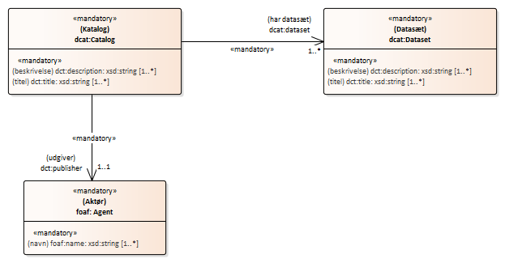

### Diagram with mandatory and recommended elements
[DCAT-AP-DK-view 2](https://github.com/digst/DCAT-AP-DK/tree/master/releases/v.2.0/views/mandatory%2Brecommended)
describes mandatory / recommended classes as well as mandatory / recommended properties for these classes (and optional elements and hidden).

<! - 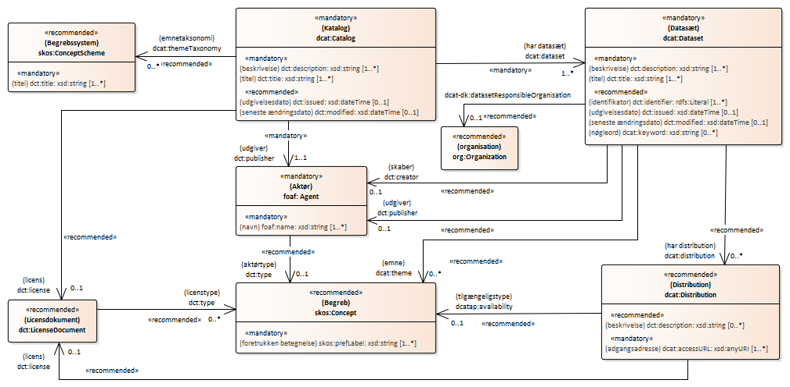 ->

  

### Diagram with all elements
The full application profile DCAT-AP-DK v.2.0.2 visualized in a UML diagram (all mandatory, recommended and optional elements).

 <a href="img/Illustration-DCAT-AP-DK-v2.0-UML.png"> 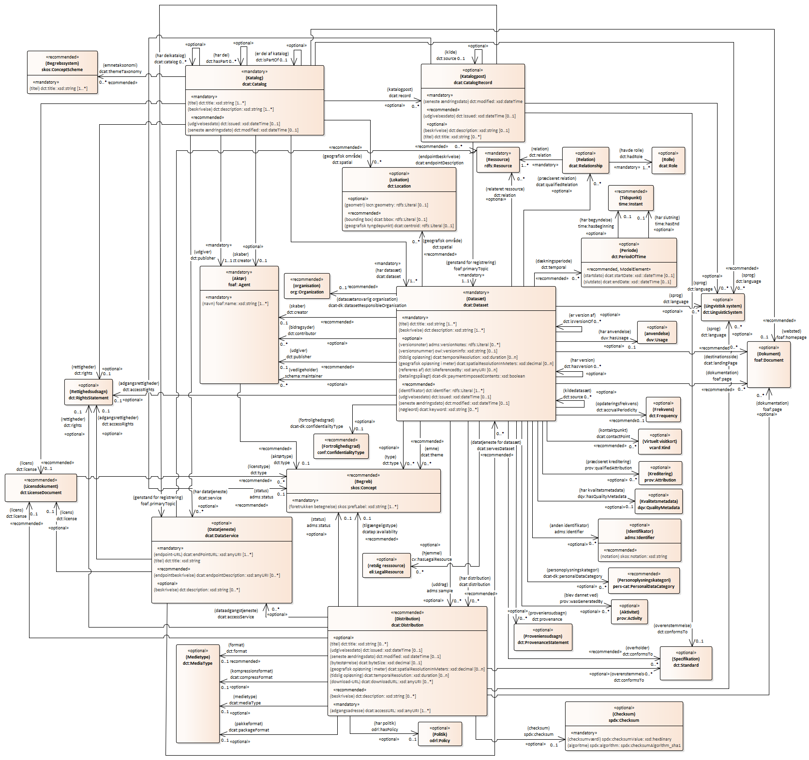 </a> 

## Divergence from DCAT-AP
Below is a description of the divergence between DCAT-AP and DCAT-AP-DK, which are expressed through changes in the requirement level as well as additions of new elements. As described below, the Danish profile differs primarily with relation to the addition of new elements for an extended description of datasets.

### Changes in requirement level
The requirement level for the following elements has been changed in DCAT-AP-DK 2.0.2 compared to DCAT-AP 2.0.1:

* Dataset: identifier (dct:identifier) ​​- Requirement level: Optional> Recommended
* Dataset: keyword (dcat:keyword) - Requirement level: Recommended> Optional
* Dataset: documentation (foaf:page) - Requirement level: Optional> Recommended
* Dataset: release date (dct:issued) - Requirement level: Optional> Recommended
* Dataset: modification date (dct:modified) - Requirement level: Optional> Recommended
* Dataset: distribution (dcat:distribution) - Requirement level: Optional> Recommended

### Additions
The following elements have been added in DCAT-AP-DK 2.0.2 compared to DCAT-AP 2.0.1:

* Dataset: dataset responsible organisation (dcat-dk:datasetResponsibleOrganisation)
* Dataset: contributor (dct:contributor)
* Dataset: maintainer (schema:maintainer)
* Dataset: has legal resource (cv:hasLegalResource)
* Dataset: payment imposed (dcat-dk:paymentImposed)
* Dataset: personal data category (dcat-dk:personalDataCategory)
* Dataset: confidentiality type (dcat-dk:confidentialityType)
* Dataset: has quality metadata (dqv:hasQualityMetadata)
* Dataset: has usage(duv:hasUsage)
* Class duv:Usage
* Class dqv:QualityMetadata
* Class org:Organization

In the table of contents, these Danish additions have been marked 'DK'.

### Omissions
No elements from DCAT-AP 2.0.1 have been omitted in DCAT-AP-DK 2.0.2.

## Key models that use DCAT

DCAT is already used in Danish specifications - eg in [Danish public sector data quality vocabulary](https://arkitektur.digst.dk/metoder/faelles-sprog-datakvalitet) and Standard for Description of IT systems [SYS-AP](https://digst.github.io/IT-System-AP/SYS-AP/docs/) and [archvSYS-AP](https://digst.github.io/IT-System-AP/archvSYS-AP/docs/ ).

DCAT is also used in a number of international specifications such as the European Commission's Single Digital Gateway - [SDG MetaModel](https://github.com/catalogue-of-services-isa/SDG-model), Core Public Service Vocabulary Application Profile ( [CPSV-AP](https://joinup.ec.europa.eu/solution/core-public-service-vocabulary-application-profile)) and
Asset Description Metadata Schema ([ADMS](https://joinup.ec.europa.eu/solution/asset-description-metadata-schema-adms))

Several national profiles of DCAT-AP have also been developed by other EU Member States as well as domain-specific profiles, eg [geoDCAT-AP](https://joinup.ec.europa.eu/solution/geodcat-application-profile-data-portals-europe) for geodata, [BregDCAP-AP](https://joinup.ec.europa.eu/solution/abr-specification-registry-registries) for basic data and [statDCAT-AP](https://joinup.ec.europa.eu/solution/statdcat-application-profile-data-portals-europe) for statistical datasets.

Find a report on DCAT-AP profiles (from 2018) and other relevant links in the section [References](https://digst.github.io/DCAT-AP-DK/releases/v.2.0/docs/index-en.html#references) .

# Elements in DCAT-AP-DK
In the following, each class and its properties in DCAT-AP-DK are presented .
		
	
			
## Class: Catalog 

<dl class="def">
<dt>URI</dt>
<dd>http://www.w3.org/ns/dcat#Catalog</dd>
<dt>Usage note (en)</dt>
<dd>A catalogue or repository that hosts the Datasets being described.</dd>
<dt>Definition (en)</dt>
<dd>A curated collection of metadata about resources (e.g., datasets and data services in the context of a data catalog).</dd>
<dt>Requirement level</dt>
<dd>Mandatory</dd>
</dl>	 
The properties of this class:	

				
### Property: title 
<dl class="def">
<dt>URI</dt>
<dd>http://purl.org/dc/terms/title</dd>
<dt>Range</dt>
<dd>http://www.w3.org/2001/XMLSchema#string</dd>
<dt>Usage note (en)</dt>
<dd>This property contains a name given to the Catalogue. This property can be repeated for parallel language versions of the name.</dd>
<dt>Definition (en)</dt>
<dd>A name given to the resource.</dd>
<dt>Multiplicity</dt>
<dd>1..*</dd>
<dt>Requirement level</dt>
<dd>Mandatory</dd>
</dl>
				
### Property: description 
<dl class="def">
<dt>URI</dt>
<dd>http://purl.org/dc/terms/description</dd>
<dt>Range</dt>
<dd>http://www.w3.org/2001/XMLSchema#string</dd>
<dt>Usage note (en)</dt>
<dd>This property contains a free-text account of the Catalogue. This property can be repeated for parallel language versions of the description.</dd>
<dt>Definition (en)</dt>
<dd>An account of the resource.</dd>
<dt>Multiplicity</dt>
<dd>1..*</dd>
<dt>Requirement level</dt>
<dd>Mandatory</dd>
</dl>
				
### Property: dataset 
<dl class="def">
<dt>URI</dt>
<dd>http://www.w3.org/ns/dcat#dataset</dd>
<dt>Range</dt>
<dd>http://www.w3.org/ns/dcat#Dataset</dd>
<dt>Usage note (en)</dt>
<dd>This property links the Catalogue with a Dataset that is part of the Catalogue.</dd>
<dt>Definition (en)</dt>
<dd>A collection of data that is listed in the catalog.</dd>
<dt>Multiplicity</dt>
<dd>1..*</dd>
<dt>Requirement level</dt>
<dd>Mandatory</dd>
</dl>
				
### Property: service 
<dl class="def">
<dt>URI</dt>
<dd>http://www.w3.org/ns/dcat#service</dd>
<dt>Range</dt>
<dd>http://www.w3.org/ns/dcat#DataService</dd>
<dt>Usage note (en)</dt>
<dd>This property refers to a site or end-point that is listed in the catalog.</dd>
<dt>Definition (en)</dt>
<dd>A site or endpoint that is listed in the catalog.</dd>
<dt>Multiplicity</dt>
<dd>0..*</dd>
<dt>Requirement level</dt>
<dd>Optional</dd>
</dl>
				
### Property: publisher 
<dl class="def">
<dt>URI</dt>
<dd>http://purl.org/dc/terms/publisher</dd>
<dt>Range</dt>
<dd>http://xmlns.com/foaf/0.1/Agent</dd>
<dt>Usage note (en)</dt>
<dd>This property refers to an entity (organisation) responsible for making the Catalogue available. </dd>
<dt>Definition (en)</dt>
<dd>An entity responsible for making the resource available.</dd>
<dt>Multiplicity</dt>
<dd>1..1</dd>
<dt>Requirement level</dt>
<dd>Mandatory</dd>
</dl>
				
### Property: creator 
<dl class="def">
<dt>URI</dt>
<dd>http://purl.org/dc/terms/creator</dd>
<dt>Range</dt>
<dd>http://xmlns.com/foaf/0.1/Agent</dd>
<dt>Usage note (en)</dt>
<dd>This property refers to the entity primarily responsible for producing the catalogue.</dd>
<dt>Definition (en)</dt>
<dd>An entity responsible for making the resource.</dd>
<dt>Multiplicity</dt>
<dd>0..1</dd>
<dt>Requirement level</dt>
<dd>Optional</dd>
</dl>
				
### Property: homepage 
<dl class="def">
<dt>URI</dt>
<dd>http://xmlns.com/foaf/0.1/homepage</dd>
<dt>Range</dt>
<dd>http://xmlns.com/foaf/0.1/Document</dd>
<dt>Usage note (en)</dt>
<dd>This property refers to a web page that acts as the main page for the Catalogue.</dd>
<dt>Definition (en)</dt>
<dd>A homepage for some thing.</dd>	
<dt>Multiplicity</dt>
<dd>0..1</dd>
<dt>Requirement level</dt>
<dd>Recommended</dd>
</dl>
				
### Property: release date 
<dl class="def">
<dt>URI</dt>
<dd>http://purl.org/dc/terms/issued</dd>
<dt>Range</dt>
<dd>http://www.w3.org/2001/XMLSchema#date;   http://www.w3.org/2001/XMLSchema#dateTime</dd>
<dt>Usage note (en)</dt>
<dd>This property contains the date of formal issuance (e.g., publication) of the Catalogue.</dd>
<dt>Definition (en)</dt>
<dd>Date of formal issuance of the resource.</dd>
<dt>Multiplicity</dt>
<dd>0..1</dd>
<dt>Requirement level</dt>
<dd>Recommended</dd>
</dl>
				
### Property: update/modification date 
<dl class="def">
<dt>URI</dt>
<dd>http://purl.org/dc/terms/modified</dd>
<dt>Range</dt>
<dd>http://www.w3.org/2001/XMLSchema#date;   http://www.w3.org/2001/XMLSchema#dateTime</dd>
<dt>Usage note (en)</dt>
<dd>This property contains the most recent date on which the Catalogue was changed or modified.</dd>
<dt>Definition (en)</dt>
<dd>Date on which the resource was changed.</dd>
<dt>Multiplicity</dt>
<dd>0..1</dd>
<dt>Requirement level</dt>
<dd>Recommended</dd>
</dl>
				
### Property: themes 
<dl class="def">
<dt>URI</dt>
<dd>http://www.w3.org/ns/dcat#themeTaxonomy</dd>
<dt>Range</dt>
<dd>http://www.w3.org/2004/02/skos/core#ConceptScheme</dd>
<dt>Usage note (en)</dt>
<dd>This property refers to a knowledge organization system used to classify the Catalogue's Datasets.</dd>
<dt>Definition (en)</dt>
<dd>A knowledge organization system (KOS) used to classify catalog's datasets and services.</dd>
<dt>Multiplicity</dt>
<dd>0..*</dd>
<dt>Requirement level</dt>
<dd>Recommended</dd>
</dl>
				
### Property: spatial/geographic 
<dl class="def">
<dt>URI</dt>
<dd>http://purl.org/dc/terms/spatial</dd>
<dt>Range</dt>
<dd>http://purl.org/dc/terms/Location</dd>
<dt>Usage note (en)</dt>
<dd>This property refers to a geographical area covered by the Catalogue. </dd>
<dt>Definition (en)</dt>
<dd>Spatial characteristics of the resource.</dd>
<dt>Multiplicity</dt>
<dd>0..*</dd>
<dt>Requirement level</dt>
<dd>Recommended</dd>
</dl>
				
### Property: language 
<dl class="def">
<dt>URI</dt>
<dd>http://purl.org/dc/terms/language</dd>
<dt>Range</dt>
<dd>http://purl.org/dc/terms/LinguisticSystem</dd>
<dt>Usage note (en)</dt>
<dd>This property refers to a language used in the textual metadata describing titles, descriptions, etc. of the Datasets in the Catalogue. This property can be repeated if the metadata is provided in multiple languages. </dd>
<dt>Definition (en)</dt>
<dd>A language of the resource.</dd>
<dt>Multiplicity</dt>
<dd>0..*</dd>
<dt>Requirement level</dt>
<dd>Recommended</dd>
</dl>
				
### Property: license 
<dl class="def">
<dt>URI</dt>
<dd>http://purl.org/dc/terms/license</dd>
<dt>Range</dt>
<dd>http://purl.org/dc/terms/LicenseDocument</dd>
<dt>Usage note (en)</dt>
<dd>This property refers to the licence under which the Catalogue can be used or reused.</dd>

<dt>Definition (en)</dt>
<dd>A legal document giving official permission to do something with a resource.</dd>
<dt>Multiplicity</dt>
<dd>0..1</dd>
<dt>Requirement level</dt>
<dd>Recommended</dd>
</dl>
				
### Property: rights 
<dl class="def">
<dt>URI</dt>
<dd>http://purl.org/dc/terms/rights</dd>
<dt>Range</dt>
<dd>http://purl.org/dc/terms/RightsStatement</dd>
<dt>Usage note (en)</dt>
<dd>This property refers to a statement that specifies rights associated with the Catalogue.</dd>
<dt>Definition (en)</dt>
<dd>Information about rights held in and over the resource.</dd>
<dt>Multiplicity</dt>
<dd>0..1</dd>
<dt>Requirement level</dt>
<dd>Optional</dd>
</dl>
				
### Property: catalog record 
<dl class="def">
<dt>URI</dt>
<dd>http://www.w3.org/ns/dcat#record</dd>
<dt>Range</dt>
<dd>http://www.w3.org/ns/dcat#CatalogRecord</dd>
<dt>Usage note (en)</dt>
<dd>This property refers to a Catalogue Record that is part of the Catalogue</dd>
<dt>Definition (en)</dt>
<dd>A record describing the registration of a single dataset or data service that is part of the catalog.</dd>
<dt>Multiplicity</dt>
<dd>0..*</dd>
<dt>Requirement level</dt>
<dd>Optional</dd>
</dl>
				
### Property: catalog 
<dl class="def">
<dt>URI</dt>
<dd>http://www.w3.org/ns/dcat#catalog</dd>
<dt>Range</dt>
<dd>http://www.w3.org/ns/dcat#Catalog</dd>
<dt>Usage note (en)</dt>
<dd>This property refers to a catalog whose contents are of interest in the context of this catalog.</dd>
<dt>Definition (en)</dt>
<dd>A catalog whose contents are of interest in the context of this catalog.</dd>
<dt>Multiplicity</dt>
<dd>0..*</dd>
<dt>Requirement level</dt>
<dd>Optional</dd>
</dl>
				
### Property: has part 
<dl class="def">
<dt>URI</dt>
<dd>http://purl.org/dc/terms/hasPart</dd>
<dt>Range</dt>
<dd>http://www.w3.org/ns/dcat#Resource</dd>
<dt>Usage note (en)</dt>
<dd>This property refers to a related Catalogue that is part of the described Catalogue.</dd>
<dt>Definition (en)</dt>
<dd>A related resource that is included either physically or logically in the described resource.</dd>
<dt>Multiplicity</dt>
<dd>0..*</dd>
<dt>Requirement level</dt>
<dd>Optional</dd>
</dl>
				
### Property: is part of 
<dl class="def">
<dt>URI</dt>
<dd>http://purl.org/dc/terms/isPartOf</dd>
<dt>Range</dt>
<dd>http://www.w3.org/ns/dcat#Catalog</dd>
<dt>Usage note (en)</dt>
<dd>This property refers to a related Catalogue in which the described Catalogue is physically or logically included.</dd>
<dt>Definition (en)</dt>
<dd>A related resource in which the described resource is physically or logically included.</dd>
<dt>Multiplicity</dt>
<dd>0..1</dd>
<dt>Requirement level</dt>
<dd>Optional</dd>
</dl>	
			
## Class: Catalog Record 

<dl class="def">
<dt>URI</dt>
<dd>http://www.w3.org/ns/dcat#CatalogRecord</dd>
<dt>Usage note (en)</dt>
<dd>A description of a Dataset’s entry in the Catalogue. </dd>
<dt>Definition (en)</dt>
<dd>A record in a data catalog, describing the registration of a single dataset or data service.</dd>
<dt>Requirement level</dt>
<dd>Optional</dd>
</dl>	 
The properties of this class:	

				
### Property: primary topic 
<dl class="def">
<dt>URI</dt>
<dd>http://xmlns.com/foaf/0.1/primaryTopic</dd>
<dt>Range</dt>
<dd>http://www.w3.org/ns/dcat#Catalog; http://www.w3.org/ns/dcat#Dataset; http://www.w3.org/ns/dcat#DataService</dd>
<dt>Usage note (en)</dt>
<dd>This property links the Catalogue Record to the Dataset, Data service or Catalog described in the record.</dd>
<dt>Definition (en)</dt>
<dd>A document that this thing is the primary topic of.</dd>
<dt>Multiplicity</dt>
<dd>1..1</dd>
<dt>Requirement level</dt>
<dd>Mandatory</dd>
</dl>
				
### Property: listing date 
<dl class="def">
<dt>URI</dt>
<dd>http://purl.org/dc/terms/issued</dd>
<dt>Range</dt>
<dd>http://www.w3.org/2001/XMLSchema#date;   http://www.w3.org/2001/XMLSchema#dateTime</dd>
<dt>Usage note (en)</dt>
<dd>This property contains the date on which the description of the Dataset was included in the Catalogue.</dd>
<dt>Definition (en)</dt>
<dd>Date of formal issuance of the resource.</dd>
<dt>Multiplicity</dt>
<dd>0..1</dd>
<dt>Requirement level</dt>
<dd>Recommended</dd>
</dl>
				
### Property: update/ modification date 
<dl class="def">
<dt>URI</dt>
<dd>http://purl.org/dc/terms/modified</dd>
<dt>Range</dt>
<dd>http://www.w3.org/2001/XMLSchema#date;   http://www.w3.org/2001/XMLSchema#dateTime</dd>
<dt>Usage note (en)</dt>
<dd>This property contains the most recent date on which the Catalogue entry was changed or modified.</dd>
<dt>Definition (en)</dt>
<dd>Date on which the resource was changed.</dd>
<dt>Multiplicity</dt>
<dd>1..1</dd>
<dt>Requirement level</dt>
<dd>Mandatory</dd>
</dl>
				
### Property: change type 
<dl class="def">
<dt>URI</dt>
<dd>http://www.w3.org/ns/adms#status</dd>
<dt>Range</dt>
<dd>http://www.w3.org/2004/02/skos/core#Concept</dd>
<dt>Usage note (en)</dt>
<dd>This property refers to the type of the latest revision of a Dataset's entry in the Catalogue. </dd>
<dt>Definition (en)</dt>
<dd>Links to the status of the Asset or Asset Distribution in the context of a particular workflow process. Since Status is defined using a skos:Concept, that is the defined range for this property.</dd>
<dt>Multiplicity</dt>
<dd>0..1</dd>
<dt>Requirement level</dt>
<dd>Recommended</dd>
</dl>
				
### Property: title 
<dl class="def">
<dt>URI</dt>
<dd>http://purl.org/dc/terms/title</dd>
<dt>Range</dt>
<dd>http://www.w3.org/2001/XMLSchema#string</dd>
<dt>Usage note (en)</dt>
<dd>This property contains a name given to the Catalogue Record. This property can be repeated for parallel language versions of the name.</dd>
<dt>Definition (en)</dt>
<dd>A name given to the resource.</dd>
<dt>Multiplicity</dt>
<dd>0..*</dd>
<dt>Requirement level</dt>
<dd>Recommended</dd>
</dl>
				
### Property: description 
<dl class="def">
<dt>URI</dt>
<dd>http://purl.org/dc/terms/description</dd>
<dt>Range</dt>
<dd>http://www.w3.org/2001/XMLSchema#string</dd>
<dt>Usage note (en)</dt>
<dd>This property contains a free-text account of the record. This property can be repeated for parallel language versions of the description.</dd>
<dt>Definition (en)</dt>
<dd>An account of the resource.</dd>
<dt>Multiplicity</dt>
<dd>0..*</dd>
<dt>Requirement level</dt>
<dd>Recommended</dd>
</dl>
				
### Property: application profile 
<dl class="def">
<dt>URI</dt>
<dd>http://purl.org/dc/terms/conformsTo</dd>
<dt>Range</dt>
<dd>http://purl.org/dc/terms/Standard</dd>
<dt>Usage note (en)</dt>
<dd>This property refers to an Application Profile that the Dataset’s metadata conforms to</dd>
<dt>Definition (en)</dt>
<dd>An established standard to which the described resource conforms.</dd>
<dt>Multiplicity</dt>
<dd>0..1</dd>
<dt>Requirement level</dt>
<dd>Recommended</dd>
</dl>
				
### Property: language 
<dl class="def">
<dt>URI</dt>
<dd>http://purl.org/dc/terms/language</dd>
<dt>Range</dt>
<dd>http://purl.org/dc/terms/LinguisticSystem</dd>
<dt>Usage note (en)</dt>
<dd>This property refers to a language used in the textual metadata describing titles, descriptions, etc. of the Dataset. This property can be repeated if the metadata is provided in multiple languages.</dd>
<dt>Definition (en)</dt>
<dd>A language of the resource.</dd>
<dt>Multiplicity</dt>
<dd>0..*</dd>
<dt>Requirement level</dt>
<dd>Optional</dd>
</dl>
				
### Property: source metadata 
<dl class="def">
<dt>URI</dt>
<dd>http://purl.org/dc/terms/source</dd>
<dt>Range</dt>
<dd>http://www.w3.org/ns/dcat#CatalogRecord</dd>
<dt>Usage note (en)</dt>
<dd>This property refers to the original metadata that was used in creating metadata for the Dataset.</dd>
<dt>Definition (en)</dt>
<dd>A related resource from which the described resource is derived.</dd>
<dt>Multiplicity</dt>
<dd>0..1</dd>
<dt>Requirement level</dt>
<dd>Optional</dd>
</dl>	
			
## Class: Dataset 

<dl class="def">
<dt>URI</dt>
<dd>http://www.w3.org/ns/dcat#Dataset</dd>
<dt>Usage note (en)</dt>
<dd>A conceptual entity that represents the information published. </dd>
<dt>Definition (en)</dt>
<dd>A collection of data, published or curated by a single agent, and available for access or download in one or more representations.</dd>
<dt>Requirement level</dt>
<dd>Mandatory</dd>
</dl>	 
The properties of this class:	

				
### Property: identifier 
<dl class="def">
<dt>URI</dt>
<dd>http://purl.org/dc/terms/identifier</dd>
<dt>Range</dt>
<dd>http://www.w3.org/2000/01/rdf-schema#Literal</dd>
<dt>Usage note (en)</dt>
<dd>This property contains the main identifier for the Dataset, e.g. the URI or other unique identifier in the context of the Catalogue.</dd>
<dt>Definition (en)</dt>
<dd>An unambiguous reference to the resource within a given context.</dd>
<dt>Multiplicity</dt>
<dd>0..*</dd>
<dt>Requirement level</dt>
<dd>Recommended</dd>
</dl>
				
### Property: other identifier 
<dl class="def">
<dt>URI</dt>
<dd>http://www.w3.org/ns/adms#identifier</dd>
<dt>Range</dt>
<dd>http://www.w3.org/ns/adms#Identifier</dd>
<dt>Usage note (en)</dt>
<dd>This property refers to a secondary identifier of the Dataset, such as MAST/ADS[1], DataCite[2], DOI[3], EZID[4] or W3ID[5].</dd>
<dt>Definition (en)</dt>
<dd>adms:identifier is used to link any resource to an instance of adms:Identifier which is its range</dd>
<dt>Multiplicity</dt>
<dd>0..*</dd>
<dt>Requirement level</dt>
<dd>Optional</dd>
</dl>
				
### Property: title 
<dl class="def">
<dt>URI</dt>
<dd>http://purl.org/dc/terms/title</dd>
<dt>Range</dt>
<dd>http://www.w3.org/2001/XMLSchema#string</dd>
<dt>Usage note (en)</dt>
<dd>This property contains a name given to the Dataset. This property can be repeated for parallel language versions of the name.</dd>
<dt>Definition (en)</dt>
<dd>A name given to the resource.</dd>
<dt>Multiplicity</dt>
<dd>1..*</dd>
<dt>Requirement level</dt>
<dd>Mandatory</dd>
</dl>
				
### Property: description 
<dl class="def">
<dt>URI</dt>
<dd>http://purl.org/dc/terms/description</dd>
<dt>Range</dt>
<dd>http://www.w3.org/2001/XMLSchema#string</dd>
<dt>Usage note (en)</dt>
<dd>This property contains a free-text account of the Dataset. This property can be repeated for parallel language versions of the description.</dd>
<dt>Definition (en)</dt>
<dd>An account of the resource.</dd>
<dt>Multiplicity</dt>
<dd>1..*</dd>
<dt>Requirement level</dt>
<dd>Mandatory</dd>
</dl>
				
### Property: publisher 
<dl class="def">
<dt>URI</dt>
<dd>http://purl.org/dc/terms/publisher</dd>
<dt>Range</dt>
<dd>http://xmlns.com/foaf/0.1/Agent</dd>
<dt>Usage note (en)</dt>
<dd>This property refers to the entity (organisation) responsible for making the Dataset available. Any dataset in a catalog must be linked to at least one agent, either a publisher or the dataset responsible organisation.</dd>
<dt>Definition (en)</dt>
<dd>An entity responsible for making the resource available.</dd>
<dt>Multiplicity</dt>
<dd>0..1</dd>
<dt>Requirement level</dt>
<dd>Recommended</dd>
</dl>
				
### Property: dataset responsible organisation 
<dl class="def">
<dt>URI</dt>
<dd>https://data.gov.dk/model/core/dcat-dk/datasetResponsibleOrganisation</dd>
<dt>Range</dt>
<dd>https://www.w3.org/ns/org#Organization</dd>
<dt>Usage note (en)</dt>
<dd>This property specifies the organization that is legally accountable for the dataset. Any dataset in a catalog must be linked to at least one agent, either a publisher or the dataset responsible organisation.</dd>
<dt>Definition (en)</dt>
<dd>organization that is legally accountable for the dataset</dd>
<dt>Multiplicity</dt>
<dd>0..1</dd>
<dt>Requirement level</dt>
<dd>Recommended</dd>
</dl>
				
### Property: creator 
<dl class="def">
<dt>URI</dt>
<dd>http://purl.org/dc/terms/creator</dd>
<dt>Range</dt>
<dd>http://xmlns.com/foaf/0.1/Agent</dd>
<dt>Usage note (en)</dt>
<dd>This property refers to the entity primarily responsible for producing the dataset.</dd>
<dt>Definition (en)</dt>
<dd>An entity responsible for making the resource.</dd>
<dt>Multiplicity</dt>
<dd>0..1</dd>
<dt>Requirement level</dt>
<dd>Recommended</dd>
</dl>
				
### Property: contributor 
<dl class="def">
<dt>URI</dt>
<dd>http://purl.org/dc/terms/contributor</dd>
<dt>Range</dt>
<dd>http://xmlns.com/foaf/0.1/Agent</dd>
<dt>Usage note (en)</dt>
<dd>This property refers to the entity responsible for making contributions to the resource.</dd>
<dt>Definition (en)</dt>
<dd>An entity responsible for making contributions to the resource.</dd>
<dt>Multiplicity</dt>
<dd>0..*</dd>
<dt>Requirement level</dt>
<dd>Optional</dd>
</dl>
				
### Property: maintainer 
<dl class="def">
<dt>URI</dt>
<dd>http://schema.org/maintainer</dd>
<dt>Range</dt>
<dd>http://xmlns.com/foaf/0.1/Agent</dd>
<dt>Usage note (en)</dt>
<dd>This property refers to the agent that manages contributions to, and/or publication of a dataset.</dd>
<dt>Definition (en)</dt>
<dd>A maintainer of a Dataset, software package (SoftwareApplication), or other Project.</dd>
<dt>Multiplicity</dt>
<dd>0..1</dd>
<dt>Requirement level</dt>
<dd>Optional</dd>
</dl>
				
### Property: contact point 
<dl class="def">
<dt>URI</dt>
<dd>http://www.w3.org/ns/dcat#contactPoint</dd>
<dt>Range</dt>
<dd>http://www.w3.org/2006/vcard/ns#Kind</dd>
<dt>Usage note (en)</dt>
<dd>This property contains contact information that can be used for sending comments about the Dataset.</dd>
<dt>Definition (en)</dt>
<dd>Relevant contact information for the catalogued resource. Use of vCard is recommended.</dd>
<dt>Multiplicity</dt>
<dd>0..*</dd>
<dt>Requirement level</dt>
<dd>Recommended</dd>
</dl>
				
### Property: dataset distribution 
<dl class="def">
<dt>URI</dt>
<dd>http://www.w3.org/ns/dcat#distribution</dd>
<dt>Range</dt>
<dd>http://www.w3.org/ns/dcat#Distribution</dd>
<dt>Usage note (en)</dt>
<dd>This property links the Dataset to an available Distribution.</dd>
<dt>Definition (en)</dt>
<dd>An available distribution of the dataset.</dd>
<dt>Multiplicity</dt>
<dd>0..*</dd>
<dt>Requirement level</dt>
<dd>Recommended</dd>
</dl>
				
### Property: sample 
<dl class="def">
<dt>URI</dt>
<dd>http://www.w3.org/ns/adms#sample</dd>
<dt>Range</dt>
<dd>http://www.w3.org/ns/dcat#Distribution</dd>
<dt>Usage note (en)</dt>
<dd>This property refers to a sample distribution of the dataset.</dd>
<dt>Definition (en)</dt>
<dd>Links to a sample of an Asset (which is itself an Asset)</dd>
<dt>Multiplicity</dt>
<dd>0..*</dd>
<dt>Requirement level</dt>
<dd>Optional</dd>
</dl>
				
### Property: landing page 
<dl class="def">
<dt>URI</dt>
<dd>http://www.w3.org/ns/dcat#landingPage</dd>
<dt>Range</dt>
<dd>http://xmlns.com/foaf/0.1/Document</dd>
<dt>Usage note (en)</dt>
<dd>This property refers to a web page that provides access to the Dataset, its Distributions and/or additional information. 
		It is intended to point to a landing page at the original data provider, not to a page on a site of a third party, such as an aggregator.</dd>
<dt>Definition (en)</dt>
<dd>A Web page that can be navigated to in a Web browser to gain access to the catalog, a dataset, its distributions and/or additional information.</dd>
<dt>Multiplicity</dt>
<dd>0..*</dd>
<dt>Requirement level</dt>
<dd>Recommended</dd>
</dl>
				
### Property: conforms to 
<dl class="def">
<dt>URI</dt>
<dd>http://purl.org/dc/terms/conformsTo</dd>
<dt>Range</dt>
<dd>http://purl.org/dc/terms/Standard</dd>
<dt>Usage note (en)</dt>
<dd>This property refers to an implementing rule or other specification.</dd>
<dt>Definition (en)</dt>
<dd>An established standard to which the described resource conforms.</dd>
<dt>Multiplicity</dt>
<dd>0..*</dd>
<dt>Requirement level</dt>
<dd>Recommended</dd>
</dl>
				
### Property: documentation 
<dl class="def">
<dt>URI</dt>
<dd>http://xmlns.com/foaf/0.1/page</dd>
<dt>Range</dt>
<dd>http://xmlns.com/foaf/0.1/Document</dd>
<dt>Usage note (en)</dt>
<dd>This property refers to a page or document about this Dataset.</dd>
<dt>Definition (en)</dt>
<dd>A page or document about this thing.</dd>
<dt>Multiplicity</dt>
<dd>0..*</dd>
<dt>Requirement level</dt>
<dd>Recommended</dd>
</dl>
				
### Property: theme/ category 
<dl class="def">
<dt>URI</dt>
<dd>http://www.w3.org/ns/dcat#theme</dd>
<dt>Range</dt>
<dd>http://www.w3.org/2004/02/skos/core#Concept</dd>
<dt>Usage note (en)</dt>
<dd>This property refers to a category of the Dataset. A Dataset may be associated with multiple themes - potentially from different classifications   The use of the EU Dataset Themes is recommended, see http://publications.europa.eu/resource/authority/data-theme. Using FORM - the Danish Public Task Reference Model - (http://www.form-online.dk/) and KLE - a Municipal Task Reference Model - (http://www.kle-online.dk/) for thematic categorisation is optional, and it is suggested that KLE is used by municipalities and FORM by regional and govermental authorities.</dd>
<dt>Definition (en)</dt>
<dd>A main category of the resource. A resource can have multiple themes.</dd>
<dt>Multiplicity</dt>
<dd>0..*</dd>
<dt>Requirement level</dt>
<dd>Recommended</dd>
</dl>
				
### Property: type 
<dl class="def">
<dt>URI</dt>
<dd>http://purl.org/dc/terms/type</dd>
<dt>Range</dt>
<dd>http://www.w3.org/2004/02/skos/core#Concept</dd>
<dt>Usage note (en)</dt>
<dd>This property refers to the type of the dataset in relation to its genre or inherent character. A controlled vocabulary for the values in range of this property has not been established in DCAT-AP, but DCAT recommends that you SHOULD be taken from a well governed and broadly recognised controlled vocabulary, such as DCMI Type vocabulary or ISO-19115-1 scope codes (see: https://www.w3.org/TR/vocab-dcat-2/#Property:resource_type)</dd>
<dt>Definition (en)</dt>
<dd>The nature or genre of the resource.</dd>
<dt>Multiplicity</dt>
<dd>0..1</dd>
<dt>Requirement level</dt>
<dd>Optional</dd>
</dl>
				
### Property: keyword/ tag 
<dl class="def">
<dt>URI</dt>
<dd>http://www.w3.org/ns/dcat#keyword</dd>
<dt>Range</dt>
<dd>http://www.w3.org/2001/XMLSchema#string</dd>
<dt>Usage note (en)</dt>
<dd>This property contains a keyword or tag describing the Dataset.</dd>
<dt>Definition (en)</dt>
<dd>A keyword or tag describing the resource.</dd>
<dt>Multiplicity</dt>
<dd>0..*</dd>
<dt>Requirement level</dt>
<dd>Optional</dd>
</dl>
				
### Property: language 
<dl class="def">
<dt>URI</dt>
<dd>http://purl.org/dc/terms/language</dd>
<dt>Range</dt>
<dd>http://purl.org/dc/terms/LinguisticSystem</dd>
<dt>Usage note (en)</dt>
<dd>This property refers to a language of the Dataset. This property can be repeated if there are multiple languages in the Dataset. When specifying a language, use the following classification: EU Vocabularies Languages Named Authority List, http://publications.europa.eu/resource/authority/language</dd>
<dt>Definition (en)</dt>
<dd>A language of the resource.</dd>
<dt>Multiplicity</dt>
<dd>0..*</dd>
<dt>Requirement level</dt>
<dd>Recommended</dd>
</dl>
				
### Property: access rights 
<dl class="def">
<dt>URI</dt>
<dd>http://purl.org/dc/terms/accessRights</dd>
<dt>Range</dt>
<dd>http://purl.org/dc/terms/RightsStatement</dd>
<dt>Usage note (en)</dt>
<dd>This property refers to information about who has rights to access the dataset. A controlled vocabulary with three members (:public, :restricted, :non-public) has been created by the Publications Office of the EU. See EU Vocabularies Access Right Named Authority List: http://publications.europa.eu/resource/authority/access-right </dd>
<dt>Definition (en)</dt>
<dd>Information about who access the resource or an indication of its security status.</dd>
<dt>Multiplicity</dt>
<dd>0..1</dd>
<dt>Requirement level</dt>
<dd>Optional</dd>
</dl>
				
### Property: spatial/ geographical coverage 
<dl class="def">
<dt>URI</dt>
<dd>http://purl.org/dc/terms/spatial</dd>
<dt>Range</dt>
<dd>http://purl.org/dc/terms/Location</dd>
<dt>Usage note (en)</dt>
<dd>This property refers to a geographic region that is covered by the dataset. The spatial scope can be expressed by geographical coordinates or by using one of the following classifications: EU Vocabularies Continents Named Authority List, EU Vocabularies Countries Named Authority List, EU Vocabularies Places Named Authority List or Geonames. (Geonames should only be used if a particular location is not in one of the mentioned Named Authority Lists. </dd>
<dt>Definition (en)</dt>
<dd>Spatial characteristics of the resource.</dd>
<dt>Multiplicity</dt>
<dd>0..*</dd>
<dt>Requirement level</dt>
<dd>Optional</dd>
</dl>
				
### Property: spatial resolution in meters 
<dl class="def">
<dt>URI</dt>
<dd>http://www.w3.org/ns/dcat#spatialResolutionInMeters</dd>
<dt>Range</dt>
<dd>http://www.w3.org/2001/XMLSchema#decimal</dd>
<dt>Usage note (en)</dt>
<dd>This property refers to the minimum spatial separation resolvable in a dataset, measured in meters. The ability of to detect details in an raster image or grid is referred to as spatial resolution. The spatial resolution is stated in metres. The more pixels are included in a raster image of a certain area, the higher the spatial resolution meaning the more details can be observed. </dd>
<dt>Definition (en)</dt>
<dd>minimum spatial separation resolvable in a dataset, measured in metres.</dd>
<dt>Multiplicity</dt>
<dd>0..*</dd>
<dt>Requirement level</dt>
<dd>Optional</dd>
</dl>
				
### Property: temporal coverage 
<dl class="def">
<dt>URI</dt>
<dd>http://purl.org/dc/terms/temporal</dd>
<dt>Range</dt>
<dd>http://purl.org/dc/terms/PeriodOfTime</dd>
<dt>Usage note (en)</dt>
<dd>This property refers to a temporal period that the Dataset covers.</dd>
<dt>Definition (en)</dt>
<dd>Temporal characteristics of the resource.</dd>
<dt>Multiplicity</dt>
<dd>0..*</dd>
<dt>Requirement level</dt>
<dd>Recommended</dd>
</dl>
				
### Property: temporal resolution 
<dl class="def">
<dt>URI</dt>
<dd>http://www.w3.org/ns/dcat#temporalResolution</dd>
<dt>Range</dt>
<dd>http://www.w3.org/2001/XMLSchema#duration</dd>
<dt>Usage note (en)</dt>
<dd>This property refers to the minimum time period resolvable in the dataset. Alternative temporal resolutions might be provided in different dataset distributions. If the dataset is a time-series this should correspond to the spacing of items in the series. For other kinds of dataset, this property will usually indicate the smallest time difference between items in the dataset.</dd>
<dt>Definition (en)</dt>
<dd>minimum time period resolvable in a dataset.</dd>
<dt>Multiplicity</dt>
<dd>0..*</dd>
<dt>Requirement level</dt>
<dd>Optional</dd>
</dl>
				
### Property: frequency 
<dl class="def">
<dt>URI</dt>
<dd>http://purl.org/dc/terms/accrualPeriodicity</dd>
<dt>Range</dt>
<dd>http://purl.org/dc/terms/Frequency</dd>
<dt>Usage note (en)</dt>
<dd>This property refers to the frequency at which the Dataset is updated. For specifying frequency use the following classification: EU Authority Table Frequency http://publications.europa.eu/resource/authority/frequency</dd>
<dt>Definition (en)</dt>
<dd>A rate at which something recurs.</dd>
<dt>Multiplicity</dt>
<dd>0..1</dd>
<dt>Requirement level</dt>
<dd>Recommended</dd>
</dl>
				
### Property: release date 
<dl class="def">
<dt>URI</dt>
<dd>http://purl.org/dc/terms/issued</dd>
<dt>Range</dt>
<dd>http://www.w3.org/2001/XMLSchema#date;   http://www.w3.org/2001/XMLSchema#dateTime</dd>
<dt>Usage note (en)</dt>
<dd>This property contains the date of formal issuance (e.g., publication) of the Dataset.</dd>
<dt>Definition (en)</dt>
<dd>Date of formal issuance of the resource.</dd>
<dt>Multiplicity</dt>
<dd>0..1</dd>
<dt>Requirement level</dt>
<dd>Recommended</dd>
</dl>
				
### Property: update/ modification date 
<dl class="def">
<dt>URI</dt>
<dd>http://purl.org/dc/terms/modified</dd>
<dt>Range</dt>
<dd>http://www.w3.org/2001/XMLSchema#date;   http://www.w3.org/2001/XMLSchema#dateTime</dd>
<dt>Usage note (en)</dt>
<dd>This property contains the most recent date on which the Dataset was changed or modified.</dd>
<dt>Definition (en)</dt>
<dd>Date on which the resource was changed.</dd>
<dt>Multiplicity</dt>
<dd>0..1</dd>
<dt>Requirement level</dt>
<dd>Recommended</dd>
</dl>
				
### Property: has quality metadata 
<dl class="def">
<dt>URI</dt>
<dd>http://www.w3.org/ns/dqv#hasQualityMetadata</dd>
<dt>Range</dt>
<dd>http://www.w3.org/ns/dqv#QualityMetadata</dd>
<dt>Usage note (en)</dt>
<dd>This property refers to a grouping of quality information about the dataset.</dd>
<dt>Definition (en)</dt>
<dd>Refers to a grouping of quality information such as certificates, policies, measurements and annotations as a named graph. Quality information represented in such a grouping can pertain to any kind of resource (e.g., a dataset, a linkset, a graph, a set of triples). However, in the DQV context, this property is generally expected to be used in statements in which subjects are instances of dcat:Dataset or dcat:Distribution.</dd>
<dt>Multiplicity</dt>
<dd>0..1</dd>
<dt>Requirement level</dt>
<dd>Optional</dd>
</dl>
				
### Property: has usage 
<dl class="def">
<dt>URI</dt>
<dd>http://www.w3.org/ns/duv#hasUsage</dd>
<dt>Range</dt>
<dd>http://www.w3.org/ns/duv#Usage</dd>
<dt>Usage note (en)</dt>
<dd>This property refers to dataset or distribution usage guidance/instructions.</dd>
<dt>Definition (en)</dt>
<dd>Dataset or distribution usage guidance/instructions.</dd>
<dt>Multiplicity</dt>
<dd>0..1</dd>
<dt>Requirement level</dt>
<dd>Optional</dd>
</dl>
				
### Property: payment imposed 
<dl class="def">
<dt>URI</dt>
<dd>https://data.gov.dk/model/core/dcat-dk/paymentImposedContents</dd>
<dt>Range</dt>
<dd>http://www.w3.org/2001/XMLSchema#boolean</dd>
<dt>Usage note (en)</dt>
<dd>This property specifies whether payment is imposed on the dataset or not.</dd>
<dt>Definition (en)</dt>
<dd>specification of whether payment is imposed on the catalogued resource or not.</dd>
<dt>Multiplicity</dt>
<dd>0..1</dd>
<dt>Requirement level</dt>
<dd>Optional</dd>
</dl>
				
### Property: personal data category 
<dl class="def">
<dt>URI</dt>
<dd>https://data.gov.dk/model/core/dcat-dk/personalDataCategory</dd>
<dt>Range</dt>
<dd>https://data.gov.dk/concept/core/personaldata-type/personalDataCategory</dd>
<dt>Usage note (en)</dt>
<dd>This property specifies a relation to specific personal data category</dd>
<dt>Definition (en)</dt>
<dd>specification of a relation to specific personal data category</dd>
<dt>Multiplicity</dt>
<dd>0..*</dd>
<dt>Requirement level</dt>
<dd>Optional</dd>
</dl>
				
### Property: confidentiality type  
<dl class="def">
<dt>URI</dt>
<dd>https://data.gov.dk/model/core/dcat-dk/confidentialityType</dd>
<dt>Range</dt>
<dd>http://www.w3.org/2004/02/skos/core#Concept</dd>
<dt>Usage note (en)</dt>
<dd>This property specifies the extent by which information contained in a dataset can be disclosed.</dd>
<dt>Definition (en)</dt>
<dd>specification of the extent by which information contained in the resource can be disclosed.</dd>
<dt>Multiplicity</dt>
<dd>0..1</dd>
<dt>Requirement level</dt>
<dd>Optional</dd>
</dl>
				
### Property: has legal resource 
<dl class="def">
<dt>URI</dt>
<dd>http://data.europa.eu/m8g/hasLegalResource</dd>
<dt>Range</dt>
<dd>http://data.europa.eu/eli/ontology#LegalResource</dd>
<dt>Usage note (en)</dt>
<dd>This property specifies the legal framework for the dataset.</dd>
<dt>Definition (en)</dt>
<dd>It indicates the Legal Resource (e.g. legislation) to which the Public Service (red:resource) relates, operates or has its legal basis</dd>
<dt>Multiplicity</dt>
<dd>0..*</dd>
<dt>Requirement level</dt>
<dd>Optional</dd>
</dl>
				
### Property: version 
<dl class="def">
<dt>URI</dt>
<dd>http://www.w3.org/2002/07/owl#versionInfo</dd>
<dt>Range</dt>
<dd>http://www.w3.org/2000/01/rdf-schema#Literal</dd>
<dt>Usage note (en)</dt>
<dd>This property contains a version number or other version designation of the Dataset.</dd>
<dt>Definition (en)</dt>
<dd>The annotation property that provides version information for an ontology or another OWL construct.</dd>
<dt>Multiplicity</dt>
<dd>0..1</dd>
<dt>Requirement level</dt>
<dd>Optional</dd>
</dl>
				
### Property: version notes 
<dl class="def">
<dt>URI</dt>
<dd>http://www.w3.org/ns/adms#versionNotes</dd>
<dt>Range</dt>
<dd>http://www.w3.org/2000/01/rdf-schema#Literal</dd>
<dt>Usage note (en)</dt>
<dd>This property contains a description of the differences between this version and a previous version of the Dataset. This property can be repeated for parallel language versions of the version notes.</dd>
<dt>Definition (en)</dt>
<dd>A description of changes between this version and the previous version of the Asset</dd>
<dt>Multiplicity</dt>
<dd>0..*</dd>
<dt>Requirement level</dt>
<dd>Optional</dd>
</dl>
				
### Property: has version 
<dl class="def">
<dt>URI</dt>
<dd>http://purl.org/dc/terms/hasVersion</dd>
<dt>Range</dt>
<dd>http://www.w3.org/ns/dcat#Dataset</dd>
<dt>Usage note (en)</dt>
<dd>This property refers to a related Dataset that is a version, edition, or adaptation of the described Dataset.</dd>
<dt>Definition (en)</dt>
<dd>A related resource that is a version, edition, or adaptation of the described resource.</dd>
<dt>Multiplicity</dt>
<dd>0..*</dd>
<dt>Requirement level</dt>
<dd>Optional</dd>
</dl>
				
### Property: is version of 
<dl class="def">
<dt>URI</dt>
<dd>http://purl.org/dc/terms/isVersionOf</dd>
<dt>Range</dt>
<dd>http://www.w3.org/ns/dcat#Dataset</dd>
<dt>Usage note (en)</dt>
<dd>This property refers to a related Dataset of which the described Dataset is a version, edition, or adaptation.</dd>
<dt>Definition (en)</dt>
<dd>A related resource of which the described resource is a version, edition, or adaptation.</dd>
<dt>Multiplicity</dt>
<dd>0..*</dd>
<dt>Requirement level</dt>
<dd>Optional</dd>
</dl>
				
### Property: provenance 
<dl class="def">
<dt>URI</dt>
<dd>http://purl.org/dc/terms/provenance</dd>
<dt>Range</dt>
<dd>http://purl.org/dc/terms/ProvenanceStatement</dd>
<dt>Usage note (en)</dt>
<dd>This property contains a statement about the lineage of a dataset in the form of statements about any agent changes significant for the authenticity, integrity, and interpretation of the dataset.</dd>
<dt>Definition (en)</dt>
<dd>A statement of any changes in ownership and custody of the resource since its creation that are significant for its authenticity, integrity, and interpretation.</dd>
<dt>Multiplicity</dt>
<dd>0..*</dd>
<dt>Requirement level</dt>
<dd>Optional</dd>
</dl>
				
### Property: related resource 
<dl class="def">
<dt>URI</dt>
<dd>http://purl.org/dc/terms/relation</dd>
<dt>Range</dt>
<dd>http://www.w3.org/2001/XMLSchema#anyURI</dd>
<dt>Usage note (en)</dt>
<dd>This property refers to a related resource.</dd>
<dt>Definition (en)</dt>
<dd>A related resource.</dd>
<dt>Multiplicity</dt>
<dd>0..*</dd>
<dt>Requirement level</dt>
<dd>Optional</dd>
</dl>
				
### Property: source dataset 
<dl class="def">
<dt>URI</dt>
<dd>http://purl.org/dc/terms/source</dd>
<dt>Range</dt>
<dd>http://www.w3.org/ns/dcat#Dataset</dd>
<dt>Usage note (en)</dt>
<dd>This property refers to a related Dataset from which the described Dataset is derived.</dd>
<dt>Definition (en)</dt>
<dd>A related resource from which the described resource is derived.</dd>
<dt>Multiplicity</dt>
<dd>0..*</dd>
<dt>Requirement level</dt>
<dd>Optional</dd>
</dl>
				
### Property: is referenced by 
<dl class="def">
<dt>URI</dt>
<dd>http://purl.org/dc/elements/1.1/isReferencedBy</dd>
<dt>Range</dt>
<dd>http://www.w3.org/2001/XMLSchema#anyURI</dd>
<dt>Usage note (en)</dt>
<dd>This property provides a link to a description of a relationship with another resource.</dd>
<dt>Definition (en)</dt>
<dd>A related resource that references, cites, or otherwise points to the described resource.</dd>
<dt>Multiplicity</dt>
<dd>0..*</dd>
<dt>Requirement level</dt>
<dd>Optional</dd>
</dl>
				
### Property: qualified attribution 
<dl class="def">
<dt>URI</dt>
<dd>http://www.w3.org/ns/prov#qualifiedAttribution</dd>
<dt>Range</dt>
<dd>http://www.w3.org/ns/prov#Attribution</dd>
<dt>Usage note (en)</dt>
<dd>This property ascribes an agent some form of responsibility for the dataset.</dd>
<dt>Definition (en)</dt>
<dd>Attribution is the ascribing of an entity to an agent. When an entity e is attributed to agent ag, entity e was generated by some unspecified activity that in turn was associated to agent ag. Thus, this relation is useful when the activity is not known, or irrelevant.</dd>
<dt>Multiplicity</dt>
<dd>0..*</dd>
<dt>Requirement level</dt>
<dd>Optional</dd>
</dl>
				
### Property: qualified relation 
<dl class="def">
<dt>URI</dt>
<dd>http://www.w3.org/ns/dcat#qualifiedRelation</dd>
<dt>Range</dt>
<dd>http://www.w3.org/ns/dcat#Relationship</dd>
<dt>Usage note (en)</dt>
<dd>This property is about a related resource, such as a publication, that references, cites, or otherwise points to the dataset.</dd>
<dt>Definition (en)</dt>
<dd>Link to a description of a relationship with another resource.</dd>
<dt>Multiplicity</dt>
<dd>0..*</dd>
<dt>Requirement level</dt>
<dd>Optional</dd>
</dl>
				
### Property: was generated by 
<dl class="def">
<dt>URI</dt>
<dd>http://www.w3.org/ns/prov#wasGeneratedBy</dd>
<dt>Range</dt>
<dd>http://www.w3.org/ns/prov#Activity</dd>
<dt>Usage note (en)</dt>
<dd>This property refers to an activity that generated, or provides the business context for, the creation of the dataset.</dd>
<dt>Definition (en)</dt>
<dd>Generation is the completion of production of a new entity by an activity. This entity did not exist before generation and becomes available for usage after this generation.</dd>
<dt>Multiplicity</dt>
<dd>0..*</dd>
<dt>Requirement level</dt>
<dd>Optional</dd>
</dl>	
			
## Class: Distribution 

<dl class="def">
<dt>URI</dt>
<dd>http://www.w3.org/ns/dcat#Distribution</dd>
<dt>Usage note (en)</dt>
<dd>A physical embodiment of the Dataset in a particular format.</dd>
<dt>Definition (en)</dt>
<dd>A specific representation of a dataset. A dataset might be available in multiple serializations that may differ in various ways, including natural language, media-type or format, schematic organization, temporal and spatial resolution, level of detail or profiles (which might specify </dd>
<dt>Requirement level</dt>
<dd>Recommended</dd>
</dl>	 
The properties of this class:	

				
### Property: access address 
<dl class="def">
<dt>URI</dt>
<dd>http://www.w3.org/ns/dcat#accessURL</dd>
<dt>Range</dt>
<dd>http://www.w3.org/2001/XMLSchema#anyURI</dd>
<dt>Usage note (en)</dt>
<dd>This property contains a URL that gives access to a Distribution of the Dataset. The resource at the access URL may contain information about how to get the Dataset. </dd>
<dt>Definition (en)</dt>
<dd>A URL of a resource that gives access to a distribution of the dataset. E.g. landing page, feed, SPARQL endpoint. Use for all cases except a simple download link, in which case downloadURL is preferred.</dd>
<dt>Multiplicity</dt>
<dd>1..*</dd>
<dt>Requirement level</dt>
<dd>Mandatory</dd>
</dl>
				
### Property: download URL 
<dl class="def">
<dt>URI</dt>
<dd>http://www.w3.org/ns/dcat#downloadURL</dd>
<dt>Range</dt>
<dd>http://www.w3.org/2001/XMLSchema#anyURI</dd>
<dt>Usage note (en)</dt>
<dd>This property contains a URL that is a direct link to a downloadable file in a given format. </dd>
<dt>Definition (en)</dt>
<dd>The URL of the downloadable file in a given format. E.g. CSV file or RDF file. The format is indicated by the distribution's dct:format and/or dcat:mediaType.</dd>
<dt>Multiplicity</dt>
<dd>0..*</dd>
<dt>Requirement level</dt>
<dd>Optional</dd>
</dl>
				
### Property: access service  
<dl class="def">
<dt>URI</dt>
<dd>http://www.w3.org/ns/dcat#accessService</dd>
<dt>Range</dt>
<dd>http://www.w3.org/ns/dcat#DataService</dd>
<dt>Usage note (en)</dt>
<dd>This property refers to a data service that gives access to the distribution of the dataset</dd>
<dt>Definition (en)</dt>
<dd>A site or end-point that gives access to the distribution of the dataset.</dd>
<dt>Multiplicity</dt>
<dd>0..*</dd>
<dt>Requirement level</dt>
<dd>Optional</dd>
</dl>
				
### Property: title 
<dl class="def">
<dt>URI</dt>
<dd>http://purl.org/dc/terms/title</dd>
<dt>Range</dt>
<dd>http://www.w3.org/2001/XMLSchema#string</dd>
<dt>Usage note (en)</dt>
<dd>This property contains a name given to the Distribution. This property can be repeated for parallel language versions of the description.</dd>
<dt>Definition (en)</dt>
<dd>A name given to the resource.</dd>
<dt>Multiplicity</dt>
<dd>0..*</dd>
<dt>Requirement level</dt>
<dd>Optional</dd>
</dl>
				
### Property: description 
<dl class="def">
<dt>URI</dt>
<dd>http://purl.org/dc/terms/description</dd>
<dt>Range</dt>
<dd>http://www.w3.org/2001/XMLSchema#string</dd>
<dt>Usage note (en)</dt>
<dd>This property contains a free-text account of the Distribution. This property can be repeated for parallel language versions of the description.</dd>
<dt>Definition (en)</dt>
<dd>An account of the resource.</dd>
<dt>Multiplicity</dt>
<dd>0..*</dd>
<dt>Requirement level</dt>
<dd>Recommended</dd>
</dl>
				
### Property: linked schemas 
<dl class="def">
<dt>URI</dt>
<dd>http://purl.org/dc/terms/conformsTo</dd>
<dt>Range</dt>
<dd>http://purl.org/dc/terms/Standard</dd>
<dt>Usage note (en)</dt>
<dd>This property refers to an established schema to which the described Distribution conforms.</dd>
<dt>Definition (en)</dt>
<dd>An established standard to which the described resource conforms.</dd>
<dt>Multiplicity</dt>
<dd>0..*</dd>
<dt>Requirement level</dt>
<dd>Optional</dd>
</dl>
				
### Property: release date 
<dl class="def">
<dt>URI</dt>
<dd>http://purl.org/dc/terms/issued</dd>
<dt>Range</dt>
<dd>http://www.w3.org/2001/XMLSchema#date;   http://www.w3.org/2001/XMLSchema#dateTime</dd>
<dt>Usage note (en)</dt>
<dd>This property contains the date of formal issuance (e.g., publication) of the Distribution.</dd>
<dt>Definition (en)</dt>
<dd>Date of formal issuance of the resource.</dd>
<dt>Multiplicity</dt>
<dd>0..1</dd>
<dt>Requirement level</dt>
<dd>Optional</dd>
</dl>
				
### Property: update/ modification date 
<dl class="def">
<dt>URI</dt>
<dd>http://purl.org/dc/terms/modified</dd>
<dt>Range</dt>
<dd>http://www.w3.org/2001/XMLSchema#date;   http://www.w3.org/2001/XMLSchema#dateTime</dd>
<dt>Usage note (en)</dt>
<dd>This property contains the most recent date on which the Distribution was changed or modified.</dd>
<dt>Definition (en)</dt>
<dd>Date on which the resource was changed.</dd>
<dt>Multiplicity</dt>
<dd>0..1</dd>
<dt>Requirement level</dt>
<dd>Optional</dd>
</dl>
				
### Property: status 
<dl class="def">
<dt>URI</dt>
<dd>http://www.w3.org/ns/adms#status</dd>
<dt>Range</dt>
<dd>http://www.w3.org/2004/02/skos/core#Concept</dd>
<dt>Usage note (en)</dt>
<dd>This property refers to the maturity of the Distribution. It MUST take one of the values Completed, Deprecated, Under Development, Withdrawn. </dd>
<dt>Definition (en)</dt>
<dd>Links to the status of the Asset or Asset Distribution in the context of a particular workflow process. Since Status is defined using a skos:Concept, that is the defined range for this property.</dd>
<dt>Multiplicity</dt>
<dd>0..1</dd>
<dt>Requirement level</dt>
<dd>Optional</dd>
</dl>
				
### Property: availability 
<dl class="def">
<dt>URI</dt>
<dd>http://data.europa.eu/r5r/availability</dd>
<dt>Range</dt>
<dd>http://www.w3.org/2004/02/skos/core#Concept</dd>
<dt>Usage note (en)</dt>
<dd>This property indicates how long it is planned to keep the Distribution of the Dataset available. </dd>
<dt>Definition (en)</dt>
<dd>This property indicates how long it is planned to keep the Distribution of the Dataset available. </dd>
<dt>Multiplicity</dt>
<dd>0..1</dd>
<dt>Requirement level</dt>
<dd>Recommended</dd>
</dl>
				
### Property: language 
<dl class="def">
<dt>URI</dt>
<dd>http://purl.org/dc/terms/language</dd>
<dt>Range</dt>
<dd>http://purl.org/dc/terms/LinguisticSystem</dd>
<dt>Usage note (en)</dt>
<dd>This property refers to a language used in the Distribution. This property can be repeated if the metadata is provided in multiple languages.</dd>
<dt>Definition (en)</dt>
<dd>A language of the resource.</dd>
<dt>Multiplicity</dt>
<dd>0..*</dd>
<dt>Requirement level</dt>
<dd>Optional</dd>
</dl>
				
### Property: checksum 
<dl class="def">
<dt>URI</dt>
<dd>http://spdx.org/rdf/terms#checksum</dd>
<dt>Range</dt>
<dd>http://spdx.org/rdf/terms#Checksum</dd>
<dt>Usage note (en)</dt>
<dd>This property provides a mechanism that can be used to verify that the contents of a distribution have not changed. The checksum is related to the downloadURL</dd>
<dt>Definition (en)</dt>
<dd>The checksum property provides a mechanism that can be used to verify that the contents of a File or Package have not changed.</dd>
<dt>Multiplicity</dt>
<dd>0..1</dd>
<dt>Requirement level</dt>
<dd>Optional</dd>
</dl>
				
### Property: byte size 
<dl class="def">
<dt>URI</dt>
<dd>http://www.w3.org/ns/dcat#byteSize</dd>
<dt>Range</dt>
<dd>http://www.w3.org/2001/XMLSchema#decimal</dd>
<dt>Usage note (en)</dt>
<dd>This property contains the size of a Distribution in bytes.</dd>
<dt>Definition (en)</dt>
<dd>The size of a distribution in bytes.</dd>
<dt>Multiplicity</dt>
<dd>0..1</dd>
<dt>Requirement level</dt>
<dd>Optional</dd>
</dl>
				
### Property: media type 
<dl class="def">
<dt>URI</dt>
<dd>http://www.w3.org/ns/dcat#mediaType</dd>
<dt>Range</dt>
<dd>http://purl.org/dc/terms/MediaType</dd>
<dt>Usage note (en)</dt>
<dd>This property refers to the media type of the Distribution as defined in the official register of media types managed by IANA.</dd>
<dt>Definition (en)</dt>
<dd>The media type of the distribution as defined by IANA.</dd>
<dt>Multiplicity</dt>
<dd>0..1</dd>
<dt>Requirement level</dt>
<dd>Optional</dd>
</dl>
				
### Property: format 
<dl class="def">
<dt>URI</dt>
<dd>http://purl.org/dc/terms/format</dd>
<dt>Range</dt>
<dd>http://purl.org/dc/terms/MediaTypeOrExtent</dd>
<dt>Usage note (en)</dt>
<dd>This property refers to the file format of the Distribution</dd>
<dt>Definition (en)</dt>
<dd>The file format, physical medium, or dimensions of the resource.</dd>
<dt>Multiplicity</dt>
<dd>0..1</dd>
<dt>Requirement level</dt>
<dd>Recommended</dd>
</dl>
				
### Property: compression format 
<dl class="def">
<dt>URI</dt>
<dd>http://www.w3.org/ns/dcat#compressFormat</dd>
<dt>Range</dt>
<dd>http://purl.org/dc/terms/MediaType</dd>
<dt>Usage note (en)</dt>
<dd>This property refers to the format of the file in which the data is contained in a compressed form, e.g. to reduce the size of the downloadable file. It SHOULD be expressed using a media type as defined in the official register of media types managed by IANA.</dd>
<dt>Definition (en)</dt>
<dd>The compression format of the distribution in which the data is contained in a compressed form, e.g. to reduce the size of the downloadable file.</dd>
<dt>Multiplicity</dt>
<dd>0..1</dd>
<dt>Requirement level</dt>
<dd>Optional</dd>
</dl>
				
### Property: packaging format 
<dl class="def">
<dt>URI</dt>
<dd>http://www.w3.org/ns/dcat#packageFormat</dd>
<dt>Range</dt>
<dd>http://purl.org/dc/terms/MediaType</dd>
<dt>Usage note (en)</dt>
<dd>This property refers to the format of the file in which one or more data files are grouped together, e.g. to enable a set of related files to be downloaded together. It SHOULD be expressed using a media type as defined in the official register of media types managed by IANA.</dd>
<dt>Definition (en)</dt>
<dd>The package format of the distribution in which one or more data files are grouped together, e.g. to enable a set of related files to be downloaded together.</dd>
<dt>Multiplicity</dt>
<dd>0..1</dd>
<dt>Requirement level</dt>
<dd>Optional</dd>
</dl>
				
### Property: documentation 
<dl class="def">
<dt>URI</dt>
<dd>http://xmlns.com/foaf/0.1/page</dd>
<dt>Range</dt>
<dd>http://xmlns.com/foaf/0.1/Document</dd>
<dt>Usage note (en)</dt>
<dd>This property refers to a page or document about this Distribution.</dd>
<dt>Definition (en)</dt>
<dd>A page or document about this thing.</dd>
<dt>Multiplicity</dt>
<dd>0..*</dd>
<dt>Requirement level</dt>
<dd>Optional</dd>
</dl>
				
### Property: has policy 
<dl class="def">
<dt>URI</dt>
<dd>http://www.w3.org/ns/odrl/2/hasPolicy</dd>
<dt>Range</dt>
<dd>http://www.w3.org/ns/odrl/2/Policy</dd>
<dt>Usage note (en)</dt>
<dd>This property refers to the policy expressing the rights associated with the distribution if using the ODRL vocabulary</dd>
<dt>Definition (en)</dt>
<dd>Identifies an ODRL Policy for which the identified Asset is the target Asset to all the Rules.</dd>
<dt>Multiplicity</dt>
<dd>0..1</dd>
<dt>Requirement level</dt>
<dd>Optional</dd>
</dl>
				
### Property: license 
<dl class="def">
<dt>URI</dt>
<dd>http://purl.org/dc/terms/license</dd>
<dt>Range</dt>
<dd>http://purl.org/dc/terms/LicenseDocument</dd>
<dt>Usage note (en)</dt>
<dd>This property refers to the licence under which the Distribution is made available.</dd>
<dt>Definition (en)</dt>
<dd>A legal document giving official permission to do something with a resource.</dd>
<dt>Multiplicity</dt>
<dd>0..1</dd>
<dt>Requirement level</dt>
<dd>Recommended</dd>
</dl>
				
### Property: rights 
<dl class="def">
<dt>URI</dt>
<dd>http://purl.org/dc/terms/rights</dd>
<dt>Range</dt>
<dd>http://purl.org/dc/terms/RightsStatement</dd>
<dt>Usage note (en)</dt>
<dd>This property refers to a statement that specifies rights associated with the Distribution.</dd>
<dt>Definition (en)</dt>
<dd>Information about rights held in and over the resource.</dd>
<dt>Multiplicity</dt>
<dd>0..1</dd>
<dt>Requirement level</dt>
<dd>Optional</dd>
</dl>
				
### Property: temporal resolution 
<dl class="def">
<dt>URI</dt>
<dd>http://www.w3.org/ns/dcat#temporalResolution</dd>
<dt>Range</dt>
<dd>http://www.w3.org/2001/XMLSchema#duration</dd>
<dt>Usage note (en)</dt>
<dd>This property refers to the minimum time period resolvable in the dataset distribution.</dd>
<dt>Definition (en)</dt>
<dd>minimum time period resolvable in a dataset.</dd>
<dt>Multiplicity</dt>
<dd>0..*</dd>
<dt>Requirement level</dt>
<dd>Optional</dd>
</dl>
				
### Property: spatial resolution 
<dl class="def">
<dt>URI</dt>
<dd>http://www.w3.org/ns/dcat#spatialResolutionInMeters</dd>
<dt>Range</dt>
<dd>http://www.w3.org/2001/XMLSchema#decimal</dd>
<dt>Usage note (en)</dt>
<dd>This property refers to the  minimum spatial separation resolvable in a dataset distribution, measured in meters.</dd>
<dt>Definition (en)</dt>
<dd>minimum spatial separation resolvable in a dataset, measured in metres.</dd>
<dt>Multiplicity</dt>
<dd>0..*</dd>
<dt>Requirement level</dt>
<dd>Optional</dd>
</dl>	
			
## Class: Data Service 

<dl class="def">
<dt>URI</dt>
<dd>http://www.w3.org/ns/dcat#DataService</dd>
<dt>Usage note (en)</dt>
<dd>A collection of operations that provides access to one or more datasets or data processing functions.</dd>
<dt>Definition (en)</dt>
<dd>A site or end-point providing operations related to the discovery of, access to, or processing functions on, data or related resources.</dd>
<dt>Requirement level</dt>
<dd>Optional</dd>
</dl>	 
The properties of this class:	

				
### Property: endpoint URL  
<dl class="def">
<dt>URI</dt>
<dd>http://www.w3.org/ns/dcat#endpointURL</dd>
<dt>Range</dt>
<dd>http://www.w3.org/2001/XMLSchema#anyURI</dd>
<dt>Usage note (en)</dt>
<dd>The root location or primary endpoint of the service (an IRI).</dd>
<dt>Definition (en)</dt>
<dd>The root location or primary endpoint of the service (a web-resolvable IRI).</dd>
<dt>Multiplicity</dt>
<dd>1..*</dd>
<dt>Requirement level</dt>
<dd>Mandatory</dd>
</dl>
				
### Property: title 
<dl class="def">
<dt>URI</dt>
<dd>http://purl.org/dc/terms/title</dd>
<dt>Range</dt>
<dd>http://www.w3.org/2001/XMLSchema#string</dd>
<dt>Usage note (en)</dt>
<dd>This property contains a name given to the Data Service. This property can be repeated for parallel language versions of the name.</dd>
<dt>Definition (en)</dt>
<dd>A name given to the resource.</dd>
<dt>Multiplicity</dt>
<dd>1..*</dd>
<dt>Requirement level</dt>
<dd>Mandatory</dd>
</dl>
				
### Property: endpoint description  
<dl class="def">
<dt>URI</dt>
<dd>http://www.w3.org/ns/dcat#endpointDescription</dd>
<dt>Range</dt>
<dd>https://www.w3.org/2000/01/rdf-schema#Resource</dd>
<dt>Usage note (en)</dt>
<dd>This property contains a description of the services available via the end-points, including their operations, parameters etc. The property gives specific details of the actual endpoint instances, while dct:conformsTo is used to indicate the general standard or specification that the endpoints implement.</dd>
<dt>Definition (en)</dt>
<dd>A description of the service end-point, including its operations, parameters etc.</dd>
<dt>Multiplicity</dt>
<dd>0..*</dd>
<dt>Requirement level</dt>
<dd>Recommended</dd>
</dl>
				
### Property: description 
<dl class="def">
<dt>URI</dt>
<dd>http://purl.org/dc/terms/description</dd>
<dt>Range</dt>
<dd>http://www.w3.org/2001/XMLSchema#string</dd>
<dt>Usage note (en)</dt>
<dd>This property contains a free-text account of the Data Service. This property can be repeated for parallel language versions of the description.</dd>
<dt>Definition (en)</dt>
<dd>An account of the resource.</dd>
<dt>Multiplicity</dt>
<dd>0..*</dd>
<dt>Requirement level</dt>
<dd>Optional</dd>
</dl>
				
### Property: serves dataset 
<dl class="def">
<dt>URI</dt>
<dd>http://www.w3.org/ns/dcat#servesDataset</dd>
<dt>Range</dt>
<dd>http://www.w3.org/ns/dcat#Dataset</dd>
<dt>Usage note (en)</dt>
<dd>This property refers to a collection of data that this data service can distribute</dd>
<dt>Definition (en)</dt>
<dd>A collection of data that this DataService can distribute.</dd>
<dt>Multiplicity</dt>
<dd>0..*</dd>
<dt>Requirement level</dt>
<dd>Recommended</dd>
</dl>
				
### Property: licence 
<dl class="def">
<dt>URI</dt>
<dd>http://purl.org/dc/terms/licence</dd>
<dt>Range</dt>
<dd>http://purl.org/dc/terms/LicenseDocument</dd>
<dt>Usage note (en)</dt>
<dd>This property contains the licence under which the Data service is made available.</dd>
<dt>Definition (en)</dt>
<dd>A legal document giving official permission to do something with a resource.</dd>
<dt>Multiplicity</dt>
<dd>0..1</dd>
<dt>Requirement level</dt>
<dd>Optional</dd>
</dl>
				
### Property: access rights 
<dl class="def">
<dt>URI</dt>
<dd>http://purl.org/dc/terms/accessRights</dd>
<dt>Range</dt>
<dd>http://purl.org/dc/terms/RightsStatement</dd>
<dt>Usage note (en)</dt>
<dd>This property MAY include information regarding access or restrictions based on privacy, security, or other policies.</dd>
<dt>Definition (en)</dt>
<dd>Information about rights held in and over the resource.</dd>
<dt>Multiplicity</dt>
<dd>0..1</dd>
<dt>Requirement level</dt>
<dd>Optional</dd>
</dl>	
			
## Class: Agent 

<dl class="def">
<dt>URI</dt>
<dd>http://xmlns.com/foaf/0.1/Agent</dd>
<dt>Usage note (en)</dt>
<dd>An entity that is associated with Catalogues and/or Datasets. If the Agent is an organisation, the use of the Organization Ontology  is recommended. </dd>
<dt>Definition (en)</dt>
<dd>An agent (eg. person, group, software or physical artifact).</dd>
<dt>Requirement level</dt>
<dd>Mandatory</dd>
</dl>	 
The properties of this class:	

				
### Property: name 
<dl class="def">
<dt>URI</dt>
<dd>http://xmlns.com/foaf/0.1/name</dd>
<dt>Range</dt>
<dd>http://www.w3.org/2001/XMLSchema#string</dd>
<dt>Usage note (en)</dt>
<dd>This property contains a name of the agent. This property can be repeated for different versions of the name (e.g. the name in different languages)</dd>
<dt>Definition (en)</dt>
<dd>A name for some thing.</dd>
<dt>Multiplicity</dt>
<dd>1..*</dd>
<dt>Requirement level</dt>
<dd>Mandatory</dd>
</dl>
				
### Property: type 
<dl class="def">
<dt>URI</dt>
<dd>http://purl.org/dc/terms/type</dd>
<dt>Range</dt>
<dd>http://www.w3.org/2004/02/skos/core#Concept</dd>
<dt>Usage note (en)</dt>
<dd>This property refers to a type of the agent that makes the Catalogue or Dataset available</dd>
<dt>Definition (en)</dt>
<dd>The nature or genre of the resource.</dd>
<dt>Multiplicity</dt>
<dd>0..1</dd>
<dt>Requirement level</dt>
<dd>Optional</dd>
</dl>	
			
## Class: Organisation 
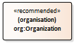
<dl class="def">
<dt>URI</dt>
<dd>http://www.w3.org/ns/org#Organization</dd>
<dt>Usage note (en)</dt>
<dd>collection of people organized together into a community or other social, commercial or political structure</dd>
<dt>Definition (en)</dt>
<dd>Represents a collection of people organized together into a community or other social, commercial or political structure. The group has some common purpose or reason for existence which goes beyond the set of people belonging to it and can act as an Agent. Organizations are often decomposable into hierarchical structures.  It is recommended that SKOS lexical labels should be used to label the Organization. In particular `skos:prefLabel` for the primary (possibly legally recognized name), `skos:altLabel` for alternative names (trading names, colloquial names) and `skos:notation` to denote a code from a code list. Alternative names: _Collective_ _Body_ _Org_ _Group_</dd>
<dt>Requirement level</dt>
<dd>Recommended</dd>
</dl>	
			
## Class: Category Scheme 
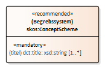
<dl class="def">
<dt>URI</dt>
<dd>http://www.w3.org/2004/02/skos/core#ConceptScheme</dd>
<dt>Usage note (en)</dt>
<dd>A concept collection (e.g. controlled vocabulary) in which the Category is defined.</dd>
<dt>Definition (en)</dt>
<dd>A set of concepts, optionally including statements about semantic relationships between those concepts.</dd>
<dt>Requirement level</dt>
<dd>Recommended</dd>
</dl>	 
The properties of this class:	

				
### Property: title 
<dl class="def">
<dt>URI</dt>
<dd>http://purl.org/dc/terms/title</dd>
<dt>Range</dt>
<dd>http://www.w3.org/2001/XMLSchema#string</dd>
<dt>Usage note (en)</dt>
<dd>This property contains a name of the category scheme. May be repeated for different versions of the name</dd>
<dt>Definition (en)</dt>
<dd>A name given to the resource.</dd>
<dt>Multiplicity</dt>
<dd>1..*</dd>
<dt>Requirement level</dt>
<dd>Mandatory</dd>
</dl>	
			
## Class: Category 

<dl class="def">
<dt>URI</dt>
<dd>http://www.w3.org/2004/02/skos/core#Concept</dd>
<dt>Usage note (en)</dt>
<dd>A subject of a Dataset.</dd>
<dt>Definition (en)</dt>
<dd>An idea or notion; a unit of thought.</dd>
<dt>Requirement level</dt>
<dd>Recommended</dd>
</dl>	 
The properties of this class:	

				
### Property: preferred label 
<dl class="def">
<dt>URI</dt>
<dd>http://www.w3.org/2004/02/skos/core#prefLabel</dd>
<dt>Range</dt>
<dd>http://www.w3.org/2001/XMLSchema#string</dd>
<dt>Usage note (en)</dt>
<dd>This property contains a preferred label of the category. This property can be repeated for parallel language versions of the label.</dd>
<dt>Definition (en)</dt>
<dd>The preferred lexical label for a resource, in a given language.</dd>
<dt>Multiplicity</dt>
<dd>1..*</dd>
<dt>Requirement level</dt>
<dd>Mandatory</dd>
</dl>	
			
## Class: Checksum 

<dl class="def">
<dt>URI</dt>
<dd>http://spdx.org/rdf/terms#Checksum</dd>
<dt>Usage note (en)</dt>
<dd>A Checksum is value that allows the contents of a file to be authenticated. Even small changes to the content of the file will change its checksum. This class allows the results of a variety of checksum and cryptographic message digest algorithms to be represented.</dd>
<dt>Definition (en)</dt>
<dd>A Checksum is value that allows the contents of a file to be authenticated. Even small changes to the content of the file will change its checksum. This class allows the results of a variety of checksum and cryptographic message digest algorithms to be represented</dd>
<dt>Requirement level</dt>
<dd>Optional</dd>
</dl>	 
The properties of this class:	

				
### Property: algorithm 
<dl class="def">
<dt>URI</dt>
<dd>http://spdx.org/rdf/terms#algorithm</dd>
<dt>Range</dt>
<dd>http://spdx.org/rdf/terms#checksumAlgorithm_sha1</dd>
<dt>Usage note (en)</dt>
<dd>This property identifies the algorithm used to produce the subject Checksum. Currently, SHA-1 is the only supported algorithm. It is anticipated that other algorithms will be supported at a later time.</dd>
<dt>Definition (en)</dt>
<dd>Identifies the algorithm used to produce the subject Checksum. Currently, SHA-1 is the only supported algorithm. It is anticipated that other algorithms will be supported at a later time. </dd>
<dt>Multiplicity</dt>
<dd>1..1</dd>
<dt>Requirement level</dt>
<dd>Mandatory</dd>
</dl>
				
### Property: checksum value 
<dl class="def">
<dt>URI</dt>
<dd>http://spdx.org/rdf/terms#checksumValue</dd>
<dt>Range</dt>
<dd>http://www.w3.org/2001/XMLSchema#hexBinary</dd>
<dt>Usage note (en)</dt>
<dd>This property provides a lower case hexadecimal encoded digest value produced using a specific algorithm</dd>
<dt>Definition (en)</dt>
<dd>The checksumValue property provides a lower case hexidecimal encoded digest value produced using a specific algorithm.</dd>
<dt>Multiplicity</dt>
<dd>1..1</dd>
<dt>Requirement level</dt>
<dd>Mandatory</dd>
</dl>	
			
## Class: Identifier 

<dl class="def">
<dt>URI</dt>
<dd>http://www.w3.org/ns/adms#Identifier</dd>
<dt>Usage note (en)</dt>
<dd>An identifier in a particular context, consisting of the string that is the identifier; an optional identifier for the identifier scheme; an optional identifier for the version of the identifier scheme; an optional identifier for the agency that manages the identifier scheme</dd>
<dt>Definition (en)</dt>
<dd>This class is based on the UN/CEFACT Identifier complex type defined in See Section 5.8 of Core Components Data Type Catalogue Version 3.1 (http://www.unece.org/fileadmin/DAM/cefact/codesfortrade/CCTS/CCTS-DTCatalogueVersion3p1.pdf) In RDF this is expressed using the following properties: - the content string should be provided using skos:notation, datatyped with the identifier scheme (inclduing the version number if appropriate); - use dcterms:creator to link to a class describing the agency that manages the identifier scheme or adms:schemaAgency to provide the name as a literal. Although not part of the ADMS conceptual model, it may be useful to provide further properties to the Identifier class such as dcterms:created to provide the date on which the identifier was issued.</dd>
<dt>Requirement level</dt>
<dd>Optional</dd>
</dl>	 
The properties of this class:	

				
### Property: notation 
<dl class="def">
<dt>URI</dt>
<dd>http://www.w3.org/2004/02/skos/core#notation</dd>
<dt>Range</dt>
<dd>rdfs:Literal</dd>
<dt>Usage note (en)</dt>
<dd>This property contains a string that is an identifier in the context of the identifier scheme referenced by its datatype.</dd>
<dt>Definition (en)</dt>
<dd>A notation, also known as classification code, is a string of characters such as "T58.5" or "303.4833" used to uniquely identify a concept within the scope of a given concept scheme.</dd>
<dt>Multiplicity</dt>
<dd>0..1</dd>
<dt>Requirement level</dt>
<dd>Optional</dd>
</dl>	
			
## Class: Licence Document 

<dl class="def">
<dt>URI</dt>
<dd>http://purl.org/dc/terms/LicenseDocument</dd>
<dt>Usage note (en)</dt>
<dd>A legal document giving official permission to do something with a resource.</dd>
<dt>Definition (en)</dt>
<dd>A legal document giving official permission to do something with a resource.</dd>
<dt>Requirement level</dt>
<dd>Recommended</dd>
</dl>	 
The properties of this class:	

				
### Property: licence type 
<dl class="def">
<dt>URI</dt>
<dd>http://purl.org/dc/terms/type</dd>
<dt>Range</dt>
<dd>http://www.w3.org/2004/02/skos/core#Concept</dd>
<dt>Usage note (en)</dt>
<dd>This property refers to a type of licence, e.g. indicating ‘public domain’ or ‘royalties required’.</dd>
<dt>Definition (en)</dt>
<dd>The nature or genre of the resource.</dd>
<dt>Multiplicity</dt>
<dd>0..*</dd>
<dt>Requirement level</dt>
<dd>Recommended</dd>
</dl>	
			
## Class: Location 

<dl class="def">
<dt>URI</dt>
<dd>http://purl.org/dc/terms/Location</dd>
<dt>Usage note (en)</dt>
<dd>A spatial region or named place. It can be represented using a controlled vocabulary or with geographic coordinates. In the latter case, the use of the Core Location Vocabulary  is recommended, following the approach described in the GeoDCAT-AP specification.</dd>
<dt>Definition (en)</dt>
<dd>A spatial region or named place.</dd>
<dt>Requirement level</dt>
<dd>Optional</dd>
</dl>	 
The properties of this class:	

				
### Property: bounding box 
<dl class="def">
<dt>URI</dt>
<dd>http://www.w3.org/ns/dcat#bbox</dd>
<dt>Range</dt>
<dd>http://www.w3.org/2000/01/rdf-schema#Literal</dd>
<dt>Usage note (en)</dt>
<dd>This property refers to he geographic bounding box of a resource.</dd>
<dt>Definition (en)</dt>
<dd>The geographic bounding box of a resource.</dd>
<dt>Multiplicity</dt>
<dd>0..1</dd>
<dt>Requirement level</dt>
<dd>Recommended</dd>
</dl>
				
### Property: centroid 
<dl class="def">
<dt>URI</dt>
<dd>http://www.w3.org/ns/dcat#centroid</dd>
<dt>Range</dt>
<dd>http://www.w3.org/2000/01/rdf-schema#Literal</dd>
<dt>Usage note (en)</dt>
<dd>This property refers to the geographic center (centroid) of a resource.</dd>
<dt>Definition (en)</dt>
<dd>The geographic center (centroid) of a resource.</dd>
<dt>Multiplicity</dt>
<dd>0..1</dd>
<dt>Requirement level</dt>
<dd>Recommended</dd>
</dl>
				
### Property: geometry 
<dl class="def">
<dt>URI</dt>
<dd>http://www.w3.org/ns/locn#geometry</dd>
<dt>Range</dt>
<dd>http://www.w3.org/2000/01/rdf-schema#Literal</dd>
<dt>Usage note (en)</dt>
<dd>This property associates any resource with the corresponding geometry.</dd>
<dt>Definition (en)</dt>
<dd>Associates any resource with the corresponding geometry.</dd>
<dt>Multiplicity</dt>
<dd>0..1</dd>
<dt>Requirement level</dt>
<dd>Optional</dd>
</dl>	
			
## Class: PeriodOfTime 

<dl class="def">
<dt>URI</dt>
<dd>http://purl.org/dc/terms/PeriodOfTime</dd>
<dt>Usage note (en)</dt>
<dd>An interval of time that is named or defined by its start and end dates.</dd>
<dt>Definition (en)</dt>
<dd>An interval of time that is named or defined by its start and end dates.</dd>
<dt>Requirement level</dt>
<dd>Optional</dd>
</dl>	 
The properties of this class:	

				
### Property: start date 
<dl class="def">
<dt>URI</dt>
<dd>http://www.w3.org/ns/dcat#startDate</dd>
<dt>Range</dt>
<dd>http://www.w3.org/2001/XMLSchema#date;   http://www.w3.org/2001/XMLSchema#dateTime</dd>
<dt>Usage note (en)</dt>
<dd>This property contains the start of the period</dd>
<dt>Definition (en)</dt>
<dd>The start of the period.</dd>
<dt>Multiplicity</dt>
<dd>0..1</dd>
<dt>Requirement level</dt>
<dd>Recommended</dd>
</dl>
				
### Property: end date 
<dl class="def">
<dt>URI</dt>
<dd>http://www.w3.org/ns/dcat#endDate</dd>
<dt>Range</dt>
<dd>http://www.w3.org/2001/XMLSchema#date;   http://www.w3.org/2001/XMLSchema#dateTime</dd>
<dt>Usage note (en)</dt>
<dd>This property contains the end of the period.</dd>
<dt>Definition (en)</dt>
<dd>The end of the period.</dd>
<dt>Multiplicity</dt>
<dd>0..1</dd>
<dt>Requirement level</dt>
<dd>Recommended</dd>
</dl>
				
### Property: beginning 
<dl class="def">
<dt>URI</dt>
<dd>http://www.w3.org/2006/time#hasBeginning</dd>
<dt>Range</dt>
<dd>http://www.w3.org/2006/time#Instant</dd>
<dt>Usage note (en)</dt>
<dd>This property contains the beginning of a period or interval.</dd>
<dt>Definition (en)</dt>
<dd>Beginning of a temporal entity.</dd>
<dt>Multiplicity</dt>
<dd>0..1</dd>
<dt>Requirement level</dt>
<dd>Optional</dd>
</dl>
				
### Property: end 
<dl class="def">
<dt>URI</dt>
<dd>http://www.w3.org/2006/time#hasEnd</dd>
<dt>Range</dt>
<dd>http://www.w3.org/2006/time#Instant</dd>
<dt>Usage note (en)</dt>
<dd>This property contains the end of a period or interval</dd>
<dt>Definition (en)</dt>
<dd>End of a temporal entity.</dd>
<dt>Multiplicity</dt>
<dd>0..1</dd>
<dt>Requirement level</dt>
<dd>Optional</dd>
</dl>	
			
## Class: Relationship 

<dl class="def">
<dt>URI</dt>
<dd>http://www.w3.org/ns/dcat#Relationship</dd>
<dt>Usage note (en)</dt>
<dd>An association class for attaching additional information to a relationship between DCAT Resources</dd>
<dt>Definition (en)</dt>
<dd>An association class for attaching additional information to a relationship between DCAT Resources.</dd>
<dt>Requirement level</dt>
<dd>Optional</dd>
</dl>	 
The properties of this class:	

				
### Property: relation 
<dl class="def">
<dt>URI</dt>
<dd>http://purl.org/dc/terms/relation</dd>
<dt>Range</dt>
<dd>http://www.w3.org/ns/dcat#Catalog; http://www.w3.org/ns/dcat#Dataset; http://www.w3.org/ns/dcat#DataService</dd>
<dt>Usage note (en)</dt>
<dd>This property refers to the resource related to the source resource.</dd>
<dt>Definition (en)</dt>
<dd>A related resource.</dd>
<dt>Multiplicity</dt>
<dd>1..*</dd>
<dt>Requirement level</dt>
<dd>Mandatory</dd>
</dl>
				
### Property: had role 
<dl class="def">
<dt>URI</dt>
<dd>http://www.w3.org/ns/dcat#hadRole</dd>
<dt>Range</dt>
<dd>http://www.w3.org/ns/dcat#Role</dd>
<dt>Usage note (en)</dt>
<dd>This property refers to the function of an entity or agent with respect to another entity or resource.</dd>
<dt>Definition (en)</dt>
<dd>The function of an entity or agent with respect to another entity or resource.</dd>
<dt>Multiplicity</dt>
<dd>1..*</dd>
<dt>Requirement level</dt>
<dd>Mandatory</dd>
</dl>	
			
## Class: Frequency 

<dl class="def">
<dt>URI</dt>
<dd>http://purl.org/dc/terms/Frequency</dd>
<dt>Usage note (en)</dt>
<dd>A rate at which something recurs, e.g. the publication of a Dataset. </dd>
<dt>Definition (en)</dt>
<dd>A rate at which something recurs.</dd>
<dt>Requirement level</dt>
<dd>Optional</dd>
</dl>	
			
## Class: Linguistic system 

<dl class="def">
<dt>URI</dt>
<dd>http://purl.org/dc/terms/LinguisticSystem</dd>
<dt>Usage note (en)</dt>
<dd>A system of signs, symbols, sounds, gestures, or rules used in communication, e.g. a language</dd>
<dt>Definition (en)</dt>
<dd>A system of signs, symbols, sounds, gestures, or rules used in communication.</dd>
<dt>Requirement level</dt>
<dd>Optional</dd>
</dl>	
			
## Class: Media Type 

<dl class="def">
<dt>URI</dt>
<dd>http://purl.org/dc/terms/MediaType</dd>
<dt>Usage note (en)</dt>
<dd>A media type, e.g. the format of a computer file </dd>

<dt>Definition (en)</dt>
<dd>A file format or physical medium.</dd>
<dt>Requirement level</dt>
<dd>Optional</dd>
</dl>	
			
## Class: Role 
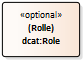
<dl class="def">
<dt>URI</dt>
<dd>http://www.w3.org/ns/dcat#Role</dd>
<dt>Usage note (en)</dt>
<dd>A role is the function of a resource or agent with respect to another resource, in the context of resource attribution or resource relationships. Note it is a subclass of skos:Concept.</dd>
<dt>Definition (en)</dt>
<dd>A role is the function of a resource or agent with respect to another resource, in the context of resource attribution or resource relationships.</dd>
<dt>Requirement level</dt>
<dd>Optional</dd>
</dl>	
			
## Class: Provenance Statement 
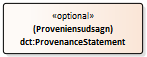
<dl class="def">
<dt>URI</dt>
<dd>http://purl.org/dc/terms/ProvenanceStatement</dd>
<dt>Usage note (en)</dt>
<dd>A statement of any changes in ownership and custody of a resource since its creation that are significant for its authenticity, integrity, and interpretation </dd>
<dt>Definition (en)</dt>
<dd>Any changes in ownership and custody of a resource since its creation that are significant for its authenticity, integrity, and interpretation.</dd>
<dt>Requirement level</dt>
<dd>Optional</dd>
</dl>	
			
## Class: Rights Statement 

<dl class="def">
<dt>URI</dt>
<dd>http://purl.org/dc/terms/RightsStatement</dd>
<dt>Usage note (en)</dt>
<dd>A statement about the intellectual property rights (IPR) held in or over a resource, a legal document giving official permission to do something with a resource, or a statement about access rights.</dd>
<dt>Definition (en)</dt>
<dd>A statement about the intellectual property rights (IPR) held in or over a resource, a legal document giving official permission to do something with a resource, or a statement about access rights.</dd>
<dt>Requirement level</dt>
<dd>Optional</dd>
</dl>	
			
## Class: Document 
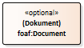
<dl class="def">
<dt>URI</dt>
<dd>http://xmlns.com/foaf/spec/#term_Document</dd>
<dt>Usage note (en)</dt>
<dd>A textual resource intended for human consumption that contains information, e.g. a web page about a Dataset.</dd>
<dt>Definition (en)</dt>
<dd>A document.</dd>
<dt>Requirement level</dt>
<dd>Optional</dd>
</dl>	
			
## Class: Standard 

<dl class="def">
<dt>URI</dt>
<dd>http://purl.org/dc/terms/Standard</dd>
<dt>Usage note (en)</dt>
<dd>A standard or other specification to which a Dataset or Distribution conforms</dd>
<dt>Definition (en)</dt>
<dd>A reference point against which other things can be evaluated or compared.</dd>
<dt>Requirement level</dt>
<dd>Optional</dd>
</dl>	
			
## Class: Kind 

<dl class="def">
<dt>URI</dt>
<dd>http://www.w3.org/2006/vcard/ns#Kind</dd>
<dt>Usage note (en)</dt>
<dd>A description following the vCard specification, e.g. to provide telephone number and e-mail address for a contact point. Note that the class Kind is the parent class for the four explicit types of vCards (Individual, Organization, Location, Group)</dd>
<dt>Definition (en)</dt>
<dd>The parent class for all objects</dd>
<dt>Requirement level</dt>
<dd>Optional</dd>
</dl>	

## Class: Activity 

<dl class="def">
<dt>URI</dt>
<dd>http://www.w3.org/ns/prov#Activity</dd>
<dt>Usage note (en)</dt>
<dd>something that occurs over a period of time and acts upon or with entities</dd>
<dt>Definition (en)</dt>
<dd>An activity is something that occurs over a period of time and acts upon or with entities; it may include consuming, processing, transforming, modifying, relocating, using, or generating entities.</dd>
<dt>Requirement level</dt>
<dd>Optional</dd>
</dl>

## Class: Legal Resource 

<dl class="def">
<dt>URI</dt>
<dd>http://data.europa.eu/eli/ontology#LegalResource</dd>
<dt>Definition (en)</dt>
<dd>A work in a legislative corpus. This applies to acts that have been legally enacted (whether or not they are still in force).A legal resource can represent a legal act or any component of a legal act, like an article.  Legal resources can be linked together using properties defined in the model.</dd>
<dt>Requirement level</dt>
<dd>Optional</dd>
</dl>

## Class: Policy 
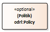
<dl class="def">
<dt>URI</dt>
<dd>http://www.w3.org/ns/odrl/2/Policy</dd>
<dt>Definition (en)</dt>
<dd>A non-empty group of Permissions and/or Prohibitions.</dd>
<dt>Requirement level</dt>
<dd>Optional</dd>
</dl>

## Class: Attribution 
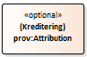
<dl class="def">
<dt>URI</dt>
<dd>http://www.w3.org/ns/prov#Attribution</dd>
<dt>Definition (en)</dt>
<dd>Attribution is the ascribing of an entity to an agent.</dd>
<dt>Requirement level</dt>
<dd>Optional</dd>
</dl>

## Class: PublicAdministrativeTaskType DK

<dl class="def">
<dt>URI</dt>
<dd>https:/data.gov.dk/concept/core/tasktype/PublicAdministrativeTaskType </dd>
<dt>Definition (en)</dt>
<dd>Type of public-sector task in relation to governance and administration in the Danish public sector</dd>
<dt>Requirement level</dt>
<dd>Anbefalet </dd>
</dl>
			
## Class: Usage DK

<dl class="def">
<dt>URI</dt>
<dd>http://www.w3.org/ns/duv#Usage</dd>
<dt>Usage note (en)</dt>
<dd>A helpful description of actions that can be performed on a given dataset or distribution</dd>
<dt>Definition (en)</dt>
<dd>A helpful description of actions that can be performed on a given dataset or distribution</dd>
<dt>Requirement level</dt>
<dd>Optional</dd>
</dl>	
			
## Class: Quality Metadata DK

<dl class="def">
<dt>URI</dt>
<dd>http://www.w3.org/ns/dqv#QualityMetadata</dd>
<dt>Usage note (en)</dt>
<dd>Represents quality metadata</dd>
<dt>Definition (en)</dt>
<dd>Represents quality metadata, it is defined to group quality certificates, policies, measurements and annotations under a named graph</dd>
<dt>Requirement level</dt>
<dd>Optional</dd>
</dl>	

## Class: Personal Data Category DK

<dl class="def">
<dt>URI</dt>
<dd>https://data.gov.dk/concept/core/personaldata-type/PersonalDataCategory</dd>
<dt>Usage note (en)</dt>
<dd>Data can be marked with a category of personal data as it is described in the Danish Data Protection Agency’s guideline: general personal data, sensitive personal data or data about criminal offences. To that is added information regarding the absence of personal data.</dd>
<dt>Definition (en)</dt>
<dd>classification according to the sensitivity of information as defifferent conditions and procedures for processing are applicable </dd>
<dt>Requirement level</dt>
<dd>Recommended</dd>
</dl>	

## Class: Confidentiality Type DK

<dl class="def">
<dt>URI</dt>
<dd>https://data.gov.dk/concept/core/confidentiality-type/ConfidentialityType</dd>
<dt>Usage note (en)</dt>
<dd>Used as a super class for the class ConfidentialityTypeNatoEu that contains classification used in NATO and EU respectively</dd>
<dt>Definition (en)</dt>
<dd>degree of confidentiality with respect to the extent by which information can be disclosed</dd>
<dt>Requirement level</dt>
<dd>Optional</dd>
</dl>	
	
## Class: Instant 

<dl class="def">
<dt>URI</dt>
<dd>http://www.w3.org/2006/time#Instant </dd>
<dt>Definition (en)</dt>
<dd>A temporal entity with zero extent or duration</dd>
<dt>Requirement level</dt>
<dd>Recommended</dd>
</dl>

## Class: Literal 
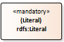
<dl class="def">
<dt>URI</dt>
<dd>http://www.w3.org/2000/01/rdf-schema#Literal</dd>
<dt>Definition (en)</dt>
<dd>The class of literal values, eg. textual strings and integers.</dd>
<dt>Requirement level</dt>
<dd>Mandatory</dd>
</dl>

## Class: Resource 

<dl class="def">
<dt>URI</dt>
<dd>http://www.w3.org/2000/01/rdf-schema#Resource</dd>
<dt>Definition (en)</dt>
<dd>The class resource, everything.</dd>
<dt>Requirement level</dt>
<dd>Mandatory</dd>
</dl>
	

# Classifications
In DCAT-AP, the European Commission specifies a number of classifications to be used in the description of catalogue, datasets and distributioner. In addition, DCAT-AP-DK introduces a few additional classifications for use in the Danish public sector

Please find below, the classifications to be used in relation to the different properties / fields. Also, please refer to Chapter 5 [Controlled Vocabularies in DCAT-AP](https://joinup.ec.europa.eu/sites/default/files/distribution/access_url/2020-06/e4823478-4458-4546-9a85-3609867ad089/DCAT_AP_2.0.1.pdf)

Note that if the property in question is used, it is a requirement that the designated classification is also used (with a few exceptions - see notes).

## Data themes (Themes)
Property: dcat:theme

**CLASSIFICATION: EU Data theme**
URI: http://publications.europa.eu/resource/authority/data-theme
[View the classification EU Datatemaer](
https://op.europa.eu/da/web/eu-vocabularies/dataset/-/resource?uri=http://publications.europa.eu/resource/dataset/data-theme)

## Public Administrative Task type (Themes)
Property: dcat:theme

**CLASSIFICATION: FORM (FællesOffentligeReferenceModel)**

[View the classification FORM](https://www.form-online.dk/soegning)

**CLASSIFICATION: KLE (KL Emnesystematik)**
[View the classification KLE](http://www.kle-online.dk/soegning)

## Frequencies
Property: dct:accrualPeriodicity

**CLASSIFICATION: EU Frequency**

URI: http://publications.europa.eu/resource/authority/frequency

[View the classification EU Frekvenser](https://op.europa.eu/da/web/eu-vocabularies/dataset/-/resource?uri=http://publications.europa.eu/resource/dataset/frequency)

## Media Types
Property: dct:mediaType

**CLASSIFICATION: Internet Assigned Numbers Authority (IANA) Media Type.** 

URI: http://www.iana.org/assignments/media-types/

[View the classification IANA Media Types](http://www.iana.org/assignments/media-types/media-types.xhtml)

Examples:
* https://www.iana.org/assignments/media-types/text/html
* https://www.iana.org/assignments/media-types/text/xml
* https://www.iana.org/assignments/media-types/text/csv
* https://www.iana.org/assignments/media-types/text/plain
* https://www.iana.org/assignments/media-types/application/json
* https://www.iana.org/assignments/media-types/application/xml
* https://www.iana.org/assignments/media-types/application/zip
* https://www.iana.org/assignments/media-types/application/pdf
* https://www.iana.org/assignments/media-types/application/ld+json
* https://www.iana.org/assignments/media-types/application/vnd.ms-excel (.xls)
* https://www.iana.org/assignments/media-types/application/vnd.openxmlformats-officedocument.spreadsheetml.sheet (.xlsx)

## File Types
Property: dct:format

**CLASSIFICATION: EU File Type**

URI: http://publications.europa.eu/resource/authority/file-type

[View the classification EU File Type](https://op.europa.eu/da/web/eu-vocabularies/dataset/-/resource?uri=http://publications.europa.eu/resource/dataset/file-type)

Examples:
* http://publications.europa.eu/resource/authority/file-type/CSV
* http://publications.europa.eu/resource/authority/file-type/XLS
* http://publications.europa.eu/resource/authority/file-type/XML
* http://publications.europa.eu/resource/authority/file-type/GML
* http://publications.europa.eu/resource/authority/file-type/RDF
* http://publications.europa.eu/resource/authority/file-type/TXT
* http://publications.europa.eu/resource/authority/file-type/ZIP
* http://publications.europa.eu/resource/authority/file-type/JSON

## Language
Property: dct:language

**CLASSIFICATION: EU Sprog**

URI: http://publications.europa.eu/resource/authority/language
 
[View the classification EU Sprog](https://op.europa.eu/da/web/eu-vocabularies/dataset/-/resource?uri=http://publications.europa.eu/resource/dataset/language)

Examples:
* http://publications.europa.eu/resource/dataset/language/DAN
* http://publications.europa.eu/resource/dataset/language/ENG

## Geographical Areas
Property: dct:spatial

**CLASSIFICATION: continent**

URI: http://publications.europa.eu/resource/authority/continent/

[View the classification continent](https://op.europa.eu/da/web/eu-vocabularies/dataset/-/resource?uri=http://publications.europa.eu/resource/dataset/continent) 

**CLASSIFICATION: country**

URI: http://publications.europa.eu/resource/authority/country

[View the classification country](https://op.europa.eu/da/web/eu-vocabularies/dataset/-/resource?uri=http://publications.europa.eu/resource/dataset/country)

**CLASSIFICATION: place name**

URI: http://publications.europa.eu/resource/authority/place/

[View the classification place name](
https://op.europa.eu/da/web/eu-vocabularies/dataset/-/resource?uri=http://publications.europa.eu/resource/dataset/place)

**CLASSIFICATION: Geonames**

URI: http://sws.geonames.org/

[View the classification Geonames](http://sws.geonames.org/)

Note that the EU Vocabularies Name Authority Lists must be used for continents, countries and places that are in those lists; if a particular location is not in one of the mentioned Named Authority Lists, Geonames URIs must be used

## Statuses
Property: adms:status

**CLASSIFICATION: ADMS Status**

A number of classifications and controlled vocabularies relevant for ADMS are distributed in the file  https://joinup.ec.europa.eu/svn/adms/ADMS_v1.00/ADMS_SKOS_v1.00.rdf. In this file the instances of skos:Concept are described in relation to a specific instance of a skos:ConceptScheme. The instances relevant for the for the status classification are in the concept scheme with the URI http://purl.org/adms/status/1.0 

[View the classification ADMS Statusser](http://purl.org/adms/status/)
* http://purl.org/adms/status/Completed
* http://purl.org/adms/status/Deprecated
* http://purl.org/adms/status/UnderDevelopment
* http://purl.org/adms/status/Withdrawn

Note that the EU Open Data Portal also use the following classification for specifying the status of a dataset. [http://publications.europa.eu/resource/authority/dataset-status](https://op.europa.eu/en/web/eu-vocabularies/at-dataset/-/resource/dataset/dataset-status)

## Publisher Type
Property: dct:type (on foaf:Agent)

**CLASSIFICATION: ADMS Publisher Type**

A number of classifications and controlled vocabularies relevant for ADMS are distributed in the file  https://joinup.ec.europa.eu/svn/adms/ADMS_v1.00/ADMS_SKOS_v1.00.rdf. In this file the instances of skos:Concept are described in relation to a specific instance of a skos:ConceptScheme. The instances relevant for the for the publisher type classification are in the concept scheme with the URI http://purl.org/adms/publishertype/1.0 

[View the classification ADMS udgivertyper](http://purl.org/adms/publishertype/)
* http://purl.org/adms/publishertype/Academia-ScientificOrganisation
* http://purl.org/adms/publishertype/Company
* http://purl.org/adms/publishertype/IndustryConsortium
* http://purl.org/adms/publishertype/LocalAuthority
* http://purl.org/adms/publishertype/NationalAuthority
* http://purl.org/adms/publishertype/NonGovernmentalOrganisation
* http://purl.org/adms/publishertype/NonProfitOrganisation
* http://purl.org/adms/publishertype/PrivateIndividual(s)
* http://purl.org/adms/publishertype/RegionalAuthority
* http://purl.org/adms/publishertype/StandardisationBody
* http://purl.org/adms/publishertype/SupraNationalAuthority"

## Licenstyper
Property: dct:license 

**CLASSIFICATION: ADMS Licence Type**

URI: http://purl.org/adms/licencetype/

[View the classification ADMS Licence Type**](http://purl.org/adms/licencetype/)  
* http://purl.org/adms/licencetype/Attribution
* http://purl.org/adms/licencetype/PublicDomain
* http://purl.org/adms/licencetype/ViralEffect-ShareAlike
* http://purl.org/adms/licencetype/ShareAlike-NotCompatible
* http://purl.org/adms/licencetype/ShareAlike-Compatible
* http://purl.org/adms/licencetype/NonCommercialUseOnly
* http://purl.org/adms/licencetype/NoDerivativeWork
* http://purl.org/adms/licencetype/RoyaltiesRequired
* http://purl.org/adms/licencetype/ReservedNames-Endorsement-OfficialStatus
* http://purl.org/adms/licencetype/NominalCost
* http://purl.org/adms/licencetype/GrantBack
* http://purl.org/adms/licencetype/JurisdictionWithinTheEU
* http://purl.org/adms/licencetype/OtherRestrictiveClauses
* http://purl.org/adms/licencetype/KnownPatentEncumbrance
* http://purl.org/adms/licencetype/UnknownIPR

## Availability
Property: dcat-ap:availability

**CLASSIFICATION: Availability (for distributions)**

URI: http://data.europa.eu/r5r/availability/

[View the classification Availability ](http://data.europa.eu/r5r/availability/)
* http://data.europa.eu/r5r/availability/temporary
* http://data.europa.eu/r5r/availability/experimental
* http://data.europa.eu/r5r/availability/available
* http://data.europa.eu/r5r/availability/stable

## Access Rights
Property: dct:accessRights 

**CLASSIFICATION: Access Right**

URI: http://publications.europa.eu/resource/authority/access-right

[View the classification Access Right]https://op.europa.eu/da/web/eu-vocabularies/dataset/-/resource?uri=http://publications.europa.eu/resource/dataset/access-right

## Personal Data Category
**CLASSIFICATION: Personal Data Category**

Content:
* https://data.gov.dk/concept/core/personaldata-type/SensitivePersonalData
* https://data.gov.dk/concept/core/personaldata-type/GeneralPersonalData 
* https://data.gov.dk/concept/core/personaldata-type/CivilRegistrationNumberData 
* https://data.gov.dk/concept/core/personaldata-type/DataAboutCriminalOffences 
* https://data.gov.dk/concept/core/personaldata-type/NonPersonalData 

References:
https://www.retsinformation.dk/eli/lta/2018/502
https://eur-lex.europa.eu/eli/reg/2016/679/oj
https://www.datatilsynet.dk/generelt-om-databeskyttelse/hvad-er-personoplysninger

## Confidentiality Type
**CLASSIFICATION: Confidentiality Types**

Confidentiality Types according to the sikkerhedscirkulæret (EU/NATO):
Ref: https://www.retsinformation.dk/eli/retsinfo/2014/10338

# References
* W3C: DCAT 2.0:[https://www.w3.org/TR/vocab-dcat-2/](https://www.w3.org/TR/vocab-dcat-2/)
* EU: DCAT-AP 2.0.1: [https://joinup.ec.europa.eu/collection/semantic-interoperability-community-semic/solution/dcat-application-profile-data-portals-europe/release/201-0](https://joinup.ec.europa.eu/collection/semantic-interoperability-community-semic/solution/dcat-application-profile-data-portals-europe/release/201-0)
* EU: DCAT-AP validator: [https://www.itb.ec.europa.eu/shacl/dcat-ap/upload](https://www.itb.ec.europa.eu/shacl/dcat-ap/upload)
* EU: DCAT-AP-OP (1.1): [http://data.europa.eu/euodp/en/developerscorner](http://data.europa.eu/euodp/en/developerscorner)
* Report - DCAT-AP and its extensions: Context and evolution [https://datos.gob.es/sites/default/files/doc/file/report_dcat-ap_and_its_extensions.pdf](https://datos.gob.es/sites/default/files/doc/file/report_dcat-ap_and_its_extensions.pdf)
* EU: EDP Goldbook: [https://www.europeandataportal.eu/sites/default/files/european_data_portal_-_open_data_goldbook.pdf](https://www.europeandataportal.eu/sites/default/files/european_data_portal_-_open_data_goldbook.pdf)
*FAIR Principles: [https://www.go-fair.org/fair-principles/](https://www.go-fair.org/fair-principles/)
* EU 10 Rules for Persistent URIs: [https://joinup.ec.europa.eu/collection/semantic-interoperability-community-semic/document/10-rules-persistent-uris](https://joinup.ec.europa.eu/collection/semantic-interoperability-community-semic/document/10-rules-persistent-uris)
* FDA: Guidelines for persistent http URIs: [https://arkitektur.digst.dk/node/588](https://arkitektur.digst.dk/node/588)
* W3C: Resource Description Framework: [https://www.w3.org/RDF/](https://www.w3.org/RDF/) 
* W3C: Shapes Constraint Language: [https://www.w3.org/TR/shacl/](https://www.w3.org/TR/shacl/)
* W3C: Data on the Web Best practices: [https://www.w3.org/TR/dwbp/](https://www.w3.org/TR/dwbp/)
* W3C: Data Quality Vocabulary: [https://www.w3.org/TR/vocab-dqv](https://www.w3.org/TR/vocab-dqv/)
* FDA: Danish public sector data quality vocabulary
[https://arkitektur.digst.dk/metoder/faelles-sprog-datakvalitet](https://arkitektur.digst.dk/node/625)
* FDA: Rules for Concept and Data Modeling:[https://arkitektur.digst.dk/metoder/regler-begrebs-og-datamodellering](https://arkitektur.digst.dk/metoder/regler-begrebs-og-datamodellering)

# Appendix

## Examples and validation

### Examples 
Examples of metadata that conforms to DCAT-AP-DK have been created.
The examples have been serialized as Turtle (.TTL) and RDF/XML (.RDF), but it is possible to convert to other format such as JSON-LD (eg. via http://www.easyrdf.org/converter)

Find the examples here: [https://github.com/digst/DCAT-AP-DK/tree/master/releases/v.2.0/examples](https://github.com/digst/DCAT-AP-DK/tree/master/releases/v.2.0/examples)

### Validation

The application profile has also been expressed with SHACL (Shapes Constraint Language), that enables validation of DCAT-AP-DK metadata. 

The SHACL profile has also been serialized as Turtle (.TTL) og RDF/XML (.RDF).

Find the SHACL files here: [https://github.com/digst/DCAT-AP-DK/tree/master/releases/v.2.0/validation](https://github.com/digst/DCAT-AP-DK/tree/master/releases/v.2.0/validation)

In SHACL Playground, insert the content of the TTL-filen and the example DCAT-AP-DK-metadata and perform validation. 
DCAT-AP has also been expressed with SHACL, and an online validator that uses this as been developed. 

Relevant links:
* SHACL Playground: [https://shacl.org/playground/](https://shacl.org/playground/)
* RDF validator: [https://www.w3.org/RDF/Validator/](https://www.w3.org/RDF/Validator/)
* DCAT-AP validator: [https://www.itb.ec.europa.eu/shacl/dcat-ap/upload](https://www.itb.ec.europa.eu/shacl/dcat-ap/upload)
* RDF converter: [http://www.easyrdf.org/converter](http://www.easyrdf.org/converter)

## UML-diagrams

### UML-diagram: DCAT-AP-DK
- URI: https://data.gov.dk/model/profile/dcat-ap-dk
- this version: https://data.gov.dk/model/profile/dcat-ap-dk-2.0.2/
- label: DCAT-AP-DK: Dansk anvendelsesprofil til beskrivelse af datasæt og datakataloger 
- responsibleEntity: Digitaliseringsstyrelsen
- versionInfo: 2.0.2
- dateModified: Date: 2020-10-01
- modelStatus: completed
- approvalStatus): approved
- approvedBy: The Public-Sector Architecture and Standards Counsel (Udvalget for Arkitektur og Standarder)
- theme:  http://www.form-online.dk/opgavenoegle/06/#06.38.10.10  
- comment: DCAT-AP-DK is a specification for the description of dataset and data catagloues to be used in the Danish public sector

### UML-diagram: DCAT-DK
- URI: https://data.gov.dk/model/core/dcat-dk
- this version: https://data.gov.dk/model/core/dcat-dk-1.0.0/
- label: DCAT-DK
- responsibleEntity: The Danish Agency for Digitisation
- versionInfo: 1.0.0
- dateModified: 2020-10-01
- modelStatus: completed
- approvedBy: The Public-Sector Architecture and Standards Counsel (Udvalget for Arkitektur og Standarder)
- approvalStatus: approved
- theme:  http://www.form-online.dk/opgavenoegle/06/#06.38.10.10  
- comment: DCAT-DK is a vocabulary that  extending the possibilities for describing datasets in the Danish Public-Secto and defines properties such as dataset reponsible organisation, payment imposed, personal data category and confidentiality type that are not part of DCAT-AP or DCAT.

## Concept Model 
- URI: https://data.gov.dk/concept/core/dataset/
- this version:  https://data.gov.dk/concept/core/dataset-1.0.0
- label: Concept Model for the Description of Datasets and Data Catalogues
- responsibleEntity: The Danish Agency for Digitisation
- versionInfo: 1.0.0
- dateModified: 2020-10-01
- modelStatus: completed
- approvalStatus: godkendt
- approvedBy: The Public-Sector Architecture and Standards Counsel (Udvalget for Arkitektur og Standarder)
- theme:  http://www.form-online.dk/opgavenoegle/06/#06.38.10.10  
- comment: Concept model containing central concepts for describing datasets and data catalogues

<table class="term-table">
    <thead>
        <tr>
            <th>
                Preferred English Term
            </th>
            <th>
                Definition
            </th>
            <th>
                Legal source
            </th>
            <th>
                Source
            </th>
            <th>
                Defined by (this model)
            </th>
            <th>
                Preferred Danish Term
            </th>
        </tr>
    </thead>
    <tbody>	

 <tr><td>catalog</td><td>a curated collection of metadata about resources</td><td>&nbsp;</td><td>http://www.w3.org/ns/dcat#Catalog</td><td>&nbsp;Yes</td><td>katalog </td></tr>
 <tr><td>catalog record</td><td>a record in a catalog, describing the registration of a single resource.</td><td>&nbsp;</td><td>http://www.w3.org/ns/dcat#CatalogPost</td><td>&nbsp;yes</td><td>katalogpost</td></tr>
 <tr><td>catalogued resource </td><td>resource published or curated by a single agent in a catalogue</td><td>&nbsp;</td><td>http://www.w3.org/ns/dcat#Resource</td><td>&nbsp;yes</td><td>katalogiseret ressource</td></tr>
 <tr><td>data catalogue</td><td>a curated collection of metadata about data-related resources</td><td>&nbsp;</td><td>&nbsp;</td><td>&nbsp;yes</td><td>datakatalog </td></tr> 
 <tr><td>data service </td><td>a site or end-point providing operations related to the discovery of, access to, or processing functions on, data or related resources.</td><td>&nbsp;</td><td>http://www.w3.org/ns/dcat#DataService</td><td>&nbsp;yes</td><td>datatjeneste</td></tr>
 <tr><td>distribution</td><td>a specific representation of a dataset</td><td>&nbsp;</td><td>http://www.w3.org/ns/dcat#Distribution</td><td>&nbsp;yes</td><td>distribution </td></tr>
 <tr><td>serialization</td><td>method for converting a data structure or an object to a format that stored or transmitted in a computer environment </td><td>&nbsp;</td><td>&nbsp;</td><td>&nbsp;no</td><td>serialisering</td></tr> 
 <tr><td>access address</td><td>a URL of a resource that gives access to a distribution of the dataset</td><td>&nbsp;yes</td><td>adgangsadresse</td></tr> 
<tr><td>download URL</td><td>the URL of the downloadable file in a given format</td><td>&nbsp;</td><td>http://www.w3.org/ns/dcat#downloadURL</td><td>&nbsp;yes</td><td>download-URL </td></tr> 
 <tr><td>dataset</td><td>a collection of data, published or curated by a single agent, and available for access or download in one or more representations</td><td>&nbsp;</td><td>http://www.w3.org/ns/dcat#Dataset</td><td>&nbsp;yes</td><td>datasæt </td></tr>
 <tr><td>concept</td><td>an idea or notion; a unit of thought</td><td>&nbsp;</td><td>http://www.w3.org/2004/02/skos/core# </td><td>&nbsp;no</td><td> begreb</td></tr>
 <tr><td>concept scheme</td><td>a set of concepts, optionally including statements about semantic relationships between those concepts</td><td>&nbsp;</td><td>http://www.w3.org/2004/02/skos/core# </td><td>&nbsp;no</td><td>begrebssystem</td></tr>
 <tr><td>bytesize</td><td>the size of a distribution in bytes</td><td>&nbsp;</td><td>&nbsp;</td><td>&nbsp;no</td><td> bytestørrelse</td></tr>  
 <tr><td>language</td><td>a system of signs, symbols, sounds, gestures, or rules used in communication</td><td>&nbsp;</td><td>http://purl.org/dc/terms/</td><td>&nbsp;no</td><td> sprog</td></tr>
 <tr><td>dataset responsible organisation</td><td>organization that is legally accountable for the entire dataset</td><td>&nbsp;</td><td>&nbsp;</td><td>&nbsp;yes</td><td>datasætansvarlig organisation</td></tr>
 <tr><td>dataset creator</td><td>agent primarily responsible for making the dataset available</td><td>&nbsp;</td><td>&nbsp;</td><td>&nbsp;yes</td><td> datasætskaber</td></tr>
 <tr><td>creator</td><td>an entity responsible for making the resource.</td><td>&nbsp;</td><td>http://purl.org/dc/terms/</td><td>&nbsp;no</td><td> skaber</td></tr>
 <tr><td>publisher</td><td>an entity responsible for making the resource available</td><td>&nbsp;</td><td>http://purl.org/dc/terms/</td><td>&nbsp;no</td><td> udgiver</td></tr> 
 <tr><td>agent</td><td>an agent (eg. person, group, software or physical artifact)</td><td>&nbsp;</td><td>https://forvir.iterm.dk/?TermId=36&SrcLang=da&TrgLang=da</td><td>&nbsp;no</td><td>aktør </td></tr>  
 <tr><td>format</td><td>the file format, physical medium, or dimensions of the resource</td><td>&nbsp;</td><td>http://purl.org/dc/terms/</td><td>&nbsp;no</td><td>format </td></tr>
 <tr><td>homepage</td><td>website for a resource composed of a primary webpage and potentially a number of interconnected webpages</td><td>&nbsp;</td><td>&nbsp;</td><td>&nbsp;no</td><td>hjemmeside</td></tr>

    </tbody>    
</table>	

## Namespaces

<table class="term-table">
<thead><tr><th>prefix</th><th>namespace</th><th>model</th></tr></thead><tbody>
 <tr><td>rdf</td><td>http://www.w3.org/1999/02/22-rdf-syntax-ns#</td><td>The RDF Concepts Vocabulary </td></tr>	
 <tr><td>rdfs</td><td>http://www.w3.org/2000/01/rdf-schema#</td><td>The RDF Schema vocabulary </td></tr>
 <tr><td>dcat</td><td>http://www.w3.org/ns/dcat#</td><td>Data Catalog Vocabulary</td></tr>
 <tr><td>dcatap</td><td>http://data.europa.eu/r5r/</td><td>DCAT Application Profile for data portals in Europe</td></tr>
 <tr><td>adms</td><td>http://www.w3.org/ns/adms#</td><td>Asset Description Metadata Schema</td></tr>	
 <tr><td>dct</td><td>http://purl.org/dc/terms/</td><td>Dublin Core Metadata Terms</td></tr>
 <tr><td>foaf</td><td>http://xmlns.com/foaf/0.1/</td><td>Friend of a Friend</td></tr>	 
 <tr><td>schema</td><td>http://schema.org/</td><td>Schema.org</td></tr>
 <tr><td>skos</td><td>http://www.w3.org/2004/02/skos/core#</td><td>Simple Knowledge Organization System</td></tr>	
 <tr><td>locn</td><td>http://www.w3.org/ns/locn#</td><td>Core Location</td></tr>
 <tr><td>owl</td><td>http://www.w3.org/2002/07/owl#</td><td>Web Ontology Language</td></tr>
 <tr><td>odrl</td><td>http://www.w3.org/ns/odrl/2/</td><td>Open Digital Rights Language</td></tr>
 <tr><td>spdx</td><td>http://spdx.org/rdf/terms#</td><td>Software Package Data Exchange Vocabulary</td></tr>
 <tr><td>xsd</td><td>http://www.w3.org/2001/XMLSchema#</td><td>XML Schema</td></tr>
 <tr><td>vann</td><td>http://purl.org/vocab/vann/</td><td>Vocabulary for annotating vocabulary descriptions</td></tr>
 <tr><td>voaf</td><td>http://purl.org/vocommons/voaf#</td><td>Vocabulary of a Friend (VOAF)</td></tr>
 <tr><td>vcard</td><td>http://www.w3.org/2006/vcard/ns#</td><td>Virtual Contact File Vocabulary</td></tr>
 <tr><td>dqv</td><td>https://www.w3.org/ns/dqv</td><td>Data Quality Vocabulary</td></tr>
 <tr><td>duv</td><td>https://www.w3.org/ns/duv</td><td>Data Usage Vocabulary</td></tr>
 <tr><td>org</td><td>http://www.w3.org/ns/org#</td><td>The Organization Ontology</td></tr>	
 <tr><td>dcat-dk</td><td>https://data.gov.dk/model/core/dcat-dk/</td><td>DCAT-DK</td></tr>
 <tr><td>pers-cat</td><td>https://data.gov.dk/concept/core/personaldata-type/</td><td>Vocabulary for Personal Data Categories</td></tr>
 <tr><td>conf</td><td>https://data.gov.dk/concept/core/confidentiality-type/</td><td>Vocabulary for Confidentiality</td></tr>
 <tr><td>dcat-ap-dk</td><td>https://data.gov.dk/model/profile/dcat-ap-dk/</td><td>DCAT-AP-DK</td></tr>
</tbody></table>

================

[arkitektur.digst.dk](arkitektur.digst.dk)

