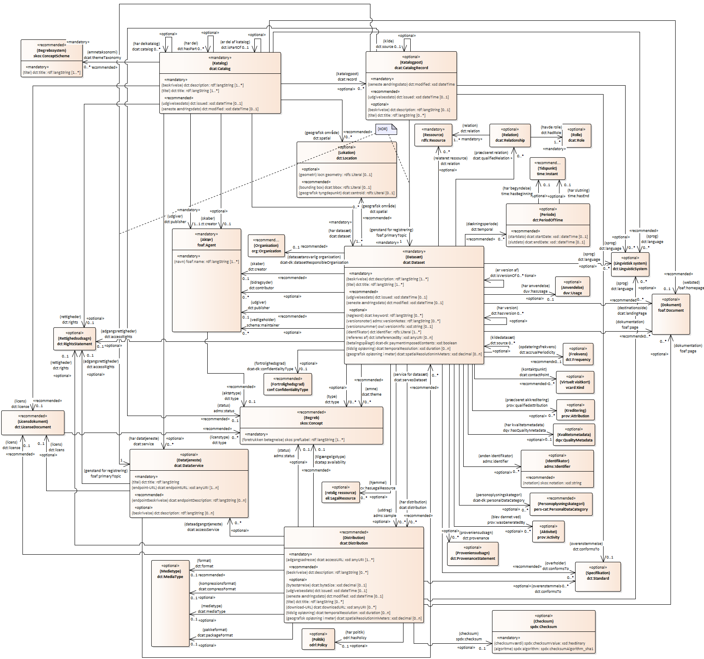
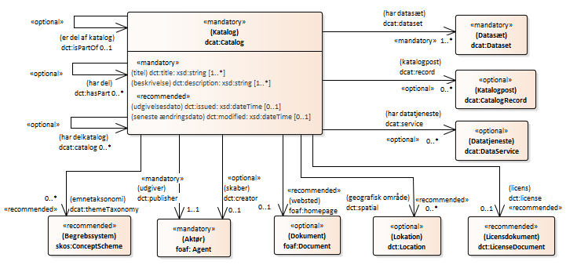
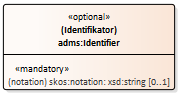
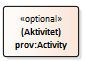

<pre class="metadata">
Title: DCAT-AP-DK 2.0.1: Dansk anvendelsesprofil til beskrivelse af datasæt og datakataloger (UDKAST)
Status: LD
URL: https://github.com/digst/DCAT-AP-DK/tree/master/releases/v.2.0/
Editor Term: Følgegruppemedlem, Følgegruppemedlemmer 
Editor: Digitaliseringsstyrelsen,, arkitektur@digst.dk
Editor: [Geodatastyrelsen]
Editor: [Erhvervsstyrelsen]
Editor: [Danmarks Miljøportal]
Editor: [Danmarks Statistik]
Editor: [KL]
Editor: [KOMBIT]
Editor: [Københavns Kommune]
Editor: [Miljøstyrelsen]
Editor: [Region Midtjylland]
Editor: [Rigsarkivet]
Editor: [Styrelsen for Arbejdsmarked og Rekruttering]
Editor: [Styrelsen for Dataforsyning og Effektivisering]
Group: Udvalget for Arkitektur og Standarder (UAS) 

Abstract: 'Dansk anvendelsesprofil til beskrivelse af datasæt og datakataloger (DCAT-AP-DK 2.0.1)' .
Boilerplate: copyright no, conformance no, abstract no
Shortname: DCAT-AP-DK
Revision: 2.0.1 (udkast)
Date: 2020-09-07
Max ToC Depth: 3
Markup Shorthands: markdown yes
Repository: digst/DCAT-AP-DK
Inline Github Issues: full
Logo: digst...
</pre>

Denne anvendelsesprofil er også tilgængelig i disse ikke-normative formater: [XMI](https://github.com/digst/DCAT-AP-DK/tree/master/releases/v.2.0/xmi), [SHACL](https://github.com/digst/DCAT-AP-DK/tree/master/releases/v.2.0/validation) og [RDF](https://github.com/digst/DCAT-AP-DK/tree/master/releases/v.2.0/rdf).

<i>DCAT-AP-DK namespace: https://data.gov.dk/model/profile/dcat-ap-dk/</i>

<h1>DCAT-AP-DK 2.0.1: Dansk anvendelsesprofil til beskrivelse af datasæt og datakataloger (UDKAST)</h1>

# Introduktion

DCAT-AP-DK 2.0.1 er en specifikation til beskrivelse af datasæt og datakataloger til anvendelse i dansk fællesoffentlig regi. Specifikationen omfatter basisoplysninger om datasæt, som fx titel, beskrivelse, udgiver, udgivelsesdato mv., samt en ensartet struktur for disse oplysninger i et fælles udvekslingsformat, som gør det muligt at dele oplysninger om datasæt på en effektiv måde. Specifikationen resulterer i en såkaldt anvendelsesprofil baseret på internationale og nationale specifikationer. 

## Formål
Specifikationen skal være med til sørge for, at begreber til beskrivelse af datasæt og datakataloger anvendes mere ens, og dermed skal den understøtte højere grad af interoperabilitet og kvalitet i oplysningerne. 

## Baggrund
De grundlæggende strukturer og elementer hentes fra Europa-Kommissionens specifikation 'The DCAT Application Profile for Data Portals in Europe' (DCAT-AP) 2.0.1, der har til formål at standardisere og etablere sammenhæng mellem dataportaler i medlemslandene. DCAT-AP 2.0.1 tager afsæt i W3C-specifikationen 'Data Catalog Vocabulary' (DCAT) 2.0. Europa-Kommissionens specifikation angiver felter, der er *obligatoriske* at udfylde samt *anbefalede* og *valgfrie* egenskaber. Specifikationen giver dermed mulighed for en meget omfangsrig metadatabeskrivelse. DCAT-AP-DK 2.0.1 vil anvende elementer fra og vil være i overensstemmelse med DCAT-AP 2.0.1. DCAT-AP-DK vil dog også tilføje enkelte nye elementer for at imødekomme behov i en dansk administrativ og fællesoffentlig kontekst. 

Specifikationen er udarbejdet med feedback fra og sparring med en følgegruppe med medlemmer, som repræsenterer både kommuner, regioner og statslige myndigheder. For at sikre at behov imødekommes vil den danske specifikation således tage udgangspunkt i følgegruppens vurdering af obligatoriske, anbefalede og valgfrie egenskaber i DCAT-AP 2.0. 

Specifikationen har også snitflader til PSI-loven (Public Sector Information) og EU’s [åbne data og PSI-direktiv](https://eur-lex.europa.eu/legal-content/DA/TXT/HTML/?uri=CELEX:32019L1024&from=EN) (2019/1024), der blandt andet indeholder krav om etablering af et enkelt adgangspunkt til offentlige data.

## Metode
Denne specifikation udgør en dansk basisprofil for datasæt og datakataloger (DCAT-AP-DK), som indeholder basisoplysninger om datasæt og datakataloger.  Basisoplysningerne udgør en fælles kerne, der kan udvides med yderligere kontekstafhængige oplysninger i nye og mere specifikke anvendelsesprofiler. Informationer dannet på baggrund af to eller flere specifikke anvendelsesprofiler kan potentielt bringes til at hænge sammen via denne fælles kerne.

Selve udviklingsarbejdet er foretaget i henhold de [Fællesoffentlige regler for begrebs- og datamodellering](https://arkitektur.digst.dk/metoder/regler-begrebs-og-datamodellering), og specifikationen sammensætter flere eksisterende nationale og internationale modeller.

### Globalt unikke og stabile identifikatorer
Data skal have tilknyttet metadata, og data skal være tildelt en unik og stabil global identifikator for at kunne genfindes og for, at man kan referere til data på en konsistent måde. Til dette anvendes en eksisterende global og bredt anvendt syntaks - URIer (Uniform Resource Identifiers). URI-specifikationen definerer en fælles syntaks for identificering og adressering  af ressourcer som på internettet. 
Der henvises til [FAIR-principperne](https://www.go-fair.org/fair-principles/), [EU 10 Rules for Persistent URIs](https://joinup.ec.europa.eu/collection/semantic-interoperability-community-semic/document/10-rules-persistent-uris) samt  [Retningslinjer for stablile http-urier](https://arkitektur.digst.dk/node/588).

## Profilens anvendelse
Anvendelsesprofilen er udformet, så den kan bruges til varetagelse to primære funktioner:
* Interne overblik over egne data i organisationer.
* Eksternt rettet information om data der deles mellem organisationer.

De metadata der er nyttige og anvendelige for disse to funktioner, er i væsentligt omfang de samme. Det har derfor ved udformningen af den danske anvendelsesprofil været hensigten at lade profilen være både en profil til brug for datadelingsinformationer og en profil for internt organisatoriske datakataloger.
Profilens informationer kan grupperes som:
* **Basisinformation** Ud over et navn for datasættet gives en informativ beskrivelse af datasættet og dets indhold, samt eventuelt lokalt anvendte identifikatorer.
* **Adgang til data** Informationer om hvordan man får adgang til datasættet og dets distributioner - fx via fildownload eller en eller flere datatjenester. 
* **Datamodel og -indhold** En reference til en eller flere modeller, skemaer eller profiler, der formelt beskriver datasættets struktur og indhold.
* **Kategorisering** Datasæt kan relateres til en eller flere klassifikationer og dermed give brugere et overblik over potentielt anvendelige datasæt. Yderligere kan der gives information om datas afgrænsning i henholdsvis tid og geografi.
* **Aktører** Identifikation af organisationer og personer der har en eller flere roller i relation til datasættet. Hvor det er relevant kan kontaktinformationer også tilføjes.
* **Datakvalitet, proveniens og historik** Til vurdering af datasættets anvendelighed til brugerens formål, kan informationer om datasættets vurderede kvalitet samt skabelses- og udviklingshistorie beskrives.
* **Jura og regulering** Forhold vedrørende licensrettigheder, betalingskrav, følsomhed af data samt lovgivningsbaggrund.

De to primære funktioner udfoldes i det følgende i disse anvendelsesscenarier:
* Organisationers interne datasætkatalog
* Organisationers eksternt rettede datasætkatalog
* Fællesorganisatorisk datasætkatalog
  * Domænespecifikt datasætkatalog
  * Nationalt datasætkatalog
  * Internationalt datasætkatalog.

### Anvendelsesscenarie 1: Organisationers interne datasætkatalog
I takt med at en organisations portefølje af datasæt stiger, øges behovet for en formel og kontrolleret håndtering af alle anvendelsesaspekter for de pågældende datasæt.
Med en samlet og koordineret registrering af organisationens datasæt kan organisationen eksempelvis få styr på, hvilke data der er i organisationen, hvad de anvendes til, hvilke services der benyttes, hvilke datasæt der er forbundne og til kontrakter og kontakter.
Et organisatorisk datasætkatalog hjælper på tværs af organisationens systemansvarlige, beslutningstagere og brugere, både ved opståede problemer, nye behov, videreudvikling og vedligehold.
Søgninger efter organisationens datasæt, dataansvarlige eller dokumentation, bliver både tidskrævende og usikker, hvis der ikke eksisterer et vedligeholdt overblik.

### Anvendelsesscenarie 2: Organisationers eksternt rettede datasætkatalog
Mange data deles allerede i dag mellem organisationer, både private og offentlige. Uanset om de data, der stilles til rådighed for andre, er fuldt og åbent tilgængelige for alle, eller om de er beskyttet af adgangs- eller betalingskrav, så er behovet for troværdige og lettilgængelige informationer om de delte data mindst lige så stort som internt i en organisation.
Særligt gælder det at information om en organisations tilgængelige datasæt kan bidrage til mere effektiv deling af data og reducere opbygning af redundante datasæt i egen organisation.
Overblik over eksisterende datasæt kan også sikre, at en organisation ikke unødigt gentager et indsamlings og/eller udviklingsarbejde, der allerede er tilgængeligt i en anden organisation.

### Anvendelsesscenarie 3: Fællesorganisatorisk datasætkatalog
Nytteværdien af et katalog over datasæt af den type der beskrives i anvendelsesscenarie 2, kan øges væsentligt ved at indgå i et informationsfællesskab om datasæt. Ved at oprette et fællesorganisatorisk katalog kan brugerne tilbydes et sted at søge informationer.
Hvor det i anvendelsesscenarie 2 var klart for brugeren, hvilken organisation der havde de beskrevne datasæt, kræves der i de fællesorganisatoriske lidt flere organisatoriske oplysninger. 
Et fællesorganisatorisk katalog samler udvalgte informationer om organisationers datasæt. Enten gennem etablerede dataportalers webservices, via indsamling fra organisationers metadataopmærkede websider eller ved direkte input fra datasætansvarlige.
Bemærk at en platform for et fællesorganisatorisk datasætkatalog også kan anvendes som den enkelte organisations overblik over egne data – også de data, der ikke ønskes delt med andre.

Fællesorganisatoriske datasætkataloger har tre specialiseringer:
* Det domænespecifikke katalog
* Det nationale katalog
* Det internationale katalog.

Disse beskrives her:

#### Anvendelsesscenarie 3.1: Domænespecifikt datasætkatalog
Et domænespecifikt katalog er et katalog, hvor organisationer, hvis datasæt er registreret i kataloget, indgår i et interessefællesskab. Dette kunne eksempelvis være et kommunalt fællesskab eller et fællesskab omkring sundhedsinformationer.
Domænespecifikke datasætkataloger kan forventes at have registreringsbehov, der knytter sig til deres domæne. Disse behov vil formentligt ligge uden for det, der dækkes af anvendelsesprofilen, men domænespecifikke kataloger vil stadig kunne benytte profilen dels som udgangspunkt for en udvidet profil, dels til at lade de domænespecifikke informationer indgå i et støre nationalt katalog.
#### Anvendelsesscenarie 3.2: Nationalt datasætkatalog
Et nationalt katalog kræver særlige løsninger for at kunne rumme den bredde af datasæt, der må forventes at blive indholdet. 
Blandt andet kræves det, at der anvendes en tværgående taksonomi. 
#### Anvendelsesscenarie 3.3: Internationalt datasætkatalog
Anvendelsesprofilen DCAT-AP-DK er baseret på en international profil og har derfor som udgangspunkt til hensigt at gøre data mere søgbare på tværs af grænser og sektorer. Det er også hensigten, at danske metadata skal kunne gøres tilgængelige i den europæisk dataportal. For at øge søgbarheden af danske data bør tekstuelle beskrivelser oversættes til engelsk i videst muligt omfang.

### Yderligere information vedrørende anvendelse af DCAT-AP-DK
* Eksempler:  
[https://github.com/digst/DCAT-AP-DK/tree/master/releases/v.2.0/examples](https://github.com/digst/DCAT-AP-DK/tree/master/releases/v.2.0/examples)

* Validering:
[https://github.com/digst/DCAT-AP-DK/tree/master/releases/v.2.0/validation](https://github.com/digst/DCAT-AP-DK/tree/master/releases/v.2.0/validation)

* Ofte stillede spørgsmål (FAQ):
[https://github.com/digst/DCAT-AP-DK/tree/master/releases/v.2.0/faq](https://github.com/digst/DCAT-AP-DK/tree/master/releases/v.2.0/faq)

* Kommentarer til DCAT-AP-DK (Issuetracker):
[https://github.com/digst/DCAT-AP-DK/issues](https://github.com/digst/DCAT-AP-DK/issues)

# Modellens grundlæggende struktur
DCAT har seks centrale elementer, hvis indbyrdes relationer udgør modellens grundlæggende struktur. Disse seks elementer beskrives herunder i kontekst af et datakatalog. Hvert element på et givet niveau kan beskrives med metadata såsom *titel*, *beskrivelse* og *identifikator*. Alle elementerne er beskrevet i detaljer i kapitel 5 [Elementer i DCAT-AP-DK](https://digst.github.io/DCAT-AP-DK/releases/v.2.0/docs/#elementer-i-dcat-ap-dk), og se evt. også [begrebsmodellen](https://digst.github.io/DCAT-AP-DK/releases/v.2.0/docs/#begrebmodel-for-beskrivelse-af-datast).

## Katalog
Et katalog (dcat:Catalog) er en udvalgt og arrangeret samling af metadata om ressourcer (fx datasæt og datatjenester i kontekst af et datakatalog). Elementet indeholder metadata om selve kataloget samt reference til de datasæt og datatjenester, som indgår i det pågældende datakatalog. Et datakatalog *skal* således indeholde datasæt, men det *kan* også indeholde datatjenester og andre datakataloger.  [Gå til klassen Katalog](https://digst.github.io/DCAT-AP-DK/releases/v.2.0/docs/#klasse-katalog-catalog)

## Katalogiseret ressource 
En katalogiseret ressource (dcat:Resource) er en ressource udgivet eller udvalgt og arrangeret af en enkelt aktør. Denne klasse bærer egenskaber, der gælder alle katalogiserede ressourcer. I kontekst af et datakatalog vil dette element ikke blive anvendt – det vil de tre datarelaterede undertyper derimod, hhv. datasæt, datatjeneste og katalog. 

## Datasæt
Et datasæt (dcat:Dataset) er en samling af data, udgivet eller udvalgt og arrangeret af en enkelt kilde, og som er til rådighed for adgang eller download i en eller flere repræsentationer (via instanser af klassen dcat:Distribution). Dvs. uafhængige af den måde data er formaliseret på.
 [Gå til klassen Datasæt](https://digst.github.io/DCAT-AP-DK/releases/v.2.0/docs/#klasse-datast-dataset)

## Datatjeneste
En datatjeneste (dcat:DataService) er et websted eller endpoint, der udstiller operationer relateret til opdagelse af, adgang til eller behandlende funktioner på data eller relaterede ressourcer. En datatjeneste kan være bundet til en eller flere specifikke datasæt. Denne klasse er valgfri.
 [Gå til klassen Datatjeneste](https://digst.github.io/DCAT-AP-DK/releases/v.2.0/docs/#klasse-datatjeneste-data-service)

## Distribution
En distribution (dcat:Distribution) er en specifik repræsentation af et datasæt. En distribution af et datasæt tilhører altid et og kun et datasæt. Et datasæt kan være tilgængelig i mange serialiseringer, der kan variere på forskellige vis, herunder sprog, medietype eller format, systemorganisering, tidslig- og geografisk opløsning, detaljeringsniveau eller profiler (der kan specificere en eller flere af ovenstående). En distribution kan betragtes som et fysisk element og indeholder derfor information om adgangsadresse, format, bytestørrelse, download-URL, adgangstjeneste m.fl. Instanser af dcat:Distribution indeholder med andre ord de informationer om datasættet, der kan variere mellem forskellige repræsentationer af samme datasæt. Denne klasse er valgfri.
 [Gå til klassen Distribution](https://digst.github.io/DCAT-AP-DK/releases/v.2.0/docs/#klasse-distribution-distribution)

Bemærk at det til beskrivelse af en distribution er muligt at benytte en række egenskaber, der også benyttes til beskrivelsen af distributionens datasæt. Egenskaberne er:
’titel’, ’beskrivelse’, ’dokumentation’, ’udgivelsesdato’, ’seneste ændringsdato’, ’overholder’, ’geografisk opløsning’ og ’tidslig opløsning’.
Hvor en distributions egenskabs information svarer til den information, der er givet på datasættets tilsvarende egenskab, er det ikke nødvendigt at gentage informationen. I de tilfælde, hvor der altså ikke er information for en distributions egenskab, gælder den information, der er givet for datasættets tilsvarende egenskab.
Hvis der for egenskaben er relevante tilføjelser, eller der er afvigelser i forhold til information givet for datasættet, bør de fremgå af distributionens egenskab.

## Katalogpost 
En katalogpost (dcat:CatalogRecord) er en post i et katalog, der beskriver registreringen af en enkelt ressource. Dette element kan rumme oplysninger, såsom hvem der har registreret ressourcen i kataloget og hvornår ressourcen blev registreret. Denne klasse er valgfri. Den kan anvendes i kataloger, hvor der skelnes mellem metadata om datasættet eller datatjenesten og metadata om selve registreringen af datasættet eller datatjenesten i kataloget.
 [Gå til klassen Katalogpost](https://digst.github.io/DCAT-AP-DK/releases/v.2.0/docs/#klasse-katalogpost-catalog-record)

## Illustration
Her ses en illustration af tre typisk anvendte elementer fra den grundlæggende struktur, nemlig "katalog" (obligatorisk), "datasæt" (obligatorisk) og "distribution" (anbefalet):

# Gældende krav og overensstemmelse
DCAT-AP-DK 2.0.1 er i overensstemmelse med DCAT-AP 2.0.1. Metadatabeskrivelser af datasæt og datakataloger, der overholder DCAT-AP-DK, overholder også DCAT-AP. 

## Kravniveauer
I DCAT-AP defineres følgende kravniveauer som også anvendes i denne anvendelsesprofil. 

* **Obligatorisk** (Mandatory): informationen SKAL angives
* **Anbefalet** (Recommended): informationen BØR angives hvis den er tilgængelig
* **Valgfri** (Optional): informationen KAN angives  

Læs mere om disse kravniveauer i kapitel 2 af [DCAT-AP 2.0.1](https://joinup.ec.europa.eu/sites/default/files/distribution/access_url/2020-06/e4823478-4458-4546-9a85-3609867ad089/DCAT_AP_2.0.1.pdf).

## Forskellige visninger af DCAT-AP-DK 
På baggrund af de tre ovenstående kravniveauer er der udarbejdet tre tilsvarende diagrammer over DCAT-AP-DK 2.0.1. 

Som det er beskrevet i kapitlet ’Modellens grundlæggende struktur’, er en distribution en direkte og konkret repræsentation af et datasæt. Det kunne måske derfor undre, at klassen for distributioner ikke er med i det diagram, der viser de obligatoriske klasser. Selv om det er sandsynligt, at der til alle datasæt er tilknyttet mindst en distribution, er det ikke en absolut nødvendighed. Eksempelvis kan der være tale om et datasæt, der er så tilstrækkeligt langt i sin udvikling, at det er meningsfyldt at beskrive datasættet i sig selv, mens en eller flere distributioner endnu ikke har nået samme stadie. 
Klassen for distributioner er med i de to øvrige diagrammer.

Se oversigt over anvendte namespaces i bilaget [Namespaces](https://digst.github.io/DCAT-AP-DK/releases/v.2.0/docs/#namespaces)

### Diagram med obligatoriske elementer (minimumsmodel)
[DCAT-AP-DK-visning 1](https://github.com/digst/DCAT-AP-DK/tree/master/releases/v.2.0/views/mandatory) 
beskriver obligatoriske klasser samt obligatoriske egenskaber for disse klasser (minimumsmodellen). 

### Diagram med obligatoriske og anbefalede elementer
[DCAT-AP-DK-visning 2](https://github.com/digst/DCAT-AP-DK/tree/master/releases/v.2.0/views/mandatory%2Brecommended)
beskriver obligatoriske/anbefalede klasser samt obligatoriske/anbefalede egenskaber for disse klasser (og som skjuler valgfrie elementer).

<!--  -->

### Diagram med alle elementer  
Den fulde anvendelsesprofil DCAT-AP-DK v.2.0.1 visualiseret med UML-diagram  (alle obligatoriske, anbefalede og valgfrie elementer).

## Afvigelser ift. DCAT-AP
Herunder beskrives afvigelser mellem DCAT-AP og DCAT-AP-DK, som kommer til udtryk gennem ændringer af kravniveau samt tilføjelser af nye elementer. Som det ses, afviger den danske profil primært i forhold til tilføjelsen af nye elementer til beskrivelse af datasæt.

### Ændringer af kravniveau
Kravniveauet for følgende elementer er blevet ændret i DCAT-AP-DK 2.0.1 ift. DCAT-AP 2.0.1:

* Datasæt: identifikator (dct:identifier) - Kravniveau: Valgfri > Anbefalet
* Datasæt: nøgleord (dcat:keyword) - Kravniveau: Anbefalet > Valgfri
* Datasæt: dokumentation (foaf:page) - Kravniveau:  Valgfri > Anbefalet
* Datasæt: udgivelsesdato (dct:issued) - Kravniveau: Valgfri > Anbefalet
* Datasæt: seneste ændringsdato (dct:modified) - Kravniveau: Valgfri > Anbefalet
* Datasæt: har distribution (dcat:distribution) - Kravniveau: Valgfri > Anbefalet

### Tilføjelser
Følgende elementer er blevet tilføjet i DCAT-AP-DK 2.0.1 ift. DCAT-AP 2.0.1:

* Datasæt: dataansvarlig organisation (dcat-dk:datasetResponsibleOrganisation)
* Datasæt: bidragsyder (dct:contributor)
* Datasæt: vedligeholder (schema:maintainer)
* Datasæt: hjemmel (cv:hasLegalResource)
* Datasæt: betalingspålagt (dcat-dk:paymentImposed)
* Datasæt: personoplysningskategori (dcat-dk:personalDataCategory) 
* Datasæt: fortrolighedsgrad (dcat-dk:confidentialityType)
* Datasæt: har kvalitetsmetadata (dqv:hasQualityMetadata)
* Datasæt: har anvendelse (duv:hasUsage)
* Klassen duv:Usage
* Klassen dqv:QualityMetadata
* Klassen org:Organization

I indholdsfortegnelsen har disse mærket 'DK'.

### Udeladelser
Der er ikke udeladt elementer fra DCAT-AP 2.0.1 i DCAT-AP 2.0.1.

## Centrale modeller som anvender DCAT

DCAT anvendes allerede i danske specifikationer - fx i [Fælles sprog for datakvalitet](https://arkitektur.digst.dk/metoder/faelles-sprog-datakvalitet) og Standard for beskrivelse af it-systemer [SYS-AP](https://digst.github.io/IT-System-AP/SYS-AP/docs/) og [archvSYS-AP](https://digst.github.io/IT-System-AP/archvSYS-AP/docs/). 

DCAT anvendes desuden i en  række internationale specifikationer såsom Europa-Kommissionens Single Digital Gateway - [SDG-metamodel](https://github.com/catalogue-of-services-isa/SDG-model), Core Public Service Vocabulary Application Profile ([CPSV-AP](https://joinup.ec.europa.eu/solution/core-public-service-vocabulary-application-profile)) og
Asset Description Metadata Schema ([ADMS](https://joinup.ec.europa.eu/solution/asset-description-metadata-schema-adms ))

Der er også udviklet flere nationale profiler af DCAT-AP af andre EU-medlemslande samt domænespecifikke profiler, fx [geoDCAT-AP](https://joinup.ec.europa.eu/solution/geodcat-application-profile-data-portals-europe) til geodata, [BregDCAP-AP](https://joinup.ec.europa.eu/solution/abr-specification-registry-registries) til grunddata og [statDCAT-AP](https://joinup.ec.europa.eu/solution/statdcat-application-profile-data-portals-europe) til statistiske datasæt. 

Find en rapport over DCAT-AP-profiler (fra 2018) samt øvrige relevante links i afsnittet [Referencer](https://digst.github.io/DCAT-AP-DK/releases/v.2.0/docs/#referencer). 

# Elementer i DCAT-AP-DK 
I det følgende præsenteres alle egenskaberne i DCAT-AP-DK per klasse.
			
			
## Klasse: Katalog (Catalog) 

<dl class="def">
<dt>URI</dt>
<dd>http://www.w3.org/ns/dcat#Catalog</dd>
<dt>Anvendelsesnote (da) </dt>
<dd>En udvalgt og arrangeret samling af metadata om datasæt og datatjenester i et katalog.</dd>
<dt>Anvendelsesnote (en)</dt>
<dd>A catalogue or repository that hosts the Datasets being described.</dd>
<dt>Definition (da)</dt>
<dd>En udvalgt og arrangeret samling af metadata om ressourcer (fx. datasæt og datatjenester i kontekst af et datakatalog).</dd>
<dt>Definition (en)</dt>
<dd>A curated collection of metadata about resources (e.g., datasets and data services in the context of a data catalog).</dd>
<dt>Kravniveau</dt>
<dd>Obligatorisk</dd>
</dl>	 
Klassens egenskaber:	

				
### Egenskab: titel (title) 
<dl class="def">
<dt>URI</dt>
<dd>http://purl.org/dc/terms/title</dd>
<dt>Rækkevidde</dt>
<dd>http://www.w3.org/2000/01/rdf-schema#Literal</dd>
<dt>Anvendelsesnote (da)</dt>
<dd>Denne egenskab giver det eller de ord der navngiver kataloget. Egenskaben kan optræde én gang for hver sprogvariant af titlen. </dd>
<dt>Anvendelsesnote (en)</dt>
<dd>This property contains a name given to the Catalogue. This property can be repeated for parallel language versions of the name.</dd>
<dt>Definition (da)</dt>
<dd>Et navn givet til ressourcen.</dd>
<dt>Definition (en)</dt>
<dd>A name given to the resource.</dd>
<dt>Multiplicitet</dt>
<dd>1..*</dd>
<dt>Kravniveau</dt>
<dd>Obligatorisk</dd>
</dl>
				
### Egenskab: beskrivelse (description) 
<dl class="def">
<dt>URI</dt>
<dd>http://purl.org/dc/terms/description</dd>
<dt>Rækkevidde</dt>
<dd>http://www.w3.org/2000/01/rdf-schema#Literal</dd>
<dt>Anvendelsesnote (da)</dt>
<dd>Denne egenskab giver en tekstbaseret beskrivelse af datakatalogets formål og indhold. Egenskaben kan optræde én gang for hver sprogvariant af beskrivelsen.</dd>
<dt>Anvendelsesnote (en)</dt>
<dd>This property contains a free-text account of the Catalogue. This property can be repeated for parallel language versions of the description.</dd>
<dt>Definition (da)</dt>
<dd>En forklaring af ressourcen.</dd>
<dt>Definition (en)</dt>
<dd>An account of the resource.</dd>
<dt>Multiplicitet</dt>
<dd>1..*</dd>
<dt>Kravniveau</dt>
<dd>Obligatorisk</dd>
</dl>
				
### Egenskab: har datasæt (dataset) 
<dl class="def">
<dt>URI</dt>
<dd>http://www.w3.org/ns/dcat#dataset</dd>
<dt>Rækkevidde</dt>
<dd>http://www.w3.org/ns/dcat#Dataset</dd>
<dt>Anvendelsesnote (da)</dt>
<dd>Denne egenskab angiver et datasæt som er opført i kataloget</dd>
<dt>Anvendelsesnote (en)</dt>
<dd>This property links the Catalogue with a Dataset that is part of the Catalogue.</dd>
<dt>Definition (da)</dt>
<dd>En samling af data som er opført i kataloget.</dd>
<dt>Definition (en)</dt>
<dd>A collection of data that is listed in the catalog.</dd>
<dt>Multiplicitet</dt>
<dd>1..*</dd>
<dt>Kravniveau</dt>
<dd>Obligatorisk</dd>
</dl>
				
### Egenskab: har datatjeneste (service) 
<dl class="def">
<dt>URI</dt>
<dd>http://www.w3.org/ns/dcat#service</dd>
<dt>Rækkevidde</dt>
<dd>http://www.w3.org/ns/dcat#DataService</dd>
<dt>Anvendelsesnote (da)</dt>
<dd>Denne egenskab angiver et websted eller endpoint som er opført i kataloget.</dd>
<dt>Anvendelsesnote (en)</dt>
<dd>This property refers to a site or end-point that is listed in the catalog.</dd>
<dt>Definition (da)</dt>
<dd>Et websted eller et endpoint som er opført i kataloget</dd>
<dt>Definition (en)</dt>
<dd>A site or endpoint that is listed in the catalog.</dd>
<dt>Multiplicitet</dt>
<dd>0..*</dd>
<dt>Kravniveau</dt>
<dd>Valgfri</dd>
</dl>
				
### Egenskab: udgiver (publisher) 
<dl class="def">
<dt>URI</dt>
<dd>http://purl.org/dc/terms/publisher</dd>
<dt>Rækkevidde</dt>
<dd>http://xmlns.com/foaf/0.1/Agent</dd>
<dt>Anvendelsesnote (da)</dt>
<dd>Denne egenskab angiver den aktør (organisation) der er ansvarlig for at gøre kataloget tilgængeligt.</dd>
<dt>Anvendelsesnote (en)</dt>
<dd>This property refers to an entity (organisation) responsible for making the Catalogue available. </dd>
<dt>Definition (da)</dt>
<dd>En entitet som er ansvarlig for at gøre ressourcen tilgængelig.</dd>
<dt>Definition (en)</dt>
<dd>An entity responsible for making the resource available.</dd>
<dt>Multiplicitet</dt>
<dd>1..1</dd>
<dt>Kravniveau</dt>
<dd>Obligatorisk</dd>
</dl>
				
### Egenskab: skaber (creator) 
<dl class="def">
<dt>URI</dt>
<dd>http://purl.org/dc/terms/creator</dd>
<dt>Rækkevidde</dt>
<dd>http://xmlns.com/foaf/0.1/Agent</dd>
<dt>Anvendelsesnote (da)</dt>
<dd>Denne egenskab angiver den aktør der primært er ansvarlig for katalogets skabelse.</dd>
<dt>Anvendelsesnote (en)</dt>
<dd>This property refers to the entity primarily responsible for producing the catalogue.</dd>
<dt>Definition (en)</dt>
<dd>An entity responsible for making the resource.En entitet der er ansvarlig for ressourcens skabelse.</dd>
<dt>Multiplicitet</dt>
<dd>0..1</dd>
<dt>Kravniveau</dt>
<dd>Valgfri</dd>
</dl>
				
### Egenskab: websted (homepage) 
<dl class="def">
<dt>URI</dt>
<dd>http://xmlns.com/foaf/0.1/homepage</dd>
<dt>Rækkevidde</dt>
<dd>http://xmlns.com/foaf/0.1/Document</dd>
<dt>Anvendelsesnote (da)</dt>
<dd>Denne egenskab angiver en webside som fungerer som katalogets hjemmeside.</dd>
<dt>Anvendelsesnote (en)</dt>
<dd>This property refers to a web page that acts as the main page for the Catalogue.</dd>
<dt>Definition (da)</dt>
<dd>Et websted for noget.</dd>
<dt>Definition (en)</dt>
<dd>A homepage for some thing.</dd>	
<dt>Multiplicitet</dt>
<dd>0..1</dd>
<dt>Kravniveau</dt>
<dd>Anbefalet</dd>
</dl>
				
### Egenskab: udgivelsesdato (release date) 
<dl class="def">
<dt>URI</dt>
<dd>http://purl.org/dc/terms/issued</dd>
<dt>Rækkevidde</dt>
<dd>http://www.w3.org/2001/XMLSchema#date;   http://www.w3.org/2001/XMLSchema#dateTime</dd>
<dt>Anvendelsesnote (da)</dt>
<dd>Denne egenskab angiver den dato hvor kataloget først blev formelt udgivet</dd>
<dt>Anvendelsesnote (en)</dt>
<dd>This property contains the date of formal issuance (e.g., publication) of the Catalogue.</dd>
<dt>Definition (en)</dt>
<dd>Date of formal issuance of the resource.Dato for hvornår ressourcen formelt blev udgivet.</dd>
<dt>Multiplicitet</dt>
<dd>0..1</dd>
<dt>Kravniveau</dt>
<dd>Anbefalet</dd>
</dl>
				
### Egenskab: seneste ændringsdato (update/modification date) 
<dl class="def">
<dt>URI</dt>
<dd>http://purl.org/dc/terms/modified</dd>
<dt>Rækkevidde</dt>
<dd>http://www.w3.org/2001/XMLSchema#date;   http://www.w3.org/2001/XMLSchema#dateTime</dd>
<dt>Anvendelsesnote (da)</dt>
<dd>Denne egenskab angiver den dato hvor kataloget senest er blevet ændret.</dd>
<dt>Anvendelsesnote (en)</dt>
<dd>This property contains the most recent date on which the Catalogue was changed or modified.</dd>
<dt>Definition (da)</dt>
<dd>Dato for hvornår ressourcen blev ændret.</dd>
<dt>Definition (en)</dt>
<dd>Date on which the resource was changed.</dd>
<dt>Multiplicitet</dt>
<dd>0..1</dd>
<dt>Kravniveau</dt>
<dd>Anbefalet</dd>
</dl>
				
### Egenskab: emneklassifikation (themes) 
<dl class="def">
<dt>URI</dt>
<dd>http://www.w3.org/ns/dcat#themeTaxonomy</dd>
<dt>Rækkevidde</dt>
<dd>http://www.w3.org/2004/02/skos/core#ConceptScheme</dd>
<dt>Anvendelsesnote (da)</dt>
<dd>Denne egenskab angiver en emneklassifikation der anvendes til klassifikation af datasæt og datatjenester i kataloget.</dd>
<dt>Anvendelsesnote (en)</dt>
<dd>This property refers to a knowledge organization system used to classify the Catalogue's Datasets.</dd>
<dt>Definition (da)</dt>
<dd>Vidensorganiseringssystem (KOS) som anvendes til at klassificere datasæt i kataloget.</dd>
<dt>Definition (en)</dt>
<dd>A knowledge organization system (KOS) used to classify catalog's datasets and services.</dd>
<dt>Multiplicitet</dt>
<dd>0..*</dd>
<dt>Kravniveau</dt>
<dd>Anbefalet</dd>
</dl>
				
### Egenskab: geografisk område (spatial/geographic) 
<dl class="def">
<dt>URI</dt>
<dd>http://purl.org/dc/terms/spatial</dd>
<dt>Rækkevidde</dt>
<dd>http://purl.org/dc/terms/Location</dd>
<dt>Anvendelsesnote (da)</dt>
<dd>Denne egenskab angiver et geografisk område som kataloget dækker. Afgræsningen kan enten udtrykkes ved udpegnings af geofrafisk område eller ved anvendelse af en af følgende klassifikationen: EU Vocabularies Continents Named Authority List, EU Vocabularies Countries Named Authority List, EU Vocabularies Places Named Authority List eller Geonames (Sidstnævnte bør kun anvendes såfremt lokationen ikke findes i et af de nævnte EU Authority Lists.</dd>
<dt>Anvendelsesnote (en)</dt>
<dd>This property refers to a geographical area covered by the Catalogue. </dd>
<dt>Definition (da)</dt>
<dd>Ressourcens geografiske karakteristika.</dd>	
<dt>Definition (en)</dt>
<dd>Spatial characteristics of the resource.</dd>
<dt>Multiplicitet</dt>
<dd>0..*</dd>
<dt>Kravniveau</dt>
<dd>Anbefalet</dd>
</dl>
				
### Egenskab: sprog (language) 
<dl class="def">
<dt>URI</dt>
<dd>http://purl.org/dc/terms/language</dd>
<dt>Rækkevidde</dt>
<dd>http://purl.org/dc/terms/LinguisticSystem</dd>
<dt>Anvendelsesnote (da)</dt>
<dd>Denne egenskab angiver et sprog som er anvendt til tekstbaserede metadata om datasæt og datatjenester i kataloget. Egenskaben kan gentages for hver sprogvariant metadata forefindes på. Til angivelse af sprog skal følgende klassifikation anvendes: EU Vocabularies Languages Named Authority List,  http://publications.europa.eu/resource/authority/language</dd>
<dt>Anvendelsesnote (en)</dt>
<dd>This property refers to a language used in the textual metadata describing titles, descriptions, etc. of the Datasets in the Catalogue. This property can be repeated if the metadata is provided in multiple languages. </dd>
<dt>Definition (da)</dt>
<dd>Ressourcens sprog.</dd>
<dt>Definition (en)</dt>
<dd>A language of the resource.</dd>
<dt>Multiplicitet</dt>
<dd>0..*</dd>
<dt>Kravniveau</dt>
<dd>Anbefalet</dd>
</dl>
				
### Egenskab: licens (license) 
<dl class="def">
<dt>URI</dt>
<dd>http://purl.org/dc/terms/license</dd>
<dt>Rækkevidde</dt>
<dd>http://purl.org/dc/terms/LicenseDocument</dd>
<dt>Anvendelsesnote (da)</dt>
<dd>Denne egenskab angiver den licens kataloget kan anvendes eller genbruges under.Et juridisk dokument der fastlægger de officielle tilladelser vedrørende en ressource.</dd>
<dt>Anvendelsesnote (en)</dt>
<dd>This property refers to the licence under which the Catalogue can be used or reused.</dd>
<dt>Definition (da)</dt>
<dd>Et juridisk dokument der fastlægger de officielle tilladelser vedrørende en ressource.</dd>	
<dt>Definition (en)</dt>
<dd>A legal document giving official permission to do something with a resource.</dd>
<dt>Multiplicitet</dt>
<dd>0..1</dd>
<dt>Kravniveau</dt>
<dd>Anbefalet</dd>
</dl>
				
### Egenskab: rettigheder (rights) 
<dl class="def">
<dt>URI</dt>
<dd>http://purl.org/dc/terms/rights</dd>
<dt>Rækkevidde</dt>
<dd>http://purl.org/dc/terms/RightsStatement</dd>
<dt>Anvendelsesnote (da)</dt>
<dd>Denne egenskab giver reference til et dokument der beskriver adgangsrettighederne forbundet med kataloget</dd>
<dt>Anvendelsesnote (en)</dt>
<dd>This property refers to a statement that specifies rights associated with the Catalogue.</dd>
<dt>Definition (da)</dt>
<dd>Information om rettigheder forbundet med ressourcen.</dd>
<dt>Definition (en)</dt>
<dd>Information about rights held in and over the resource.</dd>
<dt>Multiplicitet</dt>
<dd>0..1</dd>
<dt>Kravniveau</dt>
<dd>Valgfri</dd>
</dl>
				
### Egenskab: har katalogpost (catalog record) 
<dl class="def">
<dt>URI</dt>
<dd>http://www.w3.org/ns/dcat#record</dd>
<dt>Rækkevidde</dt>
<dd>http://www.w3.org/ns/dcat#CatalogRecord</dd>
<dt>Anvendelsesnote (da)</dt>
<dd>Denne egenskab angiver en registrering af et enkelt datasæt eller en enkelt datatjeneste som er en del af kataloget</dd>
<dt>Anvendelsesnote (en)</dt>
<dd>This property refers to a Catalogue Record that is part of the Catalogue</dd>
<dt>Definition (da)</dt>
<dd>En post der beskriver registreringen af et enkelt datasæt eller en datatjeneste som er opført i kataloget.</dd>
<dt>Definition (en)</dt>
<dd>A record describing the registration of a single dataset or data service that is part of the catalog.</dd>
<dt>Multiplicitet</dt>
<dd>0..*</dd>
<dt>Kravniveau</dt>
<dd>Valgfri</dd>
</dl>
				
### Egenskab: har delkatalog (catalog) 
<dl class="def">
<dt>URI</dt>
<dd>http://www.w3.org/ns/dcat#catalog</dd>
<dt>Rækkevidde</dt>
<dd>http://www.w3.org/ns/dcat#Catalog</dd>
<dt>Anvendelsesnote (da)</dt>
<dd>Denne egenskab angiver et katalog som udgør en del af det aktuelle katalog.</dd>
<dt>Anvendelsesnote (en)</dt>
<dd>This property refers to a catalog whose contents are of interest in the context of this catalog.</dd>
<dt>Definition (da)</dt>
<dd>Et katalog hvis indhold er relevant i forhold til det aktuelle katalog.</dd>
<dt>Definition (en)</dt>
<dd>A catalog whose contents are of interest in the context of this catalog.</dd>
<dt>Multiplicitet</dt>
<dd>0..*</dd>
<dt>Kravniveau</dt>
<dd>Valgfri</dd>
</dl>
				
### Egenskab: har del (has part) 
<dl class="def">
<dt>URI</dt>
<dd>http://purl.org/dc/terms/hasPart</dd>
<dt>Rækkevidde</dt>
<dd>http://www.w3.org/ns/dcat#Resource</dd>
<dt>Anvendelsesnote (da)</dt>
<dd>Denne egenskab angiver en katalogiseret ressource som er en del af det aktuelle katalog.</dd>
<dt>Anvendelsesnote (en)</dt>
<dd>This property refers to a related Catalogue that is part of the described Catalogue.</dd>
<dt>Definition (da)</dt>
<dd>En relateret ressource der enten fysisk eller logisk er inkluderet i den beskrevne ressource.</dd>
<dt>Definition (en)</dt>
<dd>A related resource that is included either physically or logically in the described resource.</dd>
<dt>Multiplicitet</dt>
<dd>0..*</dd>
<dt>Kravniveau</dt>
<dd>Valgfri</dd>
</dl>
				
### Egenskab: er del af katalog (is part of) 
<dl class="def">
<dt>URI</dt>
<dd>http://purl.org/dc/terms/isPartOf</dd>
<dt>Rækkevidde</dt>
<dd>http://www.w3.org/ns/dcat#Catalog</dd>
<dt>Anvendelsesnote (da)</dt>
<dd>Denne egenskab angiver et relateret katalog som det aktuelle katalog fysisk eller logisk er en del af.</dd>
<dt>Anvendelsesnote (en)</dt>
<dd>This property refers to a related Catalogue in which the described Catalogue is physically or logically included.</dd>
<dt>Definition (da)</dt>
<dd>En relateret ressource som den beskrevne ressource fysisk eller logisk er inkluderet i.</dd>
<dt>Definition (en)</dt>
<dd>A related resource in which the described resource is physically or logically included.</dd>
<dt>Multiplicitet</dt>
<dd>0..1</dd>
<dt>Kravniveau</dt>
<dd>Valgfri</dd>
</dl>	
			
## Klasse: Katalogpost (Catalog Record) 

<dl class="def">
<dt>URI</dt>
<dd>http://www.w3.org/ns/dcat#CatalogRecord</dd>
<dt>Anvendelsesnote (da) </dt>
<dd>Post i et datakatalog der beskriver registreringen af et enkelt datasæt eller en enkelt datatjeneste.</dd>
<dt>Anvendelsesnote (en)</dt>
<dd>A description of a Dataset’s entry in the Catalogue. </dd>
<dt>Definition (da)</dt>
<dd>En post i et datakatalog der beskriver registreringen af et enkelt datasæt eller en datatjeneste.</dd>
<dt>Definition (en)</dt>
<dd>A record in a data catalog, describing the registration of a single dataset or data service.</dd>
<dt>Kravniveau</dt>
<dd>Valgfri</dd>
</dl>	 
Klassens egenskaber:	

				
### Egenskab: genstand for registrering (primary topic) 
<dl class="def">
<dt>URI</dt>
<dd>http://xmlns.com/foaf/0.1/primaryTopic</dd>
<dt>Rækkevidde</dt>
<dd>http://www.w3.org/ns/dcat#Catalog; http://www.w3.org/ns/dcat#Dataset; http://www.w3.org/ns/dcat#DataService</dd>
<dt>Anvendelsesnote (da)</dt>
<dd>Denne egenskab angiver det datasæt, den datatjeneste eller det katalog som er genstand for registreringen.</dd>
<dt>Anvendelsesnote (en)</dt>
<dd>This property links the Catalogue Record to the Dataset, Data service or Catalog described in the record.</dd>
<dt>Definition (da)</dt>
<dd>Et dokument som har denne genstand som dets primære emne.</dd>
<dt>Definition (en)</dt>
<dd>A document that this thing is the primary topic of.</dd>
<dt>Multiplicitet</dt>
<dd>1..1</dd>
<dt>Kravniveau</dt>
<dd>Obligatorisk</dd>
</dl>
				
### Egenskab: tilføjelsesdato (listing date) 
<dl class="def">
<dt>URI</dt>
<dd>http://purl.org/dc/terms/issued</dd>
<dt>Rækkevidde</dt>
<dd>http://www.w3.org/2001/XMLSchema#date;   http://www.w3.org/2001/XMLSchema#dateTime</dd>
<dt>Anvendelsesnote (da)</dt>
<dd>Denne egenskab angiver den dato hvor beskrivelsen af datasættet eller datatjenesten blev registreret i kataloget.</dd>
<dt>Anvendelsesnote (en)</dt>
<dd>This property contains the date on which the description of the Dataset was included in the Catalogue.</dd>
<dt>Definition (da)</dt>
<dd>Dato for hvornår ressourcen formelt blev udgivet.</dd>
<dt>Definition (en)</dt>
<dd>Date of formal issuance of the resource.</dd>
<dt>Multiplicitet</dt>
<dd>0..1</dd>
<dt>Kravniveau</dt>
<dd>Anbefalet</dd>
</dl>
				
### Egenskab: seneste ændringsdato (update/ modification date) 
<dl class="def">
<dt>URI</dt>
<dd>http://purl.org/dc/terms/modified</dd>
<dt>Rækkevidde</dt>
<dd>http://www.w3.org/2001/XMLSchema#date;   http://www.w3.org/2001/XMLSchema#dateTime</dd>
<dt>Anvendelsesnote (da)</dt>
<dd>Denne egenskab angiver den dato hvor katalogposten senest er blevet ændret.</dd>
<dt>Anvendelsesnote (en)</dt>
<dd>This property contains the most recent date on which the Catalogue entry was changed or modified.</dd>
<dt>Definition (da)</dt>
<dd>Dato for hvornår ressourcen blev ændret.</dd>
<dt>Definition (en)</dt>
<dd>Date on which the resource was changed.</dd>
<dt>Multiplicitet</dt>
<dd>1..1</dd>
<dt>Kravniveau</dt>
<dd>Obligatorisk</dd>
</dl>
				
### Egenskab: status (change type) 
<dl class="def">
<dt>URI</dt>
<dd>http://www.w3.org/ns/adms#status</dd>
<dt>Rækkevidde</dt>
<dd>http://www.w3.org/2004/02/skos/core#Concept</dd>
<dt>Anvendelsesnote (da)</dt>
<dd>Denne egenskab angiver hvilken tilstand katalogposten befinder sig ift. udvikling og ibrugtagning. Til angivelse af status skal følgende klassifikation anvendes ADMS Status: http://purl.org/adms/status/ (Udfaldsrum: Completed, Deprecated, Under Development, Withdrawn) </dd>
<dt>Anvendelsesnote (en)</dt>
<dd>This property refers to the type of the latest revision of a Dataset's entry in the Catalogue. </dd>
<dt>Definition (da)</dt>
<dd>Link til status for aktivets eller dets distribution set i forhold til et bestemt workflow.</dd>
<dt>Definition (en)</dt>
<dd>Links to the status of the Asset or Asset Distribution in the context of a particular workflow process. Since Status is defined using a skos:Concept, that is the defined range for this property.</dd>
<dt>Multiplicitet</dt>
<dd>0..1</dd>
<dt>Kravniveau</dt>
<dd>Anbefalet</dd>
</dl>
				
### Egenskab: titel (title) 
<dl class="def">
<dt>URI</dt>
<dd>http://purl.org/dc/terms/title</dd>
<dt>Rækkevidde</dt>
<dd>http://www.w3.org/2000/01/rdf-schema#Literal</dd>
<dt>Anvendelsesnote (da)</dt>
<dd>Denne egenskab angiver det eller de ord som navngiver katalogposten. Egenskaben kan optræde én gang for hver sprogvariant af titlen.</dd>
<dt>Anvendelsesnote (en)</dt>
<dd>This property contains a name given to the Catalogue Record. This property can be repeated for parallel language versions of the name.</dd>
<dt>Definition (da)</dt>
<dd>Et navn givet til ressourcen.</dd>
<dt>Definition (en)</dt>
<dd>A name given to the resource.</dd>
<dt>Multiplicitet</dt>
<dd>0..*</dd>
<dt>Kravniveau</dt>
<dd>Anbefalet</dd>
</dl>
				
### Egenskab: beskrivelse (description) 
<dl class="def">
<dt>URI</dt>
<dd>http://purl.org/dc/terms/description</dd>
<dt>Rækkevidde</dt>
<dd>http://www.w3.org/2000/01/rdf-schema#Literal</dd>
<dt>Anvendelsesnote (da)</dt>
<dd>Denne egenskab giver en tekstbaseret beskrivelse af katalogposten. Egenskaben kan optræde én gang for hver sprogvariant af beskrivelsen.</dd>
<dt>Anvendelsesnote (en)</dt>
<dd>This property contains a free-text account of the record. This property can be repeated for parallel language versions of the description.</dd>
<dt>Definition (da)</dt>
<dd>En forklaring af ressourcen.</dd>
<dt>Definition (en)</dt>
<dd>An account of the resource.</dd>
<dt>Multiplicitet</dt>
<dd>0..*</dd>
<dt>Kravniveau</dt>
<dd>Anbefalet</dd>
</dl>
				
### Egenskab: overholder (application profile) 
<dl class="def">
<dt>URI</dt>
<dd>http://purl.org/dc/terms/conformsTo</dd>
<dt>Rækkevidde</dt>
<dd>http://purl.org/dc/terms/Standard</dd>
<dt>Anvendelsesnote (da)</dt>
<dd>Denne egenskab angiver en specifikation (anvendelsesprofil) som datasættets metadata er i overensstemmmelse med.</dd>
<dt>Anvendelsesnote (en)</dt>
<dd>This property refers to an Application Profile that the Dataset’s metadata conforms to</dd>
<dt>Definition (da)</dt>
<dd>En estableret standard som den beskrevne ressource er i overensstemelse med.</dd>
<dt>Definition (en)</dt>
<dd>An established standard to which the described resource conforms.</dd>
<dt>Multiplicitet</dt>
<dd>0..1</dd>
<dt>Kravniveau</dt>
<dd>Anbefalet</dd>
</dl>
				
### Egenskab: sprog (language) 
<dl class="def">
<dt>URI</dt>
<dd>http://purl.org/dc/terms/language</dd>
<dt>Rækkevidde</dt>
<dd>http://purl.org/dc/terms/LinguisticSystem</dd>
<dt>Anvendelsesnote (da)</dt>
<dd>Denne egenskab angiver et sprog som er anvendt til tekstbaserede metadata om datasæt og datatjenester i kataloget. Egenskaben kan gentages for hver sprogvariant metadata forefindes på. Til angivelse af sprog skal følgende klassifikation anvendes: EU Vocabularies Languages Named Authority List, http://publications.europa.eu/resource/authority/language </dd>
<dt>Anvendelsesnote (en)</dt>
<dd>This property refers to a language used in the textual metadata describing titles, descriptions, etc. of the Dataset. This property can be repeated if the metadata is provided in multiple languages.</dd>
<dt>Definition (da)</dt>
<dd>Ressourcens sprog.</dd>
<dt>Definition (en)</dt>
<dd>A language of the resource.</dd>
<dt>Multiplicitet</dt>
<dd>0..*</dd>
<dt>Kravniveau</dt>
<dd>Valgfri</dd>
</dl>
				
### Egenskab: kilde (source metadata) 
<dl class="def">
<dt>URI</dt>
<dd>http://purl.org/dc/terms/source</dd>
<dt>Rækkevidde</dt>
<dd>http://www.w3.org/ns/dcat#CatalogRecord</dd>
<dt>Anvendelsesnote (da)</dt>
<dd>Denne egenskab angiver de oprindelige metadata som blev anvendt til oprettelse af metadata om det aktuelle datasæt eller den aktuelle datatjeneste.</dd>
<dt>Anvendelsesnote (en)</dt>
<dd>This property refers to the original metadata that was used in creating metadata for the Dataset.</dd>
<dt>Definition (da)</dt>
<dd>En relateret ressource som den beskrevne ressource er afledt af.</dd>
<dt>Definition (en)</dt>
<dd>A related resource from which the described resource is derived.</dd>
<dt>Multiplicitet</dt>
<dd>0..1</dd>
<dt>Kravniveau</dt>
<dd>Valgfri</dd>
</dl>	
			
## Klasse: Datasæt (Dataset) 

<dl class="def">
<dt>URI</dt>
<dd>http://www.w3.org/ns/dcat#Dataset</dd>
<dt>Anvendelsesnote (da) </dt>
<dd>En samling af data, udgivet eller udvalgt og arrangeret af en enkelt kilde og som er til rådighed for adgang eller download i en eller flere repræsentationer.</dd>
<dt>Anvendelsesnote (en)</dt>
<dd>A conceptual entity that represents the information published. </dd>
<dt>Definition (da)</dt>
<dd>En samling af data, udgivet eller udvalgt og arrangeret af en enkelt kilde og som er til rådighed for adgang eller download i en eller flere repræsentationer.</dd>
<dt>Definition (en)</dt>
<dd>A collection of data, published or curated by a single agent, and available for access or download in one or more representations.</dd>
<dt>Kravniveau</dt>
<dd>Obligatorisk</dd>
</dl>	 
Klassens egenskaber:	

				
### Egenskab: identifikator (identifier) 
<dl class="def">
<dt>URI</dt>
<dd>http://purl.org/dc/terms/identifier</dd>
<dt>Rækkevidde</dt>
<dd>http://www.w3.org/2000/01/rdf-schema#Literal</dd>
<dt>Anvendelsesnote (da)</dt>
<dd>Denne egenskab angiver den primære identifikator for datasættet, for eksempel en URI eller anden identifikator i kontekst af kataloget.</dd>
<dt>Anvendelsesnote (en)</dt>
<dd>This property contains the main identifier for the Dataset, e.g. the URI or other unique identifier in the context of the Catalogue.</dd>
<dt>Definition (da)</dt>
<dd>En entydig reference til ressourcen i en givet kontekst.</dd>
<dt>Definition (en)</dt>
<dd>An unambiguous reference to the resource within a given context.</dd>
<dt>Multiplicitet</dt>
<dd>0..*</dd>
<dt>Kravniveau</dt>
<dd>Anbefalet</dd>
</dl>
				
### Egenskab: anden identifikator (other identifier) 
<dl class="def">
<dt>URI</dt>
<dd>http://www.w3.org/ns/adms#identifier</dd>
<dt>Rækkevidde</dt>
<dd>http://www.w3.org/ns/adms#Identifier</dd>
<dt>Anvendelsesnote (da)</dt>
<dd>Denne egenskab angiver lokal identifikator for datasættet.</dd>
<dt>Anvendelsesnote (en)</dt>
<dd>This property refers to a secondary identifier of the Dataset, such as MAST/ADS[1], DataCite[2], DOI[3], EZID[4] or W3ID[5].</dd>
<dt>Definition (da)</dt>
<dd>adms:identifier anvendes til at forbinde enhver ressource til en instans af adms:Identifier, som udgør dens rækkevidde</dd>
<dt>Definition (en)</dt>
<dd>adms:identifier is used to link any resource to an instance of adms:Identifier which is its range</dd>
<dt>Multiplicitet</dt>
<dd>0..*</dd>
<dt>Kravniveau</dt>
<dd>Valgfri</dd>
</dl>
				
### Egenskab: titel (title) 
<dl class="def">
<dt>URI</dt>
<dd>http://purl.org/dc/terms/title</dd>
<dt>Rækkevidde</dt>
<dd>http://www.w3.org/2000/01/rdf-schema#Literal</dd>
<dt>Anvendelsesnote (da)</dt>
<dd>Denne egenskab angiver det eller de ord som navngiver datasættet. Egenskaben kan optræde én gang for hver sprogvariant af titlen.</dd>
<dt>Anvendelsesnote (en)</dt>
<dd>This property contains a name given to the Dataset. This property can be repeated for parallel language versions of the name.</dd>
<dt>Definition (da)</dt>
<dd>Et navn givet til ressourcen.</dd>
<dt>Definition (en)</dt>
<dd>A name given to the resource.</dd>
<dt>Multiplicitet</dt>
<dd>1..*</dd>
<dt>Kravniveau</dt>
<dd>Obligatorisk</dd>
</dl>
				
### Egenskab: beskrivelse (description) 
<dl class="def">
<dt>URI</dt>
<dd>http://purl.org/dc/terms/description</dd>
<dt>Rækkevidde</dt>
<dd>http://www.w3.org/2000/01/rdf-schema#Literal</dd>
<dt>Anvendelsesnote (da)</dt>
<dd>Denne egenskab giver en tekstbaseret beskrivelse af datasættets formål og indhold. Egenskaben kan optræde én gang for hver sprogvariant af beskrivelsen.</dd>
<dt>Anvendelsesnote (en)</dt>
<dd>This property contains a free-text account of the Dataset. This property can be repeated for parallel language versions of the description.</dd>
<dt>Definition (da)</dt>
<dd>En forklaring af ressourcen.</dd>
<dt>Definition (en)</dt>
<dd>An account of the resource.</dd>
<dt>Multiplicitet</dt>
<dd>1..*</dd>
<dt>Kravniveau</dt>
<dd>Obligatorisk</dd>
</dl>
				
### Egenskab: udgiver (publisher) 
<dl class="def">
<dt>URI</dt>
<dd>http://purl.org/dc/terms/publisher</dd>
<dt>Rækkevidde</dt>
<dd>http://xmlns.com/foaf/0.1/Agent</dd>
<dt>Anvendelsesnote (da)</dt>
<dd>Denne egenskab angiver den aktør (organisation) som primært er ansvarlig for at gøre datasættet tilgængelig. Ethvert datasæt i et givet katalog skal være tilknyttet mindst én aktør, enten en udgiver eller en datasætanvarlig.</dd>
<dt>Anvendelsesnote (en)</dt>
<dd>This property refers to the entity (organisation) responsible for making the Dataset available.</dd>
<dt>Definition (da)</dt>
<dd>En entitet som er ansvarlig for at gøre ressourcen tilgængelig.</dd>
<dt>Definition (en)</dt>
<dd>An entity responsible for making the resource available.</dd>
<dt>Multiplicitet</dt>
<dd>0..1</dd>
<dt>Kravniveau</dt>
<dd>Anbefalet</dd>
</dl>
				
### Egenskab: datasætansvarlig organisation DK (dataset responsible organisation) 
<dl class="def">
<dt>URI</dt>
<dd>https://data.gov.dk/model/core/dcat-dk/datasetResponsibleOrganisation</dd>
<dt>Rækkevidde</dt>
<dd>https://www.w3.org/ns/org#Organization</dd>
<dt>Anvendelsesnote (da)</dt>
<dd>Denne egenskab angiver den organisation der har det juridiske ansvar for datasættet. Ethvert datasæt i et givet katalog skal være tilknyttet mindst én aktør, enten en udgiver eller en datasætanvarlig. (dansk tilføjelse) </dd>
<dt>Anvendelsesnote (en)</dt>
<dd>This property specifies the organization that is legally accountable for the dataset. </dd>
<dt>Definition (da)</dt>
<dd>organisation der har det juridiske ansvar for datasættet</dd>
<dt>Definition (en)</dt>
<dd>organization that is legally accountable for the dataset</dd>
<dt>Multiplicitet</dt>
<dd>0..1</dd>
<dt>Kravniveau</dt>
<dd>Anbefalet</dd>
</dl>
				
### Egenskab: skaber (creator) 
<dl class="def">
<dt>URI</dt>
<dd>http://purl.org/dc/terms/creator</dd>
<dt>Rækkevidde</dt>
<dd>http://xmlns.com/foaf/0.1/Agent</dd>
<dt>Anvendelsesnote (da)</dt>
<dd>Denne egenskab angiver den aktør der er primært ansvarlig for datasættets skabelse.</dd>
<dt>Anvendelsesnote (en)</dt>
<dd>This property refers to the entity primarily responsible for producing the dataset.</dd>
<dt>Definition (da)</dt>
<dd>En entitet som er ansvarlig for ressourcens skabelse.</dd>
<dt>Definition (en)</dt>
<dd>An entity responsible for making the resource.</dd>
<dt>Multiplicitet</dt>
<dd>0..1</dd>
<dt>Kravniveau</dt>
<dd>Anbefalet</dd>
</dl>
				
### Egenskab: bidragsyder DK (contributor) 
<dl class="def">
<dt>URI</dt>
<dd>http://purl.org/dc/terms/contributor</dd>
<dt>Rækkevidde</dt>
<dd>http://xmlns.com/foaf/0.1/Agent</dd>
<dt>Anvendelsesnote (da)</dt>
<dd>Denne egenskab angiver en aktør der er har bidraget til datasættets skabelse. (dansk tilføjelse)</dd>
<dt>Anvendelsesnote (en)</dt>
<dd>This property refers to the entity responsible for making contributions to the resource.</dd>
<dt>Definition (da)</dt>
<dd>En entitet der er ansvarlig for bidrage til skabelsen af ressourcen.</dd>
<dt>Definition (en)</dt>
<dd>An entity responsible for making contributions to the resource.</dd>
<dt>Multiplicitet</dt>
<dd>0..*</dd>
<dt>Kravniveau</dt>
<dd>Valgfri</dd>
</dl>
				
### Egenskab: vedligeholder DK (maintainer) 
<dl class="def">
<dt>URI</dt>
<dd>http://schema.org/maintainer</dd>
<dt>Rækkevidde</dt>
<dd>http://xmlns.com/foaf/0.1/Agent</dd>
<dt>Anvendelsesnote (da)</dt>
<dd>Denne egenskab angiver en aktør der administrerer bidrag til eller udgivelsen af et datasæt. (dansk tilføjelse)</dd>
<dt>Anvendelsesnote (en)</dt>
<dd>This property refers to the agent that manages contributions to, and/or publication of a dataset.</dd>
<dt>Definition (da)</dt>
<dd>En vedligeholder af et datasæt, softwarepakke (Softwareapplikation), eller et andet projekt .</dd>
<dt>Definition (en)</dt>
<dd>A maintainer of a Dataset, software package (SoftwareApplication), or other Project.</dd>
<dt>Multiplicitet</dt>
<dd>0..1</dd>
<dt>Kravniveau</dt>
<dd>Valgfri</dd>
</dl>
				
### Egenskab: kontaktpunkt (contact point) 
<dl class="def">
<dt>URI</dt>
<dd>http://www.w3.org/ns/dcat#contactPoint</dd>
<dt>Rækkevidde</dt>
<dd>http://www.w3.org/2006/vcard/ns#Kind</dd>
<dt>Anvendelsesnote (da)</dt>
<dd>Denne egenskab angiver kontaktoplysninger som kan anvendes til at indsende spørgsmål eller kommentarer om datasættet.</dd>
<dt>Anvendelsesnote (en)</dt>
<dd>This property contains contact information that can be used for sending comments about the Dataset.</dd>
<dt>Definition (da)</dt>
<dd>Relevante kontaktoplysninger for den katalogiserede ressource. Anvendelse af vCard anbefales.</dd>
<dt>Definition (en)</dt>
<dd>Relevant contact information for the catalogued resource. Use of vCard is recommended.</dd>
<dt>Multiplicitet</dt>
<dd>0..*</dd>
<dt>Kravniveau</dt>
<dd>Anbefalet</dd>
</dl>
				
### Egenskab: har distribution (dataset distribution) 
<dl class="def">
<dt>URI</dt>
<dd>http://www.w3.org/ns/dcat#distribution</dd>
<dt>Rækkevidde</dt>
<dd>http://www.w3.org/ns/dcat#Distribution</dd>
<dt>Anvendelsesnote (da)</dt>
<dd>Denne egenskab angiver en tilgængelig distribution af datasættet.</dd>
<dt>Anvendelsesnote (en)</dt>
<dd>This property links the Dataset to an available Distribution.</dd>
<dt>Definition (da)</dt>
<dd>En tilgængelig repræsentation af datasættet.</dd>
<dt>Definition (en)</dt>
<dd>An available distribution of the dataset.</dd>
<dt>Multiplicitet</dt>
<dd>0..*</dd>
<dt>Kravniveau</dt>
<dd>Anbefalet</dd>
</dl>
				
### Egenskab: uddrag (sample) 
<dl class="def">
<dt>URI</dt>
<dd>http://www.w3.org/ns/adms#sample</dd>
<dt>Rækkevidde</dt>
<dd>http://www.w3.org/ns/dcat#Distribution</dd>
<dt>Anvendelsesnote (da)</dt>
<dd>Denne egenskab angiver et uddrag af en distribution af datasættet</dd>
<dt>Anvendelsesnote (en)</dt>
<dd>This property refers to a sample distribution of the dataset.</dd>
<dt>Definition (da)</dt>
<dd>Link til et uddrag af aktivet (som også selv udgør et aktiv)</dd>
<dt>Definition (en)</dt>
<dd>Links to a sample of an Asset (which is itself an Asset)</dd>
<dt>Multiplicitet</dt>
<dd>0..*</dd>
<dt>Kravniveau</dt>
<dd>Valgfri</dd>
</dl>
				
### Egenskab: destinationsside (landing page) 
<dl class="def">
<dt>URI</dt>
<dd>http://www.w3.org/ns/dcat#landingPage</dd>
<dt>Rækkevidde</dt>
<dd>http://xmlns.com/foaf/0.1/Document</dd>
<dt>Anvendelsesnote (da)</dt>
<dd>Denne egenskab angiver en webside som giver adgang til datasættet, dets distributioner og/eller yderligere information. 
		Egenskaben bør pege på en webside hos den oprindelige dataudstiller - ikke en side eller et websted hos tredjepart, såsom en aggregator.</dd>
<dt>Anvendelsesnote (en)</dt>
<dd>This property refers to a web page that provides access to the Dataset, its Distributions and/or additional information. 
		It is intended to point to a landing page at the original data provider, not to a page on a site of a third party, such as an aggregator.</dd>
<dt>Definition (da)</dt>
<dd>En webside som der kan navigeres til i en webbrowser for at få adgang til kataloget, et datasæt, dets distributioner og/eller yderligere information</dd>
<dt>Definition (en)</dt>
<dd>A Web page that can be navigated to in a Web browser to gain access to the catalog, a dataset, its distributions and/or additional information.</dd>
<dt>Multiplicitet</dt>
<dd>0..*</dd>
<dt>Kravniveau</dt>
<dd>Anbefalet</dd>
</dl>
				
### Egenskab: overholder (conforms to) 
<dl class="def">
<dt>URI</dt>
<dd>http://purl.org/dc/terms/conformsTo</dd>
<dt>Rækkevidde</dt>
<dd>http://purl.org/dc/terms/Standard</dd>
<dt>Anvendelsesnote (da)</dt>
<dd>Denne egenskab angiver en specifikation som datasættet er i overensstemmmelse med.</dd>
<dt>Anvendelsesnote (en)</dt>
<dd>This property refers to an implementing rule or other specification.</dd>
<dt>Definition (da)</dt>
<dd>En estableret standard som den beskrevne ressource er i overensstemelse med.</dd>
<dt>Definition (en)</dt>
<dd>An established standard to which the described resource conforms.</dd>
<dt>Multiplicitet</dt>
<dd>0..*</dd>
<dt>Kravniveau</dt>
<dd>Anbefalet</dd>
</dl>
				
### Egenskab: dokumentation (documentation) 
<dl class="def">
<dt>URI</dt>
<dd>http://xmlns.com/foaf/0.1/page</dd>
<dt>Rækkevidde</dt>
<dd>http://xmlns.com/foaf/0.1/Document</dd>
<dt>Anvendelsesnote (da)</dt>
<dd>Denne egenskab angiver en webside eller et dokument som beskriver datasættet.</dd>
<dt>Anvendelsesnote (en)</dt>
<dd>This property refers to a page or document about this Dataset.</dd>
<dt>Definition (da)</dt>
<dd>En side eller et dokument vedrørende denne entitet.</dd>
<dt>Definition (en)</dt>
<dd>A page or document about this thing.</dd>
<dt>Multiplicitet</dt>
<dd>0..*</dd>
<dt>Kravniveau</dt>
<dd>Anbefalet</dd>
</dl>
				
### Egenskab: emne (theme/ category) 
<dl class="def">
<dt>URI</dt>
<dd>http://www.w3.org/ns/dcat#theme</dd>
<dt>Rækkevidde</dt>
<dd>http://www.w3.org/2004/02/skos/core#Concept</dd>
<dt>Anvendelsesnote (da)</dt>
<dd>Denne egenskab angiver et emne for datasættet. Et datasæt kan opmærkes med flere forskellige emner - eventuelt fra flere forskellige klassifikationer.    Anvendelse af EUs klassifikation Dataset Theme er anbefalet, se http://publications.europa.eu/resource/authority/data-theme. Anvendelse af FORM  (http://www.form-online.dk/) og KLE (http://www.kle-online.dk/) til opmærkning med forvaltningsopgave er valgfrit, og det foreslås, at KLE anvendes af kommunerne, og FORM af regioner og statslige administrative enheder.</dd>
<dt>Anvendelsesnote (en)</dt>
<dd>This property refers to a category of the Dataset. A Dataset may be associated with multiple themes.</dd>
<dt>Definition (da)</dt>
<dd>Et centralt emne for ressourcen. En ressource kan have flere centrale emner.</dd>
<dt>Definition (en)</dt>
<dd>A main category of the resource. A resource can have multiple themes.</dd>
<dt>Multiplicitet</dt>
<dd>0..*</dd>
<dt>Kravniveau</dt>
<dd>Anbefalet</dd>
</dl>
				
### Egenskab: type (type) 
<dl class="def">
<dt>URI</dt>
<dd>http://purl.org/dc/terms/type</dd>
<dt>Rækkevidde</dt>
<dd>http://www.w3.org/2004/02/skos/core#Concept</dd>
<dt>Anvendelsesnote (da)</dt>
<dd>Denne egenskab angiver datasættets type i forhold til dets genre eller iboende karakter. Der er ift. DCAT-AP endnu ikke fastlagt et kontrolleret udfaldsrum for denne egenskab, men DCAT anbefaler at man BØR genbruge udbredte og anerkendte kontrollerede udfaldsrum såsom fx DCMI Type vocabulary eller ISO-19115-1 scope codes (se: https://www.w3.org/TR/vocab-dcat-2/#Property:resource_type)</dd>
<dt>Anvendelsesnote (en)</dt>
<dd>This property refers to the type of the Dataset. A controlled vocabulary for the values has not been established.</dd>
<dt>Definition (da)</dt>
<dd>Type set i forhold til ressourcens genre eller iboende karakter.</dd>
<dt>Definition (en)</dt>
<dd>The nature or genre of the resource.</dd>
<dt>Multiplicitet</dt>
<dd>0..1</dd>
<dt>Kravniveau</dt>
<dd>Valgfri</dd>
</dl>
				
### Egenskab: nøgleord (keyword/ tag) 
<dl class="def">
<dt>URI</dt>
<dd>http://www.w3.org/ns/dcat#keyword</dd>
<dt>Rækkevidde</dt>
<dd>http://www.w3.org/2000/01/rdf-schema#Literal</dd>
<dt>Anvendelsesnote (da)</dt>
<dd>Denne egenskab angiver et nøgleord eller tag der beskriver datasættet.</dd>
<dt>Anvendelsesnote (en)</dt>
<dd>This property contains a keyword or tag describing the Dataset.</dd>
<dt>Definition (da)</dt>
<dd>Et nøgleord eller tag til beskrivelse af en ressource.</dd>
<dt>Definition (en)</dt>
<dd>A keyword or tag describing the resource.</dd>
<dt>Multiplicitet</dt>
<dd>0..*</dd>
<dt>Kravniveau</dt>
<dd>Valgfri</dd>
</dl>
				
### Egenskab: sprog (language) 
<dl class="def">
<dt>URI</dt>
<dd>http://purl.org/dc/terms/language</dd>
<dt>Rækkevidde</dt>
<dd>http://purl.org/dc/terms/LinguisticSystem</dd>
<dt>Anvendelsesnote (da)</dt>
<dd>Denne egenskab angiver det sprog der er anvendt i datasættet. Egenskaben kan gentages for hver sprogvariant. Til angivelse af sprog skal følgende klassifikation anvendes: EU Vocabularies Languages Named Authority List, http://publications.europa.eu/resource/authority/language </dd>
<dt>Anvendelsesnote (en)</dt>
<dd>This property refers to a language of the Dataset. This property can be repeated if there are multiple languages in the Dataset.</dd>
<dt>Definition (da)</dt>
<dd>Ressourcens sprog.</dd>
<dt>Definition (en)</dt>
<dd>A language of the resource.</dd>
<dt>Multiplicitet</dt>
<dd>0..*</dd>
<dt>Kravniveau</dt>
<dd>Anbefalet</dd>
</dl>
				
### Egenskab: adgangsrettigheder (access rights) 
<dl class="def">
<dt>URI</dt>
<dd>http://purl.org/dc/terms/accessRights</dd>
<dt>Rækkevidde</dt>
<dd>http://purl.org/dc/terms/RightsStatement</dd>
<dt>Anvendelsesnote (da)</dt>
<dd>Denne egenskab angiver oplysninger hvem der har rettighed til at tilgå datasættet. Via en klassifikation kan det angives hvorvidt datasættet er åbent, har adgangsbegrænsninger eller om det ikke er tilgængeligt. (Udfaldsrum: PUBLIC, RESTRICTED, NON_PUBLIC)</dd>
<dt>Anvendelsesnote (en)</dt>
<dd>This property refers to information that indicates whether the Dataset is open data, has access restrictions or is not public. A controlled vocabulary with three members (:public, :restricted, :non-public) will be created and maintained by the Publications Office of the EU. </dd>
<dt>Definition (da)</dt>
<dd>Information om hvem kan tilgå ressourcen eller en indikations af ressourcens sikkerhedsstatus.</dd>
<dt>Definition (en)</dt>
<dd>Information about who access the resource or an indication of its security status.</dd>
<dt>Multiplicitet</dt>
<dd>0..1</dd>
<dt>Kravniveau</dt>
<dd>Valgfri</dd>
</dl>
				
### Egenskab: geografisk område (spatial/ geographical coverage) 
<dl class="def">
<dt>URI</dt>
<dd>http://purl.org/dc/terms/spatial</dd>
<dt>Rækkevidde</dt>
<dd>http://purl.org/dc/terms/Location</dd>
<dt>Anvendelsesnote (da)</dt>
<dd>Denne egenskab angiver et geografisk område som datasættet dækker. Afgræsningen kan enten udtrykkes ved geografiske koordinater eller ved anvendelse af en af følgende klassifikationen: EU Vocabularies Continents Named Authority List, EU Vocabularies Countries Named Authority List, EU Vocabularies Places Named Authority List eller Geonames (Sidstnævnte bør kun anvendes såfremt lokationen ikke findes i et af de nævnte EU Authority Lists.</dd>
<dt>Anvendelsesnote (en)</dt>
<dd>This property refers to a geographic region that is covered by the Dataset. </dd>
<dt>Definition (da)</dt>
<dd>Ressourcens geografiske karaktetistika.</dd>
<dt>Definition (en)</dt>
<dd>Spatial characteristics of the resource.</dd>
<dt>Multiplicitet</dt>
<dd>0..*</dd>
<dt>Kravniveau</dt>
<dd>Valgfri</dd>
</dl>
				
### Egenskab: geografisk opløsning (i meter) (spatial resolution in meters) 
<dl class="def">
<dt>URI</dt>
<dd>http://www.w3.org/ns/dcat#spatialResolutionInMeters</dd>
<dt>Rækkevidde</dt>
<dd>http://www.w3.org/2001/XMLSchema#decimal</dd>
<dt>Anvendelsesnote (da)</dt>
<dd>Denne egenskab angivermindste geografiske afstand som kan resolveres i et datasæt, målt i meter. Muligheden for at registrere detaljer i et rasterbillede eller grid kaldes geografisk opløsning. Den geografiske opløsning er angivet i meter. Jo flere pixels der er inkluderet i et rasterbillede af et bestemt område, jo højere er den geografiske opløsning, hvilket betyder, jo flere detaljer kan observeres. </dd>
<dt>Anvendelsesnote (en)</dt>
<dd>This property refers to the minimum spatial separation resolvable in a dataset, measured in meters. The ability of to detect details in an raster image or grid is referred to as spatial resolution. The spatial resolution is stated in metres. The more pixels are included in a raster image of a certain area, the higher the spatial resolution meaning the more details can be observed. </dd>
<dt>Definition (da)</dt>
<dd>mindste geografiske afstand som kan erkendes i et datasæt, målt i meter.</dd>
<dt>Definition (en)</dt>
<dd>minimum spatial separation resolvable in a dataset, measured in metres.</dd>
<dt>Multiplicitet</dt>
<dd>0..*</dd>
<dt>Kravniveau</dt>
<dd>Valgfri</dd>
</dl>
				
### Egenskab: dækningsperiode (temporal coverage) 
<dl class="def">
<dt>URI</dt>
<dd>http://purl.org/dc/terms/temporal</dd>
<dt>Rækkevidde</dt>
<dd>http://purl.org/dc/terms/PeriodOfTime</dd>
<dt>Anvendelsesnote (da)</dt>
<dd>Denne egenskab angiver den periode datasættet dækker</dd>
<dt>Anvendelsesnote (en)</dt>
<dd>This property refers to a temporal period that the Dataset covers.</dd>
<dt>Definition (da)</dt>
<dd>Ressourcens tidslige karakteristika.</dd>
<dt>Definition (en)</dt>
<dd>Temporal characteristics of the resource.</dd>
<dt>Multiplicitet</dt>
<dd>0..*</dd>
<dt>Kravniveau</dt>
<dd>Anbefalet</dd>
</dl>
				
### Egenskab: tidslig opløsning (temporal resolution) 
<dl class="def">
<dt>URI</dt>
<dd>http://www.w3.org/ns/dcat#temporalResolution</dd>
<dt>Rækkevidde</dt>
<dd>http://www.w3.org/2001/XMLSchema#duration</dd>
<dt>Anvendelsesnote (da)</dt>
<dd>Denne egenskab angiver mindste tidsperiode der kan resolveres i datasættet.  Alternative tidslige opløsninger kan leveres som forskellige datasætdistributioner. Hvis datasættet er en tidsserie, så bør denne egenskab svare til afstanden mellem elementerne i tidsserien. For andre typer af datasæt indikerer denne egenskab den mindste tidsforskel mellem elementer i datasættet.</dd>
<dt>Anvendelsesnote (en)</dt>
<dd>This property refers to the minimum time period resolvable in the dataset.</dd>
<dt>Definition (da)</dt>
<dd>mindste tidsperiode der kan resolveres i datasættet.</dd>
<dt>Definition (en)</dt>
<dd>minimum time period resolvable in a dataset.</dd>
<dt>Multiplicitet</dt>
<dd>0..*</dd>
<dt>Kravniveau</dt>
<dd>Valgfri</dd>
</dl>
				
### Egenskab: opdateringsfrekvens (frequency) 
<dl class="def">
<dt>URI</dt>
<dd>http://purl.org/dc/terms/accrualPeriodicity</dd>
<dt>Rækkevidde</dt>
<dd>http://purl.org/dc/terms/Frequency</dd>
<dt>Anvendelsesnote (da)</dt>
<dd>Denne egenskab angiver med hvilken frekvens datasættet opdateres. Til angivelse af frekvens skal følgende klassifikation anvendes: EU Authority Table Frequencym http://publications.europa.eu/resource/authority/frequency </dd>
<dt>Anvendelsesnote (en)</dt>
<dd>This property refers to the frequency at which the Dataset is updated.</dd>
<dt>Definition (da)</dt>
<dd>Hyppighed med hvilken noget gentages.</dd>
<dt>Definition (en)</dt>
<dd>A rate at which something recurs.</dd>
<dt>Multiplicitet</dt>
<dd>0..1</dd>
<dt>Kravniveau</dt>
<dd>Anbefalet</dd>
</dl>
				
### Egenskab: udgivelsesdato (release date) 
<dl class="def">
<dt>URI</dt>
<dd>http://purl.org/dc/terms/issued</dd>
<dt>Rækkevidde</dt>
<dd>http://www.w3.org/2001/XMLSchema#date;   http://www.w3.org/2001/XMLSchema#dateTime</dd>
<dt>Anvendelsesnote (da)</dt>
<dd>Denne egenskab angiver den dato hvor datasættet først blev formelt udgivet</dd>
<dt>Anvendelsesnote (en)</dt>
<dd>This property contains the date of formal issuance (e.g., publication) of the Dataset.</dd>
<dt>Definition (da)</dt>
<dd>Dato for hvornår ressourcen formelt blev udgivet.</dd>
<dt>Definition (en)</dt>
<dd>Date of formal issuance of the resource.</dd>
<dt>Multiplicitet</dt>
<dd>0..1</dd>
<dt>Kravniveau</dt>
<dd>Anbefalet</dd>
</dl>
				
### Egenskab: seneste ændringsdato (update/ modification date) 
<dl class="def">
<dt>URI</dt>
<dd>http://purl.org/dc/terms/modified</dd>
<dt>Rækkevidde</dt>
<dd>http://www.w3.org/2001/XMLSchema#date;   http://www.w3.org/2001/XMLSchema#dateTime</dd>
<dt>Anvendelsesnote (da)</dt>
<dd>Denne egenskab angiver den dato hvor datasættet senest er blevet ændret.</dd>
<dt>Anvendelsesnote (en)</dt>
<dd>This property contains the most recent date on which the Dataset was changed or modified.</dd>
<dt>Definition (da)</dt>
<dd>Dato for hvornår ressourcen blev ændret.</dd>
<dt>Definition (en)</dt>
<dd>Date on which the resource was changed.</dd>
<dt>Multiplicitet</dt>
<dd>0..1</dd>
<dt>Kravniveau</dt>
<dd>Anbefalet</dd>
</dl>
				
### Egenskab: har kvalitetsmetadata DK (has quality metadata) 
<dl class="def">
<dt>URI</dt>
<dd>http://www.w3.org/ns/dqv#hasQualityMetadata</dd>
<dt>Rækkevidde</dt>
<dd>http://www.w3.org/ns/dqv#QualityMetadata</dd>
<dt>Anvendelsesnote (da)</dt>
<dd>Denne egenskab angiver en gruppering af kvalitetsinformation så som certifikater, politikker, målinger og annotationer som en navngiven graf (dansk tilføjelse). Se Fælles sprog for datakvalitet: https://arkitektur.digst.dk/node/625</dd>
<dt>Anvendelsesnote (en)</dt>
<dd>This property refers to a grouping of quality information such as certificates, policies, measurements and annotations as a named graph.</dd>
<dt>Definition (da)</dt>
<dd>Refererer til en gruppering af kvalitetsinformation så som certifikater, politikker, målinger og annotationer som en navngiven graf. Kvalitetsinformation repræsenteret i en sådan gruppering kan vedrøre enhver ressourcetype (fx. et datasæt, en linksamling, en graf, et mængde af tripler). I kontekst af DQV forventes denne egenskab dog at blive anvendt i udsagn hvor subjektet er instanser af dcat:Dataste eller dcat:Distribution.		
		</dd>
<dt>Definition (en)</dt>
<dd>Refers to a grouping of quality information such as certificates, policies, measurements and annotations as a named graph. Quality information represented in such a grouping can pertain to any kind of resource (e.g., a dataset, a linkset, a graph, a set of triples). However, in the DQV context, this property is generally expected to be used in statements in which subjects are instances of dcat:Dataset or dcat:Distribution.</dd>
<dt>Multiplicitet</dt>
<dd>0..1</dd>
<dt>Kravniveau</dt>
<dd>Valgfri</dd>
</dl>
				
### Egenskab: har anvendelse DK (has usage) 
<dl class="def">
<dt>URI</dt>
<dd>http://www.w3.org/ns/duv#hasUsage</dd>
<dt>Rækkevidde</dt>
<dd>http://www.w3.org/ns/duv#Usage</dd>
<dt>Anvendelsesnote (da)</dt>
<dd>Denne egenskab angiver instruktioner eller vejledning til anvendelse af datasættet. (dansk tilføjelse)</dd>
<dt>Anvendelsesnote (en)</dt>
<dd>This property refers to dataset or distribution usage guidance/instructions.</dd>
<dt>Definition (da)</dt>
<dd>Instruktioner eller vejledning til anvendelse af datasættet.</dd>
<dt>Definition (en)</dt>
<dd>Dataset or distribution usage guidance/instructions.</dd>
<dt>Multiplicitet</dt>
<dd>0..1</dd>
<dt>Kravniveau</dt>
<dd>Valgfri</dd>
</dl>
				
### Egenskab: betalingspålagt DK (payment imposed) 
<dl class="def">
<dt>URI</dt>
<dd>https://data.gov.dk/model/core/dcat-dk/paymentImposedContents</dd>
<dt>Rækkevidde</dt>
<dd>http://www.w3.org/2001/XMLSchema#boolean</dd>
<dt>Anvendelsesnote (da)</dt>
<dd>Denne egenskab angiver hvorvidt datasættet er betalingspålagt eller ej. (dansk tilføjelse)</dd>
<dt>Anvendelsesnote (en)</dt>
<dd>This property specifies whether payment is imposed on the dataset or not.</dd>
<dt>Definition (da)</dt>
<dd>angivelse af hvorvidt datasættet er betalingspålagt eller ej. </dd>
<dt>Definition (en)</dt>
<dd>specification of whether payment is imposed on the catalogued resource or not.</dd>
<dt>Multiplicitet</dt>
<dd>0..1</dd>
<dt>Kravniveau</dt>
<dd>Valgfri</dd>
</dl>
				
### Egenskab: personoplysningskategori DK (personal data category) 
<dl class="def">
<dt>URI</dt>
<dd>https://data.gov.dk/model/core/dcat-dk/personalDataCategory</dd>
<dt>Rækkevidde</dt>
<dd>https://data.gov.dk/concept/core/personaldata-type/personalDataCategory</dd>
<dt>Anvendelsesnote (da)</dt>
<dd>Denne egenskab angiver en relation til en bestemt personoplysningskategori. (dansk tilføjelse)</dd>
<dt>Anvendelsesnote (en)</dt>
<dd>This property specifies a relation to specific personal data category</dd>
<dt>Definition (da)</dt>
<dd>angivelse af en relation til en bestemt personoplysningskategori</dd>
<dt>Definition (en)</dt>
<dd>specification of a relation to specific personal data category</dd>
<dt>Multiplicitet</dt>
<dd>0..*</dd>
<dt>Kravniveau</dt>
<dd>Valgfri</dd>
</dl>
				
### Egenskab: fortrolighedsgrad DK (confidentiality type ) 
<dl class="def">
<dt>URI</dt>
<dd>https://data.gov.dk/model/core/dcat-dk/confidentialityType</dd>
<dt>Rækkevidde</dt>
<dd>http://www.w3.org/2004/02/skos/core#Concept</dd>
<dt>Anvendelsesnote (da)</dt>
<dd>Denne egenskab angiver i hvilket omfang information indeholdt i et datasæt kan videregives. (dansk tilføjelse) </dd>
<dt>Anvendelsesnote (en)</dt>
<dd>This property specifies the extent by which information contained in a dataset can be disclosed.</dd>
<dt>Definition (da)</dt>
<dd>angivelse af i hvilket omfang information indeholdt i et datasæt kan videregives. </dd>
<dt>Definition (en)</dt>
<dd>specification of the extent by which information contained in the resource can be disclosed.</dd>
<dt>Multiplicitet</dt>
<dd>0..1</dd>
<dt>Kravniveau</dt>
<dd>Valgfri</dd>
</dl>
				
### Egenskab: hjemmel (has legal resource) 
<dl class="def">
<dt>URI</dt>
<dd>http://data.europa.eu/m8g/hasLegalResource</dd>
<dt>Rækkevidde</dt>
<dd>http://data.europa.eu/eli/ontology#LegalResource</dd>
<dt>Anvendelsesnote (da)</dt>
<dd>Denne egenskab angiver med hvilken hjemmel datasættet blev skabt. (dansk tilføjelse)</dd>
<dt>Anvendelsesnote (en)</dt>
<dd>This property specifies the legal framework for the dataset.</dd>
<dt>Definition (da)</dt>
<dd>reference til retskilde som danner grundlag for ressourcen</dd>
<dt>Definition (en)</dt>
<dd>It indicates the Legal Resource (e.g. legislation) to which the Public Service (red:resource) relates, operates or has its legal basis</dd>
<dt>Multiplicitet</dt>
<dd>0..*</dd>
<dt>Kravniveau</dt>
<dd>Valgfri</dd>
</dl>
				
### Egenskab: versionsnummer (version) 
<dl class="def">
<dt>URI</dt>
<dd>http://www.w3.org/2002/07/owl#versionInfo</dd>
<dt>Rækkevidde</dt>
<dd>http://www.w3.org/2000/01/rdf-schema#Literal</dd>
<dt>Anvendelsesnote (da)</dt>
<dd>Denne egenskab angiver en versionsnummer eller anden versionsangivelse af datasættet.</dd>
<dt>Anvendelsesnote (en)</dt>
<dd>This property contains a version number or other version designation of the Dataset.</dd>
<dt>Definition (da)</dt>
<dd>Annotationsegenskab som angiver versioninformation for en ontologi eller et andet OWL-element.</dd>
<dt>Definition (en)</dt>
<dd>The annotation property that provides version information for an ontology or another OWL construct.</dd>
<dt>Multiplicitet</dt>
<dd>0..1</dd>
<dt>Kravniveau</dt>
<dd>Valgfri</dd>
</dl>
				
### Egenskab: versionsnoter (version notes) 
<dl class="def">
<dt>URI</dt>
<dd>http://www.w3.org/ns/adms#versionNotes</dd>
<dt>Rækkevidde</dt>
<dd>http://www.w3.org/2000/01/rdf-schema#Literal</dd>
<dt>Anvendelsesnote (da)</dt>
<dd>Denne egenskab angiver en beskrivelse af forskellene mellem den aktuelle version og forrige version af datasættet. Denne egenskab kan gentages for hver sprogvariant af versionsnoterne.</dd>
<dt>Anvendelsesnote (en)</dt>
<dd>This property contains a description of the differences between this version and a previous version of the Dataset. This property can be repeated for parallel language versions of the version notes.</dd>
<dt>Definition (da)</dt>
<dd>En beskrivelse af ændringer indført mellem denne version og forrige version af aktivet</dd>
<dt>Definition (en)</dt>
<dd>A description of changes between this version and the previous version of the Asset</dd>
<dt>Multiplicitet</dt>
<dd>0..*</dd>
<dt>Kravniveau</dt>
<dd>Valgfri</dd>
</dl>
				
### Egenskab: har version (has version) 
<dl class="def">
<dt>URI</dt>
<dd>http://purl.org/dc/terms/hasVersion</dd>
<dt>Rækkevidde</dt>
<dd>http://www.w3.org/ns/dcat#Dataset</dd>
<dt>Anvendelsesnote (da)</dt>
<dd>Denne egenskab angiver et relateret datasæt som er en version, udgave eller bearbejdelse af et aktuelle datasæt.</dd>
<dt>Anvendelsesnote (en)</dt>
<dd>This property refers to a related Dataset that is a version, edition, or adaptation of the described Dataset.</dd>
<dt>Definition (da)</dt>
<dd>En relateret ressource som er en version, udgave eller tilpasning af den beskrevne ressource.</dd>
<dt>Definition (en)</dt>
<dd>A related resource that is a version, edition, or adaptation of the described resource.</dd>
<dt>Multiplicitet</dt>
<dd>0..*</dd>
<dt>Kravniveau</dt>
<dd>Valgfri</dd>
</dl>
				
### Egenskab: er version af (is version of) 
<dl class="def">
<dt>URI</dt>
<dd>http://purl.org/dc/terms/isVersionOf</dd>
<dt>Rækkevidde</dt>
<dd>http://www.w3.org/ns/dcat#Dataset</dd>
<dt>Anvendelsesnote (da)</dt>
<dd>Denne egenskab angiver et relateret datasæt som det aktuelle datasæt er en version, udgave eller bearbejdelse af.</dd>
<dt>Anvendelsesnote (en)</dt>
<dd>This property refers to a related Dataset of which the described Dataset is a version, edition, or adaptation.</dd>
<dt>Definition (da)</dt>
<dd>En relateret ressource som den beskrevne ressource er en version, udgave eller tilpasning af.</dd>
<dt>Definition (en)</dt>
<dd>A related resource of which the described resource is a version, edition, or adaptation.</dd>
<dt>Multiplicitet</dt>
<dd>0..*</dd>
<dt>Kravniveau</dt>
<dd>Valgfri</dd>
</dl>
				
### Egenskab: proveniensudsagn (provenance) 
<dl class="def">
<dt>URI</dt>
<dd>http://purl.org/dc/terms/provenance</dd>
<dt>Rækkevidde</dt>
<dd>http://purl.org/dc/terms/ProvenanceStatement</dd>
<dt>Anvendelsesnote (da)</dt>
<dd>Denne egenskab angiver udsagn omkring datasættets proveniens i form af udsagn om eventuelle aktørskift som er centrale for autenciteten, integriteten og fortolkningen af datasættet.</dd>
<dt>Anvendelsesnote (en)</dt>
<dd>This property contains a statement about the lineage of a Dataset.</dd>
<dt>Definition (da)</dt>
<dd>Udsagn omkring datasættets proveniens i form af udsagn om eventuelle aktørskift som er centrale for autenciteten, integriteten og fortolkningen af ressourcen.</dd>
<dt>Definition (en)</dt>
<dd>A statement of any changes in ownership and custody of the resource since its creation that are significant for its authenticity, integrity, and interpretation.</dd>
<dt>Multiplicitet</dt>
<dd>0..*</dd>
<dt>Kravniveau</dt>
<dd>Valgfri</dd>
</dl>
				
### Egenskab: relateret ressource (related resource) 
<dl class="def">
<dt>URI</dt>
<dd>http://purl.org/dc/terms/relation</dd>
<dt>Rækkevidde</dt>
<dd>http://www.w3.org/2001/XMLSchema#anyURI</dd>
<dt>Anvendelsesnote (da)</dt>
<dd>Denne egenskab angiver en relateret ressource</dd>
<dt>Anvendelsesnote (en)</dt>
<dd>This property refers to a related resource.</dd>
<dt>Definition (da)</dt>
<dd>En relateret ressource.</dd>
<dt>Definition (en)</dt>
<dd>A related resource.</dd>
<dt>Multiplicitet</dt>
<dd>0..*</dd>
<dt>Kravniveau</dt>
<dd>Valgfri</dd>
</dl>
				
### Egenskab: kildedatasæt (source dataset) 
<dl class="def">
<dt>URI</dt>
<dd>http://purl.org/dc/terms/source</dd>
<dt>Rækkevidde</dt>
<dd>http://www.w3.org/ns/dcat#Dataset</dd>
<dt>Anvendelsesnote (da)</dt>
<dd>Denne egenskab angiver et relateret datasæt hvoraf de aktuelle datasæt er afledt.</dd>
<dt>Anvendelsesnote (en)</dt>
<dd>This property refers to a related Dataset from which the described Dataset is derived.</dd>
<dt>Definition (da)</dt>
<dd>En relateret ressource som den beskrevne ressource er afledt af.</dd>
<dt>Definition (en)</dt>
<dd>A related resource from which the described resource is derived.</dd>
<dt>Multiplicitet</dt>
<dd>0..*</dd>
<dt>Kravniveau</dt>
<dd>Valgfri</dd>
</dl>
				
### Egenskab: refereres af (is referenced by) 
<dl class="def">
<dt>URI</dt>
<dd>http://purl.org/dc/elements/1.1/isReferencedBy</dd>
<dt>Rækkevidde</dt>
<dd>http://www.w3.org/2001/XMLSchema#anyURI</dd>
<dt>Anvendelsesnote (da)</dt>
<dd>Denne egenskab angiver en reference til en beskrivelse af en relation til en anden ressource.</dd>
<dt>Anvendelsesnote (en)</dt>
<dd>This property provides a link to a description of a relationship with another resource.</dd>
<dt>Definition (da)</dt>
<dd>En relateret ressource som refererer, citerer eller på anden måde peger på den beskrevne ressource.</dd>
<dt>Definition (en)</dt>
<dd>A related resource that references, cites, or otherwise points to the described resource.</dd>
<dt>Multiplicitet</dt>
<dd>0..*</dd>
<dt>Kravniveau</dt>
<dd>Valgfri</dd>
</dl>
				
### Egenskab: kvalificeret kreditering (qualified attribution) 
<dl class="def">
<dt>URI</dt>
<dd>http://www.w3.org/ns/prov#qualifiedAttribution</dd>
<dt>Rækkevidde</dt>
<dd>http://www.w3.org/ns/prov#Attribution</dd>
<dt>Anvendelsesnote (da)</dt>
<dd>Denne egenskab tilskriver en aktør et bestemt ansvar i forbindelse med datasættet.</dd>
<dt>Anvendelsesnote (en)</dt>
<dd>This property refers to a link to an Agent having some form of responsibility for the resource</dd>
<dt>Definition (da)</dt>
<dd>Kreditering er handlingen hvormed en en aktør anerkendes et ansvar for en entitet. </dd>
<dt>Definition (en)</dt>
<dd>Attribution is the ascribing of an entity to an agent. When an entity e is attributed to agent ag, entity e was generated by some unspecified activity that in turn was associated to agent ag. Thus, this relation is useful when the activity is not known, or irrelevant.</dd>
<dt>Multiplicitet</dt>
<dd>0..*</dd>
<dt>Kravniveau</dt>
<dd>Valgfri</dd>
</dl>
				
### Egenskab: kvalificeret relation (qualified relation) 
<dl class="def">
<dt>URI</dt>
<dd>http://www.w3.org/ns/dcat#qualifiedRelation</dd>
<dt>Rækkevidde</dt>
<dd>http://www.w3.org/ns/dcat#Relationship</dd>
<dt>Anvendelsesnote (da)</dt>
<dd>Denne egenskab angiver en nærmere klassificeret relation til en anden ressource såsom en publikation der referer, citerer eller på anden på peger på datasættet. Anvendes til at referere til en anden ressource hvor relationens betydning er kendt men ikke matcher en af de standardiserede egenskaber fra Dublin Core eller PROV-O.</dd>
<dt>Anvendelsesnote (en)</dt>
<dd>This property is about a related resource, such as a publication, that references, cites, or otherwise points to the dataset.</dd>
<dt>Definition (da)</dt>
<dd>Reference til en beskrivelse af en relation til en anden ressource.</dd>
<dt>Definition (en)</dt>
<dd>Link to a description of a relationship with another resource.</dd>
<dt>Multiplicitet</dt>
<dd>0..*</dd>
<dt>Kravniveau</dt>
<dd>Valgfri</dd>
</dl>
				
### Egenskab: blev dannet ved (was generated by) 
<dl class="def">
<dt>URI</dt>
<dd>http://www.w3.org/ns/prov#wasGeneratedBy</dd>
<dt>Rækkevidde</dt>
<dd>http://www.w3.org/ns/prov#Activity</dd>
<dt>Anvendelsesnote (da)</dt>
<dd>Denne egenskab angiver den aktivitet der dannede eller leverede forretningskonteksten for datasættets skabelse.</dd>
<dt>Anvendelsesnote (en)</dt>
<dd>This property refers to an activity that generated, or provides the business context for, the creation of the dataset.</dd>
<dt>Definition (da)</dt>
<dd>Generering er det at færdiggøre produktionen af en ny entitet gennem en aktivitet. 
		Generation is the completion of production of a new entity by an activity. This entity did not exist before generation and becomes available for usage after this generation.</dd>
<dt>Definition (en)</dt>
<dd>Generation is the completion of production of a new entity by an activity. This entity did not exist before generation and becomes available for usage after this generation.</dd>
<dt>Multiplicitet</dt>
<dd>0..*</dd>
<dt>Kravniveau</dt>
<dd>Valgfri</dd>
</dl>	
			
## Klasse: Distribution (Distribution) 

<dl class="def">
<dt>URI</dt>
<dd>http://www.w3.org/ns/dcat#Distribution</dd>
<dt>Anvendelsesnote (da) </dt>
<dd>En fysisk repræsentation af datasættet. Et datasæt kan være tilgængelig i mange serialiseringer der kan variere på forskellige vis, herunder sprog, medietype eller format, systemorganisering, tidslig- og geografisk opløsning, detaljeringsniveau eller profiler (der kan specificere en eller flere af ovenstående)
	</dd>
<dt>Anvendelsesnote (en)</dt>
<dd>A physical embodiment of the Dataset in a particular format.</dd>
<dt>Definition (da)</dt>
<dd>En specifik repræsentation af et datasæt. Et datasæt kan være tilgængelig i mange serialiseringer der kan variere på forskellige vis, herunder sprog, medietype eller format, systemorganisering, tidslig- og geografisk opløsning, detaljeringsniveau eller profiler (der kan specificere en eller flere af ovenstående).</dd>
<dt>Definition (en)</dt>
<dd>A specific representation of a dataset. A dataset might be available in multiple serializations that may differ in various ways, including natural language, media-type or format, schematic organization, temporal and spatial resolution, level of detail or profiles (which might specify </dd>
<dt>Kravniveau</dt>
<dd>Anbefalet</dd>
</dl>	 
Klassens egenskaber:	

				
### Egenskab: adgangsadresse (access address) 
<dl class="def">
<dt>URI</dt>
<dd>http://www.w3.org/ns/dcat#accessURL</dd>
<dt>Rækkevidde</dt>
<dd>http://www.w3.org/2001/XMLSchema#anyURI</dd>
<dt>Anvendelsesnote (da)</dt>
<dd>Denne egenskab angiver en URL som giver adgang til en distribution af datasættet. </dd>
<dt>Anvendelsesnote (en)</dt>
<dd>This property contains a URL that gives access to a Distribution of the Dataset. The resource at the access URL may contain information about how to get the Dataset. </dd>
<dt>Definition (da)</dt>
<dd>En URL for en ressource som giver adgang til en distribution af datasættet. Fx, destinationsside, feed, SPARQL-endpoint. Anvendes i alle sammenhænge undtagen til angivelse af et simpelt download link hvor anvendelse af egenskaben download-URL foretrækkes.</dd>
<dt>Definition (en)</dt>
<dd>A URL of a resource that gives access to a distribution of the dataset. E.g. landing page, feed, SPARQL endpoint. Use for all cases except a simple download link, in which case downloadURL is preferred.</dd>
<dt>Multiplicitet</dt>
<dd>1..*</dd>
<dt>Kravniveau</dt>
<dd>Obligatorisk</dd>
</dl>
				
### Egenskab: download-URL (download URL) 
<dl class="def">
<dt>URI</dt>
<dd>http://www.w3.org/ns/dcat#downloadURL</dd>
<dt>Rækkevidde</dt>
<dd>http://www.w3.org/2001/XMLSchema#anyURI</dd>
<dt>Anvendelsesnote (da)</dt>
<dd>Denne egenskab angiver en URL der er et direkte link til en fil der kan downloades i et bestemt format.</dd>
<dt>Anvendelsesnote (en)</dt>
<dd>This property contains a URL that is a direct link to a downloadable file in a given format. </dd>
<dt>Definition (da)</dt>
<dd>URL til fil der kan downloades i et bestemt format. Fx en CSV-fil eller en RDF-fil. Formatet for distributionen angives ved hjælp af egenskaberne dct:format og/eller dcat:mediaType.URL til fil der kan downloades i et bestemt format. Fx en CSV-fil eller en RDF-fil. Formatet for distributionen angives ved hjælp af egenskaberne dct:format og/eller dcat:mediaType.</dd>
<dt>Definition (en)</dt>
<dd>The URL of the downloadable file in a given format. E.g. CSV file or RDF file. The format is indicated by the distribution's dct:format and/or dcat:mediaType.</dd>
<dt>Multiplicitet</dt>
<dd>0..*</dd>
<dt>Kravniveau</dt>
<dd>Valgfri</dd>
</dl>
				
### Egenskab: adgangstjeneste (access service ) 
<dl class="def">
<dt>URI</dt>
<dd>http://www.w3.org/ns/dcat#accessService</dd>
<dt>Rækkevidde</dt>
<dd>http://www.w3.org/ns/dcat#DataService</dd>
<dt>Anvendelsesnote (da)</dt>
<dd>Denne egenskab angiver en datatjeneste som giver adgang til en distribution af datasættet.</dd>
<dt>Anvendelsesnote (en)</dt>
<dd>This property refers to a data service that gives access to the distribution of the dataset</dd>
<dt>Definition (da)</dt>
<dd>Et websted eller endpoint der giver adgang til en distribution af datasættet</dd>
<dt>Definition (en)</dt>
<dd>A site or end-point that gives access to the distribution of the dataset.</dd>
<dt>Multiplicitet</dt>
<dd>0..*</dd>
<dt>Kravniveau</dt>
<dd>Valgfri</dd>
</dl>
				
### Egenskab: titel (title) 
<dl class="def">
<dt>URI</dt>
<dd>http://purl.org/dc/terms/title</dd>
<dt>Rækkevidde</dt>
<dd>http://www.w3.org/2000/01/rdf-schema#Literal</dd>
<dt>Anvendelsesnote (da)</dt>
<dd>Denne egenskab angiver det eller de ord som navngiver distributionen. Egenskaben kan optræde én gang for hver sprogvariant af titlen.</dd>
<dt>Anvendelsesnote (en)</dt>
<dd>This property contains a name given to the Distribution. This property can be repeated for parallel language versions of the description.</dd>
<dt>Definition (da)</dt>
<dd>Et navn givet til ressourcen.</dd>
<dt>Definition (en)</dt>
<dd>A name given to the resource.</dd>
<dt>Multiplicitet</dt>
<dd>0..*</dd>
<dt>Kravniveau</dt>
<dd>Valgfri</dd>
</dl>
				
### Egenskab: beskrivelse (description) 
<dl class="def">
<dt>URI</dt>
<dd>http://purl.org/dc/terms/description</dd>
<dt>Rækkevidde</dt>
<dd>http://www.w3.org/2000/01/rdf-schema#Literal</dd>
<dt>Anvendelsesnote (da)</dt>
<dd>Denne egenskab giver en tekstbaseret beskrivelse af distributionen. Egenskaben kan optræde én gang for hver sprogvariant af beskrivelsen.</dd>
<dt>Anvendelsesnote (en)</dt>
<dd>This property contains a free-text account of the Distribution. This property can be repeated for parallel language versions of the description.</dd>
<dt>Definition (da)</dt>
<dd>En forklaring af ressourcen.</dd>
<dt>Definition (en)</dt>
<dd>An account of the resource.</dd>
<dt>Multiplicitet</dt>
<dd>0..*</dd>
<dt>Kravniveau</dt>
<dd>Anbefalet</dd>
</dl>
				
### Egenskab: overholder (linked schemas) 
<dl class="def">
<dt>URI</dt>
<dd>http://purl.org/dc/terms/conformsTo</dd>
<dt>Rækkevidde</dt>
<dd>http://purl.org/dc/terms/Standard</dd>
<dt>Anvendelsesnote (da)</dt>
<dd>Denne egenskab angiver en specifikation (schema) som distributionen er i overensstemmmelse med.</dd>
<dt>Anvendelsesnote (en)</dt>
<dd>This property refers to an established schema to which the described Distribution conforms.</dd>
<dt>Definition (da)</dt>
<dd>En estableret standard som den beskrevne ressource er i overensstemelse med.</dd>
<dt>Definition (en)</dt>
<dd>An established standard to which the described resource conforms.En estableret standard som den beskrevne ressource er i overensstemelse med.</dd>
<dt>Multiplicitet</dt>
<dd>0..*</dd>
<dt>Kravniveau</dt>
<dd>Valgfri</dd>
</dl>
				
### Egenskab: udgivelsesdato (release date) 
<dl class="def">
<dt>URI</dt>
<dd>http://purl.org/dc/terms/issued</dd>
<dt>Rækkevidde</dt>
<dd>http://www.w3.org/2001/XMLSchema#date;   http://www.w3.org/2001/XMLSchema#dateTime</dd>
<dt>Anvendelsesnote (da)</dt>
<dd>Denne egenskab angiver den dato hvor distributionen først blev formelt udgivet</dd>
<dt>Anvendelsesnote (en)</dt>
<dd>This property contains the date of formal issuance (e.g., publication) of the Distribution.</dd>
<dt>Definition (da)</dt>
<dd>Dato for hvornår ressourcen formelt blev udgivet.</dd>
<dt>Definition (en)</dt>
<dd>Date of formal issuance of the resource.</dd>
<dt>Multiplicitet</dt>
<dd>0..1</dd>
<dt>Kravniveau</dt>
<dd>Valgfri</dd>
</dl>
				
### Egenskab: seneste ændringsdato (update/ modification date) 
<dl class="def">
<dt>URI</dt>
<dd>http://purl.org/dc/terms/modified</dd>
<dt>Rækkevidde</dt>
<dd>http://www.w3.org/2001/XMLSchema#date;   http://www.w3.org/2001/XMLSchema#dateTime</dd>
<dt>Anvendelsesnote (da)</dt>
<dd>Denne egenskab angiver den dato hvor distributionen senest er blevet ændret.</dd>
<dt>Anvendelsesnote (en)</dt>
<dd>This property contains the most recent date on which the Distribution was changed or modified.</dd>
<dt>Definition (da)</dt>
<dd>Dato for hvornår ressourcen blev ændret.</dd>
<dt>Definition (en)</dt>
<dd>Date on which the resource was changed.</dd>
<dt>Multiplicitet</dt>
<dd>0..1</dd>
<dt>Kravniveau</dt>
<dd>Valgfri</dd>
</dl>
				
### Egenskab: status (status) 
<dl class="def">
<dt>URI</dt>
<dd>http://www.w3.org/ns/adms#status</dd>
<dt>Rækkevidde</dt>
<dd>http://www.w3.org/2004/02/skos/core#Concept</dd>
<dt>Anvendelsesnote (da)</dt>
<dd>Denne egenskab angiver hvilken tilstand distributionen befinder sig ift. udvikling og ibrugtagning. Til angivelse af status skal følgende klassifikation anvendes: ADMS Status, http://purl.org/adms/status/ (Udfaldsrum: Completed, Deprecated, Under Development, Withdrawn)</dd>
<dt>Anvendelsesnote (en)</dt>
<dd>This property refers to the maturity of the Distribution. It MUST take one of the values Completed, Deprecated, Under Development, Withdrawn. </dd>
<dt>Definition (da)</dt>
<dd>Relation til den status et aktiv eller et aktivs distribution har i et bestemt workflow. </dd>
<dt>Definition (en)</dt>
<dd>Links to the status of the Asset or Asset Distribution in the context of a particular workflow process. Since Status is defined using a skos:Concept, that is the defined range for this property.</dd>
<dt>Multiplicitet</dt>
<dd>0..1</dd>
<dt>Kravniveau</dt>
<dd>Valgfri</dd>
</dl>
				
### Egenskab: tilgængelighedstype (availability) 
<dl class="def">
<dt>URI</dt>
<dd>http://data.europa.eu/r5r/availability</dd>
<dt>Rækkevidde</dt>
<dd>http://www.w3.org/2004/02/skos/core#Concept</dd>
<dt>Anvendelsesnote (da)</dt>
<dd>Denne egenskab indikerer hvor længe det er planlagt at distributionen af datasættet skal være tilgængelig. Til angivelse af tilgængelighedstype skal følgende klassifikation anvendes: Distribution Availability Vocabulary, http://data.europa.eu/r5r/availability/</dd>
<dt>Anvendelsesnote (en)</dt>
<dd>This property indicates how long it is planned to keep the Distribution of the Dataset available. </dd>
<dt>Definition (da)</dt>
<dd>Angivelse af hvor længe det er planlagt at distributionen af datasættet skal være tilgængelig.	</dd>
<dt>Definition (en)</dt>
<dd>This property indicates how long it is planned to keep the Distribution of the Dataset available. </dd>
<dt>Multiplicitet</dt>
<dd>0..1</dd>
<dt>Kravniveau</dt>
<dd>Anbefalet</dd>
</dl>
				
### Egenskab: sprog (language) 
<dl class="def">
<dt>URI</dt>
<dd>http://purl.org/dc/terms/language</dd>
<dt>Rækkevidde</dt>
<dd>http://purl.org/dc/terms/LinguisticSystem</dd>
<dt>Anvendelsesnote (da)</dt>
<dd>Denne egenskab angiver et sprog som er anvendt i distributionen. Egenskaben kan gentages for hver sprogvariant metadata forefindes på. Til angivelse af sprog skal følgende klassifikation anvendes: EU Vocabularies Languages Named Authority List, http://publications.europa.eu/resource/authority/language</dd>
<dt>Anvendelsesnote (en)</dt>
<dd>This property refers to a language used in the Distribution. This property can be repeated if the metadata is provided in multiple languages.</dd>
<dt>Definition (da)</dt>
<dd>Ressourcens sprog.</dd>
<dt>Definition (en)</dt>
<dd>A language of the resource.</dd>
<dt>Multiplicitet</dt>
<dd>0..*</dd>
<dt>Kravniveau</dt>
<dd>Valgfri</dd>
</dl>
				
### Egenskab: checksum (checksum) 
<dl class="def">
<dt>URI</dt>
<dd>http://spdx.org/rdf/terms#checksum</dd>
<dt>Rækkevidde</dt>
<dd>http://spdx.org/rdf/terms#Checksum</dd>
<dt>Anvendelsesnote (da)</dt>
<dd>Denne egenskab angiver en værdi som gør det muligt at verificere at indholdet af en distribution ikke er blevet ændret. Checksum-værdien er relateret til download-url.</dd>
<dt>Anvendelsesnote (en)</dt>
<dd>This property provides a mechanism that can be used to verify that the contents of a distribution have not changed. The checksum is related to the downloadURL</dd>
<dt>Definition (da)</dt>
<dd>Checksum-egenskaben gør det muligt at verificere at indholdet af en fil eller pakke ikke er blevet ændret..</dd>
<dt>Definition (en)</dt>
<dd>The checksum property provides a mechanism that can be used to verify that the contents of a File or Package have not changed.</dd>
<dt>Multiplicitet</dt>
<dd>0..1</dd>
<dt>Kravniveau</dt>
<dd>Valgfri</dd>
</dl>
				
### Egenskab: bytestørrelse (byte size) 
<dl class="def">
<dt>URI</dt>
<dd>http://www.w3.org/ns/dcat#byteSize</dd>
<dt>Rækkevidde</dt>
<dd>http://www.w3.org/2001/XMLSchema#decimal</dd>
<dt>Anvendelsesnote (da)</dt>
<dd>Denne egenskab angiver størrelsen af en distribution angivet i bytes.</dd>
<dt>Anvendelsesnote (en)</dt>
<dd>This property contains the size of a Distribution in bytes.</dd>
<dt>Definition (da)</dt>
<dd>Størrelsen af en distribution angivet i bytes.</dd>
<dt>Definition (en)</dt>
<dd>The size of a distribution in bytes.</dd>
<dt>Multiplicitet</dt>
<dd>0..1</dd>
<dt>Kravniveau</dt>
<dd>Valgfri</dd>
</dl>
				
### Egenskab: medietype (media type) 
<dl class="def">
<dt>URI</dt>
<dd>http://www.w3.org/ns/dcat#mediaType</dd>
<dt>Rækkevidde</dt>
<dd>http://purl.org/dc/terms/MediaType</dd>
<dt>Anvendelsesnote (da)</dt>
<dd>Denne egenskab angiver medietypen for distributionen som den er defineret af Internet Assigned Numbers Authority (IANA) (https://www.iana.org/assignments/media-types/media-types.xhtml) </dd>
<dt>Anvendelsesnote (en)</dt>
<dd>This property refers to the media type of the Distribution as defined in the official register of media types managed by IANA.</dd>
<dt>Definition (da)</dt>
<dd>Medietypen for distributionen som den er defineret af IANA.</dd>
<dt>Definition (en)</dt>
<dd>The media type of the distribution as defined by IANA.</dd>
<dt>Multiplicitet</dt>
<dd>0..1</dd>
<dt>Kravniveau</dt>
<dd>Valgfri</dd>
</dl>
				
### Egenskab: format (format) 
<dl class="def">
<dt>URI</dt>
<dd>http://purl.org/dc/terms/format</dd>
<dt>Rækkevidde</dt>
<dd>http://purl.org/dc/terms/MediaTypeOrExtent</dd>
<dt>Anvendelsesnote (da)</dt>
<dd>Denne egenskab angiver filformatet for distributionen som den er defineret af 'EU Vocabularies File Type Named Authority List' (http://publications.europa.eu/resource/authority/file-type)</dd>
<dt>Anvendelsesnote (en)</dt>
<dd>This property refers to the file format of the Distribution</dd>
<dt>Definition (da)</dt>
<dd>Ressourcens filformat, fysiske medium eller dimensioner.</dd>
<dt>Definition (en)</dt>
<dd>The file format, physical medium, or dimensions of the resource.</dd>
<dt>Multiplicitet</dt>
<dd>0..1</dd>
<dt>Kravniveau</dt>
<dd>Anbefalet</dd>
</dl>
				
### Egenskab: kompressionsformat (compression format) 
<dl class="def">
<dt>URI</dt>
<dd>http://www.w3.org/ns/dcat#compressFormat</dd>
<dt>Rækkevidde</dt>
<dd>http://purl.org/dc/terms/MediaType</dd>
<dt>Anvendelsesnote (da)</dt>
<dd>Denne egenskab angiver filformatet for den distribution hvori data er indholdt i et komprimeret format, fx. med det formål at reducere størrelsen af downloadfilen. Formatet BØR udtrykkes med en medietype defineret af Internet Assigned Numbers Authority (IANA) (https://www.iana.org/assignments/media-types/media-types.xhtml) </dd>
<dt>Anvendelsesnote (en)</dt>
<dd>This property refers to the format of the file in which the data is contained in a compressed form, e.g. to reduce the size of the downloadable file. It SHOULD be expressed using a media type as defined in the official register of media types managed by IANA.</dd>
<dt>Definition (da)</dt>
<dd>Kompressionsformatet for distributionen som indeholder data i et komprimeret format, fx. for at reducere størrelsen af downloadfilen,</dd>
<dt>Definition (en)</dt>
<dd>The compression format of the distribution in which the data is contained in a compressed form, e.g. to reduce the size of the downloadable file.</dd>
<dt>Multiplicitet</dt>
<dd>0..1</dd>
<dt>Kravniveau</dt>
<dd>Valgfri</dd>
</dl>
				
### Egenskab: pakkeformat (packaging format) 
<dl class="def">
<dt>URI</dt>
<dd>http://www.w3.org/ns/dcat#packageFormat</dd>
<dt>Rækkevidde</dt>
<dd>http://purl.org/dc/terms/MediaType</dd>
<dt>Anvendelsesnote (da)</dt>
<dd>Denne egenskab angiver filformatet for den distribution som grupperer en eller flere datafiler, fx. med det formål at gøre det muligt at download et antal relaterede filer på én gang. Formatet BØR udtrykkes med en medietype defineret af Internet Assigned Numbers Authority (IANA) (https://www.iana.org/assignments/media-types/media-types.xhtml)</dd>
<dt>Anvendelsesnote (en)</dt>
<dd>This property refers to the format of the file in which one or more data files are grouped together, e.g. to enable a set of related files to be downloaded together. It SHOULD be expressed using a media type as defined in the official register of media types managed by IANA.</dd>
<dt>Definition (da)</dt>
<dd>Format til pakning af data med henblik på distribution af en eller flere relaterede datafiler der samles til en enhed med henblik på samlet distribution</dd>
<dt>Definition (en)</dt>
<dd>The package format of the distribution in which one or more data files are grouped together, e.g. to enable a set of related files to be downloaded together.</dd>
<dt>Multiplicitet</dt>
<dd>0..1</dd>
<dt>Kravniveau</dt>
<dd>Valgfri</dd>
</dl>
				
### Egenskab: dokumentation (documentation) 
<dl class="def">
<dt>URI</dt>
<dd>http://xmlns.com/foaf/0.1/page</dd>
<dt>Rækkevidde</dt>
<dd>http://xmlns.com/foaf/0.1/Document</dd>
<dt>Anvendelsesnote (da)</dt>
<dd>Denne egenskab angiver en webside eller et dokument som beskriver distibutionen.</dd>
<dt>Anvendelsesnote (en)</dt>
<dd>This property refers to a page or document about this Distribution.</dd>
<dt>Definition (da)</dt>
<dd>En side eller et dokument vedrørende denne entitet.</dd>
<dt>Definition (en)</dt>
<dd>A page or document about this thing.</dd>
<dt>Multiplicitet</dt>
<dd>0..*</dd>
<dt>Kravniveau</dt>
<dd>Valgfri</dd>
</dl>
				
### Egenskab: har politik (has policy) 
<dl class="def">
<dt>URI</dt>
<dd>http://www.w3.org/ns/odrl/2/hasPolicy</dd>
<dt>Rækkevidde</dt>
<dd>http://www.w3.org/ns/odrl/2/Policy</dd>
<dt>Anvendelsesnote (da)</dt>
<dd>Denne egenskab angiver de rettigheder der er forbundet med distributionen hvis W3Cs Open Digital Rights Language (ODRL) anvendes.</dd>
<dt>Anvendelsesnote (en)</dt>
<dd>This property refers to the policy expressing the rights associated with the distribution if using the ODRL vocabulary</dd>
<dt>Definition (da)</dt>
<dd>Identificerer en ODRL Politik hvis regler gælder det identificerede aktiv.</dd>
<dt>Definition (en)</dt>
<dd>Identifies an ODRL Policy for which the identified Asset is the target Asset to all the Rules.</dd>
<dt>Multiplicitet</dt>
<dd>0..1</dd>
<dt>Kravniveau</dt>
<dd>Valgfri</dd>
</dl>
				
### Egenskab: licens (license) 
<dl class="def">
<dt>URI</dt>
<dd>http://purl.org/dc/terms/license</dd>
<dt>Rækkevidde</dt>
<dd>http://purl.org/dc/terms/LicenseDocument</dd>
<dt>Anvendelsesnote (da)</dt>
<dd>Denne egenskab angiver den licens distributionen er gjort tilgængelig under.</dd>
<dt>Anvendelsesnote (en)</dt>
<dd>This property refers to the licence under which the Distribution is made available.</dd>
<dt>Definition (da)</dt>
<dd>Et juridisk dokument der fastlægger de officielle tilladelser vedrørende en ressource.</dd>
<dt>Definition (en)</dt>
<dd>A legal document giving official permission to do something with a resource.</dd>
<dt>Multiplicitet</dt>
<dd>0..1</dd>
<dt>Kravniveau</dt>
<dd>Anbefalet</dd>
</dl>
				
### Egenskab: rettigheder (rights) 
<dl class="def">
<dt>URI</dt>
<dd>http://purl.org/dc/terms/rights</dd>
<dt>Rækkevidde</dt>
<dd>http://purl.org/dc/terms/RightsStatement</dd>
<dt>Anvendelsesnote (da)</dt>
<dd>Denne egenskab giver reference til et dokument der beskriver rettighederne forbundet med distributionen</dd>
<dt>Anvendelsesnote (en)</dt>
<dd>This property refers to a statement that specifies rights associated with the Distribution.</dd>
<dt>Definition (da)</dt>
<dd>Information om rettigheder forbundet med ressourcen.</dd>
<dt>Definition (en)</dt>
<dd>Information about rights held in and over the resource.</dd>
<dt>Multiplicitet</dt>
<dd>0..1</dd>
<dt>Kravniveau</dt>
<dd>Valgfri</dd>
</dl>
				
### Egenskab: tidslig opløsning (temporal resolution) 
<dl class="def">
<dt>URI</dt>
<dd>http://www.w3.org/ns/dcat#temporalResolution</dd>
<dt>Rækkevidde</dt>
<dd>http://www.w3.org/2001/XMLSchema#duration</dd>
<dt>Anvendelsesnote (da)</dt>
<dd>Denne egenskab angiver mindste tidsperiode der kan resolveres i distributionen.</dd>
<dt>Anvendelsesnote (en)</dt>
<dd>This property refers to the minimum time period resolvable in the dataset distribution.</dd>
<dt>Definition (da)</dt>
<dd>mindste tidsperiode der kan resolveres i datasættet.</dd>
<dt>Definition (en)</dt>
<dd>minimum time period resolvable in a dataset.</dd>
<dt>Multiplicitet</dt>
<dd>0..*</dd>
<dt>Kravniveau</dt>
<dd>Valgfri</dd>
</dl>
				
### Egenskab: geografisk opløsning (i meter) (spatial resolution) 
<dl class="def">
<dt>URI</dt>
<dd>http://www.w3.org/ns/dcat#spatialResolutionInMeters</dd>
<dt>Rækkevidde</dt>
<dd>http://www.w3.org/2001/XMLSchema#decimal</dd>
<dt>Anvendelsesnote (da)</dt>
<dd>Denne egenskab angivermindste geografiske afstand som kan resolveres i en distribution, målt i meter.</dd>
<dt>Anvendelsesnote (en)</dt>
<dd>This property refers to the  minimum spatial separation resolvable in a dataset distribution, measured in meters.</dd>
<dt>Definition (da)</dt>
<dd>mindste geografiske afstand som kan erkendes i et datasæt, målt i meter.</dd>
<dt>Definition (en)</dt>
<dd>minimum spatial separation resolvable in a dataset, measured in metres.</dd>
<dt>Multiplicitet</dt>
<dd>0..*</dd>
<dt>Kravniveau</dt>
<dd>Valgfri</dd>
</dl>	
			
## Klasse: Datatjeneste (Data Service) 

<dl class="def">
<dt>URI</dt>
<dd>http://www.w3.org/ns/dcat#DataService</dd>
<dt>Anvendelsesnote (da) </dt>
<dd>Et websted eller endpoint der udstiller operationer relateret til opdagelse af, adgang til eller behandlende funktioner på data eller relaterede ressourcer.</dd>
<dt>Anvendelsesnote (en)</dt>
<dd>A collection of operations that provides access to one or more datasets or data processing functions.</dd>
<dt>Definition (da)</dt>
<dd>Et websted eller endpoint der udstiller operationer relateret til opdagelse af, adgang til eller behandlende funktioner på data eller relaterede ressourcer.</dd>
<dt>Definition (en)</dt>
<dd>A site or end-point providing operations related to the discovery of, access to, or processing functions on, data or related resources.</dd>
<dt>Kravniveau</dt>
<dd>Valgfri</dd>
</dl>	 
Klassens egenskaber:	

				
### Egenskab: endpoint-URL (endpoint URL ) 
<dl class="def">
<dt>URI</dt>
<dd>http://www.w3.org/ns/dcat#endpointURL</dd>
<dt>Rækkevidde</dt>
<dd>http://www.w3.org/2001/XMLSchema#anyURI</dd>
<dt>Anvendelsesnote (da)</dt>
<dd>Denne egenskab giver rodplaceringen eller det primære endpoint for en tjeneste (en web-resolverbar IRI).</dd>
<dt>Anvendelsesnote (en)</dt>
<dd>The root location or primary endpoint of the service (an IRI).</dd>
<dt>Definition (da)</dt>
<dd>Rodplaceringen eller det primære endpoint for en tjeneste (en web-resolverbar IRI).</dd>
<dt>Definition (en)</dt>
<dd>The root location or primary endpoint of the service (a web-resolvable IRI).</dd>
<dt>Multiplicitet</dt>
<dd>1..*</dd>
<dt>Kravniveau</dt>
<dd>Obligatorisk</dd>
</dl>
				
### Egenskab: titel (title) 
<dl class="def">
<dt>URI</dt>
<dd>http://purl.org/dc/terms/title</dd>
<dt>Rækkevidde</dt>
<dd>http://www.w3.org/2000/01/rdf-schema#Literal</dd>
<dt>Anvendelsesnote (da)</dt>
<dd>Denne egenskab angiver det eller de ord som navngiver datatjenesten. Egenskaben kan optræde én gang for hver sprogvariant af titlen.</dd>
<dt>Anvendelsesnote (en)</dt>
<dd>This property contains a name given to the Data Service. This property can be repeated for parallel language versions of the name.</dd>
<dt>Definition (da)</dt>
<dd>Et navn givet til ressourcen.</dd>
<dt>Definition (en)</dt>
<dd>A name given to the resource.</dd>
<dt>Multiplicitet</dt>
<dd>1..*</dd>
<dt>Kravniveau</dt>
<dd>Obligatorisk</dd>
</dl>
				
### Egenskab: endpointbeskrivelse (endpoint description ) 
<dl class="def">
<dt>URI</dt>
<dd>http://www.w3.org/ns/dcat#endpointDescription</dd>
<dt>Rækkevidde</dt>
<dd>http://www.w3.org/2001/XMLSchema#anyURI</dd>
<dt>Anvendelsesnote (da)</dt>
<dd>Denne egenskab giver en beskrivelse af det pågældende tjenesteendpoint, inklusiv dets operationer, parametre etc. Egenskaben udtrykker specifikke oplysninger om de faktiske endpointinstanser, hvorimod dct:conformsTo anvendes til at angive en generel standard eller specifikation som det aktuelle endpoint er i overensstemmelse med. </dd>
<dt>Anvendelsesnote (en)</dt>
<dd>This property contains a description of the services available via the end-points, including their operations, parameters etc. The property gives specific details of the actual endpoint instances, while dct:conformsTo is used to indicate the general standard or specification that the endpoints implement.</dd>
<dt>Definition (da)</dt>
<dd>En beskrivelse af det pågældende tjenesteendpoint, inklusiv dets operationer, parametre etc.</dd>
<dt>Definition (en)</dt>
<dd>A description of the service end-point, including its operations, parameters etc.</dd>
<dt>Multiplicitet</dt>
<dd>0..*</dd>
<dt>Kravniveau</dt>
<dd>Anbefalet</dd>
</dl>
				
### Egenskab: beskrivelse (description) 
<dl class="def">
<dt>URI</dt>
<dd>http://purl.org/dc/terms/description</dd>
<dt>Rækkevidde</dt>
<dd>http://www.w3.org/2000/01/rdf-schema#Literal</dd>
<dt>Anvendelsesnote (da)</dt>
<dd>Denne egenskab giver en tekstbaseret beskrivelse af datatjenesten</dd>
<dt>Anvendelsesnote (en)</dt>
<dd>This property contains a free-text account of the Data Service. This property can be repeated for parallel language versions of the description.</dd>
<dt>Definition (da)</dt>
<dd>En forklaring af ressourcen.</dd>
<dt>Definition (en)</dt>
<dd>An account of the resource.</dd>
<dt>Multiplicitet</dt>
<dd>0..*</dd>
<dt>Kravniveau</dt>
<dd>Valgfri</dd>
</dl>
				
### Egenskab: datatjeneste for datasæt (serves dataset) 
<dl class="def">
<dt>URI</dt>
<dd>http://www.w3.org/ns/dcat#servesDataset</dd>
<dt>Rækkevidde</dt>
<dd>http://www.w3.org/ns/dcat#Dataset</dd>
<dt>Anvendelsesnote (da)</dt>
<dd>Denne egenskab refererer til en samling af data som denne datatjeneste kan distribuere.</dd>
<dt>Anvendelsesnote (en)</dt>
<dd>This property refers to a collection of data that this data service can distribute</dd>
<dt>Definition (da)</dt>
<dd>En samling af data som denne datatjeneste kan distribuere.</dd>
<dt>Definition (en)</dt>
<dd>A collection of data that this DataService can distribute.</dd>
<dt>Multiplicitet</dt>
<dd>0..*</dd>
<dt>Kravniveau</dt>
<dd>Anbefalet</dd>
</dl>
				
### Egenskab: licens (licence) 
<dl class="def">
<dt>URI</dt>
<dd>http://purl.org/dc/terms/licence</dd>
<dt>Rækkevidde</dt>
<dd>http://purl.org/dc/terms/LicenseDocument</dd>
<dt>Anvendelsesnote (da)</dt>
<dd>Denne egenskab angiver den licens datatjenesten er gjort tilgængelig under.</dd>
<dt>Anvendelsesnote (en)</dt>
<dd>This property contains the licence under which the Data service is made available.</dd>
<dt>Definition (da)</dt>
<dd>Et juridisk dokument der fastlægger de officielle tilladelser vedrørende en ressource.</dd>
<dt>Definition (en)</dt>
<dd>A legal document giving official permission to do something with a resource.</dd>
<dt>Multiplicitet</dt>
<dd>0..1</dd>
<dt>Kravniveau</dt>
<dd>Valgfri</dd>
</dl>
				
### Egenskab: adgangsrettigheder (access rights) 
<dl class="def">
<dt>URI</dt>
<dd>http://purl.org/dc/terms/accessRights</dd>
<dt>Rækkevidde</dt>
<dd>http://purl.org/dc/terms/RightsStatement</dd>
<dt>Anvendelsesnote (da)</dt>
<dd>Denne egenskab giver reference til et dokument der beskriver adgangsrettighederne forbundet med datatjenesten</dd>
<dt>Anvendelsesnote (en)</dt>
<dd>This property MAY include information regarding access or restrictions based on privacy, security, or other policies.</dd>
<dt>Definition (da)</dt>
<dd>Information om rettigheder forbundet med ressourcen.</dd>
<dt>Definition (en)</dt>
<dd>Information about rights held in and over the resource.</dd>
<dt>Multiplicitet</dt>
<dd>0..1</dd>
<dt>Kravniveau</dt>
<dd>Valgfri</dd>
</dl>	
			
## Klasse: Aktør (Agent) 

<dl class="def">
<dt>URI</dt>
<dd>http://xmlns.com/foaf/0.1/Agent</dd>
<dt>Anvendelsesnote (da) </dt>
<dd>En entitet som er tilknyttet kataloget, datasættet eller datatjenesten. Hvis aktøren er en organisation, så anbefales det at denne opmærkes med W3Cs The Organization Ontology (https://www.w3.org/TR/vocab-org/)</dd>
<dt>Anvendelsesnote (en)</dt>
<dd>An entity that is associated with Catalogues and/or Datasets. If the Agent is an organisation, the use of the Organization Ontology  is recommended. </dd>
<dt>Definition (da)</dt>
<dd>En aktør (fx. person, gruppe, software eller fysisk artefakt).</dd>
<dt>Definition (en)</dt>
<dd>An agent (eg. person, group, software or physical artifact).</dd>
<dt>Kravniveau</dt>
<dd>Obligatorisk</dd>
</dl>	 
Klassens egenskaber:	

				
### Egenskab: navn (name) 
<dl class="def">
<dt>URI</dt>
<dd>http://xmlns.com/foaf/0.1/name</dd>
<dt>Rækkevidde</dt>
<dd>http://www.w3.org/2000/01/rdf-schema#Literal</dd>
<dt>Anvendelsesnote (da)</dt>
<dd>Denne egenskab angiver aktørens navn. Egenskaben kan optræde én gang for hver sprogvariant af navnet.</dd>
<dt>Anvendelsesnote (en)</dt>
<dd>This property contains a name of the agent. This property can be repeated for different versions of the name (e.g. the name in different languages)</dd>
<dt>Definition (da)</dt>
<dd>Et navn for noget</dd>
<dt>Definition (en)</dt>
<dd>A name for some thing.</dd>
<dt>Multiplicitet</dt>
<dd>1..*</dd>
<dt>Kravniveau</dt>
<dd>Obligatorisk</dd>
</dl>
				
### Egenskab: aktørtype (type) 
<dl class="def">
<dt>URI</dt>
<dd>http://purl.org/dc/terms/type</dd>
<dt>Rækkevidde</dt>
<dd>http://www.w3.org/2004/02/skos/core#Concept</dd>
<dt>Anvendelsesnote (da)</dt>
<dd>Denne egenskab angiver aktørens type i forhold til dennes iboende karakter. Til angivelse af aktørtype skal følgende klassifikation anvendes: ADMS Publisher Type, http://purl.org/adms/publishertype/</dd>
<dt>Anvendelsesnote (en)</dt>
<dd>This property refers to a type of the agent that makes the Catalogue or Dataset available</dd>
<dt>Definition (da)</dt>
<dd>Type set i forhold til ressourcens genre eller iboende karakter.</dd>
<dt>Definition (en)</dt>
<dd>The nature or genre of the resource.</dd>
<dt>Multiplicitet</dt>
<dd>0..1</dd>
<dt>Kravniveau</dt>
<dd>Valgfri</dd>
</dl>	
			
## Klasse: Organisation (Organisation) 

<dl class="def">
<dt>URI</dt>
<dd>http://www.w3.org/ns/org#Organization</dd>
<dt>Anvendelsesnote (da) </dt>
<dd>samling mennesker, der er organiseret i et fællesskab eller anden social, kommerciel eller politisk struktur</dd>
<dt>Anvendelsesnote (en)</dt>
<dd>collection of people organized together into a community or other social, commercial or political structure</dd>
<dt>Definition (da)</dt>
<dd>Repræsenterer en samling mennesker, der er organiseret i et fællesskab eller anden social, kommerciel eller politisk struktur.</dd>
<dt>Definition (en)</dt>
<dd>Represents a collection of people organized together into a community or other social, commercial or political structure. The group has some common purpose or reason for existence which goes beyond the set of people belonging to it and can act as an Agent. Organizations are often decomposable into hierarchical structures.  It is recommended that SKOS lexical labels should be used to label the Organization. In particular `skos:prefLabel` for the primary (possibly legally recognized name), `skos:altLabel` for alternative names (trading names, colloquial names) and `skos:notation` to denote a code from a code list. Alternative names: _Collective_ _Body_ _Org_ _Group_</dd>
<dt>Kravniveau</dt>
<dd>Anbefalet</dd>
</dl>	
			
## Klasse: Begrebssystem (Category Scheme) 

<dl class="def">
<dt>URI</dt>
<dd>http://www.w3.org/2004/02/skos/core#ConceptScheme</dd>
<dt>Anvendelsesnote (da) </dt>
<dd>En samling af begreber (fx. et kontrolleret udfaldsrum) hvori et givet begreb indgår.</dd>
<dt>Anvendelsesnote (en)</dt>
<dd>A concept collection (e.g. controlled vocabulary) in which the Category is defined.</dd>
<dt>Definition (da)</dt>
<dd>En samling af ét eller flere begreber, samt eventuelt også udsagn om de indbyrdes semantiske relationer mellem disse begreber.</dd>
<dt>Definition (en)</dt>
<dd>A set of concepts, optionally including statements about semantic relationships between those concepts.</dd>
<dt>Kravniveau</dt>
<dd>Anbefalet</dd>
</dl>	 
Klassens egenskaber:	

				
### Egenskab: titel (title) 
<dl class="def">
<dt>URI</dt>
<dd>http://purl.org/dc/terms/title</dd>
<dt>Rækkevidde</dt>
<dd>http://www.w3.org/2000/01/rdf-schema#Literal</dd>
<dt>Anvendelsesnote (da)</dt>
<dd>Denne egenskab angiver det eller de ord som navngiver emneklassifikationen. Egenskaben kan optræde én gang for hver sprogvariant af titlen.</dd>
<dt>Anvendelsesnote (en)</dt>
<dd>This property contains a name of the category scheme. May be repeated for different versions of the name</dd>
<dt>Definition (da)</dt>
<dd>Et navn givet til ressourcen.</dd>
<dt>Definition (en)</dt>
<dd>A name given to the resource.</dd>
<dt>Multiplicitet</dt>
<dd>1..*</dd>
<dt>Kravniveau</dt>
<dd>Obligatorisk</dd>
</dl>	
			
## Klasse: Begreb (Category) 

<dl class="def">
<dt>URI</dt>
<dd>http://www.w3.org/2004/02/skos/core#Concept</dd>
<dt>Anvendelsesnote (da) </dt>
<dd>En emne som klassificerer datasættet. </dd>
<dt>Anvendelsesnote (en)</dt>
<dd>A subject of a Dataset.</dd>
<dt>Definition (da)</dt>
<dd>En idé eller en forestilling; en tankeenhed</dd>
<dt>Definition (en)</dt>
<dd>An idea or notion; a unit of thought.</dd>
<dt>Kravniveau</dt>
<dd>Anbefalet</dd>
</dl>	 
Klassens egenskaber:	

				
### Egenskab: foretrukken betegnelse (preferred label) 
<dl class="def">
<dt>URI</dt>
<dd>http://www.w3.org/2004/02/skos/core#prefLabel</dd>
<dt>Rækkevidde</dt>
<dd>http://www.w3.org/2000/01/rdf-schema#Literal</dd>
<dt>Anvendelsesnote (da)</dt>
<dd>Denne egenskab angiver begrebets foretrukne betegnelse. Egenskaben kan optræde én gang for hver sprogvariant af betegnelsen.</dd>
<dt>Anvendelsesnote (en)</dt>
<dd>This property contains a preferred label of the category. This property can be repeated for parallel language versions of the label.</dd>
<dt>Definition (da)</dt>
<dd>Det foretrukne leksikalske udtryk for en ressource på et givet sprog.</dd>
<dt>Definition (en)</dt>
<dd>The preferred lexical label for a resource, in a given language.</dd>
<dt>Multiplicitet</dt>
<dd>1..*</dd>
<dt>Kravniveau</dt>
<dd>Obligatorisk</dd>
</dl>	
			
## Klasse: Checksum (Checksum) 

<dl class="def">
<dt>URI</dt>
<dd>http://spdx.org/rdf/terms#Checksum</dd>
<dt>Anvendelsesnote (da) </dt>
<dd>En checksum en en værdi som gør det muligt at verificere indholdet af en fil. Selv mindre ændringer i indholdet af en fil vil ændre dets checksum. Denne klasse gør det muligt at repræsentere resultaterne af forskellige checksum- og kryptografiske Message-Digest-algoritmer.</dd>
<dt>Anvendelsesnote (en)</dt>
<dd>A Checksum is value that allows the contents of a file to be authenticated. Even small changes to the content of the file will change its checksum. This class allows the results of a variety of checksum and cryptographic message digest algorithms to be represented.</dd>
<dt>Definition (da)</dt>
<dd>En checksum en en værdi som gør det muligt at verificere indholdet af en fil. Selv mindre ændringer i indholdet af en fil vil ændre dets checksum. Denne klasse gør det muligt at repræsentere resultaterne af forskellige checksum- og kryptografiske Message-Digest-algoritmer.</dd>
<dt>Definition (en)</dt>
<dd>A Checksum is value that allows the contents of a file to be authenticated. Even small changes to the content of the file will change its checksum. This class allows the results of a variety of checksum and cryptographic message digest algorithms to be represented</dd>
<dt>Kravniveau</dt>
<dd>Valgfri</dd>
</dl>	 
Klassens egenskaber:	

				
### Egenskab: algoritme (algorithm) 
<dl class="def">
<dt>URI</dt>
<dd>http://spdx.org/rdf/terms#algorithm</dd>
<dt>Rækkevidde</dt>
<dd>http://spdx.org/rdf/terms#checksumAlgorithm_sha1</dd>
<dt>Anvendelsesnote (da)</dt>
<dd>Denne egenskab angiver den algoritme der er blevet anvendt til at beregne checksum-værdien. Iøjeblikket understøttes alene SHA-1-algoritment. Der forventes at yderligere algoritmer vil blive understøttet på et senere tidspunkt.</dd>
<dt>Anvendelsesnote (en)</dt>
<dd>This property identifies the algorithm used to produce the subject Checksum. Currently, SHA-1 is the only supported algorithm. It is anticipated that other algorithms will be supported at a later time.</dd>
<dt>Definition (da)</dt>
<dd>Angiver den algoritme der er blevet anvendt til at beregne checksum-værdien. Iøjeblikket understøttes alene SHA-1-algoritment. Der forventes at yderligere algoritmer vil blive understøttet på et senere tidspunkt.</dd>
<dt>Definition (en)</dt>
<dd>Identifies the algorithm used to produce the subject Checksum. Currently, SHA-1 is the only supported algorithm. It is anticipated that other algorithms will be supported at a later time. </dd>
<dt>Multiplicitet</dt>
<dd>1..1</dd>
<dt>Kravniveau</dt>
<dd>Obligatorisk</dd>
</dl>
				
### Egenskab: checksumværdi (checksum value) 
<dl class="def">
<dt>URI</dt>
<dd>http://spdx.org/rdf/terms#checksumValue</dd>
<dt>Rækkevidde</dt>
<dd>http://www.w3.org/2001/XMLSchema#hexBinary</dd>
<dt>Anvendelsesnote (da)</dt>
<dd>Denne egenskab angiver en digest-værdi beregnet med en specifik algoritme og udtrykt osm en lower case hexidecimal</dd>
<dt>Anvendelsesnote (en)</dt>
<dd>This property provides a lower case hexadecimal encoded digest value produced using a specific algorithm</dd>
<dt>Definition (en)</dt>
<dd>The checksumValue property provides a lower case hexidecimal encoded digest value produced using a specific algorithm.</dd>
<dt>Multiplicitet</dt>
<dd>1..1</dd>
<dt>Kravniveau</dt>
<dd>Obligatorisk</dd>
</dl>	
			
## Klasse: Identifikator (Identifier) 

<dl class="def">
<dt>URI</dt>
<dd>http://www.w3.org/ns/adms#Identifier</dd>
<dt>Anvendelsesnote (da) </dt>
<dd>En identifikator i en bestemt kontekst bestående af en streng der udgør selve idenfikatoren; en valgfri identifikator af identifikatorschemaet; en valgfri identifikator for versionen af identifikatorschemaet; en valgfri identifikator at den autoritet der administrerer identifikatorschemaet</dd>
<dt>Anvendelsesnote (en)</dt>
<dd>An identifier in a particular context, consisting of the string that is the identifier; an optional identifier for the identifier scheme; an optional identifier for the version of the identifier scheme; an optional identifier for the agency that manages the identifier scheme</dd>
<dt>Definition (da)</dt>
<dd>Denne klasse er baseret på UN/CEFACT Identifier.</dd>
<dt>Definition (en)</dt>
<dd>This class is based on the UN/CEFACT Identifier complex type defined in See Section 5.8 of Core Components Data Type Catalogue Version 3.1 (http://www.unece.org/fileadmin/DAM/cefact/codesfortrade/CCTS/CCTS-DTCatalogueVersion3p1.pdf) In RDF this is expressed using the following properties: - the content string should be provided using skos:notation, datatyped with the identifier scheme (inclduing the version number if appropriate); - use dcterms:creator to link to a class describing the agency that manages the identifier scheme or adms:schemaAgency to provide the name as a literal. Although not part of the ADMS conceptual model, it may be useful to provide further properties to the Identifier class such as dcterms:created to provide the date on which the identifier was issued.</dd>
<dt>Kravniveau</dt>
<dd>Valgfri</dd>
</dl>	 
Klassens egenskaber:	

				
### Egenskab: notation (notation) 
<dl class="def">
<dt>URI</dt>
<dd>http://www.w3.org/2004/02/skos/core#notation</dd>
<dt>Rækkevidde</dt>
<dd>rdfs:Literal</dd>
<dt>Anvendelsesnote (da)</dt>
<dd>Denne engenskab indeholder en streng som fungerer som en identifikator i kontekst af det identifikatorschema datatypen refererer til.</dd>
<dt>Anvendelsesnote (en)</dt>
<dd>This property contains a string that is an identifier in the context of the identifier scheme referenced by its datatype.</dd>
<dt>Definition (en)</dt>
<dd>A notation, also known as classification code, is a string of characters such as "T58.5" or "303.4833" used to uniquely identify a concept within the scope of a given concept scheme.</dd>
<dt>Multiplicitet</dt>
<dd>0..1</dd>
<dt>Kravniveau</dt>
<dd>Valgfri</dd>
</dl>	
			
## Klasse: Licensdokument (Licence Document) 

<dl class="def">
<dt>URI</dt>
<dd>http://purl.org/dc/terms/LicenseDocument</dd>
<dt>Anvendelsesnote (da) </dt>
<dd>Et juridisk dokument der fastlægger de officielle tilladelser vedrørende en ressource.</dd>
<dt>Anvendelsesnote (en)</dt>
<dd>A legal document giving official permission to do something with a resource.</dd>
<dt>Definition (da)</dt>
<dd>Et juridisk dokument der fastlægger de officielle tilladelser vedrørende en ressource.</dd>
<dt>Definition (en)</dt>
<dd>A legal document giving official permission to do something with a resource.</dd>
<dt>Kravniveau</dt>
<dd>Anbefalet</dd>
</dl>	 
Klassens egenskaber:	

				
### Egenskab: licenstype (licence type) 
<dl class="def">
<dt>URI</dt>
<dd>http://purl.org/dc/terms/type</dd>
<dt>Rækkevidde</dt>
<dd>http://www.w3.org/2004/02/skos/core#Concept</dd>
<dt>Anvendelsesnote (da)</dt>
<dd>Denne egenskab angiver licensens type som defineret af ADMS licence type vocabulary (http://purl.org/adms/licencetype/) </dd>
<dt>Anvendelsesnote (en)</dt>
<dd>This property refers to a type of licence, e.g. indicating ‘public domain’ or ‘royalties required’.</dd>
<dt>Definition (da)</dt>
<dd>Type set i forhold til ressourcens genre eller iboende karakter.</dd>
<dt>Definition (en)</dt>
<dd>The nature or genre of the resource.</dd>
<dt>Multiplicitet</dt>
<dd>0..*</dd>
<dt>Kravniveau</dt>
<dd>Anbefalet</dd>
</dl>	
			
## Klasse: Lokation (Location) 

<dl class="def">
<dt>URI</dt>
<dd>http://purl.org/dc/terms/Location</dd>
<dt>Anvendelsesnote (da) </dt>
<dd>Et geografisk område eller navngivet sted. Det kan repræsenteres ved en kontrollereret udfaldsrum eller geografiske koordinater. Til sidstnævnte, anbefales det at vokabularet Core Location anvendes iht.  den metode der beskrives i GeoDCAT-AP-specifikationen.</dd>
<dt>Anvendelsesnote (en)</dt>
<dd>A spatial region or named place. It can be represented using a controlled vocabulary or with geographic coordinates. In the latter case, the use of the Core Location Vocabulary  is recommended, following the approach described in the GeoDCAT-AP specification.</dd>
<dt>Definition (da)</dt>
<dd>Et geografisk område eller navngivet sted.</dd>
<dt>Definition (en)</dt>
<dd>A spatial region or named place.</dd>
<dt>Kravniveau</dt>
<dd>Valgfri</dd>
</dl>	 
Klassens egenskaber:	

				
### Egenskab: bounding box (bounding box) 
<dl class="def">
<dt>URI</dt>
<dd>http://www.w3.org/ns/dcat#bbox</dd>
<dt>Rækkevidde</dt>
<dd>http://www.w3.org/2000/01/rdf-schema#Literal</dd>
<dt>Anvendelsesnote (da)</dt>
<dd>Denne egenskab angiver den geografiske omskrevne firkant af en ressource. Koordinater i den omskrevne firkant skal være angivet i geografiske koordinater.</dd>
<dt>Anvendelsesnote (en)</dt>
<dd>This property refers to he geographic bounding box of a resource.</dd>
<dt>Definition (da)</dt>
<dd>Den geografiske omskrevne firkant af en ressource</dd>
<dt>Definition (en)</dt>
<dd>The geographic bounding box of a resource.</dd>
<dt>Multiplicitet</dt>
<dd>0..1</dd>
<dt>Kravniveau</dt>
<dd>Anbefalet</dd>
</dl>
				
### Egenskab: geometrisk tyngdepunkt (centroid) 
<dl class="def">
<dt>URI</dt>
<dd>http://www.w3.org/ns/dcat#centroid</dd>
<dt>Rækkevidde</dt>
<dd>http://www.w3.org/2000/01/rdf-schema#Literal</dd>
<dt>Anvendelsesnote (da)</dt>
<dd>Denne egenskab angiver en ressource geometriske tyngdepunkt (centroid).</dd>
<dt>Anvendelsesnote (en)</dt>
<dd>This property refers to the geographic center (centroid) of a resource.</dd>
<dt>Definition (da)</dt>
<dd>Det geometriske tyngdepunkt (centroid) for en ressource.</dd>
<dt>Definition (en)</dt>
<dd>The geographic center (centroid) of a resource.</dd>
<dt>Multiplicitet</dt>
<dd>0..1</dd>
<dt>Kravniveau</dt>
<dd>Anbefalet</dd>
</dl>
				
### Egenskab: geometri (geometry) 
<dl class="def">
<dt>URI</dt>
<dd>http://www.w3.org/ns/locn#geometry</dd>
<dt>Rækkevidde</dt>
<dd>http://www.w3.org/2000/01/rdf-schema#Literal</dd>
<dt>Anvendelsesnote (da)</dt>
<dd>Denne egenskab knytter en ressource til dens tilsvarende geometri.</dd>
<dt>Anvendelsesnote (en)</dt>
<dd>This property associates any resource with the corresponding geometry.</dd>
<dt>Definition (da)</dt>
<dd>Knytter en ressource til dens tilsvarende geometri.</dd>
<dt>Definition (en)</dt>
<dd>Associates any resource with the corresponding geometry.</dd>
<dt>Multiplicitet</dt>
<dd>0..1</dd>
<dt>Kravniveau</dt>
<dd>Valgfri</dd>
</dl>	
			
## Klasse: Periode (PeriodOfTime) 

<dl class="def">
<dt>URI</dt>
<dd>http://purl.org/dc/terms/PeriodOfTime</dd>
<dt>Anvendelsesnote (da) </dt>
<dd>Et tidsinterval der er navngivet eller fastlagt ved start- og slutdato.</dd>
<dt>Anvendelsesnote (en)</dt>
<dd>An interval of time that is named or defined by its start and end dates.</dd>
<dt>Definition (da)</dt>
<dd>Et tidsinterval der er navngivet eller fastlagt ved start- og slutdato.</dd>
<dt>Definition (en)</dt>
<dd>An interval of time that is named or defined by its start and end dates.</dd>
<dt>Kravniveau</dt>
<dd>Valgfri</dd>
</dl>	 
Klassens egenskaber:	

				
### Egenskab: startdato (start date) 
<dl class="def">
<dt>URI</dt>
<dd>http://www.w3.org/ns/dcat#startDate</dd>
<dt>Rækkevidde</dt>
<dd>http://www.w3.org/2001/XMLSchema#date;   http://www.w3.org/2001/XMLSchema#dateTime</dd>
<dt>Anvendelsesnote (da)</dt>
<dd>Denne egenskab angiver periodens startdato.</dd>
<dt>Anvendelsesnote (en)</dt>
<dd>This property contains the start of the period</dd>
<dt>Definition (da)</dt>
<dd>Start på perioden.</dd>
<dt>Definition (en)</dt>
<dd>The start of the period.</dd>
<dt>Multiplicitet</dt>
<dd>0..1</dd>
<dt>Kravniveau</dt>
<dd>Anbefalet</dd>
</dl>
				
### Egenskab: slutdato (end date) 
<dl class="def">
<dt>URI</dt>
<dd>http://www.w3.org/ns/dcat#endDate</dd>
<dt>Rækkevidde</dt>
<dd>http://www.w3.org/2001/XMLSchema#date;   http://www.w3.org/2001/XMLSchema#dateTime</dd>
<dt>Anvendelsesnote (da)</dt>
<dd>Denne egenskab angiver slutningen på perioden.</dd>
<dt>Anvendelsesnote (en)</dt>
<dd>This property contains the end of the period.</dd>
<dt>Definition (da)</dt>
<dd>Slutningen på perioden.</dd>
<dt>Definition (en)</dt>
<dd>The end of the period.</dd>
<dt>Multiplicitet</dt>
<dd>0..1</dd>
<dt>Kravniveau</dt>
<dd>Anbefalet</dd>
</dl>
				
### Egenskab: har begyndelse (beginning) 
<dl class="def">
<dt>URI</dt>
<dd>http://www.w3.org/2006/time#hasBeginning</dd>
<dt>Rækkevidde</dt>
<dd>http://www.w3.org/2006/time#Instant</dd>
<dt>Anvendelsesnote (da)</dt>
<dd>Denne egenskab angiver begyndelsen på en periode eller tidsinterval.</dd>
<dt>Anvendelsesnote (en)</dt>
<dd>This property contains the beginning of a period or interval.</dd>
<dt>Definition (da)</dt>
<dd>Denne egenskab angiver begyndelsen på en periode eller tidsinterval.Begyndelsen på en periode eller tidsinterval.</dd>
<dt>Definition (en)</dt>
<dd>Beginning of a temporal entity.</dd>
<dt>Multiplicitet</dt>
<dd>0..1</dd>
<dt>Kravniveau</dt>
<dd>Valgfri</dd>
</dl>
				
### Egenskab: har slutning (end) 
<dl class="def">
<dt>URI</dt>
<dd>http://www.w3.org/2006/time#hasEnd</dd>
<dt>Rækkevidde</dt>
<dd>http://www.w3.org/2006/time#Instant</dd>
<dt>Anvendelsesnote (da)</dt>
<dd>Denne egenskab angiver slutningen på en periode eller tidsinterval.</dd>
<dt>Anvendelsesnote (en)</dt>
<dd>This property contains the end of a period or interval</dd>
<dt>Definition (da)</dt>
<dd>Denne egenskab angiver slutningen på en periode eller tidsinterval.Slutningen på en periode eller tidsinterval.</dd>
<dt>Definition (en)</dt>
<dd>End of a temporal entity.</dd>
<dt>Multiplicitet</dt>
<dd>0..1</dd>
<dt>Kravniveau</dt>
<dd>Valgfri</dd>
</dl>	
			
## Klasse: Relation (Relationship) 

<dl class="def">
<dt>URI</dt>
<dd>http://www.w3.org/ns/dcat#Relationship</dd>
<dt>Anvendelsesnote (da) </dt>
<dd>En associationsklasse hvormed en relation mellem to DCAT-ressourcer kan forsynes med yderligere information.</dd>
<dt>Anvendelsesnote (en)</dt>
<dd>An association class for attaching additional information to a relationship between DCAT Resources</dd>
<dt>Definition (da)</dt>
<dd>En associationsklasse hvormed en relation mellem two DCAT-ressourcer kan forsynes med yderligere information.</dd>
<dt>Definition (en)</dt>
<dd>An association class for attaching additional information to a relationship between DCAT Resources.</dd>
<dt>Kravniveau</dt>
<dd>Valgfri</dd>
</dl>	 
Klassens egenskaber:	

				
### Egenskab: relation (relation) 
<dl class="def">
<dt>URI</dt>
<dd>http://purl.org/dc/terms/relation</dd>
<dt>Rækkevidde</dt>
<dd>http://www.w3.org/ns/dcat#Role</dd>
<dt>Anvendelsesnote (da)</dt>
<dd>Denne egenskab angiver en ressource som er relateret til den aktuelle ressource.</dd>
<dt>Anvendelsesnote (en)</dt>
<dd>This property refers to the resource related to the source resource.</dd>
<dt>Definition (da)</dt>
<dd>En relateret ressource.</dd>
<dt>Definition (en)</dt>
<dd>A related resource.</dd>
<dt>Multiplicitet</dt>
<dd>1..*</dd>
<dt>Kravniveau</dt>
<dd>Obligatorisk</dd>
</dl>
				
### Egenskab: havde rolle (had role) 
<dl class="def">
<dt>URI</dt>
<dd>http://www.w3.org/ns/dcat#hadRole</dd>
<dt>Rækkevidde</dt>
<dd>http://www.w3.org/ns/dcat#Catalog; http://www.w3.org/ns/dcat#Dataset; http://www.w3.org/ns/dcat#DataService</dd>
<dt>Anvendelsesnote (da)</dt>
<dd>Denne egenskab angiver den rolle som en entitet eller aktør spiller i forhold til en anden entitet eller ressource.</dd>
<dt>Anvendelsesnote (en)</dt>
<dd>This property refers to the function of an entity or agent with respect to another entity or resource.</dd>
<dt>Definition (da)</dt>
<dd>Den funktion en entitet eller aktør har i forhold til en anden ressource.</dd>
<dt>Definition (en)</dt>
<dd>The function of an entity or agent with respect to another entity or resource.</dd>
<dt>Multiplicitet</dt>
<dd>1..*</dd>
<dt>Kravniveau</dt>
<dd>Obligatorisk</dd>
</dl>	
			
## Klasse: Frekvens (Frequency) 

<dl class="def">
<dt>URI</dt>
<dd>http://purl.org/dc/terms/Frequency</dd>
<dt>Anvendelsesnote (da) </dt>
<dd>Den hyppighed med hvilken noget gentages, fx. opdateringen af et datasæt</dd>
<dt>Anvendelsesnote (en)</dt>
<dd>A rate at which something recurs, e.g. the publication of a Dataset. </dd>
<dt>Definition (da)</dt>
<dd>Hyppighed med hvilken noget gentages.</dd>
<dt>Definition (en)</dt>
<dd>A rate at which something recurs.</dd>
<dt>Kravniveau</dt>
<dd>Valgfri</dd>
</dl>	
			
## Klasse: Lingvistisk system (Linguistic system) 

<dl class="def">
<dt>URI</dt>
<dd>http://purl.org/dc/terms/LinguisticSystem</dd>
<dt>Anvendelsesnote (da) </dt>
<dd>Et system bestående af tegn, symboler, lyde, gestikulation eller regler anvendt i kommunikation, fx. et sprog.</dd>
<dt>Anvendelsesnote (en)</dt>
<dd>A system of signs, symbols, sounds, gestures, or rules used in communication, e.g. a language</dd>
<dt>Definition (da)</dt>
<dd>Et system bestående af tegn, symboler, lyde, gestikulation eller regler anvendt i kommunikation.</dd>
<dt>Definition (en)</dt>
<dd>A system of signs, symbols, sounds, gestures, or rules used in communication.</dd>
<dt>Kravniveau</dt>
<dd>Valgfri</dd>
</dl>	
			
## Klasse: Medietype (Media Type) 

<dl class="def">
<dt>URI</dt>
<dd>http://purl.org/dc/terms/MediaType</dd>
<dt>Anvendelsesnote (da) </dt>
<dd>Formatet for lagringen af indhold i en computerfil.</dd>
<dt>Anvendelsesnote (en)</dt>
<dd>A media type, e.g. the format of a computer file </dd>
<dt>Definition (da)</dt>
<dd>Et filformat eller fysisk medie.</dd>	
<dt>Definition (en)</dt>
<dd>A file format or physical medium.</dd>
<dt>Kravniveau</dt>
<dd>Valgfri</dd>
</dl>	
			
## Klasse: Rolle (Role) 

<dl class="def">
<dt>URI</dt>
<dd>http://www.w3.org/ns/dcat#Role</dd>
<dt>Anvendelsesnote (da) </dt>
<dd>En rolle er den funktion en ressource eller aktør har i forhold til en anden ressource, i forbindelse med ressourcekreditering eller ressourcerelationer.</dd>
<dt>Anvendelsesnote (en)</dt>
<dd>A role is the function of a resource or agent with respect to another resource, in the context of resource attribution or resource relationships. Note it is a subclass of skos:Concept.</dd>
<dt>Definition (en)</dt>
<dd>A role is the function of a resource or agent with respect to another resource, in the context of resource attribution or resource relationships.</dd>
<dt>Kravniveau</dt>
<dd>Valgfri</dd>
</dl>	
			
## Klasse: Proveniensudsagn (Provenance Statement) 

<dl class="def">
<dt>URI</dt>
<dd>http://purl.org/dc/terms/ProvenanceStatement</dd>
<dt>Anvendelsesnote (da) </dt>
<dd>Denne egenskab angiver udsagn omkring datasættets oprindelse og udvikling. Proveniensudsagn erstatter ikke direkte brug af udsagn om ejerskab og varetagelse af datasættet, men er et supplement.</dd>
<dt>Anvendelsesnote (en)</dt>
<dd>A statement of any changes in ownership and custody of a resource since its creation that are significant for its authenticity, integrity, and interpretation </dd>
<dt>Definition (da)</dt>
<dd>Enhver ændring i en ressources ejerskabs- eller kustodeforhold siden ressourcen blev skabt som er centrale for autencitet, integritet og fortolkning. </dd>
<dt>Definition (en)</dt>
<dd>Any changes in ownership and custody of a resource since its creation that are significant for its authenticity, integrity, and interpretation.</dd>
<dt>Kravniveau</dt>
<dd>Valgfri</dd>
</dl>	
			
## Klasse: Rettighedsudsagn (Rights Statement) 

<dl class="def">
<dt>URI</dt>
<dd>http://purl.org/dc/terms/RightsStatement</dd>
<dt>Anvendelsesnote (da) </dt>
<dd>En beskrivelse af de intellektuelle ejendomsrettigheder forbundet med en ressource, et juridisk dokument der angiver officielle tilladelser vedrørende en ressource eller en beskrivelse af adgangsrettigheder.</dd>
<dt>Anvendelsesnote (en)</dt>
<dd>A statement about the intellectual property rights (IPR) held in or over a resource, a legal document giving official permission to do something with a resource, or a statement about access rights.</dd>
<dt>Definition (da)</dt>
<dd>Udsagn om de intellektuelle ejendomsrettigheder forbundet med en ressource, et juridisk dokument der angiver officielle tilladelser vedrørende en ressource eller en beskrivelse af adgangsrettigheder.</dd>
<dt>Definition (en)</dt>
<dd>A statement about the intellectual property rights (IPR) held in or over a resource, a legal document giving official permission to do something with a resource, or a statement about access rights.</dd>
<dt>Kravniveau</dt>
<dd>Valgfri</dd>
</dl>	
			
## Klasse: Dokument (Document) 

<dl class="def">
<dt>URI</dt>
<dd>http://xmlns.com/foaf/spec/#term_Document</dd>
<dt>Anvendelsesnote (da) </dt>
<dd>En tekstbaseret ressourcer som indeholder information målrettet mennesker, fx. en webside som beskriver et datasæt</dd>
<dt>Anvendelsesnote (en)</dt>
<dd>A textual resource intended for human consumption that contains information, e.g. a web page about a Dataset.</dd>
<dt>Definition (da)</dt>
<dd>Et dokument.</dd>
<dt>Definition (en)</dt>
<dd>A document.</dd>
<dt>Kravniveau</dt>
<dd>Valgfri</dd>
</dl>	
			
## Klasse: Specifikation (Standard) 

<dl class="def">
<dt>URI</dt>
<dd>http://purl.org/dc/terms/Standard</dd>
<dt>Anvendelsesnote (da) </dt>
<dd>En standard eller anden specifikation som et katalog, et datasæt, en datatjeneste eller en distribution overholder.</dd>
<dt>Anvendelsesnote (en)</dt>
<dd>A standard or other specification to which a Dataset or Distribution conforms</dd>
<dt>Definition (da)</dt>
<dd>Et referencepunkt som man kan evaluere eller sammenligne andre ressourcer op i mod.</dd>
<dt>Definition (en)</dt>
<dd>A reference point against which other things can be evaluated or compared.</dd>
<dt>Kravniveau</dt>
<dd>Valgfri</dd>
</dl>	
			
## Klasse: Virtuelt visitkort (Kind) 

<dl class="def">
<dt>URI</dt>
<dd>http://www.w3.org/2006/vcard/ns#Kind</dd>
<dt>Anvendelsesnote (da) </dt>
<dd>Et virtuelt visitkort som overholder vCard-specifikationen. Anvendes eksempelvis til angivelse af telefonnummer og emailadrese for et kontaktpunkt. Bemærk at denne klasse er overklassen for de fire eksplicitte vCard-typer (Individ, Organisation, Lokation og Gruppe)</dd>
<dt>Anvendelsesnote (en)</dt>
<dd>A description following the vCard specification, e.g. to provide telephone number and e-mail address for a contact point. Note that the class Kind is the parent class for the four explicit types of vCards (Individual, Organization, Location, Group)</dd>
<dt>Definition (da)</dt>
<dd>Moderklassen for alle objekter</dd>
<dt>Definition (en)</dt>
<dd>The parent class for all objects</dd>
<dt>Kravniveau</dt>
<dd>Valgfri</dd>
</dl>	

## Klasse: Aktivitet (Activity) 

<dl class="def">
<dt>URI</dt>
<dd>http://www.w3.org/ns/prov#Activity</dd>
<dt>Anvendelsesnote (da) </dt>
<dd>noget der sker over en tidsperiode og påvirker eller interagerer med entiteter</dd>
<dt>Anvendelsesnote (en)</dt>
<dd>something that occurs over a period of time and acts upon or with entities</dd>
<dt>Definition (da)</dt>
<dd>En aktivitet er noget der sker over en tidsperiode og påvirker eller interagerer med entiteter; dette kan inkludere forbrug, behandling, transformation, ændring, omplacering, anvendelse eller skabelse af entiteter.</dd>
<dt>Definition (en)</dt>
<dd>An activity is something that occurs over a period of time and acts upon or with entities; it may include consuming, processing, transforming, modifying, relocating, using, or generating entities.</dd>
<dt>Kravniveau</dt>
<dd>Valgfri</dd>
</dl>
			
## Klasse: Anvendelse DK (Usage) 

<dl class="def">
<dt>URI</dt>
<dd>http://www.w3.org/ns/duv#Usage</dd>
<dt>Anvendelsesnote (da) </dt>
<dd>En beskrivelse af de handlinger der kan udføres med et datasæt eller dets distribution (dansk tilføjelse)</dd>
<dt>Anvendelsesnote (en)</dt>
<dd>A helpful description of actions that can be performed on a given dataset or distribution</dd>
<dt>Definition (da)</dt>
<dd>En beskrivelse af de handlinger der kan udføres med et datasæt eller dets distribution</dd>
<dt>Definition (en)</dt>
<dd>A helpful description of actions that can be performed on a given dataset or distribution</dd>
<dt>Kravniveau</dt>
<dd>Valgfri</dd>
</dl>	
			
## Klasse: Kvalitetsmetadata DK (Quality Metadata) 

<dl class="def">
<dt>URI</dt>
<dd>http://www.w3.org/ns/dqv#QualityMetadata</dd>
<dt>Anvendelsesnote (da) </dt>
<dd>Repræsenterer kvalitetsmetadata (dansk tilføjelse)</dd>
<dt>Anvendelsesnote (en)</dt>
<dd>Represents quality metadata</dd>
<dt>Definition (da)</dt>
<dd>Repræsenterer kvalitetsmetadata, og er defineret for at gruppere kvalitetscertifikater, -politikker, -målinger pg annotationer under er navngiven graf</dd>
<dt>Definition (en)</dt>
<dd>Represents quality metadata, it is defined to group quality certificates, policies, measurements and annotations under a named graph</dd>
<dt>Kravniveau</dt>
<dd>Valgfri</dd>
</dl>	

## Klasse: Personoplysningskategori DK (Personal Data Category) 

<dl class="def">
<dt>URI</dt>
<dd>https://data.gov.dk/concept/core/personaldata-type/PersonalDataCategory</dd>
<dt>Anvendelsesnote (da) </dt>
<dd>Data kan opmærkes med en Personoplysningskategori som beskrives i Datatilsynets vejledning: almindelige personoplysninger, følsomme personoplysninger eller oplysninger om strafbare forhold. Dertil tilføjes en angivelse af fraværet af personoplysninger.</dd>
<dt>Anvendelsesnote (en)</dt>
<dd>Data can be marked with a category of personal data as it is described in the Danish Data Protection Agency’s guideline: general personal data, sensitive personal data or data about criminal offences. To that is added information regarding the absence of personal data.</dd>
<dt>Definition (da)</dt>
<dd>kategori af personoplysninger set i forhold til følsomhed idet der gælder forskellige betingelser og procedurer for behandling af oplysningerne</dd>
<dt>Definition (en)</dt>
<dd>classification according to the sensitivity of information as defifferent conditions and procedures for processing are applicable </dd>
<dt>Kravniveau</dt>
<dd>Recommended</dd>
</dl>	

## Klasse: Fortrolighedsgrad DK (Confidentiality Type) 

<dl class="def">
<dt>URI</dt>
<dd>https://data.gov.dk/concept/core/confidentiality-type/ConfidentialityType</dd>
<dt>Anvendelsesnote (da) </dt>
<dd>Anvendes som overklasse for klassen ConfidentialityTypeNatoEu der indeholder klassifikationer anvendt i henholdsvis NATO og EU. </dd>
<dt>Anvendelsesnote (en)</dt>
<dd>Used as a super class for the class ConfidentialityTypeNatoEu that contains classification used in NATO and EU respectively</dd>
<dt>Definition (da)</dt>
<dd>grad af fortrolighed forstået som i hvilket omfang information kan videregives</dd>
<dt>Definition (en)</dt>
<dd>degree of confidentiality with respect to the extent by which information can be disclosed</dd>
<dt>Kravniveau</dt>
<dd>Valgfri</dd>
</dl>	
			

# Klassifikationer
I forbindelse med DCAT-AP udpeger Europa-Kommissionen en række klassifikationer, som skal anvendes til opmærkning af dels kataloger, datasæt og datasætrepræsentationer. Derudover introducerer DCAT-AP-DK få yderligere klassifikationer til anvendelse i dansk fællesoffentlig kontekst.

Herunder  ses hvilke klassifikationer, der er i advendelse ift. forskellige egenskaber/felter. Se evt. også kapitel 5 [Controlled Vocabularies i DCAT-AP](https://joinup.ec.europa.eu/sites/default/files/distribution/access_url/2019-12/12f0dc1d-50b6-43e4-90c2-0afe213ac2be/DCAT_AP_2.0.0.pdf)

Bemærk at hvis den pågældende egenskab anvendes, er det et krav, at den udpegede klassifikation også anvendes (med enkelte undtagelser - se noter).

## Datatemaer (Emner)
Egenskab: dcat:theme

**KLASSIFIKATION: EU Datatemaer**
URI: http://publications.europa.eu/resource/authority/data-theme
[Se klassifikationens indhold](
https://op.europa.eu/en/web/eu-vocabularies/at-concept-scheme/-/resource/authority/data-theme/?target=Browse&uri=http://publications.europa.eu/resource/authority/data-theme)

## Forvaltningsopgaver (Emner)
Egenskab: dcat:theme

**KLASSIFIKATION: FORM (FællesOffentligeReferenceModel)**

[Se FORM](https://www.form-online.dk/soegning)

**KLASSIFIKATION: KLE (KL Emnesystematik)**
[Se KLE](http://www.kle-online.dk/soegning)

## Opdateringsfrekvenser
Egenskab: dct:accrualPeriodicity

**KLASSIFIKATION: EU Frekvenser**

URI: http://publications.europa.eu/resource/authority/frequency

[Se klassifikationens indhold](https://op.europa.eu/en/web/eu-vocabularies/at-concept-scheme/-/resource/authority/frequency/?target=Browse&uri=http://publications.europa.eu/resource/authority/frequency)

## Medietyper
Egenskab: dct:mediaType

**KLASSIFIKATION: Internet Assigned Numbers Authority (IANA).** 

URI: http://www.iana.org/assignments/media-types/

[Se klassifikationens indhold](http://www.iana.org/assignments/media-types/media-types.xhtml)

Eksempler:
* https://www.iana.org/assignments/media-types/text/html
* https://www.iana.org/assignments/media-types/text/xml
* https://www.iana.org/assignments/media-types/text/csv
* https://www.iana.org/assignments/media-types/text/plain
* https://www.iana.org/assignments/media-types/application/json
* https://www.iana.org/assignments/media-types/application/xml
* https://www.iana.org/assignments/media-types/application/zip
* https://www.iana.org/assignments/media-types/application/pdf
* https://www.iana.org/assignments/media-types/application/ld+json
* https://www.iana.org/assignments/media-types/application/vnd.ms-excel (.xls)
* https://www.iana.org/assignments/media-types/application/vnd.openxmlformats-officedocument.spreadsheetml.sheet (.xlsx)

## Filformater
Egenskab: dct:format

**KLASSIFIKATION: EU Filtyper**

URI: http://publications.europa.eu/resource/authority/file-type

[Se klassifikationens indhold](https://op.europa.eu/en/web/eu-vocabularies/at-concept-scheme/-/resource/authority/file-type/?target=Browse&uri=http://publications.europa.eu/resource/authority/file-type)

Eksempler:
* http://publications.europa.eu/resource/authority/file-type/CSV
* http://publications.europa.eu/resource/authority/file-type/XLS
* http://publications.europa.eu/resource/authority/file-type/XML
* http://publications.europa.eu/resource/authority/file-type/GML
* http://publications.europa.eu/resource/authority/file-type/RDF
* http://publications.europa.eu/resource/authority/file-type/TXT
* http://publications.europa.eu/resource/authority/file-type/ZIP
* http://publications.europa.eu/resource/authority/file-type/JSON

## Sprog
Egenskab: dct:language

**KLASSIFIKATION: EU Sprog**

URI: http://publications.europa.eu/resource/authority/language
 
[Se klassifikationens indhold](https://op.europa.eu/en/web/eu-vocabularies/at-dataset/-/resource/dataset/language)

Eksempler:
* http://publications.europa.eu/resource/dataset/language/DAN
* http://publications.europa.eu/resource/dataset/language/ENG

## Geografiske områder
Egenskab: dct:spatial

**KLASSIFIKATION: kontinenter**

URI: http://publications.europa.eu/resource/authority/continent/

[Se klassifikations indhold](https://op.europa.eu/en/web/eu-vocabularies/at-concept-scheme/-/resource/authority/continent/) 

**KLASSIFIKATION: lande**

URI: http://publications.europa.eu/resource/authority/country

[Se klassifikations indhold](https://op.europa.eu/en/web/eu-vocabularies/at-concept-scheme/-/resource/authority/country/)

**KLASSIFIKATION: stednavne**

URI: http://publications.europa.eu/resource/authority/place/

[Se klassifikations indhold](
https://op.europa.eu/en/web/eu-vocabularies/at-concept-scheme/-/resource/authority/place/)

**KLASSIFIKATION: Geonames**

URI: http://sws.geonames.org/

[Se klassifikations indhold](http://sws.geonames.org/)

Bemærk at EUs geografiske vokabularer SKAL anvendes hvis det pågældende kontinent, land eller sted optræder dér. Hvis et givet sted ikke findes i EUs geografiske vokabularer, så skal der anvendes URIer fra Geonames.

## Statusser
Egenskab: adms:status

**KLASSIFIKATION: ADMS Statusser**

EU har samlet en række klassifikationen og kontrollerede vokabularer i filen https://joinup.ec.europa.eu/svn/adms/ADMS_v1.00/ADMS_SKOS_v1.00.rdf. I filen er de enkelte begreber (instanser af skos:Concept) struktureret som begrebssystemer (instanser af skos:ConceptScheme). 
Begreberne anvendt til klassifikation af status for datasæt er struktureret i begrebssystemet med URI = http://purl.org/adms/status/1.0 

[Se klassifikationens indhold](http://purl.org/adms/status/)
* http://purl.org/adms/status/Completed
* http://purl.org/adms/status/Deprecated
* http://purl.org/adms/status/UnderDevelopment
* http://purl.org/adms/status/Withdrawn

Bemærk: I EUs Open Data Portal anvendes også følgende klassifikation til at angive status for datasæt: [http://publications.europa.eu/resource/authority/dataset-status](https://op.europa.eu/en/web/eu-vocabularies/at-dataset/-/resource/dataset/dataset-status)

## Udgivertyper
Egenskab: dct:type (på foaf:Agent)

**KLASSIFIKATION: ADMS udgivertyper**

EU har samlet en række klassifikationen og kontrollerede vokabularer i filen [ADMS_SKOS_v1.00.rdf](https://joinup.ec.europa.eu/svn/adms/ADMS_v1.00/ADMS_SKOS_v1.00.rdf). I filen er de enkelte begreber (instanser af skos:Concept) struktureret som begrebssystemer (instanser af skos:ConceptScheme). 
Begreberne anvendt til klassifikation af udgivertyper er struktureret i begrebssystemet med URI = http://purl.org/adms/publishertype/1.0 

[Se klassifikationens indhold](http://purl.org/adms/publishertype/)
* http://purl.org/adms/publishertype/Academia-ScientificOrganisation
* http://purl.org/adms/publishertype/Company
* http://purl.org/adms/publishertype/IndustryConsortium
* http://purl.org/adms/publishertype/LocalAuthority
* http://purl.org/adms/publishertype/NationalAuthority
* http://purl.org/adms/publishertype/NonGovernmentalOrganisation
* http://purl.org/adms/publishertype/NonProfitOrganisation
* http://purl.org/adms/publishertype/PrivateIndividual(s)
* http://purl.org/adms/publishertype/RegionalAuthority
* http://purl.org/adms/publishertype/StandardisationBody
* http://purl.org/adms/publishertype/SupraNationalAuthority"

## Licenstyper
Egenskab: dct:license 

**KLASSIFIKATION: ADMS licenstyper**

URI: http://purl.org/adms/licencetype/

[Se klassifikationens indhold](http://purl.org/adms/licencetype/)  
* http://purl.org/adms/licencetype/Attribution
* http://purl.org/adms/licencetype/PublicDomain
* http://purl.org/adms/licencetype/ViralEffect-ShareAlike
* http://purl.org/adms/licencetype/ShareAlike-NotCompatible
* http://purl.org/adms/licencetype/ShareAlike-Compatible
* http://purl.org/adms/licencetype/NonCommercialUseOnly
* http://purl.org/adms/licencetype/NoDerivativeWork
* http://purl.org/adms/licencetype/RoyaltiesRequired
* http://purl.org/adms/licencetype/ReservedNames-Endorsement-OfficialStatus
* http://purl.org/adms/licencetype/NominalCost
* http://purl.org/adms/licencetype/GrantBack
* http://purl.org/adms/licencetype/JurisdictionWithinTheEU
* http://purl.org/adms/licencetype/OtherRestrictiveClauses
* http://purl.org/adms/licencetype/KnownPatentEncumbrance
* http://purl.org/adms/licencetype/UnknownIPR

## Tilgængelighedstyper
Egenskab: dcat-ap:availability

**KLASSIFIKATION: Tilgængeligshedstyper (for distributioner)**

URI: http://data.europa.eu/r5r/availability/

[Se klassifikationens indhold](http://data.europa.eu/r5r/availability/)
* http://data.europa.eu/r5r/availability/temporary
* http://data.europa.eu/r5r/availability/experimental
* http://data.europa.eu/r5r/availability/available
* http://data.europa.eu/r5r/availability/stable

## Personoplysningskategori
**KLASSIFIKATION: Personoplysningskategorier**

Indeholder følgende udfaldsrum:
* https://data.gov.dk/concept/core/personaldata-type/SensitivePersonalData (følsomme personoplysninger)
* https://data.gov.dk/concept/core/personaldata-type/GeneralPersonalData (almindelige personoplysninger) 
* https://data.gov.dk/concept/core/personaldata-type/CivilRegistrationNumberData (personnummeroplysninger)
* https://data.gov.dk/concept/core/personaldata-type/DataAboutCriminalOffences (oplysninger om strafbare forhold)
* https://data.gov.dk/concept/core/personaldata-type/NonPersonalData (ingen personoplysninger)

https://www.retsinformation.dk/eli/lta/2018/502
https://eur-lex.europa.eu/eli/reg/2016/679/oj
https://www.datatilsynet.dk/generelt-om-databeskyttelse/hvad-er-personoplysninger

## Fortrolighedsgrad
**KLASSIFIKATION: Fortrolighedsgrader**

Fortrolighedsgrader iht. sikkerhedscirkulæret (EU/NATO):
Se https://www.retsinformation.dk/eli/retsinfo/2014/10338

# Referencer
* W3C: DCAT 2.0:[https://www.w3.org/TR/vocab-dcat-2/](https://www.w3.org/TR/vocab-dcat-2/)
* EU: DCAT-AP 2.0.1: [https://joinup.ec.europa.eu/collection/semantic-interoperability-community-semic/solution/dcat-application-profile-data-portals-europe/release/201-0](https://joinup.ec.europa.eu/collection/semantic-interoperability-community-semic/solution/dcat-application-profile-data-portals-europe/release/201-0)
* EU: DCAT-AP validator: [https://www.itb.ec.europa.eu/shacl/dcat-ap/upload](https://www.itb.ec.europa.eu/shacl/dcat-ap/upload)
* EU: DCAT-AP-OP (1.1): [http://data.europa.eu/euodp/en/developerscorner](http://data.europa.eu/euodp/en/developerscorner)
* Overblik over nationale DCAT-APer: [https://datos.gob.es/sites/default/files/doc/file/report_dcat-ap_and_its_extensions.pdf](https://datos.gob.es/sites/default/files/doc/file/report_dcat-ap_and_its_extensions.pdf)
* EU: EDP Goldbook: [https://www.europeandataportal.eu/sites/default/files/european_data_portal_-_open_data_goldbook.pdf](https://www.europeandataportal.eu/sites/default/files/european_data_portal_-_open_data_goldbook.pdf)
* FAIR-principperne: [https://www.go-fair.org/fair-principles/](https://www.go-fair.org/fair-principles/)
* EU 10 Rules for Persistent URIs: [https://joinup.ec.europa.eu/collection/semantic-interoperability-community-semic/document/10-rules-persistent-uris](https://joinup.ec.europa.eu/collection/semantic-interoperability-community-semic/document/10-rules-persistent-uris)
* FDA: Retningslinjer for stabile http-URIer: [https://arkitektur.digst.dk/node/588](https://arkitektur.digst.dk/node/588)
* W3C: Resource Description Framework: [https://www.w3.org/RDF/](https://www.w3.org/RDF/) 
* W3C: Shapes Constraint Language: [https://www.w3.org/TR/shacl/](https://www.w3.org/TR/shacl/)
* W3C: Data on the Web Best practices: [https://www.w3.org/TR/dwbp/](https://www.w3.org/TR/dwbp/)
* W3C: Data Quality Vocabulary: [https://www.w3.org/TR/vocab-dqv](https://www.w3.org/TR/vocab-dqv/)
* FDA: Fælles sprog for datakvalitet: [https://arkitektur.digst.dk/metoder/faelles-sprog-datakvalitet](https://arkitektur.digst.dk/node/625)
* FDA: Regler for begrebs- og datamodellering: [https://arkitektur.digst.dk/metoder/regler-begrebs-og-datamodellering](https://arkitektur.digst.dk/metoder/regler-begrebs-og-datamodellering)

# Bilag

## Eksempler og validering

### Eksempler
Der er oprettet eksempler på DCAT-AP-DK-metadata, som er i overensstemmelse med DCAT-AP-DK.
Eksemplerne er serialiseret som hhv. Turtle (.TTL) og RDF/XML (.RDF), men kan konverteres til flere såsom JSON-LD (fx vha. http://www.easyrdf.org/converter)

Find eksemplerne her: [https://github.com/digst/DCAT-AP-DK/tree/master/releases/v.2.0/examples](https://github.com/digst/DCAT-AP-DK/tree/master/releases/v.2.0/examples)

### Validering 

Anvendelsesprofilen er også udtrykt med SHACL (Shapes Constraint Language), som muliggør validering af DCAT-AP-DK-metadata. 

SHACL-profilen er ligeledes serialiseret som hhv. Turtle (.TTL) og RDF/XML (.RDF).

Find SHACL-filen her: [https://github.com/digst/DCAT-AP-DK/tree/master/releases/v.2.0/validation](https://github.com/digst/DCAT-AP-DK/tree/master/releases/v.2.0/validation)

I SHACL Playground kan indholdet af TTL-filen her indsættes, hvorefter DCAT-AP-DK-metadata indsættes.
DCAT-AP er også udtrykt med DCAT-AP, og der er udviklet en online validator, som anvender denne.

Relevante links:
* SHACL Playground: [https://shacl.org/playground/](https://shacl.org/playground/)
* RDF validator: [https://www.w3.org/RDF/Validator/](https://www.w3.org/RDF/Validator/)
* DCAT-AP validator: [https://www.itb.ec.europa.eu/shacl/dcat-ap/upload](https://www.itb.ec.europa.eu/shacl/dcat-ap/upload)
* RDF converter: [http://www.easyrdf.org/converter](http://www.easyrdf.org/converter)

## UML-diagrammer

### UML-diagram: DCAT-AP-DK
- URI: https://data.gov.dk/model/profile/dcat-ap-dk
- Denne version: https://data.gov.dk/model/profile/dcat-ap-dk-2.0.1/
- Modelnavn (label): DCAT-AP-DK: Dansk anvendelsesprofil til beskrivelse af datasæt og datakataloger 
- Modelansvarlig (responsibleEntity): Digitaliseringsstyrelsen
- Versionnummer (versionInfo): 2.0.1
- Seneste opdateringsdato (dateModified): 2020-08-27
- Modelstatus (modelStatus): completed
- Godkendelsesstatus (approvalStatus): afventer godkendelse
- Forretningsområde (theme):  http://www.form-online.dk/opgavenoegle/06/#06.38.10.10  
- Kommentar (comment): DCAT-AP-DK er en specifikation til beskrivelse af datasæt og datakataloger til anvendelse i dansk fællesoffentlig regi. Specifikationen omfatter basisoplysninger om datasæt, som fx titel, beskrivelse, udgiver, udgivelsesdato mv., samt en ensartet struktur for disse oplysninger i et fælles udvekslingsformat, som gør det muligt at dele oplysninger om datasæt på en effektiv måde.

### UML-diagram: DCAT-DK
- URI: https://data.gov.dk/model/core/dcat-dk
- Denne version: https://data.gov.dk/model/core/dcat-dk-1.0.0/
- Modelnavn (label): DCAT-DK
- Modelansvarlig (responsibleEntity): Digitaliseringsstyrelsen
- Versionnummer (versionInfo): 1.0.0
- Seneste opdateringsdato (dateModified): 2020-08-27
- Modelstatus (modelStatus): completed
- Godkendelsesstatus (approvalStatus): afventer godkendelse
- Forretningsområde (theme):  http://www.form-online.dk/opgavenoegle/06/#06.38.10.10  
- Kommentar (comment): DCAT-DK er et vokabular, der udvider mulighederne for beskrivelse af datasæt i dansk fællesoffentlig kontekst og definerer egenskaber såsom datasætansvarlig, betalingspålagt, personoplysningskategori og fortrolighedsgrad, som ikke indgår i DCAT-AP eller DCAT.

## Begrebmodel for beskrivelse af datasæt
- URI: https://data.gov.dk/concept/core/dataset-1.0.0
- Namespace: https://data.gov.dk/concept/core/dataset/
- Modelnavn (label): Begrebsmodel for beskrivelse datasæt og datakataloger
- Modelansvarlig (responsibleEntity): Digitaliseringsstyrelsen
- Versionnummer (versionInfo): 1.0.0
- Seneste opdateringsdato (dateModified): 2020-08-27
- Modelstatus (modelStatus): completed
- Godkendelsesstatus (approvalStatus): afventer godkendelse
- Forretningsområde (theme):  http://www.form-online.dk/opgavenoegle/06/#06.38.10.10  
- Kommentar (comment): Begrebsmodel der indholder centrale begreber i forhold til beskrivelse af dataset og datakataloger.

<table class="term-table">
    <thead>
        <tr>
            <th>
                Foretrukken dansk term
            </th>
            <th>
                Definition
            </th>
            <th>
                Juridisk kilde
            </th>
            <th>
                Kilde
            </th>
            <th>
                Tilh&oslash;rer emneomr&aring;de
            </th>
            <th>
                Foretrukken engelsk term
            </th>
        </tr>
    </thead>
    <tbody>	

 <tr><td>katalog</td><td>udvalgt og arrangeret samling af metadata om ressourcer</td><td>&nbsp;</td><td>http://www.w3.org/ns/dcat#Catalog</td><td>&nbsp;ja</td><td>catalog </td></tr>
 <tr><td>katalogpost</td><td>post i et katalog der beskriver registreringen af en enkelt katalogiseret ressource</td><td>&nbsp;</td><td>http://www.w3.org/ns/dcat#CatalogPost</td><td>&nbsp;ja</td><td>catalog record </td></tr>
 <tr><td>katalogiseret ressource</td><td>ressource udgivet eller udvalgt og arrangeret af en enkelt aktør i et katalog</td><td>&nbsp;</td><td>http://www.w3.org/ns/dcat#Resource</td><td>&nbsp;ja</td><td>catalogued resource </td></tr>
 <tr><td>datakatalog</td><td>katalog som indeholder metadata om datarelaterede ressoucer</td><td>&nbsp;</td><td>&nbsp;</td><td>&nbsp;ja</td><td>data catalog </td></tr> 
 <tr><td>datatjeneste</td><td>websted eller endpoint der udstiller operationer relateret til opdagelse af, adgang til eller behandlende funktioner på data eller relaterede ressourcer</td><td>&nbsp;</td><td>http://www.w3.org/ns/dcat#DataService</td><td>&nbsp;ja</td><td>data service </td></tr>
 <tr><td>distribution</td><td>specifik repræsentation af et datasæt</td><td>&nbsp;</td><td>http://www.w3.org/ns/dcat#Distribution</td><td>&nbsp;ja</td><td>distribution </td></tr>
 <tr><td>serialisering</td><td>metode til at konvertere en datastruktur eller et objekt til et format der kan lagres eller sendes i et computermiljø</td><td>&nbsp;</td><td>&nbsp;</td><td>&nbsp;nej</td><td>serialization </td></tr> 
 <tr><td>adgangsadresse</td><td>URL for en ressource som giver adgang til en distribution af datasættet</td><td>&nbsp;</td><td>http://www.w3.org/ns/dcat#accessURL</td><td>&nbsp;ja</td><td>access address</td></tr> 
<tr><td>download-URL</td><td>URL til fil der kan downloades i et bestemt format</td><td>&nbsp;</td><td>http://www.w3.org/ns/dcat#downloadURL</td><td>&nbsp;ja</td><td>download URL </td></tr> 
 <tr><td>datasæt</td><td>samling af data, udgivet eller udvalgt og arrangeret af en enkelt kilde og som er til rådighed for adgang eller download af i en eller flere repræsentationer</td><td>&nbsp;</td><td>http://www.w3.org/ns/dcat#Dataset</td><td>&nbsp;ja</td><td>dataset </td></tr>
 <tr><td>begreb</td><td>en idé eller en forestilling; en tankeenhed</td><td>&nbsp;</td><td>http://www.w3.org/2004/02/skos/core# </td><td>&nbsp;nej</td><td>concept </td></tr>
 <tr><td>begrebssystem</td><td>samling af ét eller flere begreber, samt eventuelt også udsagn om de indbyrdes semantiske relationer mellem disse begreber</td><td>&nbsp;</td><td>http://www.w3.org/2004/02/skos/core# </td><td>&nbsp;nej</td><td>concept scheme </td></tr>
 <tr><td>bytestørrelse</td><td>størrelsen af en distribution angivet i bytes</td><td>&nbsp;</td><td>&nbsp;</td><td>&nbsp;nej</td><td>bytesize </td></tr>  
 <tr><td>sprog</td><td>system bestående af tegn, symboler, lyde, gestikulation eller regler anvendt i kommunikation</td><td>&nbsp;</td><td>http://purl.org/dc/terms/</td><td>&nbsp;nej</td><td>language </td></tr>
 <tr><td>datasætansvarlig</td><td>organisation der har det juridiske ansvar for datasættet</td><td>&nbsp;</td><td>&nbsp;</td><td>&nbsp;ja</td><td>dataset responsible organisation </td></tr>
 <tr><td>datasætskaber</td><td>aktør der er primært ansvarlig for datasættets skabelse</td><td>&nbsp;</td><td>&nbsp;</td><td>&nbsp;ja</td><td>dataset creator </td></tr>
 <tr><td>skaber</td><td>entitet som er ansvarlig for ressourcens skabelse</td><td>&nbsp;</td><td>http://purl.org/dc/terms/</td><td>&nbsp;nej</td><td>creator </td></tr>
 <tr><td>udgiver</td><td>entitet som er ansvarlig for at gøre ressourcen tilgængelig</td><td>&nbsp;</td><td>http://purl.org/dc/terms/</td><td>&nbsp;nej</td><td>publisher </td></tr> 
 <tr><td>aktør</td><td>objekt, der deltager i en aktivitet</td><td>&nbsp;</td><td>https://forvir.iterm.dk/?TermId=36&SrcLang=da&TrgLang=da</td><td>&nbsp;nej</td><td>agent </td></tr>  
 <tr><td>format</td><td>en ressources filformat, fysiske medium eller dimensioner</td><td>&nbsp;</td><td>http://purl.org/dc/terms/</td><td>&nbsp;nej</td><td>format </td></tr>
 <tr><td>hjemmeside</td><td>websted for en ressource som udgøres af en primær webside samt en række indbyrdes forbundne websider</td><td>&nbsp;</td><td>&nbsp;</td><td>&nbsp;nej</td><td>homepage </td></tr>

    </tbody>    
</table>	

## Namespaces

<table class="term-table">
<thead><tr><th>prefix</th><th>namespace</th><th>model</th></tr></thead><tbody>
 <tr><td>rdf</td><td>http://www.w3.org/1999/02/22-rdf-syntax-ns#</td><td>The RDF Concepts Vocabulary </td></tr>	
 <tr><td>rdfs</td><td>http://www.w3.org/2000/01/rdf-schema#</td><td>The RDF Schema vocabulary </td></tr>
 <tr><td>dcat</td><td>http://www.w3.org/ns/dcat#</td><td>Data Catalog Vocabulary</td></tr>
 <tr><td>dcatap</td><td>http://data.europa.eu/r5r/</td><td>DCAT Application Profile for data portals in Europe</td></tr>
 <tr><td>adms</td><td>http://www.w3.org/ns/adms#</td><td>Asset Description Metadata Schema</td></tr>	
 <tr><td>dct</td><td>http://purl.org/dc/terms/</td><td>Dublin Core Metadata Terms</td></tr>
 <tr><td>foaf</td><td>http://xmlns.com/foaf/0.1/</td><td>Friend of a Friend</td></tr>	 
 <tr><td>schema</td><td>http://schema.org/</td><td>Schema.org</td></tr>
 <tr><td>skos</td><td>http://www.w3.org/2004/02/skos/core#</td><td>Simple Knowledge Organization System</td></tr>	
 <tr><td>locn</td><td>http://www.w3.org/ns/locn#</td><td>Core Location</td></tr>
 <tr><td>owl</td><td>http://www.w3.org/2002/07/owl#</td><td>Web Ontology Language</td></tr>
 <tr><td>odrl</td><td>http://www.w3.org/ns/odrl/2/</td><td>Open Digital Rights Language</td></tr>
 <tr><td>spdx</td><td>http://spdx.org/rdf/terms#</td><td>Software Package Data Exchange Vocabulary</td></tr>
 <tr><td>xsd</td><td>http://www.w3.org/2001/XMLSchema#</td><td>XML Schema</td></tr>
 <tr><td>vann</td><td>http://purl.org/vocab/vann/</td><td>Vocabulary for annotating vocabulary descriptions</td></tr>
 <tr><td>voaf</td><td>http://purl.org/vocommons/voaf#</td><td>Vocabulary of a Friend (VOAF)</td></tr>
 <tr><td>vcard</td><td>http://www.w3.org/2006/vcard/ns#</td><td>Virtual Contact File Vocabulary</td></tr>
 <tr><td>dqv</td><td>https://www.w3.org/ns/dqv</td><td>Data Quality Vocabulary</td></tr>
 <tr><td>duv</td><td>https://www.w3.org/ns/duv</td><td>Data Usage Vocabulary</td></tr>
 <tr><td>org</td><td>http://www.w3.org/ns/org#</td><td>The Organization Ontology</td></tr>	
 <tr><td>dcat-dk</td><td>https://data.gov.dk/model/core/dcat-dk/</td><td>DCAT-DK</td></tr>
 <tr><td>pers-cat</td><td>https://data.gov.dk/concept/core/personaldata-type/</td><td>Vocabulary for Personal Data Categories</td></tr>
 <tr><td>conf</td><td>https://data.gov.dk/concept/core/confidentiality-type/</td><td>Vocabulary for Confidentiality</td></tr>
 <tr><td>dcat-ap-dk</td><td>https://data.gov.dk/model/profile/dcat-ap-dk/</td><td>DCAT-AP-DK</td></tr>
</tbody></table>

================

[arkitektur.digst.dk](arkitektur.digst.dk)

