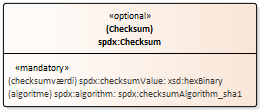
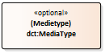
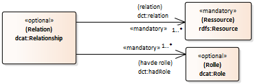
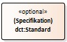

<pre class="metadata">
Title: DCAT-AP-DK 2.0: Dansk anvendelsesprofil til beskrivelse af datasæt og datakataloger (UDKAST)
Status: LD
URL: https://github.com/digst/DCAT-AP-DK/tree/master/releases/v.2.0/
Editor Term: Bidragsyder, Bidragsydere 
Editor: Digitaliseringsstyrelsen,, arkitektur@digst.dk
Editor: [Styrelsen for data og effektivisering]
Editor: [Styrelsen for arbejdsmarked og rekruttering]
Editor: [Geodatastyrelsen]
Editor: [Erhvervstyrelsen]
Editor: [Danmarks Miljøportal]
Editor: [Danmarks Statistik]
Editor: [Kommunernes Landsforening]
Editor: [KOMBIT]
Group: Udvalget for Arkitektur og Standarder (UAS) 

Abstract: 'Dansk anvendelsesprofil til beskrivelse af datasæt og datakataloger (DCAT-AP-DK 2.0)' .
Boilerplate: copyright no, conformance no, abstract no
Shortname: DCAT-AP-DK
Revision: 2.0.0 (udkast)
Date: 2019-04-20
Max ToC Depth: 2
Markup Shorthands: markdown yes
Repository: digst/DCAT-AP-DK
Inline Github Issues: full
Logo: digst...
</pre>

<h1>DCAT-AP-DK 2.0: Dansk anvendelsesprofil til beskrivelse af datasæt og datakataloger (UDKAST)</h1>

UDKAST til DCAT-AP-DK 2.0

April 2020
   

# Introduktion

DCAT-AP-DK 2.0 er en specifikation til beskrivelse af datasæt og datakataloger til anvendelse i dansk fællesoffentlig regi. Specifikationen omfatter basisoplysninger om datasæt, som fx titel, beskrivelse, udgiver, udgivelsesdato mv., samt en ensartet struktur for disse oplysninger i et fælles udvekslingsformat, som gør det muligt at dele oplysninger om datasæt på en effektiv måde. Specifikationen resulterer i en såkaldt anvendelsesprofil baseret på internationale og nationale specifikationer.

## Formål
Specifikationen skal være med til sørge for at begreber til beskrivelse af datasæt og datakataloger anvendes mere ens, og dermed skal den understøtte højere grad af interoperablitet og kvalitet i oplysningerne. 

## Baggrund

De grundlæggende strukturer og elementer hentes fra EU-Kommissionens specifikation DCAT-AP 2.0 der har til formål at standardisere og etablere sammenhæng mellem dataportaler i medlemslandene. EU-Kommissionens specifikation tager ligeledes afsæt i W3C specifikationen DCAT (Data Catalog Vocabulary). EU-Kommissionens specifikation angiver ikke blot hvilke felter der er *obligatoriske*, men angiver også *anbefalede* og *valgfrie* egenskaber og giver mulighed for en meget omfangsrig metadatabeskrivelse. DCAT-AP-DK 2.0 vil anvende elementer fra og vil være i overensstemmelse med DCAT-AP 2.0. DCAT-AP-DK vil dog også tilføje enkelte nye elementer for at opfylde behov i en dansk administrativ og fællesoffentlig kontekst.

Specifikationen er udarbejdet med feedback fra og sparring med en følgegruppe med medlemmer som repræsenterer både kommuner, regioner og statslige myndigheder.

For at sikre at behov imødekommes vil den danske specifikation således tage udgangspunkt i følgegruppens vurdering af obligatoriske, anbefalede og valgfrie egenskaber i DCAT-AP 2.0. 

## Metode

Denne specifikation udgøres af en dansk basisprofil for datsæt og datakataloger (DCAT-AP-DK), som indeholder de basisoplysninger om datasæt og datakataloger.  Basisoplysningerne udgør en fælles kerne, der kan udvides med yderligere kontekstafhængige oplysninger, i nye og mere specifikke anvendelsesprofiler. Informationer dannet på baggrund af to eller flere specifikke anvendelsesprofiler kan potentielt bringes til at hænge sammen via denne fælles kerne.

Selve udviklingsarbejdet er foretaget i henhold de [Fællesoffentlige regler for begrebs- og datamodellering](https://arkitektur.digst.dk/metoder/regler-begrebs-og-datamodellering), og specifikationen sammensætter flere eksisterende nationale og internationale modeller.

## Standardens anvendelse og afgrænsning

### Use case 1: En national dataportal

### Use case 2: En domænespecifik dataportal

### Use case 3: En myndighedsspecifik dataportal

### Use case 4: En myndigheds interne dataoverblik

Issue: Disse udkast til use cases skal drøftes yderligere. 

Se [https://github.com/digst/DCAT-AP-DK/issues/3](https://github.com/digst/DCAT-AP-DK/issues/3 ) 

### Relevante emner

Basisinformation, Emneinddeling, Aktører,  Dataindhold, Afgrænsning, Datakvalitet, Jura og regulering,  Proveniens og historik

## Overenstemmelse og afvigelser ift. DCAT-AP
DCAT-AP-DK er i overensstemmelse med DCAT-AP. Metadatabeskrivelser af datasæt og datakataloger der overholder DCAT-AP-DK overholder også med DCAT-AP. 

Herunder beskrives afvigelser mellem DCAT-AP og DCAT-AP-DK som kommer til udtryk gennem ændringer af kravniveau samt tilføjelser af nye elementer. Som det ses herunder afviger den danske profil primært i forhold til tilføjelsen af nye elementer til beskrivelse af datasæt.

I DCAT-AP defineres følgende kravniveauer som også anvendes i denne anvendelsesprofil. Læs mere om disse kravniveauer i kapitel 2 af [DCAT-AP 2.0](https://joinup.ec.europa.eu/solution/dcat-application-profile-data-portals-europe/distribution/dcat-ap-200-pdf).

* **Obligatorisk** (Mandatory): informationen SKAL angives
* **Anbefalet** (Recommended): informationen BØR bør angives hvis den er tilgængelig
* **Valgfri** (Optional): informationen KAN angives  

### Ændringer af kravniveau
Kravniveauet for følgende elementer er blevet ændret i DCAT-AP-DK ift. DCAT-AP:

* Datasæt: identifikator (dct:identifier) - Kravniveau: Valgfri > Anbefalet
* Datasæt: emneord (dcat:keyword) - Kravniveau: Anbefalet > Valgfri
* Datasæt: dækningsperiode (dct:temporal ) - Kravniveau:   Anbefalet > ?
* Datasæt: dokumentation (foaf:page) - Kravniveau:  Valgfri > Anbefalet
* Datasæt: seneste ændringsdato (dct:modified) - Kravniveau: Valgfri > Anbefalet

### Tilføjelser
Følgende elementer er blevet tilføjet i DCAT-AP-DK ift. DCAT-AP:

* Datasæt: forvaltningsopgave (dcat-dk:publicAdministrativeTaskType - subproperty of dcat:theme) FORMversionNumber
* Datasæt: dataansvarlig organisation (frbr:responsibleEntity) 
* Datasæt: bidragsyder (dct:contributor
* Datasæt: vedligeholder (schema:maintainer)
* Datasæt: hjemmel (cv:hasLegalResource)
* Datasæt: betalingspålagt (dcat-dk:paymentImposed)
* Datasæt: personoplysningskategori (dcat-dk:personalDataCategory) 
* Datasæt: fortrolighedsgrad (dcat-dk:confidentialityType)
* Datasæt: har kvalitetsmetadata (dqv:hasQualityMetadata)
* Datasæt: har anvendelse (duv:hasUsage)

Disse tilføjelser skal drøftes yderligere 

### Udeladelser
Der er ikke udeladt elementer fra DCAT-AP i DCAT-AP-DK.

# Oversigt over anvendelsesprofilen

## Diagram 
Anvendelseprofilen DCAT-AP-DK v.2 visualiseret med UML-diagram (kommer)

## Namespaces

<table class="term-table">
<thead><tr><th>prefix</th><th>namespace</th><th>model</th></tr></thead><tbody>
 <tr><td>adms</td><td>http://www.w3.org/ns/adms#</td><td>Asset Description Metadata Schema</td></tr>
 <tr><td>dcat</td><td>http://www.w3.org/ns/dcat#</td><td>Data Catalog Vocabulary</td></tr>
 <tr><td>dcatap</td><td>http://data.europa.eu/r5r/</td><td>DCAT Application Profile for data portals in Europe</td></tr>
 <tr><td>dct</td><td>http://purl.org/dc/terms/</td><td>Data Catalog Application Profile</td></tr>
 <tr><td>foaf</td><td>http://xmlns.com/foaf/0.1/</td><td>Friend of a Friend</td></tr>
 <tr><td>locn</td><td>http://www.w3.org/ns/locn#</td><td>Core Location</td></tr>
 <tr><td>owl</td><td>http://www.w3.org/2002/07/owl#</td><td>Web Ontology Language</td></tr>
 <tr><td>odrl</td><td>http://www.w3.org/ns/odrl/2/</td><td>Open Digital Rights Language</td></tr>
 <tr><td>rdfs</td><td>http://www.w3.org/2000/01/rdf-schema#</td><td>The RDF Schema vocabulary </td></tr>
 <tr><td>schema</td><td>http://schema.org/</td><td>Schema.org</td></tr>
 <tr><td>skos</td><td>http://www.w3.org/2004/02/skos/core#</td><td>Simple Knowledge Organization System</td></tr>
 <tr><td>spdx</td><td>http://spdx.org/rdf/terms#</td><td>Software Package Data Exchange Vocabulary</td></tr>
 <tr><td>xsd</td><td>http://www.w3.org/2001/XMLSchema#</td><td>XML Schema</td></tr>
 <tr><td>vann</td><td>http://purl.org/vocab/vann/</td><td>Vocabulary for annotating vocabulary descriptions</td></tr>
 <tr><td>voaf</td><td>http://purl.org/vocommons/voaf#</td><td>Vocabulary of a Friend (VOAF)</td></tr>
 <tr><td>vcard</td><td>http://www.w3.org/2006/vcard/ns#</td><td>Virtual Contact File Vocabulary</td></tr>
 <tr><td>dqv</td><td>https://www.w3.org/ns/dqv</td><td>Data Quality Vocabulary</td></tr>
 <tr><td>duv</td><td>https://www.w3.org/ns/duv</td><td>Data Usage Vocabulary</td></tr>
 <tr><td>dcat-dk</td><td>https://data.gov.dk/model/core/dcat-dk/</td><td>DCAT-DK</td></tr>
 <tr><td>dcat-ap-dk</td><td>https://data.gov.dk/model/profile/dcat-ap-dk/</td><td>DCAT-AP-DK</td></tr>
</tbody></table>

<!--
* adms: http://www.w3.org/ns/adms#
* dcat: http://www.w3.org/ns/dcat#
* dcatap: http://data.europa.eu/r5r/
* dct: http://purl.org/dc/terms/
* foaf: http://xmlns.com/foaf/0.1/
* locn: http://www.w3.org/ns/locn#
* owl: http://www.w3.org/2002/07/owl#
* odrl: http://www.w3.org/ns/odrl/2/
* rdfs: http://www.w3.org/2000/01/rdf-schema#
* schema: http://schema.org/
* skos: http://www.w3.org/2004/02/skos/core#
* spdx: http://spdx.org/rdf/terms#
* xsd: http://www.w3.org/2001/XMLSchema#
* vann: http://purl.org/vocab/vann/
* voaf: http://purl.org/vocommons/voaf#
* vcard: http://www.w3.org/2006/vcard/ns#
* dqv: https://www.w3.org/ns/dqv
* duv: https://www.w3.org/ns/duv
* dcat-dk: https://data.gov.dk/model/core/dcat-dk/
* dcat-ap-dk: https://data.gov.dk/model/profile/dcat-ap-dk/
-->

# Modellens grundlæggende struktur
DCAT har seks centrale elementer hvis indbyrdes relationer udgør modellens grundlæggende struktur. Disse seks elementer beskrives herunder i kontekst af et datakatalog. Hvert element på et givet niveau kan beskrives med metadata såsom *titel*, *beskrivelse* og *identifikator*. Se også [begrebslisten](https://digst.github.io/DCAT-AP-DK/releases/v.2.0/docs/#begrebsliste) med yderligere information.

## Katalog
Et katalog (dcat:Catalog) er en samling af metadata om ressourcer (fx. datasæt og dataservices i kontekst af et datakatalog). Elementet indeholder metadata om selve kataloget samt reference til de datasæt og dataservices som indgår i det pågældende datakatalog. Et datakatalog *skal* således indeholde datasæt, men det *kan* også indeholde dataservices og andre datakataloger.

## Katalogiseret ressource 
En katalogiseret ressource (dcat:Resource) er en ressource udgivet eller organiseret af en enkelt aktør. Denne klasse bærer egenskaber der gælder alle katalogiserede ressourcer. I kontekst af et datakatalog vil dette element ikke blive anvendt – det vil de tre datarelaterede undertyper derimod, hhv. datasæt, dataservice og katalog. 

## Datasæt
Et datasæt (dcat:Dataset) er en samling af data, udgivet eller organiseret af en enkelt kilde og som der er adgang til i en eller flere repræsentationer. Et datasæt kan betragtes som logisk element der repræsenterer den udgivne information, og der kan eksistere mange forskellige distributioner af det samme datasæt.

## Distribution
En distribution (dcat:Distribution) er en specifik repræsentation af et datasæt. Et datasæt kan være tilgængelig i mange serialiseringer der kan variere på forskellige vis, herunder sprog, medietype eller format, systemorganisering, tidslig- og rumlig opløsning, detaljeringsniveau eller profiler (der kan specificere en eller flere af ovenstående). En distribution kan betragtes som et fysisk element og indeholder derfor information om adgangs-URL, format, bytestørrelse, downloadURL, adgangsservice m.fl.

## Dataservice
En dataservice (dcat:DataService) er et websted eller endpoint der udstiller en samling af operationer relateret til opdagelse af, adgang til eller behandlende funktioner på data eller relaterede ressourcer. En dataservice kan være bundet til en eller flere specifikke datasæt.

## Katalogpost 
En katalogpost (dcat:CatalogRecord) er en optegnelse i et katalog der beskriver registreringen af en enkelt ressource. Dette element kan rumme oplysninger såsom hvem der har opført ressourcen til kataloget og hvornår ressourcen blev opført. Denne klasse er valgfri. Den kan anvendes i de kataloger for der skelnes mellem metadata om datasættet eller dataservicen og metadata om selve optegnelsen af datasættet eller dataservicen i kataloget.

**Illustration**
Herunder kan ses en illustration af eksempler på elementerne "katalog", "datasæt" og "distribution":

Hvordan fungerer denne fortælling om strukturen? 

# Elementer i DCAT-AP-DK 
I det følgende præsenteres alle egenskaberne i DCAT-AP-DK per klasse.

Herunder er indsat elementerne fra DCAT-AP samt enkelte yderligere egenskaber. Elementbetegnelserne og anvendelsesnoterne er oversat til dansk (forslag). De oprindelige definitioner fra kernemodellerne er også indsat. Angivelse af kravniveau for klasser mangler

## Klasse: Katalog
<dl class="def">
<dt>URI</dt>
<dd>http://www.w3.org/ns/dcat#Catalog</dd>
<dt>Anvendelsesnote (da) </dt>
<dd>En organiseret samling af metadata om datasæt og dataservices i et katalog.</dd>
<dt>Anvendelsesnote (en)</dt>
<dd>A catalogue or repository that hosts the Datasets being described.</dd>
<dt>Definition (en)</dt>
<dd>A curated collection of metadata about resources (e.g., datasets and data services in the context of a data catalog).</dd>
<dt>Kravniveau</dt>
<dd></dd>
</dl>
				
### titel
<dl class="def">
<dt>URI</dt>
<dd>http://purl.org/dc/terms/title</dd>
<dt>Rækkevidde</dt>
<dd>http://www.w3.org/2000/01/rdf-schema#Literal</dd>
<dt>Anvendelsesnote (da)</dt>
<dd>Denne egenskab giver det eller de ord der navngiver kataloget. Egenskaben kan gentages for hver sprogvariant af titlen. </dd>
<dt>Anvendelsesnote (en)</dt>
<dd>This property contains a name given to the Catalogue. This property can be repeated for parallel language versions of the name.</dd>
<dt>Definition (en)</dt>
<dd>A name given to the resource.</dd>
<dt>Multiplicitet</dt>
<dd>1..*</dd>
<dt>Kravniveau</dt>
<dd>Obligatorisk</dd>
</dl>
				
### beskrivelse
<dl class="def">
<dt>URI</dt>
<dd>http://purl.org/dc/terms/description</dd>
<dt>Rækkevidde</dt>
<dd>http://www.w3.org/2000/01/rdf-schema#Literal</dd>
<dt>Anvendelsesnote (da)</dt>
<dd>Denne egenskab giver en tekstbaseret beskrivelse af datakatalogets formål og indhold. Egenskaben kan gentages for hvert sprogvariant af beskrivelsen</dd>
<dt>Anvendelsesnote (en)</dt>
<dd>This property contains a free-text account of the Catalogue. This property can be repeated for parallel language versions of the description.</dd>
<dt>Definition (en)</dt>
<dd>An account of the resource.</dd>
<dt>Multiplicitet</dt>
<dd>1..*</dd>
<dt>Kravniveau</dt>
<dd>Obligatorisk</dd>
</dl>
				
### datasæt
<dl class="def">
<dt>URI</dt>
<dd>http://www.w3.org/ns/dcat#dataset</dd>
<dt>Rækkevidde</dt>
<dd>http://www.w3.org/ns/dcat#Dataset</dd>
<dt>Anvendelsesnote (da)</dt>
<dd>Denne egenskab angiver et datasæt som er opført i kataloget</dd>
<dt>Anvendelsesnote (en)</dt>
<dd>This property links the Catalogue with a Dataset that is part of the Catalogue.</dd>
<dt>Definition (en)</dt>
<dd>A collection of data that is listed in the catalog.</dd>
<dt>Multiplicitet</dt>
<dd>1..*</dd>
<dt>Kravniveau</dt>
<dd>Obligatorisk</dd>
</dl>
				
### dataservice
<dl class="def">
<dt>URI</dt>
<dd>http://www.w3.org/ns/dcat#service</dd>
<dt>Rækkevidde</dt>
<dd>http://www.w3.org/ns/dcat#DataService</dd>
<dt>Anvendelsesnote (da)</dt>
<dd>Denne egenskab angiver et websted eller endpoint som er opført i kataloget.</dd>
<dt>Anvendelsesnote (en)</dt>
<dd>This property refers to a site or end-point that is listed in the catalog.</dd>
<dt>Definition (en)</dt>
<dd>A site or endpoint that is listed in the catalog.</dd>
<dt>Multiplicitet</dt>
<dd>0..*</dd>
<dt>Kravniveau</dt>
<dd>Valgfri</dd>
</dl>
				
### udgiver
<dl class="def">
<dt>URI</dt>
<dd>http://purl.org/dc/terms/publisher</dd>
<dt>Rækkevidde</dt>
<dd>http://xmlns.com/foaf/0.1/Agent</dd>
<dt>Anvendelsesnote (da)</dt>
<dd>Denne egenskab angiver den aktør (organisation) der er ansvarlig for at gøre kataloget tilgængeligt.</dd>
<dt>Anvendelsesnote (en)</dt>
<dd>This property refers to an entity (organisation) responsible for making the Catalogue available. </dd>
<dt>Definition (en)</dt>
<dd>An entity responsible for making the resource available.</dd>
<dt>Multiplicitet</dt>
<dd>1..1</dd>
<dt>Kravniveau</dt>
<dd>Obligatorisk</dd>
</dl>
				
### skaber
<dl class="def">
<dt>URI</dt>
<dd>http://purl.org/dc/terms/creator</dd>
<dt>Rækkevidde</dt>
<dd>http://xmlns.com/foaf/0.1/Agent</dd>
<dt>Anvendelsesnote (da)</dt>
<dd>Denne egenskab angiver den aktør der primært er ansvarlig for katalogets skabelse.</dd>
<dt>Anvendelsesnote (en)</dt>
<dd>This property refers to the entity primarily responsible for producing the catalogue.</dd>
<dt>Definition (en)</dt>
<dd>An entity responsible for making the resource.</dd>
<dt>Multiplicitet</dt>
<dd>0..1</dd>
<dt>Kravniveau</dt>
<dd>Valgfri</dd>
</dl>
				
### websted
<dl class="def">
<dt>URI</dt>
<dd>http://xmlns.com/foaf/0.1/homepage</dd>
<dt>Rækkevidde</dt>
<dd>http://xmlns.com/foaf/0.1/Document</dd>
<dt>Anvendelsesnote (da)</dt>
<dd>Denne egenskab angiver en webside som fungerer som katalogets hjemmeside.</dd>
<dt>Anvendelsesnote (en)</dt>
<dd>This property refers to a web page that acts as the main page for the Catalogue.</dd>
<dt>Definition (en)</dt>
<dd>A homepage for some thing.</dd>
<dt>Multiplicitet</dt>
<dd>0..1</dd>
<dt>Kravniveau</dt>
<dd>Anbefalet</dd>
</dl>
				
### udgivelsesdato
<dl class="def">
<dt>URI</dt>
<dd>http://purl.org/dc/terms/issued</dd>
<dt>Rækkevidde</dt>
<dd>http://www.w3.org/2001/XMLSchema#date el. http://www.w3.org/2001/XMLSchema#dateTime</dd>
<dt>Anvendelsesnote (da)</dt>
<dd>Denne egenskab angiver den dato hvor kataloget først blev formelt udgivet</dd>
<dt>Anvendelsesnote (en)</dt>
<dd>This property contains the date of formal issuance (e.g., publication) of the Catalogue.</dd>
<dt>Definition (en)</dt>
<dd>Date of formal issuance of the resource.</dd>
<dt>Multiplicitet</dt>
<dd>0..1</dd>
<dt>Kravniveau</dt>
<dd>Anbefalet</dd>
</dl>
				
### seneste opdateringsdato
<dl class="def">
<dt>URI</dt>
<dd>http://purl.org/dc/terms/modified</dd>
<dt>Rækkevidde</dt>
<dd>http://www.w3.org/2001/XMLSchema#date el. http://www.w3.org/2001/XMLSchema#dateTime</dd>
<dt>Anvendelsesnote (da)</dt>
<dd>Denne egenskab angiver den dato hvor kataloget senest er blevet ændret.</dd>
<dt>Anvendelsesnote (en)</dt>
<dd>This property contains the most recent date on which the Catalogue was changed or modified.</dd>
<dt>Definition (en)</dt>
<dd>Date on which the resource was changed.</dd>
<dt>Multiplicitet</dt>
<dd>0..1</dd>
<dt>Kravniveau</dt>
<dd>Anbefalet</dd>
</dl>
				
### emneklassifikation
<dl class="def">
<dt>URI</dt>
<dd>http://www.w3.org/ns/dcat#themeTaxonomy</dd>
<dt>Rækkevidde</dt>
<dd>http://www.w3.org/2004/02/skos/core#ConceptScheme</dd>
<dt>Anvendelsesnote (da)</dt>
<dd>Denne egenskab angiver en emneklassifikation der anvendes til klassifikation af datasæt og dataservices i kataloget.</dd>
<dt>Anvendelsesnote (en)</dt>
<dd>This property refers to a knowledge organization system used to classify the Catalogue's Datasets.</dd>
<dt>Definition (en)</dt>
<dd>A knowledge organization system (KOS) used to classify catalog's datasets and services.</dd>
<dt>Multiplicitet</dt>
<dd>0..*</dd>
<dt>Kravniveau</dt>
<dd>Anbefalet</dd>
</dl>
				
### geografisk område
<dl class="def">
<dt>URI</dt>
<dd>http://purl.org/dc/terms/spatial</dd>
<dt>Rækkevidde</dt>
<dd>http://purl.org/dc/terms/Location</dd>
<dt>Anvendelsesnote (da)</dt>
<dd>Denne egenskab angiver et geografisk område som kataloget dækker. Afgræsningen kan enten udtrykkes ved udpegnings af geofrafisk område eller ved anvendelse af en af følgende klassifikationen: EU Vocabularies Continents Named Authority List, EU Vocabularies Countries Named Authority List, EU Vocabularies Places Named Authority List eller Geonames (Sidstnævnte bør kun anvendes såfremt lokationen ikke findes i et af de nævnte EU Authority Lists.</dd>
<dt>Anvendelsesnote (en)</dt>
<dd>This property refers to a geographical area covered by the Catalogue. </dd>
<dt>Definition (en)</dt>
<dd>Spatial characteristics of the resource.</dd>
<dt>Multiplicitet</dt>
<dd>0..*</dd>
<dt>Kravniveau</dt>
<dd>Anbefalet</dd>
</dl>
				
### sprog
<dl class="def">
<dt>URI</dt>
<dd>http://purl.org/dc/terms/language</dd>
<dt>Rækkevidde</dt>
<dd>Anvend følgende klassifikation: ^http://publications.europa.eu/resource/dataset/language/</dd>
<dt>Anvendelsesnote (da)</dt>
<dd>Denne egenskab angiver et sprog som er anvendt til tekstbaserede metadata om dataset og dataservices i kataloget. Egenskaben kan gentages for hver sprogvariant metadata forefindes på. Til angivelse af sprog skal følgende klassifikation anvendes: EU Vocabularies Languages Named Authority List,  http://publications.europa.eu/resource/authority/language</dd>
<dt>Anvendelsesnote (en)</dt>
<dd>This property refers to a language used in the textual metadata describing titles, descriptions, etc. of the Datasets in the Catalogue. This property can be repeated if the metadata is provided in multiple languages. </dd>
<dt>Definition (en)</dt>
<dd>A language of the resource.</dd>
<dt>Multiplicitet</dt>
<dd>0..*</dd>
<dt>Kravniveau</dt>
<dd>Anbefalet</dd>
</dl>
				
### licens
<dl class="def">
<dt>URI</dt>
<dd>http://purl.org/dc/terms/license</dd>
<dt>Rækkevidde</dt>
<dd>http://purl.org/dc/terms/LicenseDocument</dd>
<dt>Anvendelsesnote (da)</dt>
<dd>Denne egenskab angiver den licens kataloget kan anvendes eller genbruges under.</dd>
<dt>Anvendelsesnote (en)</dt>
<dd>This property refers to the licence under which the Catalogue can be used or reused.</dd>
<dt>Definition (en)</dt>
<dd>A legal document giving official permission to do something with a resource.</dd>
<dt>Multiplicitet</dt>
<dd>0..1</dd>
<dt>Kravniveau</dt>
<dd>Anbefalet</dd>
</dl>
				
### rettigheder
<dl class="def">
<dt>URI</dt>
<dd>http://purl.org/dc/terms/rights</dd>
<dt>Rækkevidde</dt>
<dd>http://purl.org/dc/terms/RightsStatement</dd>
<dt>Anvendelsesnote (da)</dt>
<dd>Denne egenskab giver reference til et dokument der beskriver adgangsrettighederne forbundet med kataloget</dd>
<dt>Anvendelsesnote (en)</dt>
<dd>This property refers to a statement that specifies rights associated with the Catalogue.</dd>
<dt>Definition (en)</dt>
<dd>Information about rights held in and over the resource.</dd>
<dt>Multiplicitet</dt>
<dd>0..1</dd>
<dt>Kravniveau</dt>
<dd>Valgfri</dd>
</dl>
				
### katalogpost
<dl class="def">
<dt>URI</dt>
<dd>http://www.w3.org/ns/dcat#record</dd>
<dt>Rækkevidde</dt>
<dd>http://www.w3.org/ns/dcat#CatalogRecord</dd>
<dt>Anvendelsesnote (da)</dt>
<dd>Denne egenskab angiver en registrering af et enkelt datasæt eller en enkelt dataservice som er en del af kataloget</dd>
<dt>Anvendelsesnote (en)</dt>
<dd>This property refers to a Catalogue Record that is part of the Catalogue</dd>
<dt>Definition (en)</dt>
<dd>A record describing the registration of a single dataset or data service that is part of the catalog.</dd>
<dt>Multiplicitet</dt>
<dd>0..*</dd>
<dt>Kravniveau</dt>
<dd>Valgfri</dd>
</dl>
				
### katalog
<dl class="def">
<dt>URI</dt>
<dd>http://www.w3.org/ns/dcat#catalog</dd>
<dt>Rækkevidde</dt>
<dd>http://www.w3.org/ns/dcat#Catalog</dd>
<dt>Anvendelsesnote (da)</dt>
<dd>Denne egenskab angiver et katalog hvis indhold er relevant i forhold til det aktuelle katalog.</dd>
<dt>Anvendelsesnote (en)</dt>
<dd>This property refers to a catalog whose contents are of interest in the context of this catalog.</dd>
<dt>Definition (en)</dt>
<dd>A catalog whose contents are of interest in the context of this catalog.</dd>
<dt>Multiplicitet</dt>
<dd>0..*</dd>
<dt>Kravniveau</dt>
<dd>Valgfri</dd>
</dl>
				
### har delkatalog
<dl class="def">
<dt>URI</dt>
<dd>http://purl.org/dc/terms/hasPart</dd>
<dt>Rækkevidde</dt>
<dd>http://www.w3.org/ns/dcat#Catalog</dd>
<dt>Anvendelsesnote (da)</dt>
<dd>Denne egenskab angiver et relateret katalog som er en del af det aktuelle katalog.</dd>
<dt>Anvendelsesnote (en)</dt>
<dd>This property refers to a related Catalogue that is part of the described Catalogue.</dd>
<dt>Definition (en)</dt>
<dd>A related resource that is included either physically or logically in the described resource.</dd>
<dt>Multiplicitet</dt>
<dd>0..*</dd>
<dt>Kravniveau</dt>
<dd>Valgfri</dd>
</dl>
				
### er del af katalog
<dl class="def">
<dt>URI</dt>
<dd>http://purl.org/dc/terms/isPartOf</dd>
<dt>Rækkevidde</dt>
<dd>http://www.w3.org/ns/dcat#Catalog</dd>
<dt>Anvendelsesnote (da)</dt>
<dd>Denne egenskab angiver et relateret katalog som det aktuelle katalog fysisk eller logisk er en del af.</dd>
<dt>Anvendelsesnote (en)</dt>
<dd>This property refers to a related Catalogue in which the described Catalogue is physically or logically included.</dd>
<dt>Definition (en)</dt>
<dd>A related resource in which the described resource is physically or logically included.</dd>
<dt>Multiplicitet</dt>
<dd>0..1</dd>
<dt>Kravniveau</dt>
<dd>Valgfri</dd>
</dl>	
			
## Klasse: Katalogpost
<dl class="def">
<dt>URI</dt>
<dd>http://www.w3.org/ns/dcat#CatalogRecord</dd>
<dt>Anvendelsesnote (da) </dt>
<dd>Post i et datakatalog der beskriver registreringen af et enkelt datasæt eller en enkelt dataservice.</dd>
<dt>Anvendelsesnote (en)</dt>
<dd>A description of a Dataset’s entry in the Catalogue. </dd>
<dt>Definition (en)</dt>
<dd>A record in a data catalog, describing the registration of a single dataset or data service.</dd>
<dt>Kravniveau</dt>
<dd></dd>
</dl>
				
### genstand for registrering
<dl class="def">
<dt>URI</dt>
<dd>http://xmlns.com/foaf/0.1/primaryTopic</dd>
<dt>Rækkevidde</dt>
<dd></dd>
<dt>Anvendelsesnote (da)</dt>
<dd>Denne egenskab angiver det datasæt, den dataservice eller det katalog som er genstand for registreringen.</dd>
<dt>Anvendelsesnote (en)</dt>
<dd>This property links the Catalogue Record to the Dataset, Data service or Catalog described in the record.</dd>
<dt>Definition (en)</dt>
<dd>A document that this thing is the primary topic of.</dd>
<dt>Multiplicitet</dt>
<dd>1..1</dd>
<dt>Kravniveau</dt>
<dd>Obligatorisk</dd>
</dl>
				
### tilføjelsesdato
<dl class="def">
<dt>URI</dt>
<dd>http://purl.org/dc/terms/issued</dd>
<dt>Rækkevidde</dt>
<dd>http://www.w3.org/2001/XMLSchema#date el. http://www.w3.org/2001/XMLSchema#dateTime</dd>
<dt>Anvendelsesnote (da)</dt>
<dd>Denne egenskab angiver den dato hvor beskrivelsen af datasættet eller dataservicen blev registreret i kataloget.</dd>
<dt>Anvendelsesnote (en)</dt>
<dd>This property contains the date on which the description of the Dataset was included in the Catalogue.</dd>
<dt>Definition (en)</dt>
<dd>Date of formal issuance of the resource.</dd>
<dt>Multiplicitet</dt>
<dd>0..1</dd>
<dt>Kravniveau</dt>
<dd>Anbefalet</dd>
</dl>
				
### seneste ændringsdato
<dl class="def">
<dt>URI</dt>
<dd>http://purl.org/dc/terms/modified</dd>
<dt>Rækkevidde</dt>
<dd></dd>
<dt>Anvendelsesnote (da)</dt>
<dd>Denne egenskab angiver den dato hvor katalogposten senest er blevet ændret.</dd>
<dt>Anvendelsesnote (en)</dt>
<dd>This property contains the most recent date on which the Catalogue entry was changed or modified.</dd>
<dt>Definition (en)</dt>
<dd>Date on which the resource was changed.</dd>
<dt>Multiplicitet</dt>
<dd>1..1</dd>
<dt>Kravniveau</dt>
<dd>Obligatorisk</dd>
</dl>
				
### status
<dl class="def">
<dt>URI</dt>
<dd>http://www.w3.org/ns/adms#status</dd>
<dt>Rækkevidde</dt>
<dd>Anvend følgende klassifikation: ^http://purl.org/adms/status/</dd>
<dt>Anvendelsesnote (da)</dt>
<dd>Denne egenskab angiver hvilken tilstand katalogposten befinder sig ift. udvikling og ibrugtagning. Til angivelse af status skal følgende klassifikation anvendes ADMS Status: http://purl.org/adms/status/ (Udfaldsrum: Completed, Deprecated, Under Development, Withdrawn) </dd>
<dt>Anvendelsesnote (en)</dt>
<dd>This property refers to the type of the latest revision of a Dataset's entry in the Catalogue. </dd>
<dt>Definition (en)</dt>
<dd>Links to the status of the Asset or Asset Distribution in the context of a particular workflow process. 
									Since Status is defined using a skos:Concept, that is the defined range for this property.</dd>
<dt>Multiplicitet</dt>
<dd>0..1</dd>
<dt>Kravniveau</dt>
<dd>Anbefalet</dd>
</dl>
				
### titel
<dl class="def">
<dt>URI</dt>
<dd>http://purl.org/dc/terms/title</dd>
<dt>Rækkevidde</dt>
<dd>http://www.w3.org/2000/01/rdf-schema#Literal</dd>
<dt>Anvendelsesnote (da)</dt>
<dd>Denne egenskab angiver det eller de ord som navngiver katalogposten. Egenskaben kan gentages for hver sprogvariant.</dd>
<dt>Anvendelsesnote (en)</dt>
<dd>This property contains a name given to the Catalogue Record. This property can be repeated for parallel language versions of the name.</dd>
<dt>Definition (en)</dt>
<dd>A name given to the resource.</dd>
<dt>Multiplicitet</dt>
<dd>0..*</dd>
<dt>Kravniveau</dt>
<dd>Anbefalet</dd>
</dl>
				
### beskrivelse
<dl class="def">
<dt>URI</dt>
<dd>http://purl.org/dc/terms/description</dd>
<dt>Rækkevidde</dt>
<dd>http://www.w3.org/2000/01/rdf-schema#Literal</dd>
<dt>Anvendelsesnote (da)</dt>
<dd>Denne egenskab giver en tekstbaseret beskrivelse af katalogposten. Egenskaben kan gentages for hvert sprogvariant af beskrivelsen</dd>
<dt>Anvendelsesnote (en)</dt>
<dd>This property contains a free-text account of the record. This property can be repeated for parallel language versions of the description.</dd>
<dt>Definition (en)</dt>
<dd>An account of the resource.</dd>
<dt>Multiplicitet</dt>
<dd>0..*</dd>
<dt>Kravniveau</dt>
<dd>Anbefalet</dd>
</dl>
				
### overenstemmelse
<dl class="def">
<dt>URI</dt>
<dd>http://purl.org/dc/terms/conformsTo</dd>
<dt>Rækkevidde</dt>
<dd>http://purl.org/dc/terms/Standard</dd>
<dt>Anvendelsesnote (da)</dt>
<dd>Denne egenskab angiver en specifikation (anvendelsesprofil) som datasættets metadata er i overenstemmmelse med.</dd>
<dt>Anvendelsesnote (en)</dt>
<dd>This property refers to an Application Profile that the Dataset’s metadata conforms to</dd>
<dt>Definition (en)</dt>
<dd>An established standard to which the described resource conforms.</dd>
<dt>Multiplicitet</dt>
<dd>0..1</dd>
<dt>Kravniveau</dt>
<dd>Anbefalet</dd>
</dl>
				
### sprog
<dl class="def">
<dt>URI</dt>
<dd>http://purl.org/dc/terms/language</dd>
<dt>Rækkevidde</dt>
<dd>Anvend følgende klassifikation: ^http://publications.europa.eu/resource/dataset/language/</dd>
<dt>Anvendelsesnote (da)</dt>
<dd>Denne egenskab angiver et sprog som er anvendt til tekstbaserede metadata om dataset og dataservices i kataloget. Egenskaben kan gentages for hver sprogvariant metadata forefindes på. Til angivelse af sprog skal følgende klassifikation anvendes: EU Vocabularies Languages Named Authority List, http://publications.europa.eu/resource/authority/language </dd>
<dt>Anvendelsesnote (en)</dt>
<dd>This property refers to a language used in the textual metadata describing titles, descriptions, etc. of the Dataset. This property can be repeated if the metadata is provided in multiple languages.</dd>
<dt>Definition (en)</dt>
<dd>A language of the resource.</dd>
<dt>Multiplicitet</dt>
<dd>0..*</dd>
<dt>Kravniveau</dt>
<dd>Valgfri</dd>
</dl>
				
### kilde
<dl class="def">
<dt>URI</dt>
<dd>http://purl.org/dc/terms/source</dd>
<dt>Rækkevidde</dt>
<dd>http://www.w3.org/ns/dcat#CatalogRecord</dd>
<dt>Anvendelsesnote (da)</dt>
<dd>Denne egenskab angiver de oprindelige metadata som blev anvendt til oprettelse af metadata om det aktuelle datasæt eller den aktuelle dataservice.</dd>
<dt>Anvendelsesnote (en)</dt>
<dd>This property refers to the original metadata that was used in creating metadata for the Dataset.</dd>
<dt>Definition (en)</dt>
<dd>A related resource from which the described resource is derived.</dd>
<dt>Multiplicitet</dt>
<dd>0..1</dd>
<dt>Kravniveau</dt>
<dd>Valgfri</dd>
</dl>	
			
## Klasse: Datasæt
<dl class="def">
<dt>URI</dt>
<dd>http://www.w3.org/ns/dcat#Dataset</dd>
<dt>Anvendelsesnote (da) </dt>
<dd>En samling a data, udgivet eller organiseret af en enkelt kilde og som der er adgang til i en eller flere repræsentationer.</dd>
<dt>Anvendelsesnote (en)</dt>
<dd>A conceptual entity that represents the information published. </dd>
<dt>Definition (en)</dt>
<dd>A collection of data, published or curated by a single agent, and available for access or download in one or more representations.</dd>
<dt>Kravniveau</dt>
<dd></dd>
</dl>
				
### identifikator
<dl class="def">
<dt>URI</dt>
<dd>http://purl.org/dc/terms/identifier</dd>
<dt>Rækkevidde</dt>
<dd>http://www.w3.org/2000/01/rdf-schema#Literal</dd>
<dt>Anvendelsesnote (da)</dt>
<dd>Denne egenskab angiver en global identifikator for datasættet, for eksempel en URI eller anden identifikator som er stabil og globalt unik</dd>
<dt>Anvendelsesnote (en)</dt>
<dd>This property contains the main identifier for the Dataset, e.g. the URI or other unique identifier in the context of the Catalogue.</dd>
<dt>Definition (en)</dt>
<dd>An unambiguous reference to the resource within a given context.</dd>
<dt>Multiplicitet</dt>
<dd>0..*</dd>
<dt>Kravniveau</dt>
<dd>Obligatorisk</dd>
</dl>
				
### anden identifikator
<dl class="def">
<dt>URI</dt>
<dd>http://www.w3.org/ns/adms#identifier</dd>
<dt>Rækkevidde</dt>
<dd>http://www.w3.org/ns/adms#Identifier</dd>
<dt>Anvendelsesnote (da)</dt>
<dd>Denne egenskab angiver lokal identifikator for datasættet.</dd>
<dt>Anvendelsesnote (en)</dt>
<dd>This property refers to a secondary identifier of the Dataset, such as MAST/ADS[1], DataCite[2], DOI[3], EZID[4] or W3ID[5].</dd>
<dt>Definition (en)</dt>
<dd>adms:identifier is used to link any resource to an instance of adms:Identifier which is its range</dd>
<dt>Multiplicitet</dt>
<dd>0..*</dd>
<dt>Kravniveau</dt>
<dd>Valgfri</dd>
</dl>
				
### titel
<dl class="def">
<dt>URI</dt>
<dd>http://purl.org/dc/terms/title</dd>
<dt>Rækkevidde</dt>
<dd>http://www.w3.org/2000/01/rdf-schema#Literal</dd>
<dt>Anvendelsesnote (da)</dt>
<dd>Denne egenskab angiver det eller de ord som navngiver datasættet. Egenskaben kan gentages for hver sprogvariant.</dd>
<dt>Anvendelsesnote (en)</dt>
<dd>This property contains a name given to the Dataset. This property can be repeated for parallel language versions of the name.</dd>
<dt>Definition (en)</dt>
<dd>A name given to the resource.</dd>
<dt>Multiplicitet</dt>
<dd>1..*</dd>
<dt>Kravniveau</dt>
<dd>Obligatorisk</dd>
</dl>
				
### beskrivelse
<dl class="def">
<dt>URI</dt>
<dd>http://purl.org/dc/terms/description</dd>
<dt>Rækkevidde</dt>
<dd>http://www.w3.org/2000/01/rdf-schema#Literal</dd>
<dt>Anvendelsesnote (da)</dt>
<dd>Denne egenskab giver en tekstbaseret beskrivelse af datasættets formål og indhold. Egenskaben kan gentages for hvert sprog.</dd>
<dt>Anvendelsesnote (en)</dt>
<dd>This property contains a free-text account of the Dataset. This property can be repeated for parallel language versions of the description.</dd>
<dt>Definition (en)</dt>
<dd>An account of the resource.</dd>
<dt>Multiplicitet</dt>
<dd>1..*</dd>
<dt>Kravniveau</dt>
<dd>Obligatorisk</dd>
</dl>
				
### udgiver
<dl class="def">
<dt>URI</dt>
<dd>http://purl.org/dc/terms/publisher</dd>
<dt>Rækkevidde</dt>
<dd>http://xmlns.com/foaf/0.1/Agent</dd>
<dt>Anvendelsesnote (da)</dt>
<dd>Denne egenskab angiver den aktør (organisation) som primært er ansvarlig for at gøre datasættet tilgængelig.</dd>
<dt>Anvendelsesnote (en)</dt>
<dd>This property refers to the entity (organisation) responsible for making the Dataset available.</dd>
<dt>Definition (en)</dt>
<dd>An entity responsible for making the resource available.</dd>
<dt>Multiplicitet</dt>
<dd>0..1</dd>
<dt>Kravniveau</dt>
<dd>Anbefalet</dd>
</dl>
				
### dataansvarlig organisation
<dl class="def">
<dt>URI</dt>
<dd>https://data.gov.dk/model/core/dcat-dk/dataresponsibleorganisation</dd>
<dt>Rækkevidde</dt>
<dd>http://xmlns.com/foaf/0.1/Agent</dd>
<dt>Anvendelsesnote (da)</dt>
<dd>Denne egenskab angiver den aktør der er ansvarlig for den overordnede administration af alle forhold omkring et datasæt </dd>
<dt>Anvendelsesnote (en)</dt>
<dd>This property refers to the agent responsible for the general administration of all aspects concerning a dataset</dd>
<dt>Definition (en)</dt>
<dd>aktør der er ansvarlig for den overordnede administration af alle forhold omkring et datasætagent responsible for the general administration of all aspects concerning a dataset</dd>
<dt>Multiplicitet</dt>
<dd>0..1</dd>
<dt>Kravniveau</dt>
<dd>Anbefalet</dd>
</dl>
				
### skaber
<dl class="def">
<dt>URI</dt>
<dd>http://purl.org/dc/terms/creator</dd>
<dt>Rækkevidde</dt>
<dd>http://xmlns.com/foaf/0.1/Agent</dd>
<dt>Anvendelsesnote (da)</dt>
<dd>Denne egenskab angiver den aktør der er primært ansvarlig datasættets skabelse.</dd>
<dt>Anvendelsesnote (en)</dt>
<dd>This property refers to the entity primarily responsible for producing the dataset</dd>
<dt>Definition (en)</dt>
<dd>An entity responsible for making the resource.</dd>
<dt>Multiplicitet</dt>
<dd>0..1</dd>
<dt>Kravniveau</dt>
<dd>Valgfri</dd>
</dl>
				
### bidragsyder
<dl class="def">
<dt>URI</dt>
<dd>http://purl.org/dc/terms/contributor</dd>
<dt>Rækkevidde</dt>
<dd>http://xmlns.com/foaf/0.1/Agent</dd>
<dt>Anvendelsesnote (da)</dt>
<dd>Denne egenskab angiver en aktør der er har bidraget til datasættets skabelse.</dd>
<dt>Anvendelsesnote (en)</dt>
<dd>This property refers to the entity responsible for making contributions to the resource.</dd>
<dt>Definition (en)</dt>
<dd>n entity responsible for making contributions to the resource.</dd>
<dt>Multiplicitet</dt>
<dd>0..</dd>
<dt>Kravniveau</dt>
<dd>Valgfri</dd>
</dl>
				
### vedligeholder
<dl class="def">
<dt>URI</dt>
<dd>http://schema.org/maintainer</dd>
<dt>Rækkevidde</dt>
<dd>http://xmlns.com/foaf/0.1/Agent</dd>
<dt>Anvendelsesnote (da)</dt>
<dd>Denne egenskab angiver en aktør der administrerer bidrag til eller udgivelsen af et datasæt.</dd>
<dt>Anvendelsesnote (en)</dt>
<dd>This property refers to the agent that manages contributions to, and/or publication of a dataset.</dd>
<dt>Definition (en)</dt>
<dd>A maintainer of a Dataset, software package (SoftwareApplication), or other Project.</dd>
<dt>Multiplicitet</dt>
<dd>0..</dd>
<dt>Kravniveau</dt>
<dd>Valgfri</dd>
</dl>
				
### kontaktpunkt
<dl class="def">
<dt>URI</dt>
<dd>http://www.w3.org/ns/dcat#contactPoint</dd>
<dt>Rækkevidde</dt>
<dd>http://www.w3.org/2006/vcard/ns#Kind</dd>
<dt>Anvendelsesnote (da)</dt>
<dd>Denne egenskab angiver kontaktoplysninger som kan anvendes til at indsende spørgsmål eller kommentarer om datasættet.</dd>
<dt>Anvendelsesnote (en)</dt>
<dd>This property contains contact information that can be used for sending comments about the Dataset.</dd>
<dt>Definition (en)</dt>
<dd>Relevant contact information for the catalogued resource. Use of vCard is recommended.</dd>
<dt>Multiplicitet</dt>
<dd>0..*</dd>
<dt>Kravniveau</dt>
<dd>Anbefalet</dd>
</dl>
				
### distribution
<dl class="def">
<dt>URI</dt>
<dd>http://www.w3.org/ns/dcat#distribution</dd>
<dt>Rækkevidde</dt>
<dd>http://www.w3.org/ns/dcat#Distribution</dd>
<dt>Anvendelsesnote (da)</dt>
<dd>Denne egenskab angiver en tilgængelig distribution af datasættet.</dd>
<dt>Anvendelsesnote (en)</dt>
<dd>This property links the Dataset to an available Distribution.</dd>
<dt>Definition (en)</dt>
<dd>An available distribution of the dataset.</dd>
<dt>Multiplicitet</dt>
<dd>0..*</dd>
<dt>Kravniveau</dt>
<dd>Anbefalet</dd>
</dl>
				
### uddrag
<dl class="def">
<dt>URI</dt>
<dd>http://www.w3.org/ns/adms#sample</dd>
<dt>Rækkevidde</dt>
<dd>http://www.w3.org/ns/dcat#Distribution</dd>
<dt>Anvendelsesnote (da)</dt>
<dd>Denne egenskab angiver et uddrag af en distribution af datasættet</dd>
<dt>Anvendelsesnote (en)</dt>
<dd>This property refers to a sample distribution of the dataset.</dd>
<dt>Definition (en)</dt>
<dd>Links to a sample of an Asset (which is itself an Asset)</dd>
<dt>Multiplicitet</dt>
<dd>0..*</dd>
<dt>Kravniveau</dt>
<dd>Valgfri</dd>
</dl>
				
### destinationsside
<dl class="def">
<dt>URI</dt>
<dd>http://www.w3.org/ns/dcat#landingPage</dd>
<dt>Rækkevidde</dt>
<dd>http://xmlns.com/foaf/0.1/Document</dd>
<dt>Anvendelsesnote (da)</dt>
<dd>Denne egenskab angiver en webside som giver adgang til datasættet, dets distributioner og/eller yderliger information. 
		Egenskaben bør pege på en webside hos den oprindelige dataudstiller - ikke en side eller et websted hos tredjepart, såsom en aggregator.</dd>
<dt>Anvendelsesnote (en)</dt>
<dd>This property refers to a web page that provides access to the Dataset, its Distributions and/or additional information. 
		It is intended to point to a landing page at the original data provider, not to a page on a site of a third party, such as an aggregator.</dd>
<dt>Definition (en)</dt>
<dd>A Web page that can be navigated to in a Web browser to gain access to the catalog, a dataset, its distributions and/or additional information.</dd>
<dt>Multiplicitet</dt>
<dd>0..*</dd>
<dt>Kravniveau</dt>
<dd>Anbefalet</dd>
</dl>
				
### overenstemmelse
<dl class="def">
<dt>URI</dt>
<dd>http://purl.org/dc/terms/conformsTo</dd>
<dt>Rækkevidde</dt>
<dd>http://purl.org/dc/terms/Standard</dd>
<dt>Anvendelsesnote (da)</dt>
<dd>Denne egenskab angiver en specifikation som datasættet er i overenstemmmelse med.</dd>
<dt>Anvendelsesnote (en)</dt>
<dd>This property refers to an implementing rule or other specification.</dd>
<dt>Definition (en)</dt>
<dd>An established standard to which the described resource conforms.</dd>
<dt>Multiplicitet</dt>
<dd>0..*</dd>
<dt>Kravniveau</dt>
<dd>Anbefalet</dd>
</dl>
				
### dokumentation
<dl class="def">
<dt>URI</dt>
<dd>http://xmlns.com/foaf/0.1/page</dd>
<dt>Rækkevidde</dt>
<dd>http://xmlns.com/foaf/0.1/Document</dd>
<dt>Anvendelsesnote (da)</dt>
<dd>Denne egenskab angiver en webside eller et dokument som beskriver datasættet.</dd>
<dt>Anvendelsesnote (en)</dt>
<dd>This property refers to a page or document about this Dataset.</dd>
<dt>Definition (en)</dt>
<dd>A page or document about this thing.</dd>
<dt>Multiplicitet</dt>
<dd>0..*</dd>
<dt>Kravniveau</dt>
<dd>Anbefalet</dd>
</dl>
				
### emne
<dl class="def">
<dt>URI</dt>
<dd>http://www.w3.org/ns/dcat#theme</dd>
<dt>Rækkevidde</dt>
<dd>Anvend følgende klassifikation: ^http://publications.europa.eu/resource/authority/data-theme/</dd>
<dt>Anvendelsesnote (da)</dt>
<dd>Denne egenskab angiver et centralt emne for datasættet. Et datasæt kan have flere centrale emner. Til angivelse af emne skal følgende klassifikation anvendes: EU Dataset Theme Vocabulary:  http://publications.europa.eu/resource/authority/data-theme</dd>
<dt>Anvendelsesnote (en)</dt>
<dd>This property refers to a category of the Dataset. A Dataset may be associated with multiple themes.</dd>
<dt>Definition (en)</dt>
<dd>A main category of the resource. A resource can have multiple themes.</dd>
<dt>Multiplicitet</dt>
<dd>0..*</dd>
<dt>Kravniveau</dt>
<dd>Anbefalet</dd>
</dl>
				
### type
<dl class="def">
<dt>URI</dt>
<dd>http://purl.org/dc/terms/type</dd>
<dt>Rækkevidde</dt>
<dd></dd>
<dt>Anvendelsesnote (da)</dt>
<dd>Denne egenskab angiver datasættets type i forhold til dets genre eller iboende karakter. Der er ift. DCAT-AP endnu ikke fastlagt et kontrolleret udfaldsrum for denne egenskab, men DCAT anbefaler at man BØR genbruge udbredte og anerkendte kontrollerede udfaldsrum såsom fx DCMI Type vocabulary eller ISO-19115-1 scope codes (se: https://www.w3.org/TR/vocab-dcat-2/#Property:resource_type)</dd>
<dt>Anvendelsesnote (en)</dt>
<dd>This property refers to the type of the Dataset. A controlled vocabulary for the values has not been established.</dd>
<dt>Definition (en)</dt>
<dd>The nature or genre of the resource.</dd>
<dt>Multiplicitet</dt>
<dd>0..*</dd>
<dt>Kravniveau</dt>
<dd>Valgfri</dd>
</dl>
				
### emneord
<dl class="def">
<dt>URI</dt>
<dd>http://www.w3.org/ns/dcat#keyword</dd>
<dt>Rækkevidde</dt>
<dd>http://www.w3.org/2000/01/rdf-schema#Literal</dd>
<dt>Anvendelsesnote (da)</dt>
<dd>Denne egenskab angiver et ord eller tag der kan bruges som grundlag for en søgning</dd>
<dt>Anvendelsesnote (en)</dt>
<dd>This property contains a keyword or tag describing the Dataset.</dd>
<dt>Definition (en)</dt>
<dd>A keyword or tag describing the resource.</dd>
<dt>Multiplicitet</dt>
<dd>0..*</dd>
<dt>Kravniveau</dt>
<dd>Valgfri</dd>
</dl>
				
### sprog
<dl class="def">
<dt>URI</dt>
<dd>http://purl.org/dc/terms/language</dd>
<dt>Rækkevidde</dt>
<dd>Anvend følgende klassifikation: ^http://publications.europa.eu/resource/dataset/language/</dd>
<dt>Anvendelsesnote (da)</dt>
<dd>Denne egenskab angiver det sprog der er anvendt i datasættet. Egenskaben kan gentages for hver sprogvariant. Til angivelse af sprog skal følgende klassifikation anvendes: EU Vocabularies Languages Named Authority List, http://publications.europa.eu/resource/authority/language </dd>
<dt>Anvendelsesnote (en)</dt>
<dd>This property refers to a language of the Dataset. This property can be repeated if there are multiple languages in the Dataset.</dd>
<dt>Definition (en)</dt>
<dd>A language of the resource.</dd>
<dt>Multiplicitet</dt>
<dd>0..*</dd>
<dt>Kravniveau</dt>
<dd>Anbefalet</dd>
</dl>
				
### adgangsrettigheder
<dl class="def">
<dt>URI</dt>
<dd>http://purl.org/dc/terms/accessRights</dd>
<dt>Rækkevidde</dt>
<dd>http://purl.org/dc/terms/RightsStatement</dd>
<dt>Anvendelsesnote (da)</dt>
<dd>Denne egenskab angiver oplysninger hvem der har rettighed til at tilgå datasættet. Via en klassifikation kan det angives hvorvidt datasættet er åbent, har adgangsbegrænsninger eller om det ikke er tilgængeligt. (Udfaldsrum: PUBLIC, RESTRICTED, NON_PUBLIC)</dd>
<dt>Anvendelsesnote (en)</dt>
<dd>This property refers to information that indicates whether the Dataset is open data, has access restrictions or is not public. A controlled vocabulary with three members (:public, :restricted, :non-public) will be created and maintained by the Publications Office of the EU. </dd>
<dt>Definition (en)</dt>
<dd>Information about who access the resource or an indication of its security status.</dd>
<dt>Multiplicitet</dt>
<dd>0..1</dd>
<dt>Kravniveau</dt>
<dd>Valgfri</dd>
</dl>
				
### geografisk område
<dl class="def">
<dt>URI</dt>
<dd>http://purl.org/dc/terms/spatial</dd>
<dt>Rækkevidde</dt>
<dd>http://purl.org/dc/terms/Location</dd>
<dt>Anvendelsesnote (da)</dt>
<dd>Denne egenskab angiver et geografisk område som datasættet dækker. Afgræsningen kan enten udtrykkes ved geografiske koordinater eller ved anvendelse af en af følgende klassifikationen: EU Vocabularies Continents Named Authority List, EU Vocabularies Countries Named Authority List, EU Vocabularies Places Named Authority List eller Geonames (Sidstnævnte bør kun anvendes såfremt lokationen ikke findes i et af de nævnte EU Authority Lists.</dd>
<dt>Anvendelsesnote (en)</dt>
<dd>This property refers to a geographic region that is covered by the Dataset. </dd>
<dt>Definition (en)</dt>
<dd>Spatial characteristics of the resource.</dd>
<dt>Multiplicitet</dt>
<dd>0..*</dd>
<dt>Kravniveau</dt>
<dd>Valgfri</dd>
</dl>
				
### rumlig opløsning (i meter)
<dl class="def">
<dt>URI</dt>
<dd>http://www.w3.org/ns/dcat#spatialResolutionInMeters</dd>
<dt>Rækkevidde</dt>
<dd></dd>
<dt>Anvendelsesnote (da)</dt>
<dd>Denne egenskab angivermindste rumlige afstand som kan resolveres i et datasæt, målt i meter.</dd>
<dt>Anvendelsesnote (en)</dt>
<dd>This property refers to the minimum spatial separation resolvable in a dataset, measured in meters.</dd>
<dt>Definition (en)</dt>
<dd>minimum spatial separation resolvable in a dataset, measured in metres.</dd>
<dt>Multiplicitet</dt>
<dd>0..*</dd>
<dt>Kravniveau</dt>
<dd>Valgfri</dd>
</dl>
				
### dækningsperiode
<dl class="def">
<dt>URI</dt>
<dd>http://purl.org/dc/terms/temporal</dd>
<dt>Rækkevidde</dt>
<dd>http://purl.org/dc/terms/PeriodOfTime</dd>
<dt>Anvendelsesnote (da)</dt>
<dd>Denne egenskab angiver den periode datasættet dækker</dd>
<dt>Anvendelsesnote (en)</dt>
<dd>This property refers to a temporal period that the Dataset covers.</dd>
<dt>Definition (en)</dt>
<dd>Temporal characteristics of the resource.</dd>
<dt>Multiplicitet</dt>
<dd>0..*</dd>
<dt>Kravniveau</dt>
<dd>Valgfri</dd>
</dl>
				
### tidslig opløsning
<dl class="def">
<dt>URI</dt>
<dd>http://www.w3.org/ns/dcat#temporalResolution</dd>
<dt>Rækkevidde</dt>
<dd></dd>
<dt>Anvendelsesnote (da)</dt>
<dd>Denne egenskab angiver mindste tidsperiode der kan resolveres i datasættet.</dd>
<dt>Anvendelsesnote (en)</dt>
<dd>This property refers to the minimum time period resolvable in the dataset.</dd>
<dt>Definition (en)</dt>
<dd>minimum time period resolvable in a dataset.</dd>
<dt>Multiplicitet</dt>
<dd>0..*</dd>
<dt>Kravniveau</dt>
<dd>Valgfri</dd>
</dl>
				
### opdateringsfrekvens
<dl class="def">
<dt>URI</dt>
<dd>http://purl.org/dc/terms/accrualPeriodicity</dd>
<dt>Rækkevidde</dt>
<dd>Anvend følgende klassifikation: ^http://publications.europa.eu/resource/authority/frequency/</dd>
<dt>Anvendelsesnote (da)</dt>
<dd>Denne egenskab angiver med hvilken frekvens datasættet opdateres. Til angivelse af frekvens skal følgende klassifikation anvendes: EU Authority Table Frequencym http://publications.europa.eu/resource/authority/frequency </dd>
<dt>Anvendelsesnote (en)</dt>
<dd>This property refers to the frequency at which the Dataset is updated.</dd>
<dt>Definition (en)</dt>
<dd>A rate at which something recurs.</dd>
<dt>Multiplicitet</dt>
<dd>0..1</dd>
<dt>Kravniveau</dt>
<dd>Anbefalet</dd>
</dl>
				
### udgivelsesdato
<dl class="def">
<dt>URI</dt>
<dd>http://purl.org/dc/terms/issued</dd>
<dt>Rækkevidde</dt>
<dd></dd>
<dt>Anvendelsesnote (da)</dt>
<dd>Denne egenskab angiver den dato hvor datasættet først blev formelt udgivet</dd>
<dt>Anvendelsesnote (en)</dt>
<dd>This property contains the date of formal issuance (e.g., publication) of the Dataset.</dd>
<dt>Definition (en)</dt>
<dd>Date of formal issuance of the resource.</dd>
<dt>Multiplicitet</dt>
<dd>0..1</dd>
<dt>Kravniveau</dt>
<dd>Valgfri</dd>
</dl>
				
### opdateringsdato
<dl class="def">
<dt>URI</dt>
<dd>http://purl.org/dc/terms/modified</dd>
<dt>Rækkevidde</dt>
<dd></dd>
<dt>Anvendelsesnote (da)</dt>
<dd>Denne egenskab angiver den dato hvor datasættet senest er blevet ændret.</dd>
<dt>Anvendelsesnote (en)</dt>
<dd>This property contains the most recent date on which the Dataset was changed or modified.</dd>
<dt>Definition (en)</dt>
<dd>Date on which the resource was changed.</dd>
<dt>Multiplicitet</dt>
<dd>0..1</dd>
<dt>Kravniveau</dt>
<dd>Valgfri</dd>
</dl>
				
### har kvalitetsmetadata
<dl class="def">
<dt>URI</dt>
<dd>http://www.w3.org/ns/dqv#hasQualityMetadata</dd>
<dt>Rækkevidde</dt>
<dd>http://www.w3.org/ns/dqv#QualityMetadata</dd>
<dt>Anvendelsesnote (da)</dt>
<dd>Denne egenskab angiver en gruppering af kvalitetsinformation så som certifikater, politikker, målinger og annotationer som en navngiven graf </dd>
<dt>Anvendelsesnote (en)</dt>
<dd>This property refers to a grouping of quality information such as certificates, policies, measurements and annotations as a named graph.</dd>
<dt>Definition (en)</dt>
<dd>Refers to a grouping of quality information such as certificates, policies, measurements and annotations as a named graph. Quality information represented in such a grouping can pertain to any kind of resource (e.g., a dataset, a linkset, a graph, a set of triples). However, in the DQV context, this property is generally expected to be used in statements in which subjects are instances of dcat:Dataset or dcat:Distribution.</dd>
<dt>Multiplicitet</dt>
<dd>0..1</dd>
<dt>Kravniveau</dt>
<dd>Valgfri</dd>
</dl>
				
### har anvendelse
<dl class="def">
<dt>URI</dt>
<dd>http://www.w3.org/ns/duv#hasUsage</dd>
<dt>Rækkevidde</dt>
<dd>http://www.w3.org/ns/duv#Usage</dd>
<dt>Anvendelsesnote (da)</dt>
<dd>Denne egenskab angiver instruktioner eller vejledning til anvendelse af datasættet.</dd>
<dt>Anvendelsesnote (en)</dt>
<dd>This property refers to dataset or distribution usage guidance/instructions.</dd>
<dt>Definition (en)</dt>
<dd>Dataset or distribution usage guidance/instructions.</dd>
<dt>Multiplicitet</dt>
<dd>0..1</dd>
<dt>Kravniveau</dt>
<dd>Valgfri</dd>
</dl>
				
### betalingspålagt
<dl class="def">
<dt>URI</dt>
<dd>https://data.gov.dk/model/core/dcat-dk/paymentImposedContents</dd>
<dt>Rækkevidde</dt>
<dd></dd>
<dt>Anvendelsesnote (da)</dt>
<dd>Denne egenskab angiver hvorvidt datasættet er betalingspålagt eller ej.</dd>
<dt>Anvendelsesnote (en)</dt>
<dd>This property specifies whether payment is imposed on the dataset or not.</dd>
<dt>Definition (en)</dt>
<dd>This property specifies whether payment is imposed on the catalogued resource or not.</dd>
<dt>Multiplicitet</dt>
<dd>0..1</dd>
<dt>Kravniveau</dt>
<dd>Valgfri</dd>
</dl>
				
### personoplysningskategori
<dl class="def">
<dt>URI</dt>
<dd>https://data.gov.dk/model/core/dcat-dk/personalDataCategory</dd>
<dt>Rækkevidde</dt>
<dd>Anvend følgende klassifikation: ^https://data.gov.dk/concept/core/personaldata-type/PersonalDataCategory/</dd>
<dt>Anvendelsesnote (da)</dt>
<dd>Denne egenskab angiver en relation til en bestemt personoplysningskategori. Til angivelse af frekvens skal følgende klassifikation anvendes:https://data.gov.dk/concept/profile/personal-data-categories </dd>
<dt>Anvendelsesnote (en)</dt>
<dd>This property specifies a relation to specific personal data category</dd>
<dt>Definition (en)</dt>
<dd>specification of a relation to specific personal data category</dd>
<dt>Multiplicitet</dt>
<dd>0..*</dd>
<dt>Kravniveau</dt>
<dd>Valgfri</dd>
</dl>
				
### fortrolighedsgrad 
<dl class="def">
<dt>URI</dt>
<dd>https://data.gov.dk/model/core/dcat-dk/confidentialityType</dd>
<dt>Rækkevidde</dt>
<dd>Anvend følgende klassifikation: ^https://data.gov.dk/concept/core/confidentiality-type/ConfidentialityType/</dd>
<dt>Anvendelsesnote (da)</dt>
<dd>Denne egenskab angiver i hvilket omfang information indeholdt i et datasæt kan videregives. </dd>
<dt>Anvendelsesnote (en)</dt>
<dd>This property specifies the extent by which information contained in a dataset can be disclosed.</dd>
<dt>Definition (en)</dt>
<dd>specification of the extent by which information contained in the resource can be disclosed.</dd>
<dt>Multiplicitet</dt>
<dd>0..1</dd>
<dt>Kravniveau</dt>
<dd>Valgfri</dd>
</dl>
				
### hjemmel
<dl class="def">
<dt>URI</dt>
<dd>http://data.europa.eu/m8g/hasLegalResource</dd>
<dt>Rækkevidde</dt>
<dd>http://data.europa.eu/eli/ontology#LegalResource</dd>
<dt>Anvendelsesnote (da)</dt>
<dd>Denne egenskab angiver med hvilken hjemmel datasættet blev skabt.</dd>
<dt>Anvendelsesnote (en)</dt>
<dd>This property specifies the legal framework for the dataset.</dd>
<dt>Definition (en)</dt>
<dd>It indicates the Legal Resource (e.g. legislation) to which the Public Service (red:resource) relates, operates or has its legal basisreference til retskilde som danner grundlag for ressourcen</dd>
<dt>Multiplicitet</dt>
<dd>0..*</dd>
<dt>Kravniveau</dt>
<dd>Valgfri</dd>
</dl>
				
### versionsnummer
<dl class="def">
<dt>URI</dt>
<dd>http://www.w3.org/2002/07/owl#versionInfo</dd>
<dt>Rækkevidde</dt>
<dd>http://www.w3.org/2000/01/rdf-schema#Literal</dd>
<dt>Anvendelsesnote (da)</dt>
<dd>Denne egenskab angiver en versionsnummer eller anden versionsangivelse af datasættet.</dd>
<dt>Anvendelsesnote (en)</dt>
<dd>This property contains a version number or other version designation of the Dataset.</dd>
<dt>Definition (en)</dt>
<dd>The annotation property that provides version information for an ontology or another OWL construct.</dd>
<dt>Multiplicitet</dt>
<dd>0..1</dd>
<dt>Kravniveau</dt>
<dd>Valgfri</dd>
</dl>
				
### versionsnoter
<dl class="def">
<dt>URI</dt>
<dd>http://www.w3.org/ns/adms#versionNotes</dd>
<dt>Rækkevidde</dt>
<dd>http://www.w3.org/2000/01/rdf-schema#Literal</dd>
<dt>Anvendelsesnote (da)</dt>
<dd>Denne egenskab angiver en beskrivelse af forskellene mellem den aktuelle version og forrige version af datasættet. Denne egenskab kan genrages for hver sprogvariant af versionsnoterne.</dd>
<dt>Anvendelsesnote (en)</dt>
<dd>This property contains a description of the differences between this version and a previous version of the Dataset. This property can be repeated for parallel language versions of the version notes.</dd>
<dt>Definition (en)</dt>
<dd>A description of changes between this version and the previous version of the Asset</dd>
<dt>Multiplicitet</dt>
<dd>0..*</dd>
<dt>Kravniveau</dt>
<dd>Valgfri</dd>
</dl>
				
### har version
<dl class="def">
<dt>URI</dt>
<dd>http://purl.org/dc/terms/hasVersion</dd>
<dt>Rækkevidde</dt>
<dd>http://www.w3.org/ns/dcat#Dataset</dd>
<dt>Anvendelsesnote (da)</dt>
<dd>Denne egenskab angiver et relateret datasæt som er en version, udgave eller bearbejdelse af et aktuelle datasæt.</dd>
<dt>Anvendelsesnote (en)</dt>
<dd>This property refers to a related Dataset that is a version, edition, or adaptation of the described Dataset.</dd>
<dt>Definition (en)</dt>
<dd>A related resource that is a version, edition, or adaptation of the described resource.</dd>
<dt>Multiplicitet</dt>
<dd>0..*</dd>
<dt>Kravniveau</dt>
<dd>Valgfri</dd>
</dl>
				
### er version af
<dl class="def">
<dt>URI</dt>
<dd>http://purl.org/dc/terms/isVersionOf</dd>
<dt>Rækkevidde</dt>
<dd>http://www.w3.org/ns/dcat#Dataset</dd>
<dt>Anvendelsesnote (da)</dt>
<dd>Denne egenskab angiver et relateret datasæt som det aktuelle datasæt er en version, udgave eller bearbejdelse af.</dd>
<dt>Anvendelsesnote (en)</dt>
<dd>This property refers to a related Dataset of which the described Dataset is a version, edition, or adaptation.</dd>
<dt>Definition (en)</dt>
<dd>A related resource of which the described resource is a version, edition, or adaptation.</dd>
<dt>Multiplicitet</dt>
<dd>0..*</dd>
<dt>Kravniveau</dt>
<dd>Valgfri</dd>
</dl>
				
### proveniensudsagn
<dl class="def">
<dt>URI</dt>
<dd>http://purl.org/dc/terms/provenance</dd>
<dt>Rækkevidde</dt>
<dd>http://purl.org/dc/terms/ProvenanceStatement</dd>
<dt>Anvendelsesnote (da)</dt>
<dd>Denne egenskab angiver udsagn omkring datasættets proveniens i form af udsagn eventuelle aktørskift som er centrale for autenciteten, integriteten og fortolkningen af datasættet.</dd>
<dt>Anvendelsesnote (en)</dt>
<dd>This property contains a statement about the lineage of a Dataset.</dd>
<dt>Definition (en)</dt>
<dd>A statement of any changes in ownership and custody of the resource since its creation that are significant for its authenticity, integrity, and interpretation.</dd>
<dt>Multiplicitet</dt>
<dd>0..*</dd>
<dt>Kravniveau</dt>
<dd>Valgfri</dd>
</dl>
				
### relateret ressource
<dl class="def">
<dt>URI</dt>
<dd>http://purl.org/dc/terms/relation</dd>
<dt>Rækkevidde</dt>
<dd>http://www.w3.org/2001/XMLSchema#anyURI</dd>
<dt>Anvendelsesnote (da)</dt>
<dd>Denne egenskab angiver en relateret ressource</dd>
<dt>Anvendelsesnote (en)</dt>
<dd>This property refers to a related resource.</dd>
<dt>Definition (en)</dt>
<dd>A related resource.</dd>
<dt>Multiplicitet</dt>
<dd>0..*</dd>
<dt>Kravniveau</dt>
<dd>Valgfri</dd>
</dl>
				
### kildedatasæt
<dl class="def">
<dt>URI</dt>
<dd>http://purl.org/dc/terms/source</dd>
<dt>Rækkevidde</dt>
<dd>http://www.w3.org/ns/dcat#Dataset</dd>
<dt>Anvendelsesnote (da)</dt>
<dd>Denne egenskab angiver et relateret datasæt hvoraf de aktuelle datasæt er afledt.</dd>
<dt>Anvendelsesnote (en)</dt>
<dd>This property refers to a related Dataset from which the described Dataset is derived.</dd>
<dt>Definition (en)</dt>
<dd>A related resource from which the described resource is derived.</dd>
<dt>Multiplicitet</dt>
<dd>0..*</dd>
<dt>Kravniveau</dt>
<dd>Valgfri</dd>
</dl>
				
### refereres af
<dl class="def">
<dt>URI</dt>
<dd>http://purl.org/dc/elements/1.1/isReferencedBy</dd>
<dt>Rækkevidde</dt>
<dd>http://www.w3.org/2001/XMLSchema#anyURI</dd>
<dt>Anvendelsesnote (da)</dt>
<dd>Denne egenskab angiver en reference til en beskrivelse af en relation til en anden ressource.</dd>
<dt>Anvendelsesnote (en)</dt>
<dd>This property provides a link to a description of a relationship with another resource.</dd>
<dt>Definition (en)</dt>
<dd>A related resource that references, cites, or otherwise points to the described resource.</dd>
<dt>Multiplicitet</dt>
<dd>0..*</dd>
<dt>Kravniveau</dt>
<dd>Valgfri</dd>
</dl>
				
### præciseret tilskrivning
<dl class="def">
<dt>URI</dt>
<dd>http://www.w3.org/ns/prov#qualifiedAttribution</dd>
<dt>Rækkevidde</dt>
<dd>http://www.w3.org/ns/prov#Attribution</dd>
<dt>Anvendelsesnote (da)</dt>
<dd>Denne egenskab tilskriver en aktør et bestemt ansvar i forbindelse med datasættet.</dd>
<dt>Anvendelsesnote (en)</dt>
<dd>This property refers to a link to an Agent having some form of responsibility for the resource</dd>
<dt>Definition (en)</dt>
<dd>Attribution is the ascribing of an entity to an agent. When an entity e is attributed to agent ag, entity e was generated by some unspecified activity that in turn was associated to agent ag. Thus, this relation is useful when the activity is not known, or irrelevant.</dd>
<dt>Multiplicitet</dt>
<dd>0..*</dd>
<dt>Kravniveau</dt>
<dd>Valgfri</dd>
</dl>
				
### præciseret relation
<dl class="def">
<dt>URI</dt>
<dd>http://www.w3.org/ns/dcat#qualifiedRelation</dd>
<dt>Rækkevidde</dt>
<dd>http://www.w3.org/ns/dcat#Relationship</dd>
<dt>Anvendelsesnote (da)</dt>
<dd>Denne egenskab angiver en nærmere klassificeret relation til en anden ressource såsom en publikation der referer, citerer eller på anden på peger på datasættet. Anvendes til at referere til en anden ressource hvor relationens betydning er kendt men ikke matcher en af de standardiserede egenskaber fra Dublin Core.</dd>
<dt>Anvendelsesnote (en)</dt>
<dd>This property is about a related resource, such as a publication, that references, cites, or otherwise points to the dataset.</dd>
<dt>Definition (en)</dt>
<dd>Link to a description of a relationship with another resource.</dd>
<dt>Multiplicitet</dt>
<dd>0..*</dd>
<dt>Kravniveau</dt>
<dd>Valgfri</dd>
</dl>
				
### blev dannet ved
<dl class="def">
<dt>URI</dt>
<dd>http://www.w3.org/ns/prov#wasGeneratedBy</dd>
<dt>Rækkevidde</dt>
<dd>http://www.w3.org/ns/prov#Activity</dd>
<dt>Anvendelsesnote (da)</dt>
<dd>Denne egenskab angiver den aktivitet der dannede eller leverede forretningskonteksten for datasættets skabelse.</dd>
<dt>Anvendelsesnote (en)</dt>
<dd>This property refers to an activity that generated, or provides the business context for, the creation of the dataset.</dd>
<dt>Definition (en)</dt>
<dd>Generation is the completion of production of a new entity by an activity. This entity did not exist before generation and becomes available for usage after this generation.</dd>
<dt>Multiplicitet</dt>
<dd>0..*</dd>
<dt>Kravniveau</dt>
<dd>Valgfri</dd>
</dl>	
			
## Klasse: Distribution
<dl class="def">
<dt>URI</dt>
<dd>http://www.w3.org/ns/dcat#Distribution</dd>
<dt>Anvendelsesnote (da) </dt>
<dd>En fysisk repræsentation af datasættet.  Et datasæt kan være tilgængelig i mange serialiseringer der kan variere på forskellige vis, herunder sprog, medietype eller format, systemorganisering, tidslig- og rumlig opløsning, detaljeringsniveau eller profiler (der kan specificere en eller flere af ovenstående)
	</dd>
<dt>Anvendelsesnote (en)</dt>
<dd>A physical embodiment of the Dataset in a particular format.</dd>
<dt>Definition (en)</dt>
<dd>A specific representation of a dataset. A dataset might be available in multiple serializations that may differ in various ways, including natural language, media-type or format, schematic organization, temporal and spatial resolution, level of detail or profiles (which might specify </dd>
<dt>Kravniveau</dt>
<dd></dd>
</dl>
				
### adgangs-URL
<dl class="def">
<dt>URI</dt>
<dd>http://www.w3.org/ns/dcat#accessURL</dd>
<dt>Rækkevidde</dt>
<dd>http://www.w3.org/2001/XMLSchema#anyURI</dd>
<dt>Anvendelsesnote (da)</dt>
<dd>Denne egenskab angiver en URL som giver adgang til en distribution af datasættet. </dd>
<dt>Anvendelsesnote (en)</dt>
<dd>This property contains a URL that gives access to a Distribution of the Dataset. The resource at the access URL may contain information about how to get the Dataset. </dd>
<dt>Definition (en)</dt>
<dd>A URL of a resource that gives access to a distribution of the dataset. E.g. landing page, feed, SPARQL endpoint. Use for all cases except a simple download link, in which case downloadURL is preferred.</dd>
<dt>Multiplicitet</dt>
<dd>1..*</dd>
<dt>Kravniveau</dt>
<dd>Obligatorisk</dd>
</dl>
				
### download-URL
<dl class="def">
<dt>URI</dt>
<dd>http://www.w3.org/ns/dcat#downloadURL</dd>
<dt>Rækkevidde</dt>
<dd>http://www.w3.org/2001/XMLSchema#anyURI</dd>
<dt>Anvendelsesnote (da)</dt>
<dd>Denne egenskab angiver en URL der er et direkte link til en fil der kan downloades i et bestemt format.</dd>
<dt>Anvendelsesnote (en)</dt>
<dd>This property contains a URL that is a direct link to a downloadable file in a given format. </dd>
<dt>Definition (en)</dt>
<dd>The URL of the downloadable file in a given format. E.g. CSV file or RDF file. The format is indicated by the distribution's dct:format and/or dcat:mediaType.URL til fil der kan downloades i et bestemt format. Fx en CSV-fil eller en RDF-fil. Formatet for distributionen angives ved hjælp af egenskaberne dct:format og/eller dcat:mediaType.</dd>
<dt>Multiplicitet</dt>
<dd>0..*</dd>
<dt>Kravniveau</dt>
<dd>Valgfri</dd>
</dl>
				
### adgangsservice
<dl class="def">
<dt>URI</dt>
<dd>http://www.w3.org/ns/dcat#accessService</dd>
<dt>Rækkevidde</dt>
<dd>http://www.w3.org/ns/dcat#DataService</dd>
<dt>Anvendelsesnote (da)</dt>
<dd>Denne egenskab angiver en dataservice som giver adgang til en distribution af datasættet.</dd>
<dt>Anvendelsesnote (en)</dt>
<dd>This property refers to a data service that gives access to the distribution of the dataset</dd>
<dt>Definition (en)</dt>
<dd>A site or end-point that gives access to the distribution of the dataset.Et websted eller endpoint der giver adgang til en distribution af datasættet</dd>
<dt>Multiplicitet</dt>
<dd>0..*</dd>
<dt>Kravniveau</dt>
<dd>Valgfri</dd>
</dl>
				
### titel
<dl class="def">
<dt>URI</dt>
<dd>http://purl.org/dc/terms/title</dd>
<dt>Rækkevidde</dt>
<dd>http://www.w3.org/2000/01/rdf-schema#Literal</dd>
<dt>Anvendelsesnote (da)</dt>
<dd>Denne egenskab angiver det eller de ord som navngiver distributionen. Egenskaben kan gentages for hver sprogvariant.</dd>
<dt>Anvendelsesnote (en)</dt>
<dd>This property contains a name given to the Distribution. This property can be repeated for parallel language versions of the description.</dd>
<dt>Definition (en)</dt>
<dd>A name given to the resource.</dd>
<dt>Multiplicitet</dt>
<dd>0..*</dd>
<dt>Kravniveau</dt>
<dd>Valgfri</dd>
</dl>
				
### beskrivelse
<dl class="def">
<dt>URI</dt>
<dd>http://purl.org/dc/terms/description</dd>
<dt>Rækkevidde</dt>
<dd>http://www.w3.org/2000/01/rdf-schema#Literal</dd>
<dt>Anvendelsesnote (da)</dt>
<dd>Denne egenskab giver en tekstbaseret beskrivelse af distributionen</dd>
<dt>Anvendelsesnote (en)</dt>
<dd>This property contains a free-text account of the Distribution. This property can be repeated for parallel language versions of the description.</dd>
<dt>Definition (en)</dt>
<dd>An account of the resource.</dd>
<dt>Multiplicitet</dt>
<dd>0..*</dd>
<dt>Kravniveau</dt>
<dd>Anbefalet</dd>
</dl>
				
### overenstemmelse
<dl class="def">
<dt>URI</dt>
<dd>http://purl.org/dc/terms/conformsTo</dd>
<dt>Rækkevidde</dt>
<dd>http://purl.org/dc/terms/Standard</dd>
<dt>Anvendelsesnote (da)</dt>
<dd>Denne egenskab angiver en specifikation (schema) som distributionen er i overenstemmmelse med.</dd>
<dt>Anvendelsesnote (en)</dt>
<dd>This property refers to an established schema to which the described Distribution conforms.</dd>
<dt>Definition (en)</dt>
<dd>An established standard to which the described resource conforms.</dd>
<dt>Multiplicitet</dt>
<dd>0..*</dd>
<dt>Kravniveau</dt>
<dd>Valgfri</dd>
</dl>
				
### udgivelsesdato
<dl class="def">
<dt>URI</dt>
<dd>http://purl.org/dc/terms/issued</dd>
<dt>Rækkevidde</dt>
<dd>http://www.w3.org/2001/XMLSchema#date el. http://www.w3.org/2001/XMLSchema#dateTime</dd>
<dt>Anvendelsesnote (da)</dt>
<dd>Denne egenskab angiver den dato hvor distributionen først blev formelt udgivet</dd>
<dt>Anvendelsesnote (en)</dt>
<dd>This property contains the date of formal issuance (e.g., publication) of the Distribution.</dd>
<dt>Definition (en)</dt>
<dd>Date of formal issuance of the resource.</dd>
<dt>Multiplicitet</dt>
<dd>0..1</dd>
<dt>Kravniveau</dt>
<dd>Valgfri</dd>
</dl>
				
### seneste ændringsdato
<dl class="def">
<dt>URI</dt>
<dd>http://purl.org/dc/terms/modified</dd>
<dt>Rækkevidde</dt>
<dd>http://www.w3.org/2001/XMLSchema#date el. http://www.w3.org/2001/XMLSchema#dateTime</dd>
<dt>Anvendelsesnote (da)</dt>
<dd>Denne egenskab angiver den dato hvor distributionen senest er blevet ændret.</dd>
<dt>Anvendelsesnote (en)</dt>
<dd>This property contains the most recent date on which the Distribution was changed or modified.</dd>
<dt>Definition (en)</dt>
<dd>Date on which the resource was changed.</dd>
<dt>Multiplicitet</dt>
<dd>0..1</dd>
<dt>Kravniveau</dt>
<dd>Valgfri</dd>
</dl>
				
### status
<dl class="def">
<dt>URI</dt>
<dd>http://www.w3.org/ns/adms#status</dd>
<dt>Rækkevidde</dt>
<dd>Anvend følgende klassifikation: ^http://purl.org/adms/status/</dd>
<dt>Anvendelsesnote (da)</dt>
<dd>Denne egenskab angiver hvilken tilstand distributionen befinder sig ift. udvikling og ibrugtagning. Til angivelse af status skal følgende klassifikation anvendes: ADMS Status, http://purl.org/adms/status/ (Udfaldsrum: Completed, Deprecated, Under Development, Withdrawn)</dd>
<dt>Anvendelsesnote (en)</dt>
<dd>This property refers to the maturity of the Distribution. It MUST take one of the values Completed, Deprecated, Under Development, Withdrawn. </dd>
<dt>Definition (en)</dt>
<dd>Links to the status of the Asset or Asset Distribution in the context of a particular workflow process. 
									Since Status is defined using a skos:Concept, that is the defined range for this property.</dd>
<dt>Multiplicitet</dt>
<dd>0..1</dd>
<dt>Kravniveau</dt>
<dd>Valgfri</dd>
</dl>
				
### tilgængeligstype
<dl class="def">
<dt>URI</dt>
<dd>http://data.europa.eu/r5r/availability</dd>
<dt>Rækkevidde</dt>
<dd>Anvend følgende klassifikation: ^http://data.europa.eu/r5r/availability/</dd>
<dt>Anvendelsesnote (da)</dt>
<dd>Denne egenskab indikerer hvor længe det er planlagt at distributionen af datasættet skal være tilgængeligt. Til angivelse af tilgængelighedstype skal følgende klassifikation anvendes: Distribution Availability Vocabulary, http://data.europa.eu/r5r/availability/</dd>
<dt>Anvendelsesnote (en)</dt>
<dd>This property indicates how long it is planned to keep the Distribution of the Dataset available. </dd>
<dt>Definition (en)</dt>
<dd>This property indicates how long it is planned to keep the Distribution of the Dataset available. </dd>
<dt>Multiplicitet</dt>
<dd>0..1</dd>
<dt>Kravniveau</dt>
<dd>Anbefalet</dd>
</dl>
				
### sprog
<dl class="def">
<dt>URI</dt>
<dd>http://purl.org/dc/terms/language</dd>
<dt>Rækkevidde</dt>
<dd>Anvend følgende klassifikation: ^http://publications.europa.eu/resource/dataset/language/</dd>
<dt>Anvendelsesnote (da)</dt>
<dd>Denne egenskab angiver et sprog som er anvendt i distributionen. Egenskaben kan gentages for hver sprogvariant metadata forefindes på. Til angivelse af sprog skal følgende klassifikation anvendes: EU Vocabularies Languages Named Authority List, http://publications.europa.eu/resource/authority/language</dd>
<dt>Anvendelsesnote (en)</dt>
<dd>This property refers to a language used in the Distribution. This property can be repeated if the metadata is provided in multiple languages.</dd>
<dt>Definition (en)</dt>
<dd>A language of the resource.</dd>
<dt>Multiplicitet</dt>
<dd>0..*</dd>
<dt>Kravniveau</dt>
<dd>Valgfri</dd>
</dl>
				
### checksum
<dl class="def">
<dt>URI</dt>
<dd>http://spdx.org/rdf/terms#checksum</dd>
<dt>Rækkevidde</dt>
<dd>http://spdx.org/rdf/terms#Checksum</dd>
<dt>Anvendelsesnote (da)</dt>
<dd>Denne egenskab angiver en værdi som gør det muligt at verificere at indholdet af en distribution ikke er blevet ændret. Checksum-værdien er relateret til download-url.</dd>
<dt>Anvendelsesnote (en)</dt>
<dd>This property provides a mechanism that can be used to verify that the contents of a distribution have not changed. The checksum is related to the downloadURL</dd>
<dt>Definition (en)</dt>
<dd>The checksum property provides a mechanism that can be used to verify that the contents of a File or Package have not changed.</dd>
<dt>Multiplicitet</dt>
<dd>0..1</dd>
<dt>Kravniveau</dt>
<dd>Valgfri</dd>
</dl>
				
### bytestørrelse
<dl class="def">
<dt>URI</dt>
<dd>http://www.w3.org/ns/dcat#byteSize</dd>
<dt>Rækkevidde</dt>
<dd></dd>
<dt>Anvendelsesnote (da)</dt>
<dd></dd>
<dt>Anvendelsesnote (en)</dt>
<dd>This property contains the size of a Distribution in bytes.</dd>
<dt>Definition (en)</dt>
<dd>The size of a distribution in bytes.Størrelsen af en distribution angivet i bytes.</dd>
<dt>Multiplicitet</dt>
<dd>0..1</dd>
<dt>Kravniveau</dt>
<dd>Valgfri</dd>
</dl>
				
### medietype
<dl class="def">
<dt>URI</dt>
<dd>http://www.w3.org/ns/dcat#mediaType</dd>
<dt>Rækkevidde</dt>
<dd>Anvend følgende klassifikation: ^https://www.iana.org/assignments/media-types/</dd>
<dt>Anvendelsesnote (da)</dt>
<dd>Denne egenskab angiver medietypen for distributionen som den er defineret af Internet Assigned Numbers Authority (IANA) (https://www.iana.org/assignments/media-types/media-types.xhtml) </dd>
<dt>Anvendelsesnote (en)</dt>
<dd>This property refers to the media type of the Distribution as defined in the official register of media types managed by IANA.</dd>
<dt>Definition (en)</dt>
<dd>The media type of the distribution as defined by IANA.Medietypen for distributionen som den er defineret af IANA </dd>
<dt>Multiplicitet</dt>
<dd>0..1</dd>
<dt>Kravniveau</dt>
<dd>Valgfri</dd>
</dl>
				
### format
<dl class="def">
<dt>URI</dt>
<dd>http://purl.org/dc/terms/format</dd>
<dt>Rækkevidde</dt>
<dd>Anvend følgende klassifikation: ^http://publications.europa.eu/resource/authority/file-type/</dd>
<dt>Anvendelsesnote (da)</dt>
<dd>Denne egenskab angiver filformatet for distributionen som den er defineret af 'EU Vocabularies File Type Named Authority List' (http://publications.europa.eu/resource/authority/file-type)</dd>
<dt>Anvendelsesnote (en)</dt>
<dd>This property refers to the file format of the Distribution</dd>
<dt>Definition (en)</dt>
<dd>The file format, physical medium, or dimensions of the resource.</dd>
<dt>Multiplicitet</dt>
<dd>0..1</dd>
<dt>Kravniveau</dt>
<dd>Anbefalet</dd>
</dl>
				
### kompressionsformat
<dl class="def">
<dt>URI</dt>
<dd>http://www.w3.org/ns/dcat#compressFormat</dd>
<dt>Rækkevidde</dt>
<dd>Anvend følgende klassifikation: ^https://www.iana.org/assignments/media-types/</dd>
<dt>Anvendelsesnote (da)</dt>
<dd>Denne egenskab angiver filformatet for den distribution hvori data er indholdt i et komprimeret format, fx. med det formål at reducere størrelsen af downloadfilen. Formatet BØR udtrykkes med en medietype defineret af Internet Assigned Numbers Authority (IANA) (https://www.iana.org/assignments/media-types/media-types.xhtml) </dd>
<dt>Anvendelsesnote (en)</dt>
<dd>This property refers to the format of the file in which the data is contained in a compressed form, e.g. to reduce the size of the downloadable file. It SHOULD be expressed using a media type as defined in the official register of media types managed by IANA.</dd>
<dt>Definition (en)</dt>
<dd>The compression format of the distribution in which the data is contained in a compressed form, e.g. to reduce the size of the downloadable file.Kompressionsformatet for distributionen som indeholder data i et komprimeret format, fx. for at reducere størrelsen af downloadfilen,</dd>
<dt>Multiplicitet</dt>
<dd>0..1</dd>
<dt>Kravniveau</dt>
<dd>Valgfri</dd>
</dl>
				
### pakkeformat
<dl class="def">
<dt>URI</dt>
<dd>http://www.w3.org/ns/dcat#packageFormat</dd>
<dt>Rækkevidde</dt>
<dd>Anvend følgende klassifikation: ^https://www.iana.org/assignments/media-types/</dd>
<dt>Anvendelsesnote (da)</dt>
<dd>Denne egenskab angiver filformatet for den distribution som grupperer en eller flere datafiler, fx. med det formål at gøre det muligt at download et antal relaterede filer på én gang. Formatet BØR udtrykkes med en medietype defineret af Internet Assigned Numbers Authority (IANA) (https://www.iana.org/assignments/media-types/media-types.xhtml)</dd>
<dt>Anvendelsesnote (en)</dt>
<dd>This property refers to the format of the file in which one or more data files are grouped together, e.g. to enable a set of related files to be downloaded together. It SHOULD be expressed using a media type as defined in the official register of media types managed by IANA.</dd>
<dt>Definition (en)</dt>
<dd>The package format of the distribution in which one or more data files are grouped together, e.g. to enable a set of related files to be downloaded together.Pakkeformatet for en distribution som grupperer en eller flere datafiler, fx. med det formål at gøre det muligt at download et antal relaterede filer på én gang.</dd>
<dt>Multiplicitet</dt>
<dd>0..1</dd>
<dt>Kravniveau</dt>
<dd>Valgfri</dd>
</dl>
				
### dokumentation
<dl class="def">
<dt>URI</dt>
<dd>http://xmlns.com/foaf/0.1/page</dd>
<dt>Rækkevidde</dt>
<dd>http://xmlns.com/foaf/0.1/Document</dd>
<dt>Anvendelsesnote (da)</dt>
<dd>Denne egenskab angiver en webside eller et dokument som beskriver distibutionen.</dd>
<dt>Anvendelsesnote (en)</dt>
<dd>This property refers to a page or document about this Distribution.</dd>
<dt>Definition (en)</dt>
<dd>A page or document about this thing.</dd>
<dt>Multiplicitet</dt>
<dd>0..*</dd>
<dt>Kravniveau</dt>
<dd>Valgfri</dd>
</dl>
				
### har politik
<dl class="def">
<dt>URI</dt>
<dd>http://www.w3.org/ns/odrl/2/hasPolicy</dd>
<dt>Rækkevidde</dt>
<dd>http://www.w3.org/ns/odrl/2/Policy</dd>
<dt>Anvendelsesnote (da)</dt>
<dd>Denne egenskab angiver de rettigheder der er forbundet med distributionen hvis W3Cs Open Digital Rights Language (ODRL) anvendes.</dd>
<dt>Anvendelsesnote (en)</dt>
<dd>This property refers to the policy expressing the rights associated with the distribution if using the ODRL vocabulary</dd>
<dt>Definition (en)</dt>
<dd>Identifies an ODRL Policy for which the identified Asset is the target Asset to all the Rules.</dd>
<dt>Multiplicitet</dt>
<dd>0..1</dd>
<dt>Kravniveau</dt>
<dd>Valgfri</dd>
</dl>
				
### licens
<dl class="def">
<dt>URI</dt>
<dd>http://purl.org/dc/terms/license</dd>
<dt>Rækkevidde</dt>
<dd>http://purl.org/dc/terms/LicenseDocument</dd>
<dt>Anvendelsesnote (da)</dt>
<dd>Denne egenskab angiver den licens distributionen er gjort tilgængelig under.</dd>
<dt>Anvendelsesnote (en)</dt>
<dd>This property refers to the licence under which the Distribution is made available.</dd>
<dt>Definition (en)</dt>
<dd>A legal document giving official permission to do something with a resource.</dd>
<dt>Multiplicitet</dt>
<dd>0..1</dd>
<dt>Kravniveau</dt>
<dd>Anbefalet</dd>
</dl>
				
### rettigheder
<dl class="def">
<dt>URI</dt>
<dd>http://purl.org/dc/terms/rights</dd>
<dt>Rækkevidde</dt>
<dd>http://purl.org/dc/terms/RightsStatement</dd>
<dt>Anvendelsesnote (da)</dt>
<dd>Denne egenskab giver reference til et dokument der beskriver rettighederne forbundet med distributionen</dd>
<dt>Anvendelsesnote (en)</dt>
<dd>This property refers to a statement that specifies rights associated with the Distribution.</dd>
<dt>Definition (en)</dt>
<dd>Information about rights held in and over the resource.</dd>
<dt>Multiplicitet</dt>
<dd>0..1</dd>
<dt>Kravniveau</dt>
<dd>Valgfri</dd>
</dl>
				
### tidslig opløsning
<dl class="def">
<dt>URI</dt>
<dd>http://www.w3.org/ns/dcat#temporalResolution</dd>
<dt>Rækkevidde</dt>
<dd></dd>
<dt>Anvendelsesnote (da)</dt>
<dd>Denne egenskab angiver mindste tidsperiode der kan resolveres i distributionen.</dd>
<dt>Anvendelsesnote (en)</dt>
<dd>This property refers to the minimum time period resolvable in the dataset distribution.</dd>
<dt>Definition (en)</dt>
<dd>minimum time period resolvable in a dataset.</dd>
<dt>Multiplicitet</dt>
<dd>0..*</dd>
<dt>Kravniveau</dt>
<dd>Valgfri</dd>
</dl>
				
### rumlig opløsning (i meter)
<dl class="def">
<dt>URI</dt>
<dd>http://www.w3.org/ns/dcat#spatialResolutionInMeters</dd>
<dt>Rækkevidde</dt>
<dd></dd>
<dt>Anvendelsesnote (da)</dt>
<dd>Denne egenskab angivermindste rumlige afstand som kan resolveres i en distribution, målt i meter.</dd>
<dt>Anvendelsesnote (en)</dt>
<dd>This property refers to the  minimum spatial separation resolvable in a dataset distribution, measured in meters.</dd>
<dt>Definition (en)</dt>
<dd>minimum spatial separation resolvable in a dataset, measured in metres.</dd>
<dt>Multiplicitet</dt>
<dd>0..*</dd>
<dt>Kravniveau</dt>
<dd>Valgfri</dd>
</dl>	
			
## Klasse: Dataservice
<dl class="def">
<dt>URI</dt>
<dd>http://www.w3.org/ns/dcat#DataService</dd>
<dt>Anvendelsesnote (da) </dt>
<dd>Et websted eller endpoint der udstiller operationer relateret til opdagelse af, adgang til eller behandlende funktioner på data eller relaterede ressourcer.</dd>
<dt>Anvendelsesnote (en)</dt>
<dd>A collection of operations that provides access to one or more datasets or data processing functions.</dd>
<dt>Definition (en)</dt>
<dd></dd>
<dt>Kravniveau</dt>
<dd></dd>
</dl>
				
### endpoint-URL
<dl class="def">
<dt>URI</dt>
<dd>http://www.w3.org/ns/dcat#endpointURL</dd>
<dt>Rækkevidde</dt>
<dd>http://www.w3.org/2001/XMLSchema#anyURI</dd>
<dt>Anvendelsesnote (da)</dt>
<dd>Denne egenskab giver</dd>
<dt>Anvendelsesnote (en)</dt>
<dd>The root location or primary endpoint of the service (an IRI).</dd>
<dt>Definition (en)</dt>
<dd>The root location or primary endpoint of the service (a web-resolvable IRI).Rodplaceringen eller det primære endpoint for en service (en web-resolverbar IR</dd>
<dt>Multiplicitet</dt>
<dd>1..*</dd>
<dt>Kravniveau</dt>
<dd>Obligatorisk</dd>
</dl>
				
### titel
<dl class="def">
<dt>URI</dt>
<dd>http://purl.org/dc/terms/title</dd>
<dt>Rækkevidde</dt>
<dd>http://www.w3.org/2000/01/rdf-schema#Literal</dd>
<dt>Anvendelsesnote (da)</dt>
<dd>Denne egenskab angiver det eller de ord som navngiver dataservicen. Egenskaben kan gentages for hver sprogvariant.</dd>
<dt>Anvendelsesnote (en)</dt>
<dd>This property contains a name given to the Data Service. This property can be repeated for parallel language versions of the name.</dd>
<dt>Definition (en)</dt>
<dd>A name given to the resource.</dd>
<dt>Multiplicitet</dt>
<dd>1..*</dd>
<dt>Kravniveau</dt>
<dd>Obligatorisk</dd>
</dl>
				
### endpointbeskrivelse
<dl class="def">
<dt>URI</dt>
<dd>http://www.w3.org/ns/dcat#endpointDescription</dd>
<dt>Rækkevidde</dt>
<dd>http://www.w3.org/2001/XMLSchema#anyURI</dd>
<dt>Anvendelsesnote (da)</dt>
<dd>Denne egenskab giver en beskrivelse af det pågældende serviceendpoint, inklusiv dets operationer, parametre etc. Egenskaben udtrykker specifikke oplysninger om de faktiske endpointinstanser, hvorimod dct:conformsTo anvendes til at angive en generel standard eller specifikation som det aktuelle endpoint implementerer.</dd>
<dt>Anvendelsesnote (en)</dt>
<dd>This property contains a description of the services available via the end-points, including their operations, parameters etc.The property gives specific details of the actual endpoint instances, while dct:conformsTo is used to indicate the general standard or specification that the endpoints implement.</dd>
<dt>Definition (en)</dt>
<dd>A description of the service end-point, including its operations, parameters etc.En beskrivelse af det pågældende serviceendpoint, inklusiv dets operationer, parametre etc.</dd>
<dt>Multiplicitet</dt>
<dd>0..*</dd>
<dt>Kravniveau</dt>
<dd>Anbefalet</dd>
</dl>
				
### beskrivelse
<dl class="def">
<dt>URI</dt>
<dd>http://purl.org/dc/terms/description</dd>
<dt>Rækkevidde</dt>
<dd>http://www.w3.org/2000/01/rdf-schema#Literal</dd>
<dt>Anvendelsesnote (da)</dt>
<dd>Denne egenskab giver en tekstbaseret beskrivelse af dataservicen</dd>
<dt>Anvendelsesnote (en)</dt>
<dd>This property contains a free-text account of the Data Service. This property can be repeated for parallel language versions of the description.</dd>
<dt>Definition (en)</dt>
<dd>An account of the resource.</dd>
<dt>Multiplicitet</dt>
<dd>0..*</dd>
<dt>Kravniveau</dt>
<dd>Valgfri</dd>
</dl>
				
### leverer datasæt
<dl class="def">
<dt>URI</dt>
<dd>http://www.w3.org/ns/dcat#servesDataset</dd>
<dt>Rækkevidde</dt>
<dd>http://www.w3.org/ns/dcat#Dataset</dd>
<dt>Anvendelsesnote (da)</dt>
<dd>Denne egenskab refererer til en samling af data som denne dataservice kan levere.</dd>
<dt>Anvendelsesnote (en)</dt>
<dd>This property refers to a collection of data that this data service can distribute</dd>
<dt>Definition (en)</dt>
<dd>A collection of data that this DataService can distribute.En samling af data som denne dataservice kan levere.</dd>
<dt>Multiplicitet</dt>
<dd>0..*</dd>
<dt>Kravniveau</dt>
<dd>Anbefalet</dd>
</dl>
				
### licens
<dl class="def">
<dt>URI</dt>
<dd>http://purl.org/dc/terms/licence</dd>
<dt>Rækkevidde</dt>
<dd>http://purl.org/dc/terms/LicenseDocument</dd>
<dt>Anvendelsesnote (da)</dt>
<dd>Denne egenskab angiver den licens dataservices er gjort tilgængelig under.</dd>
<dt>Anvendelsesnote (en)</dt>
<dd>This property contains the licence under which the Data service is made available.</dd>
<dt>Definition (en)</dt>
<dd>A legal document giving official permission to do something with a resource.</dd>
<dt>Multiplicitet</dt>
<dd>0..1</dd>
<dt>Kravniveau</dt>
<dd>Valgfri</dd>
</dl>
				
### adgangsrettigheder
<dl class="def">
<dt>URI</dt>
<dd>http://purl.org/dc/terms/accessRights</dd>
<dt>Rækkevidde</dt>
<dd>http://purl.org/dc/terms/RightsStatement</dd>
<dt>Anvendelsesnote (da)</dt>
<dd>Denne egenskab giver reference til et dokument der beskriver adgangsrettighederne forbundet med dataservicen</dd>
<dt>Anvendelsesnote (en)</dt>
<dd>This property MAY include information regarding access or restrictions based on privacy, security, or other policies.</dd>
<dt>Definition (en)</dt>
<dd>Information about rights held in and over the resource.</dd>
<dt>Multiplicitet</dt>
<dd>0..1</dd>
<dt>Kravniveau</dt>
<dd>Valgfri</dd>
</dl>	
			
## Klasse: Aktør
<dl class="def">
<dt>URI</dt>
<dd>http://xmlns.com/foaf/0.1/Agent</dd>
<dt>Anvendelsesnote (da) </dt>
<dd>En entitet som er tilknyttet kataloget, datasættet eller dataservicen. Hvis aktøren er en organisation, så anbefales det at denne opmærkes med W3Cs The Organization Ontology (https://www.w3.org/TR/vocab-org/)</dd>
<dt>Anvendelsesnote (en)</dt>
<dd>An entity that is associated with Catalogues and/or Datasets. If the Agent is an organisation, the use of the Organization Ontology  is recommended. </dd>
<dt>Definition (en)</dt>
<dd>An agent (eg. person, group, software or physical artifact).En aktør (fx. person, gruppe, software eller fysisk artefakt).</dd>
<dt>Kravniveau</dt>
<dd></dd>
</dl>
				
### navn
<dl class="def">
<dt>URI</dt>
<dd>http://xmlns.com/foaf/0.1/name</dd>
<dt>Rækkevidde</dt>
<dd>http://www.w3.org/2000/01/rdf-schema#Literal</dd>
<dt>Anvendelsesnote (da)</dt>
<dd>Denne egenskab angiver aktørens navn. Egenskaben kan gentages for hver sprogvariant af navnet.</dd>
<dt>Anvendelsesnote (en)</dt>
<dd>This property contains a name of the agent. This property can be repeated for different versions of the name (e.g. the name in different languages)</dd>
<dt>Definition (en)</dt>
<dd>A name for some thing.Et navn for noget</dd>
<dt>Multiplicitet</dt>
<dd>1..*</dd>
<dt>Kravniveau</dt>
<dd>Obligatorisk</dd>
</dl>
				
### aktørtype
<dl class="def">
<dt>URI</dt>
<dd>http://purl.org/dc/terms/type</dd>
<dt>Rækkevidde</dt>
<dd>Anvend følgende klassifikation: ^http://purl.org/adms/publishertype/</dd>
<dt>Anvendelsesnote (da)</dt>
<dd>Denne egenskab angiver aktørens type i forhold til dennes iboende karakter. Til angivelse af aktørtype skal følgende klassifikation anvendes: ADMS Publisher Type, http://purl.org/adms/publishertype/</dd>
<dt>Anvendelsesnote (en)</dt>
<dd>This property refers to a type of the agent that makes the Catalogue or Dataset available</dd>
<dt>Definition (en)</dt>
<dd>The nature or genre of the resource.</dd>
<dt>Multiplicitet</dt>
<dd>0..1</dd>
<dt>Kravniveau</dt>
<dd>Valgfri</dd>
</dl>	
			
## Klasse: Begrebssystem
<dl class="def">
<dt>URI</dt>
<dd>http://www.w3.org/2004/02/skos/core#ConceptScheme</dd>
<dt>Anvendelsesnote (da) </dt>
<dd>En samling af begreber (fx. et kontrolleret udfaldsrum) hvori et givet begreb indgår.</dd>
<dt>Anvendelsesnote (en)</dt>
<dd>A concept collection (e.g. controlled vocabulary) in which the Category is defined.</dd>
<dt>Definition (en)</dt>
<dd></dd>
<dt>Kravniveau</dt>
<dd></dd>
</dl>
				
### titel
<dl class="def">
<dt>URI</dt>
<dd>http://purl.org/dc/terms/title</dd>
<dt>Rækkevidde</dt>
<dd>http://www.w3.org/2000/01/rdf-schema#Literal</dd>
<dt>Anvendelsesnote (da)</dt>
<dd>Denne egenskab angiver det eller de ord som navngiver emneklassifikationen. Egenskaben kan gentages for hver sprogvariant.</dd>
<dt>Anvendelsesnote (en)</dt>
<dd>This property contains a name of the category scheme. May be repeated for different versions of the name</dd>
<dt>Definition (en)</dt>
<dd>A name given to the resource.Et navn givet til ressourcen.</dd>
<dt>Multiplicitet</dt>
<dd>1..*</dd>
<dt>Kravniveau</dt>
<dd>Obligatorisk</dd>
</dl>	
			
## Klasse: Begreb
<dl class="def">
<dt>URI</dt>
<dd>http://www.w3.org/2004/02/skos/core#Concept</dd>
<dt>Anvendelsesnote (da) </dt>
<dd></dd>
<dt>Anvendelsesnote (en)</dt>
<dd></dd>
<dt>Definition (en)</dt>
<dd></dd>
<dt>Kravniveau</dt>
<dd></dd>
</dl>
				
### foretrukken betegnelse
<dl class="def">
<dt>URI</dt>
<dd>http://www.w3.org/2004/02/skos/core#prefLabel</dd>
<dt>Rækkevidde</dt>
<dd>http://www.w3.org/2000/01/rdf-schema#Literal</dd>
<dt>Anvendelsesnote (da)</dt>
<dd>Denne egenskab angiver begrebets foretrukne betegnelse. Egenskaben kan gentages for hver sprogvariant af betegnelsen.</dd>
<dt>Anvendelsesnote (en)</dt>
<dd>This property contains a preferred label of the category. This property can be repeated for parallel language versions of the label.</dd>
<dt>Definition (en)</dt>
<dd>The preferred lexical label for a resource, in a given language.Det foretrukne leksikalske udtryk for en ressource på et givet sprog.</dd>
<dt>Multiplicitet</dt>
<dd>1..*</dd>
<dt>Kravniveau</dt>
<dd>Obligatorisk</dd>
</dl>	
			
## Klasse: Checksum
<dl class="def">
<dt>URI</dt>
<dd>http://spdx.org/rdf/terms#Checksum</dd>
<dt>Anvendelsesnote (da) </dt>
<dd>En checksum en en værdi som gør det muligt at verificere indholdet af en fil. Selv mindre ændringer i indholdet af en fil vil ændre dets checksum. Denne klasse gør det muligt at repræsentere resultaterne af forskellige checksum- og krypografiske Message-Digest-algoritmer.</dd>
<dt>Anvendelsesnote (en)</dt>
<dd>A Checksum is value that allows the contents of a file to be authenticated. Even small changes to the content of the file will change its checksum. This class allows the results of a variety of checksum and cryptographic message digest algorithms to be represented.</dd>
<dt>Definition (en)</dt>
<dd></dd>
<dt>Kravniveau</dt>
<dd></dd>
</dl>
				
### algoritme
<dl class="def">
<dt>URI</dt>
<dd>http://spdx.org/rdf/terms#algorithm</dd>
<dt>Rækkevidde</dt>
<dd></dd>
<dt>Anvendelsesnote (da)</dt>
<dd>Denne egenskab angiver den algoritme der er blevet anvendet til at beregne checksum-værdien. Iøjeblikket understøttes alene SHA-1-algoritment. Der forventes at yderligere algoritmer vil blive understøttet på et senere tidspunkt.</dd>
<dt>Anvendelsesnote (en)</dt>
<dd>This property identifies the algorithm used to produce the subject Checksum. Currently, SHA-1 is the only supported algorithm. It is anticipated that other algorithms will be supported at a later time.</dd>
<dt>Definition (en)</dt>
<dd>Identifies the algorithm used to produce the subject Checksum. Currently, SHA-1 is the only supported algorithm. It is anticipated that other algorithms will be supported at a later time. </dd>
<dt>Multiplicitet</dt>
<dd>1..1</dd>
<dt>Kravniveau</dt>
<dd>Obligatorisk</dd>
</dl>
				
### checksumværdi
<dl class="def">
<dt>URI</dt>
<dd>http://spdx.org/rdf/terms#checksumValue</dd>
<dt>Rækkevidde</dt>
<dd></dd>
<dt>Anvendelsesnote (da)</dt>
<dd>Denne egenskab angiver en digest-værdi beregnet med en specifik algoritme og udtrykt osm en lower case hexidecimal</dd>
<dt>Anvendelsesnote (en)</dt>
<dd>This property provides a lower case hexadecimal encoded digest value produced using a specific algorithm</dd>
<dt>Definition (en)</dt>
<dd>The checksumValue property provides a lower case hexidecimal encoded digest value produced using a specific algorithm.</dd>
<dt>Multiplicitet</dt>
<dd>1..1</dd>
<dt>Kravniveau</dt>
<dd>Obligatorisk</dd>
</dl>	
			
## Klasse: Identifikator
<dl class="def">
<dt>URI</dt>
<dd>http://www.w3.org/ns/adms#Identifier</dd>
<dt>Anvendelsesnote (da) </dt>
<dd>En identifikator i en bestemt kontekst bestående af en streng der udgør selve idenfikatoren; en valgfri identifikator af identifikatorschemaet; en valgfri identifikator for versionen af identifikatorschemaet; en valgfri identifikator at den autoritet der administrerer identifikatorschemaet</dd>
<dt>Anvendelsesnote (en)</dt>
<dd>An identifier in a particular context, consisting of the string that is the identifier; an optional identifier for the identifier scheme; an optional identifier for the version of the identifier scheme; an optional identifier for the agency that manages the identifier scheme</dd>
<dt>Definition (en)</dt>
<dd>This class is based on the UN/CEFACT Identifier complex type defined in See Section 5.8 of Core Components Data Type Catalogue Version 3.1 (http://www.unece.org/fileadmin/DAM/cefact/codesfortrade/CCTS/CCTS-DTCatalogueVersion3p1.pdf) In RDF this is expressed using the following properties: - the content string should be provided using skos:notation, datatyped with the identifier scheme (inclduing the version number if appropriate); - use dcterms:creator to link to a class describing the agency that manages the identifier scheme or adms:schemaAgency to provide the name as a literal. Although not part of the ADMS conceptual model, it may be useful to provide further properties to the Identifier class such as dcterms:created to provide the date on which the identifier was issued.</dd>
<dt>Kravniveau</dt>
<dd></dd>
</dl>
				
### notation
<dl class="def">
<dt>URI</dt>
<dd>http://www.w3.org/2004/02/skos/core#notation</dd>
<dt>Rækkevidde</dt>
<dd></dd>
<dt>Anvendelsesnote (da)</dt>
<dd>Denne engenskab indeholder en streng som fungerer som en identifikator i kontekst af det identifikatorschema datatypen refererer til.</dd>
<dt>Anvendelsesnote (en)</dt>
<dd>This property contains a string that is an identifier in the context of the identifier scheme referenced by its datatype.</dd>
<dt>Definition (en)</dt>
<dd>A notation, also known as classification code, is a string of characters such as "T58.5" or "303.4833" used to uniquely identify a concept within the scope of a given concept scheme.</dd>
<dt>Multiplicitet</dt>
<dd>0..1</dd>
<dt>Kravniveau</dt>
<dd>Valgfri</dd>
</dl>	
			
## Klasse: Licensdokument
<dl class="def">
<dt>URI</dt>
<dd>http://purl.org/dc/terms/LicenseDocument</dd>
<dt>Anvendelsesnote (da) </dt>
<dd>Et juridisk dokument der fastlægger de officielle tilladelser vedrørende en ressource.</dd>
<dt>Anvendelsesnote (en)</dt>
<dd>A legal document giving official permission to do something with a resource.</dd>
<dt>Definition (en)</dt>
<dd>A legal document giving official permission to do something with a resource.</dd>
<dt>Kravniveau</dt>
<dd></dd>
</dl>
				
### licenstype
<dl class="def">
<dt>URI</dt>
<dd>http://purl.org/dc/terms/type</dd>
<dt>Rækkevidde</dt>
<dd>Anvend følgende klassifikation: ^http://purl.org/adms/licencetype/</dd>
<dt>Anvendelsesnote (da)</dt>
<dd>Denne egenskab angiver licensens type som defineret af ADMS licence type vocabulary (http://purl.org/adms/licencetype/) </dd>
<dt>Anvendelsesnote (en)</dt>
<dd>This property refers to a type of licence, e.g. indicating ‘public domain’ or ‘royalties required’.</dd>
<dt>Definition (en)</dt>
<dd>The nature or genre of the resource.</dd>
<dt>Multiplicitet</dt>
<dd>0..*</dd>
<dt>Kravniveau</dt>
<dd>Anbefalet</dd>
</dl>	
			
## Klasse: Lokation
<dl class="def">
<dt>URI</dt>
<dd>http://purl.org/dc/terms/Location</dd>
<dt>Anvendelsesnote (da) </dt>
<dd>En spatialt område eller navngivet sted. Det kan repræsenteres ved en kontrollereret udfaldsrum eller geografiske koordinater. Til sidstnævnte, anbefales det at vokabularet Core Location anvendes iht.  den metode der beskrives i GeoDCAT-AP-specifikationen.</dd>
<dt>Anvendelsesnote (en)</dt>
<dd>A spatial region or named place. It can be represented using a controlled vocabulary or with geographic coordinates. In the latter case, the use of the Core Location Vocabulary  is recommended, following the approach described in the GeoDCAT-AP specification.</dd>
<dt>Definition (en)</dt>
<dd></dd>
<dt>Kravniveau</dt>
<dd></dd>
</dl>
				
### bounding box
<dl class="def">
<dt>URI</dt>
<dd>http://www.w3.org/ns/dcat#bbox</dd>
<dt>Rækkevidde</dt>
<dd>http://www.w3.org/2000/01/rdf-schema#Literal</dd>
<dt>Anvendelsesnote (da)</dt>
<dd>Denne egenskab angiver den geografiske afgrænsning af en ressource.</dd>
<dt>Anvendelsesnote (en)</dt>
<dd>This property refers to he geographic bounding box of a resource.</dd>
<dt>Definition (en)</dt>
<dd>The geographic bounding box of a resource.Den geografiske afgrænsning af en ressource.</dd>
<dt>Multiplicitet</dt>
<dd>0..1</dd>
<dt>Kravniveau</dt>
<dd>Anbefalet</dd>
</dl>
				
### geografisk tyngdepunkt
<dl class="def">
<dt>URI</dt>
<dd>http://www.w3.org/ns/dcat#centroid</dd>
<dt>Rækkevidde</dt>
<dd>http://www.w3.org/2000/01/rdf-schema#Literal</dd>
<dt>Anvendelsesnote (da)</dt>
<dd>Denne egenskab angiver en ressource geometriske tyngdepunkt (centroid).</dd>
<dt>Anvendelsesnote (en)</dt>
<dd>This property refers to the geographic center (centroid) of a resource.</dd>
<dt>Definition (en)</dt>
<dd>The geographic center (centroid) of a resource.</dd>
<dt>Multiplicitet</dt>
<dd>0..1</dd>
<dt>Kravniveau</dt>
<dd>Anbefalet</dd>
</dl>
				
### geometri
<dl class="def">
<dt>URI</dt>
<dd>http://www.w3.org/ns/locn#geometry</dd>
<dt>Rækkevidde</dt>
<dd>http://www.w3.org/2000/01/rdf-schema#Literal</dd>
<dt>Anvendelsesnote (da)</dt>
<dd>Denne egenskab knytter en ressource til en geometri</dd>
<dt>Anvendelsesnote (en)</dt>
<dd>This property associates any resource with the corresponding geometry.</dd>
<dt>Definition (en)</dt>
<dd>Associates any resource with the corresponding geometry.</dd>
<dt>Multiplicitet</dt>
<dd>0..1</dd>
<dt>Kravniveau</dt>
<dd>Valgfri</dd>
</dl>	
			
## Klasse: Periode
<dl class="def">
<dt>URI</dt>
<dd>http://purl.org/dc/terms/PeriodOfTime</dd>
<dt>Anvendelsesnote (da) </dt>
<dd>Et tidsinterval der er navngivet eller fastlagt ved start- og slutdato.</dd>
<dt>Anvendelsesnote (en)</dt>
<dd>An interval of time that is named or defined by its start and end dates.</dd>
<dt>Definition (en)</dt>
<dd></dd>
<dt>Kravniveau</dt>
<dd></dd>
</dl>
				
### startdato
<dl class="def">
<dt>URI</dt>
<dd>http://www.w3.org/ns/dcat#startDate</dd>
<dt>Rækkevidde</dt>
<dd></dd>
<dt>Anvendelsesnote (da)</dt>
<dd>Denne egenskab angiver periodens startdato.</dd>
<dt>Anvendelsesnote (en)</dt>
<dd>This property contains the start of the period</dd>
<dt>Definition (en)</dt>
<dd>The start of the period.Periodens startdato.</dd>
<dt>Multiplicitet</dt>
<dd>0..1</dd>
<dt>Kravniveau</dt>
<dd>Anbefalet</dd>
</dl>
				
### slutdato
<dl class="def">
<dt>URI</dt>
<dd>http://www.w3.org/ns/dcat#endDate</dd>
<dt>Rækkevidde</dt>
<dd></dd>
<dt>Anvendelsesnote (da)</dt>
<dd>Denne egenskab angiver periodens slutdato.</dd>
<dt>Anvendelsesnote (en)</dt>
<dd>This property contains the end of the period</dd>
<dt>Definition (en)</dt>
<dd>The end of the period.Periodens slutdato.</dd>
<dt>Multiplicitet</dt>
<dd>0..1</dd>
<dt>Kravniveau</dt>
<dd>Anbefalet</dd>
</dl>
				
### har begyndelse
<dl class="def">
<dt>URI</dt>
<dd>http://www.w3.org/2006/time#hasBeginning</dd>
<dt>Rækkevidde</dt>
<dd>http://www.w3.org/2006/time#Instant</dd>
<dt>Anvendelsesnote (da)</dt>
<dd></dd>
<dt>Anvendelsesnote (en)</dt>
<dd>beginning of a temporal entity</dd>
<dt>Definition (en)</dt>
<dd>This property contains the beginning of a period or interval.Denne egenskab angiver begyndelsen af perioden eller tidsintervallet.Beginning of a temporal entity.</dd>
<dt>Multiplicitet</dt>
<dd>0..1</dd>
<dt>Kravniveau</dt>
<dd>Valgfri</dd>
</dl>
				
### har slutning
<dl class="def">
<dt>URI</dt>
<dd>http://www.w3.org/2006/time#hasEnd</dd>
<dt>Rækkevidde</dt>
<dd>http://www.w3.org/2006/time#Instant</dd>
<dt>Anvendelsesnote (da)</dt>
<dd></dd>
<dt>Anvendelsesnote (en)</dt>
<dd>This property contains the end of a period or interval</dd>
<dt>Definition (en)</dt>
<dd>Denne egenskab angiver slutningen af perioden eller tidsintervallet.End of a temporal entity.</dd>
<dt>Multiplicitet</dt>
<dd>0..1</dd>
<dt>Kravniveau</dt>
<dd>Valgfri</dd>
</dl>	
			
## Klasse: Relation
<dl class="def">
<dt>URI</dt>
<dd>http://www.w3.org/ns/dcat#Relationship</dd>
<dt>Anvendelsesnote (da) </dt>
<dd>En associationsklasse hvormed en relation mellem to DCAT-ressourcer kan forsynes med yderligere information.</dd>
<dt>Anvendelsesnote (en)</dt>
<dd>An association class for attaching additional information to a relationship between DCAT Resources</dd>
<dt>Definition (en)</dt>
<dd>An association class for attaching additional information to a relationship between DCAT Resources.En associationsklasse hvormed en relation mellem two DCAT-ressourcer kan forsynes med yderligere information.</dd>
<dt>Kravniveau</dt>
<dd></dd>
</dl>
				
### relation
<dl class="def">
<dt>URI</dt>
<dd>http://purl.org/dc/terms/relation</dd>
<dt>Rækkevidde</dt>
<dd>http://www.w3.org/ns/dcat#Role</dd>
<dt>Anvendelsesnote (da)</dt>
<dd>Denne egenskab angiver en ressource som er relateret til den aktuelle ressource.</dd>
<dt>Anvendelsesnote (en)</dt>
<dd>This property refers to the resource related to the source resource.</dd>
<dt>Definition (en)</dt>
<dd>A related resource.En relateret ressource.</dd>
<dt>Multiplicitet</dt>
<dd>1..*</dd>
<dt>Kravniveau</dt>
<dd>Obligatorisk</dd>
</dl>
				
### havde rolle
<dl class="def">
<dt>URI</dt>
<dd>http://www.w3.org/ns/dcat#hadRole</dd>
<dt>Rækkevidde</dt>
<dd></dd>
<dt>Anvendelsesnote (da)</dt>
<dd>Denne egenskab angiver den rolle som en entitet eller aktør spiller i forhold til en anden entitet eller ressource.</dd>
<dt>Anvendelsesnote (en)</dt>
<dd>This property refers to the function of an entity or agent with respect to another entity or resource.</dd>
<dt>Definition (en)</dt>
<dd>The function of an entity or agent with respect to another entity or resource.Den funktion en entitet eller aktør har i forhold til en anden ressource</dd>
<dt>Multiplicitet</dt>
<dd>1..*</dd>
<dt>Kravniveau</dt>
<dd>Obligatorisk</dd>
</dl>	
			
## Klasse: Frekvens
<dl class="def">
<dt>URI</dt>
<dd>http://purl.org/dc/terms/Frequency</dd>
<dt>Anvendelsesnote (da) </dt>
<dd>Den hyppighed med hvilken noget gentages, fx. opdateringen af et datasæt</dd>
<dt>Anvendelsesnote (en)</dt>
<dd>A rate at which something recurs, e.g. the publication of a Dataset. </dd>
<dt>Definition (en)</dt>
<dd>A rate at which something recurs.</dd>
<dt>Kravniveau</dt>
<dd></dd>
</dl>	
			
## Klasse: Lingvistisk system
<dl class="def">
<dt>URI</dt>
<dd>http://purl.org/dc/terms/LinguisticSystem</dd>
<dt>Anvendelsesnote (da) </dt>
<dd>Et system bestående af tegn, symboler, lyde, gestikulation eller regler anvendt i kommunikation, fx. et sprog.</dd>
<dt>Anvendelsesnote (en)</dt>
<dd>A system of signs, symbols, sounds, gestures, or rules used in communication, e.g. a language</dd>
<dt>Definition (en)</dt>
<dd>A system of signs, symbols, sounds, gestures, or rules used in communication.</dd>
<dt>Kravniveau</dt>
<dd></dd>
</dl>	
			
## Klasse: Medietype
<dl class="def">
<dt>URI</dt>
<dd>http://purl.org/dc/terms/MediaType</dd>
<dt>Anvendelsesnote (da) </dt>
<dd>Formatet for lagringen af indhold i en computerfil.</dd>
<dt>Anvendelsesnote (en)</dt>
<dd>A media type, e.g. the format of a computer file </dd>
<dt>Definition (en)</dt>
<dd>A file format or physical medium.</dd>
<dt>Kravniveau</dt>
<dd></dd>
</dl>	
			
## Klasse: Udgivertype (Udkast - endnu ikke implementeret)
<dl class="def">
<dt>URI</dt>
<dd>http://www.w3.org/2004/02/skos/core#Concept</dd>
<dt>Anvendelsesnote (da) </dt>
<dd>Typen af organisationen der har rollen som udgiver</dd>
<dt>Anvendelsesnote (en)</dt>
<dd>A type of organisation that acts as a publisher</dd>
<dt>Definition (en)</dt>
<dd></dd>
<dt>Kravniveau</dt>
<dd></dd>
</dl>	
			
## Klasse: Status (Udkast - endnu ikke implementeret)
<dl class="def">
<dt>URI</dt>
<dd>http://www.w3.org/2004/02/skos/core#Concept</dd>
<dt>Anvendelsesnote (da) </dt>
<dd>Angivelse af hvilken tilstand elementet befinder sig ift. udvikling og ibrugtagning.</dd>
<dt>Anvendelsesnote (en)</dt>
<dd>An indication of the maturity of a Distribution or the type of change of a Catalogue Record.</dd>
<dt>Definition (en)</dt>
<dd></dd>
<dt>Kravniveau</dt>
<dd></dd>
</dl>	
			
## Klasse: Rolle
<dl class="def">
<dt>URI</dt>
<dd>http://www.w3.org/ns/dcat#Role</dd>
<dt>Anvendelsesnote (da) </dt>
<dd>En rolle er den funktion en ressource eller aktør har i forhold til en anden ressource, i forbindelse med ressourcetilskrivning eller ressourcerelationer.</dd>
<dt>Anvendelsesnote (en)</dt>
<dd>A role is the function of a resource or agent with respect to another resource, in the context of resource attribution or resource relationships. Note it is a subclass of skos:Concept.</dd>
<dt>Definition (en)</dt>
<dd>A role is the function of a resource or agent with respect to another resource, in the context of resource attribution or resource relationships.</dd>
<dt>Kravniveau</dt>
<dd></dd>
</dl>	
			
## Klasse: Proveniensudsagn
<dl class="def">
<dt>URI</dt>
<dd>http://purl.org/dc/terms/ProvenanceStatement</dd>
<dt>Anvendelsesnote (da) </dt>
<dd>Udsagn omkring en ressources proveniens i form af udsagn eventuelle aktørskift som er centrale for autencitet, integritet og fortolkning.</dd>
<dt>Anvendelsesnote (en)</dt>
<dd>A statement of any changes in ownership and custody of a resource since its creation that are significant for its authenticity, integrity, and interpretation </dd>
<dt>Definition (en)</dt>
<dd>Any changes in ownership and custody of a resource since its creation that are significant for its authenticity, integrity, and interpretation.</dd>
<dt>Kravniveau</dt>
<dd></dd>
</dl>	
			
## Klasse: Dokument
<dl class="def">
<dt>URI</dt>
<dd>http://xmlns.com/foaf/spec/#term_Document</dd>
<dt>Anvendelsesnote (da) </dt>
<dd>En tekstbaseret ressourcer som indeholder information målrettet mennesker, fx. en webside som beskriver et datasæt</dd>
<dt>Anvendelsesnote (en)</dt>
<dd>A textual resource intended for human consumption that contains information, e.g. a web page about a Dataset.</dd>
<dt>Definition (en)</dt>
<dd>A document.</dd>
<dt>Kravniveau</dt>
<dd></dd>
</dl>	
			
## Klasse: Rettighedsudsagn
<dl class="def">
<dt>URI</dt>
<dd>http://purl.org/dc/terms/RightsStatement</dd>
<dt>Anvendelsesnote (da) </dt>
<dd>En beskrivelse af de intellektuelle ejendomsrettigheder forbundet med en ressource, et juridisk dokument der angiver officielle tilladelser vedrørende en ressource eller en beskrivelse af adgangsrettigheder.</dd>
<dt>Anvendelsesnote (en)</dt>
<dd>A statement about the intellectual property rights (IPR) held in or over a resource, a legal document giving official permission to do something with a resource, or a statement about access rights.</dd>
<dt>Definition (en)</dt>
<dd>A statement about the intellectual property rights (IPR) held in or over a resource, a legal document giving official permission to do something with a resource, or a statement about access rights.</dd>
<dt>Kravniveau</dt>
<dd></dd>
</dl>	
			
## Klasse: Specifikation
<dl class="def">
<dt>URI</dt>
<dd>http://purl.org/dc/terms/Standard</dd>
<dt>Anvendelsesnote (da) </dt>
<dd>En specifikation som et kataloget, et datasæt, en dataservice eller en distribution er i overenstemmelse med.</dd>
<dt>Anvendelsesnote (en)</dt>
<dd>A standard or other specification to which a Dataset or Distribution conforms</dd>
<dt>Definition (en)</dt>
<dd>A reference point against which other things can be evaluated or compared.</dd>
<dt>Kravniveau</dt>
<dd></dd>
</dl>	
			
## Klasse: Virtuelt visitkort
<dl class="def">
<dt>URI</dt>
<dd>http://www.w3.org/2006/vcard/ns#Kind</dd>
<dt>Anvendelsesnote (da) </dt>
<dd>Et virtuelt visitkort beskrevet i overensstemmelse med vCard specifikationen. Anvendes eksempelvis til angivelse af telefonnummer og emailadrese for et kontaktpunkt. Bemærk at denne klasse er overklassen for de fire eksplicitte vCard-typer (Individ, Organisation, Lokation og Gruppe)</dd>
<dt>Anvendelsesnote (en)</dt>
<dd>A description following the vCard specification, e.g. to provide telephone number and e-mail address for a contact point. Note that the class Kind is the parent class for the four explicit types of vCards (Individual, Organization, Location, Group)</dd>
<dt>Definition (en)</dt>
<dd>The parent class for all objects</dd>
<dt>Kravniveau</dt>
<dd></dd>
</dl>	

# Klassifikationer

I forbindelse med DCAT-AP udpeger EU Kommissionen en række klassifikationer skal anvendes til opmærkning af dels kataloger, datasæt og datasætrepræsentationer.

Her under kan I se hvilke klassifikationer der er i anevndelse ift. forskellige egenskaber/felter. Se evt. også kapitel 5 [Controlled Vocabularies i DCAT-AP] (https://joinup.ec.europa.eu/sites/default/files/distribution/access_url/2019-12/12f0dc1d-50b6-43e4-90c2-0afe213ac2be/DCAT_AP_2.0.0.pdf)

Bemærk at hvis den pågældende egenskab anvendes så er det et krav at de(n) udpegede klassifikation anvendes (med enkelte undtagelser - se noter).

## Datatemaer

Egenskab: dct:theme

KLASSIFIKATION: EU Datatemaer

URI: http://publications.europa.eu/resource/authority/data-theme
[Se klassifikationens indhold](
https://op.europa.eu/en/web/eu-vocabularies/at-concept-scheme/-/resource/authority/data-theme/?target=Browse&uri=http://publications.europa.eu/resource/authority/data-theme)

## Forvaltningsopgaver

Egenskab: dct:theme

KLASSIFIKATION: FORM (FællesOffentligeReferenceModel)

KLASSIFIKATION: KLE (KL Emnesystematik)

[Se FORM](https://www.form-online.dk/soegning)

[Se KLE](http://www.kle-online.dk/soegning)

## Opdateringsfrekvenser

Egenskab: dct:accrualPeriodicity

KLASSIFIKATION: EU Frekvenser

URI: http://publications.europa.eu/resource/authority/frequency

[Se klassifikationens indhold](https://op.europa.eu/en/web/eu-vocabularies/at-concept-scheme/-/resource/authority/frequency/?target=Browse&uri=http://publications.europa.eu/resource/authority/frequency)

## Medietyper
Egenskab: dct:mediaType

KLASSIFIKATION: Internet Assigned Numbers Authority (IANA). 

URI: http://www.iana.org/assignments/media-types/

[Se klassifikationens indhold](http://www.iana.org/assignments/media-types/media-types.xhtml)

Eksempler:
* hhttps://www.iana.org/assignments/media-types/text/html
* hhttps://www.iana.org/assignments/media-types/text/xml
* hhttps://www.iana.org/assignments/media-types/text/csv
* hhttps://www.iana.org/assignments/media-types/text/plain
* hhttps://www.iana.org/assignments/media-types/application/json
* hhttps://www.iana.org/assignments/media-types/application/xml
* hhttps://www.iana.org/assignments/media-types/application/zip
* hhttps://www.iana.org/assignments/media-types/application/pdf
* hhttps://www.iana.org/assignments/media-types/application/ld+json
* hhttps://www.iana.org/assignments/media-types/application/vnd.ms-excel (.xls)
* hhttps://www.iana.org/assignments/media-types/application/vnd.openxmlformats-officedocument.spreadsheetml.sheet (.xlsx)

## Filformater

Egenskab: dct:format

KLASSIFIKATION: EU Filtyper

URI: http://publications.europa.eu/resource/authority/file-type

[Se klassifikationens indhold](https://op.europa.eu/en/web/eu-vocabularies/at-concept-scheme/-/resource/authority/file-type/?target=Browse&uri=http://publications.europa.eu/resource/authority/file-type)

Eksempler:
* http://publications.europa.eu/resource/authority/file-type/CSV
* http://publications.europa.eu/resource/authority/file-type/XLS
* http://publications.europa.eu/resource/authority/file-type/XML
* http://publications.europa.eu/resource/authority/file-type/GML
* http://publications.europa.eu/resource/authority/file-type/RDF
* http://publications.europa.eu/resource/authority/file-type/TXT
* http://publications.europa.eu/resource/authority/file-type/ZIP
* http://publications.europa.eu/resource/authority/file-type/JSON

## Sprog
Egenskab: dct:language

KLASSIFIKATION: EU Sprog

URI: http://publications.europa.eu/resource/authority/language
 
[Se klassifikationens indhold](https://op.europa.eu/en/web/eu-vocabularies/at-dataset/-/resource/dataset/language)

Eksempler:
* http://publications.europa.eu/resource/dataset/language/DAN
* http://publications.europa.eu/resource/dataset/language/ENG

## Geografiske områder

Egenskab: dct:spatial

KLASSIFIKATION: kontinenter

URI: http://publications.europa.eu/resource/authority/continent/

[Se klassifikations indhold](https://op.europa.eu/en/web/eu-vocabularies/at-concept-scheme/-/resource/authority/continent/?target=Browse&uri=http://publications.europa.eu/resource/authority/continent](http://publications.europa.eu/resource/authority/continent) 

KLASSIFIKATION: lande

URI: http://publications.europa.eu/resource/authority/country

[Se klassifikations indhold](https://op.europa.eu/en/web/eu-vocabularies/at-concept-scheme/-/resource/authority/country/?target=Browse&uri=http://publications.europa.eu/resource/authority/country](http://publications.europa.eu/resource/authority/country)

KLASSIFIKATION: stednavne

URI: http://publications.europa.eu/resource/authority/place/

[Se klassifikations indhold](
https://op.europa.eu/en/web/eu-vocabularies/at-concept-scheme/-/resource/authority/place/?target=Browse&uri=http://publications.europa.eu/resource/authority/place](http://publications.europa.eu/resource/authority/place)

KLASSIFIKATION: Geonames

URI: http://sws.geonames.org/

[Se klassifikations indhold](http://sws.geonames.org/](http://sws.geonames.org/)

Note: The EU Vocabularies Name Authority Lists must be used for continents, countries and places that are in those lists; if a particular location is not in one of the mentioned Named Authority Lists, Geonames URIs must be used.

## Statusser
Egenskab: adms:status

KLASSIFIKATION: ADMS Statusser

URI: http://purl.org/adms/status/

[Se klassifikationens indhold](http://purl.org/adms/status/)
* http://purl.org/adms/status/Completed
* http://purl.org/adms/status/Deprecated
* http://purl.org/adms/status/UnderDevelopment
* http://purl.org/adms/status/Withdrawn

## Udgivertyper
Egenskab: dct:type (på foaf:Agent)

KLASSIFIKATION: ADMS udgivertyper

URI: http://purl.org/adms/publishertype/

[Se klassifikationens indhold](http://purl.org/adms/publishertype/)
* http://purl.org/adms/publishertype/Academia-ScientificOrganisation
* http://purl.org/adms/publishertype/Company
* http://purl.org/adms/publishertype/IndustryConsortium
* http://purl.org/adms/publishertype/LocalAuthority
* http://purl.org/adms/publishertype/NationalAuthority
* http://purl.org/adms/publishertype/NonGovernmentalOrganisation
* http://purl.org/adms/publishertype/NonProfitOrganisation
* http://purl.org/adms/publishertype/PrivateIndividual(s)
* http://purl.org/adms/publishertype/RegionalAuthority
* http://purl.org/adms/publishertype/StandardisationBody
* http://purl.org/adms/publishertype/SupraNationalAuthority"

Note: evt. fremtidig mapning til klassifikationen Offentlige organisationstyper herunder

KLASSIFIKATION: Offentlige organisationstyper 

URI: https://data.gov.dk/concept/profile/public-org-types

[Se klassifikationens indhold](https://digst.github.io/IT-System-AP/SYS-AP/docs/#klassifikation-offentlige-organisationstyper)

## Licenstyper

Egenskab: dct:license 

KLASSIFIKATION: ADMS licenstyper

URI: http://purl.org/adms/licencetype/

[Se klassifikationens indhold](http://purl.org/adms/licencetype/)  
* http://purl.org/adms/licencetype/Attribution
* http://purl.org/adms/licencetype/PublicDomain
* http://purl.org/adms/licencetype/ViralEffect-ShareAlike
* http://purl.org/adms/licencetype/ShareAlike-NotCompatible
* http://purl.org/adms/licencetype/ShareAlike-Compatible
* http://purl.org/adms/licencetype/NonCommercialUseOnly
* http://purl.org/adms/licencetype/NoDerivativeWork
* http://purl.org/adms/licencetype/RoyaltiesRequired
* http://purl.org/adms/licencetype/ReservedNames-Endorsement-OfficialStatus
* http://purl.org/adms/licencetype/NominalCost
* http://purl.org/adms/licencetype/GrantBack
* http://purl.org/adms/licencetype/JurisdictionWithinTheEU
* http://purl.org/adms/licencetype/OtherRestrictiveClauses
* http://purl.org/adms/licencetype/KnownPatentEncumbrance
* http://purl.org/adms/licencetype/UnknownIPR

## Tilgængelighedstyper

Egenskab: dcat-ap:availability

KLASSIFIKATION: Tilgængeligshedstyper (for distributioner)

URI: http://data.europa.eu/r5r/availability/

[Se klassifikationens indhold](http://data.europa.eu/r5r/availability/)
* http://data.europa.eu/r5r/availability/temporary
* http://data.europa.eu/r5r/availability/experimental
* http://data.europa.eu/r5r/availability/available
* http://data.europa.eu/r5r/availability/stable

# Referencer

* [DCAT 2.0]((https://www.w3.org/TR/vocab-dcat-2/)
* [DCAT-AP 2.0](https://joinup.ec.europa.eu/solution/dcat-application-profile-data-portals-europe/release/200)
* [DCAT-AP validator](https://www.itb.ec.europa.eu/shacl/dcat-ap/upload)
* [DCAT-AP-OP (1.1)](http://data.europa.eu/euodp/en/developerscorner)
* [Overblik over nationale DCAT-APer](https://datos.gob.es/sites/default/files/doc/file/report_dcat-ap_and_its_extensions.pdf)
* [EDP Goldbook](https://www.europeandataportal.eu/sites/default/files/european_data_portal_-_open_data_goldbook.pdf)
* [W3C Data Quality Vocabulary](https://www.w3.org/TR/vocab-dqv/)
* [Fælles sprog for datakvalitet](https://arkitektur.digst.dk/sites/default/files/faelles_sprog_for_datakvalitet_-_vejledning_til_deklaration_af_datasaet_med_kernedimensioner_vers_1.0.0.docx)
* [W3C Data on the Web Best practices](https://www.w3.org/TR/dwbp/)

# Bilag

## UML-diagrammer

### UML-diagram: DCAT-AP-DK

#### Deldiagrammer: 

### UML-diagram: DCAT-DK

## Eksempler 

Der er oprettet eksempler på DCAT-AP-DK-metadata som er i overensstemmelse med DCAT-AP-DK.
Eksemplerne er serialiseret som hhv. Turtle (.TTL) og RDF/XML (.RDF), men kan konverteres til flere såsom JSON-LD (fx vha. http://www.easyrdf.org/converter)

Find eksemplerne her: [https://github.com/digst/DCAT-AP-DK/tree/master/releases/v.2.0/examples](https://github.com/digst/DCAT-AP-DK/tree/master/releases/v.2.0/examples)

<pre class=include-code>
path: https://raw.githubusercontent.com/digst/DCAT-AP-DK/master/releases/v.2.0/examples/basic-example1.ttl
highlight: ttl
</pre>

<pre class=include-code>
path: /../examples/basic-example1.ttl
highlight: turtle
</pre>

## Validering 

Anvendelsesprofilen er også udtrykt med SHACL (Shapes Constraint Language) som muliggør validering af DCAT-AP-DK-metadata. 

SHACL-profilen er ligeledes serialiseret som hhv. Turtle (.TTL) og RDF/XML (.RDF).

Find SHACL-filen her: [https://github.com/digst/DCAT-AP-DK/tree/master/releases/v.2.0/validation](https://github.com/digst/DCAT-AP-DK/tree/master/releases/v.2.0/validation)

I SHACL Playground kan indholdet af TTL-filen her indsættes hvorefter DCAT-AP-DK-metadata indsættes.
DCAT-AP er også udtrykt med DCAT-AP og der er udviklet en online validator som anvender denne.

Relevante links:
* SHACL Playground: [https://shacl.org/playground/](https://shacl.org/playground/)
* RDF validator: [https://www.w3.org/RDF/Validator/](https://www.w3.org/RDF/Validator/)
* DCAT-AP validator: [https://www.itb.ec.europa.eu/shacl/dcat-ap/upload](https://www.itb.ec.europa.eu/shacl/dcat-ap/upload)
* RDF converter: [http://www.easyrdf.org/converter](http://www.easyrdf.org/converter)

## Begrebsliste

**Begrebmodel for beskrivelse af datasæt**

- Namespace: https://data.gov.dk/concept/core/dataset/
- Modelnavn (label): Begrebsmodel for datasæt
- Modelansvarlig (responsibleEntity): Digitaliseringsstyrelsen
- Versionnummer (versionInfo): 0.2.0
- Seneste opdateringsdato (dateModified): 19-14-2020
- Modelstatus (modelStatus): development
- Godkendelsesstatus (approvalStatus): afventer godkendelse
- Forretningsområde (theme):  http://www.form-online.dk/opgavenoegle/06/#06.38.10.10  
- Kommentar (comment): Begrebsmodel der indholder centrale begreber i forhold til beskrivelse af dataset og datakataloger

<table class="term-table">
    <thead>
        <tr>
            <th>
                Foretrukken dansk term
            </th>
            <th>
                Definition
            </th>
            <th>
                Juridisk kilde
            </th>
            <th>
                Kilde
            </th>
            <th>
                Tilh&oslash;rer emneomr&aring;de
            </th>
            <th>
                Foretrukken engelsk term
            </th>
        </tr>
    </thead>
    <tbody>	
 <tr><td>aktør</td><td>&nbsp;</td><td>&nbsp;</td><td>&nbsp;</td><td>&nbsp;nej</td><td>agent </td></tr>
 <tr><td>bytestørrelse</td><td>&nbsp;</td><td>&nbsp;</td><td>&nbsp;</td><td>&nbsp;nej</td><td>bytesize </td></tr>
 <tr><td>katalog</td><td>&nbsp;</td><td>&nbsp;</td><td>&nbsp;</td><td>&nbsp;ja</td><td>catalog </td></tr>
 <tr><td>katalogpost</td><td>&nbsp;</td><td>&nbsp;</td><td>&nbsp</td><td>&nbsp;ja</td><td>catalog record </td></tr>
 <tr><td>katalogiseret ressource</td><td>&nbsp;</td><td>&nbsp;</td><td>&nbsp;</td><td>&nbsp;ja</td><td>catalogued resource </td></tr>
 <tr><td>begreb</td><td>&nbsp;</td><td>&nbsp;</td><td>&nbsp;</td><td>&nbsp;nej</td><td>concept </td></tr>
 <tr><td>begrebssystem</td><td>&nbsp;</td><td>&nbsp;</td><td>&nbsp;</td><td>&nbsp;nej</td><td>concept scheme </td></tr>
 <tr><td>skaber</td><td>&nbsp;</td><td>&nbsp;</td><td>&nbsp;</td><td>&nbsp;nej</td><td>creator </td></tr>
 <tr><td>datakatalog</td><td>&nbsp;</td><td>&nbsp;</td><td>&nbsp;</td><td>&nbsp;ja</td><td>data catalog </td></tr>
 <tr><td>dataansvarlig</td><td>&nbsp;</td><td>&nbsp;</td><td>&nbsp;</td><td>&nbsp;ja</td><td>data responsible organisation </td></tr>
 <tr><td>dataskaber</td><td>&nbsp;</td><td>&nbsp;</td><td>&nbsp;</td><td>&nbsp;ja</td><td>dataset creator </td></tr>
 <tr><td>distribution</td><td>&nbsp;</td><td>&nbsp;</td><td>&nbsp;</td><td>&nbsp;ja</td><td>distribution </td></tr>
 <tr><td>download-url</td><td>&nbsp;</td><td>&nbsp;</td><td>&nbsp;</td><td>&nbsp;ja</td><td>download url </td></tr>
 <tr><td>format</td><td>&nbsp;</td><td>&nbsp;</td><td>&nbsp</td><td>&nbsp;nej</td><td>format </td></tr>
 <tr><td>hjemmeside</td><td>&nbsp;</td><td>&nbsp;</td><td>&nbsp;</td><td>&nbsp;nej</td><td>homepage </td></tr>
 <tr><td>sprog</td><td>&nbsp;</td><td>&nbsp;</td><td>&nbsp;</td><td>&nbsp;nej</td><td>language </td></tr>
 <tr><td>udgiver</td><td>&nbsp;</td><td>&nbsp;</td><td>&nbsp;</td><td>&nbsp;nej</td><td>publisher </td></tr>
 <tr><td>ansvarlig aktør</td><td>&nbsp;</td><td>&nbsp;</td><td>&nbsp;</td><td>&nbsp;nej</td><td>responsible entity </td></tr>
 <tr><td>serialisering</td><td>&nbsp;</td><td>&nbsp;</td><td>&nbsp;</td><td>&nbsp;nej</td><td>serialization </td></tr>
 <tr><td>dataservice</td><td>&nbsp;</td><td>&nbsp;</td><td>&nbsp;</td><td>&nbsp;ja</td><td>data service </td></tr>
 <tr><td>datasæt</td><td>&nbsp;</td><td>&nbsp;</td><td>&nbsp;</td><td>&nbsp;ja</td><td>dataset </td></tr>	
    </tbody>    
</table>	    

================

[arkitektur.digst.dk](arkitektur.digst.dk)

